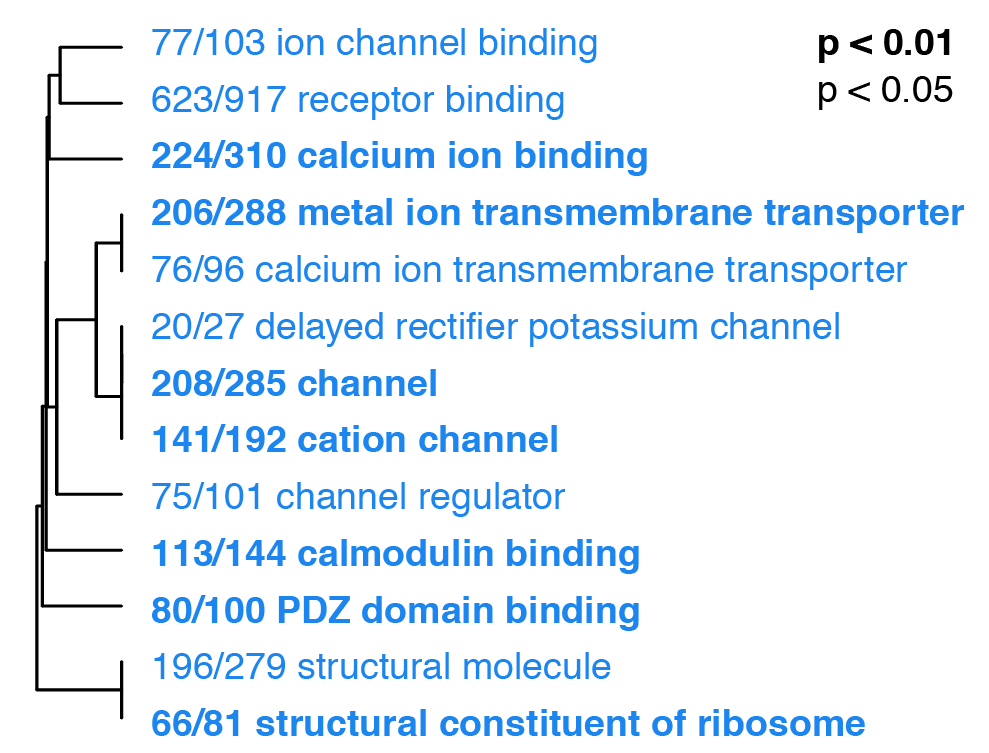
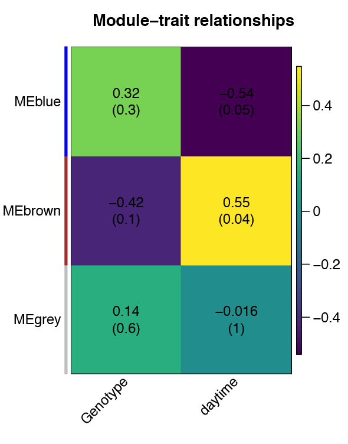

# FMR1rnaseqCA1

## Data organization

1. UNIXworkflow 
1. data
1. scripts

- UNIXworkflow - runs on The Texas Advanced Computing Center's (TACC) cluster 'Stampede'
- data
	- the files with the 01 and 02 prefix are semi-raw files for starting analysis
	- all other files are results files or meta data
- scripts
	- 00_cpfiles.sh	- a bash script for copying files into and out of this repo
	- 01_behavior.Rmd - knittable analysis script for wrangling, analyzing, and visualizing avoidance behavior 
	- 01_behavior.md - output of above script
	- 02_RNAseq.Rmd	- knittable analysis of differential gene expression of RNA-seq data with DESeq2, GO-WMU, and WGCNA
	- 02_RNAseq.md	- output of above script
	- 03_wgcna.R	- R script for weighted gene co-expression network analysis
	- 04_ephys.Rmd	- knittable analysis hippocampal electrophysiology to measure synaptic properties
	- 04_ephys.md - output of above script
	- 06_GO_MWU	- directory with data, code, and results for Gene Ontology analysis
	- figureoptions.R - my color pallet of choice for this experiment

## Data Availability

- NCBI: The raw sequencing data, the counts matrix, and meta data at https://www.ncbi.nlm.nih.gov/geo/query/acc.cgi?acc=GSE106595
- GitHub: A collection of RNA-seq datasets listed by GEO accession number https://github.com/raynamharris/MouseHippocampusRNAseqData

## Citation 

- For the NCBI data archive, include this inline: ([Accession: GSE106595](https://www.ncbi.nlm.nih.gov/geo/query/acc.cgi?acc=GSE106595))
- For the GitHub data-only archive cite 
- For the GitHub data, code, and results repository cite 
- For the paper: cite the soon to be release bioRxiv paper or my thesis

## Scientific insights

These are the main conclusions from the research

1. Confirm that FMR1-KO does not impair learning or memory, but unexpectidly, find that FMR1-KO impairs cognitive discrimination

WT and FMR1-KO mice exhibit place avoidance and cognitive discrimination
Top) Consistently trained mice (red) from both WT (solid lines, filled circles) and FMR1-KO (dashes lines, open circles) make fewer entrances into the shock zone than yoked-mice (grey). Bottom) Conflict trained mice (pink) from both WT (solid lines, filled circles) and FMR1-KO (dashes lines, open circles) learn to avoid the initial and the conflicting shock zones. Data are reported as mean +/- SEM. A Mann-Whitney statistical test shows that there are no significant differences due to genotype for any treatment at any time point (as evidenced by all overlapping standard error bars). Inserts) The pie-shaped shaded regions of the inserts highlight the region used to count the number of entrances. Sample sizes for each treatment group and genotype are shown on the bottom right.

2. Identify transcriptional response to constitutive gene knockdown of fragile x mental retardation protein (FMRP)

WT and FMR1-KO show evidence of differential gene expression in the CA1
A)  The sample size for RNA-sequencing is 8 WT and 8 FMR1-KO tissues from the CA1 subfield from only the consistent-yoke group. B) Hierarchical clustering of differentially expressed genes shows that only 13 genes are upregulated in response to FMR1KO while 16, including Fmr1, were downregulated in the CA1 subfield of yoked-consistent mice. C) A volcano plot shows that expression Ccnd2 and Fmr1 are highly upregulated in WT compared to FMR1-KO mice. Genes with negative log fold change value are more highly expressed in WT (dark grey filled circles) while genes with a positive log fold change value are more highly expressed in the Fmr1 mice (open circles). Genes that are not significantly expressed are shown in light grey.

Downregulation of ion transport in the the the CA1 subfield 
Down-regulation of ion channel binding, receptor binding, calcium binding, metal ion membrane transport, calcium ion transmembrane transporter, delayed rectifier potassium channel, channel, cation channel, channel regulator, calmodulin binding, PDZ domain binding, structural molecular, and structural constituent of ribosome. On the plot, different fonts are used to indicate significance (bold: p < 0.01, regular: p < 0.05) and color indicates enrichment with either up (red) or down (blue) regulated genes. The fraction next to GO category name indicates the fraction of "good" genes that exceed the p-value cutoff. The tree on the plot is hierarchical clustering of GO categories based on shared genes. Categories with no branch length between them are subsets of each other.

1. Show that synaptic strength not diminished despite reduced calcium activity 

CA3-CA1 synaptic strength is not altered by genotype or place avoidance training.
I did not observe reduction in synaptic strength at the CA3-CA1 synapse (as measured by maximum fEPSP slope) with avoidance learning or with FMR1-KO. The interaction between Genotype and Training Group was not significant, and Genotype alone was not significant. Violin plots are colored by treatment group and shaded according to genotype.  

Gene expression influenced more by the time of day than by genotype.
Using a weight gene-expression analyses15, I identify hundreds of genes whose expression is influenced by time of day. 

