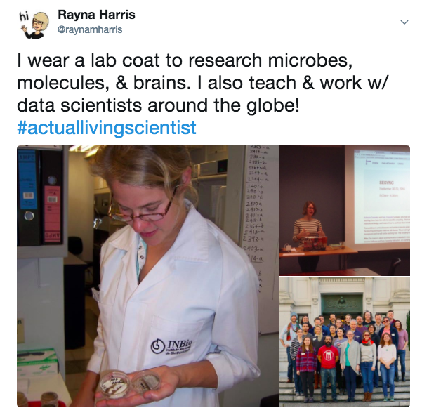
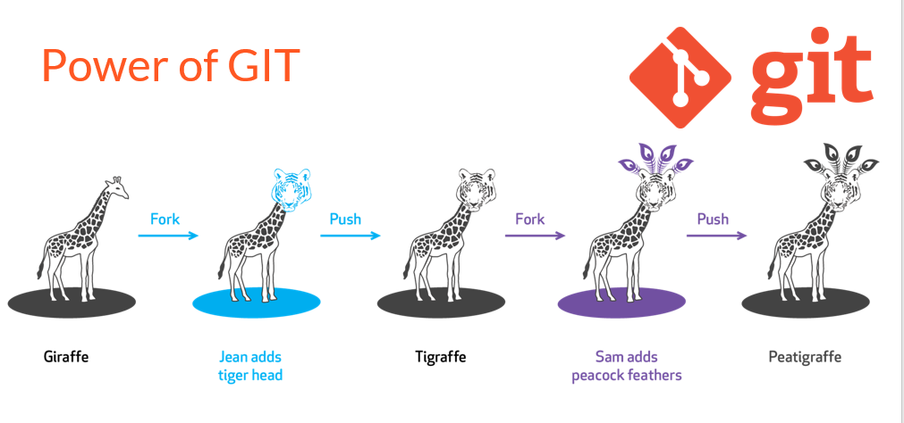
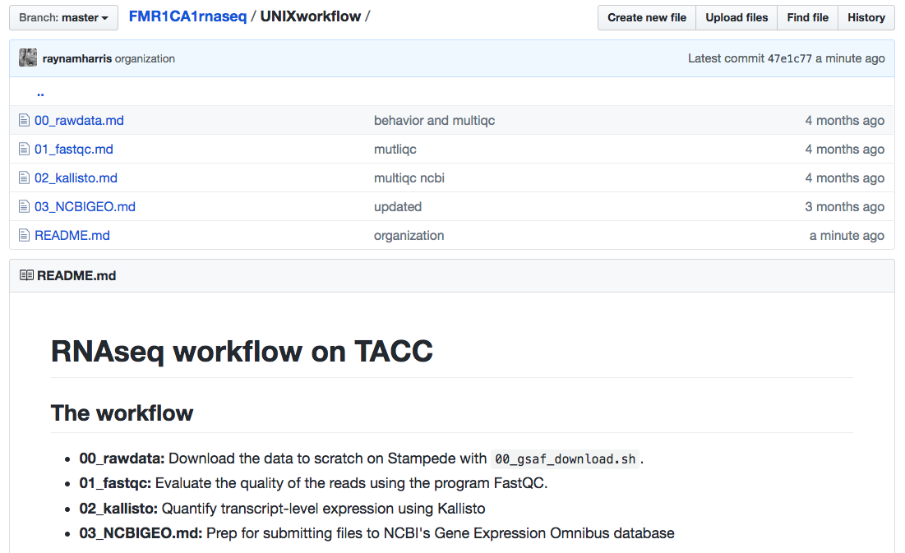
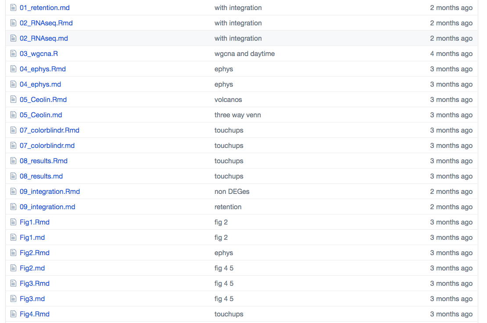
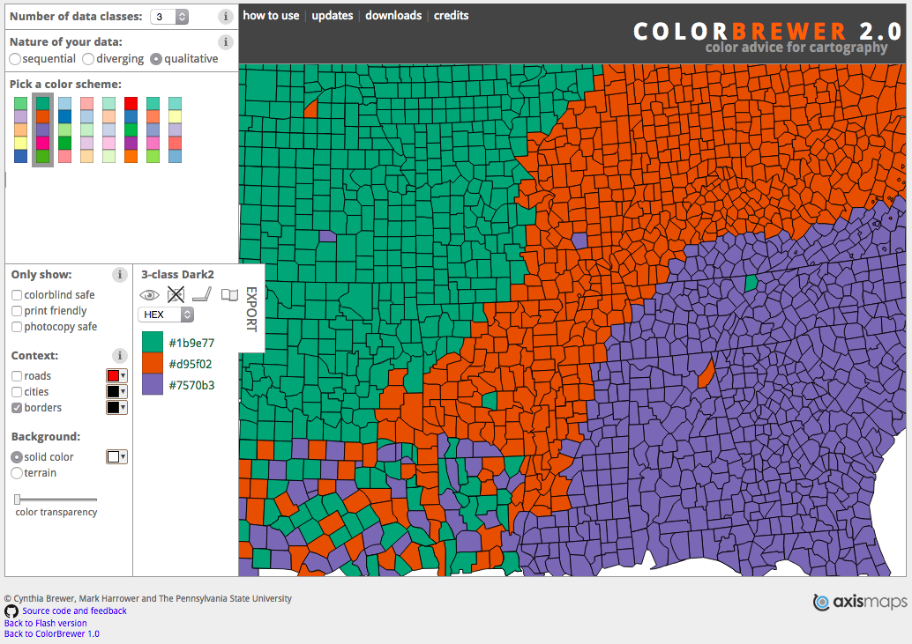
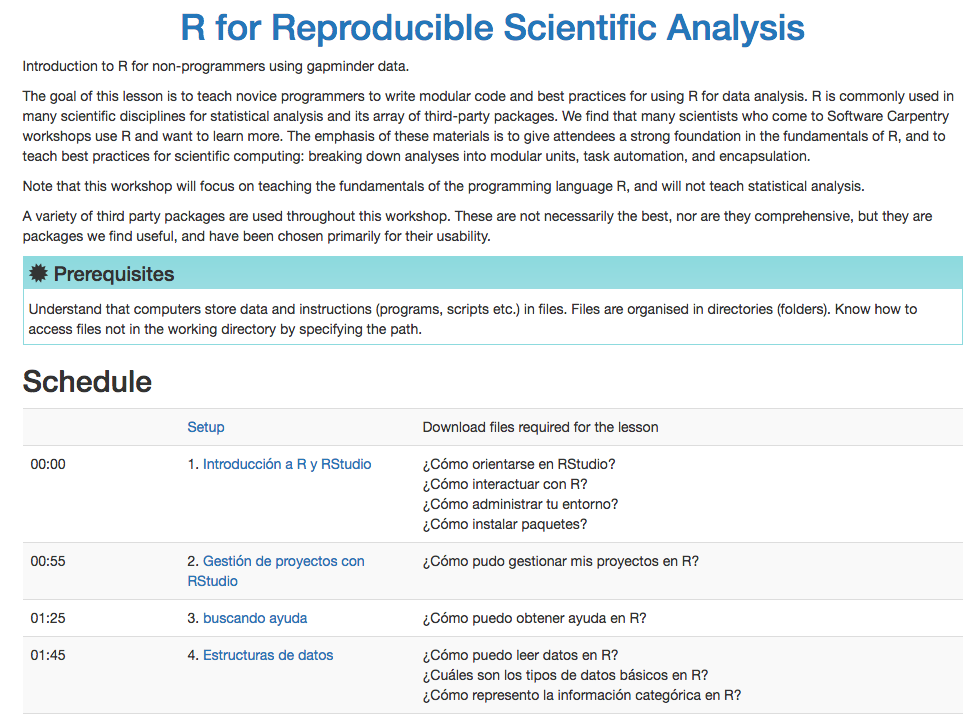

```{r setup, include=FALSE}
knitr::opts_chunk$set(echo = FALSE,
                      fig.path = '../figures/talk/')
library(tidyverse) # for subsetting data 
library(car) # for fancy ANOVA
library(cowplot) # for "easier"" ggplot themes
library(plyr) # data wrangling
library(colorblindr) # for color blind test
library(magick) # for color blind test
```

# ¿Quién soy? 


 
[^1]

[^1]: https://twitter.com/raynamharris


# Soy voluntaria de Sofware Carpentry


[^2]

[^2]: https://software-carpentry.org/lessons/


# Mis 10 mejores deseos (en lugar de mis 10 mejores consejos)

>-
>-  Recuerda: Vos podés hacer lo que quieras
>-  Recuerda: Nadie es re buena al principio 
>-  Yo creo que la mejor manera de aprender es a ensenñar
>-  Yo creo que todos aprenden más cuando la ciencia y la educación están abiertas 

# Deseo 1: Usa *R Markdown* para la reproducibilidad 

{width=50%}
[^3] 

[^3]: https://rmarkdown.rstudio.com/authoring_quick_tour.html

# Deseo 2: Usa el control de versiones para la colaboración

{width=75%}
[^4]

[^4]: http://technetnepal.net/blogs/shirishamaharjan/archive/2017/05/07/expand-horizons-change-attitudes-git-and-github-workshop.aspx


# Deseo 3: Documenta su flujo de trabajo

Porque probablemente sea único y complejo

{width=75%}
[^5]
[^5]: https://www.blogdelfotografo.com/workflow-flujo-trabajo-foto/

# Por ejemplo, puede enumerar los comandos por orden de operación

{width=75%}
[^6]

[^6]:  https://github.com/raynamharris/FMR1CA1rnaseq

# Pruebe múltiples estrategias de organización y haga lo que funcione mejor para vos

{width=75%}
[^6]

# Deseo 4: Desarrolla tu propia paleta de colores

```{r, out.width = "250px"}
df <- read.table(header=TRUE, text='
 cond yval
    A 2
    B 2.5
    C 1.6
')

one <- ggplot(df, aes(x=cond, y=yval, fill=cond)) + geom_bar(stat="identity")

two <- ggplot(df, aes(x=cond, y=yval, fill=cond)) + geom_bar(stat="identity") + 
    scale_fill_manual(values=c("red", "green", "blue"))

three <- ggplot(df, aes(x=cond, y=yval, fill=cond)) + geom_bar(stat="identity") + 
    scale_fill_manual(values=c("#d95f02", "#1b9e77", "#7570b3"))

allthree <- plot_grid(one,two,three, nrow =1, labels = c("I", "II","III"))
allthree

deutranplot <- edit_colors(allthree, desaturate, sev=0.9)
plot_grid(deutranplot)
```

-  I: predeterminado
-  II: values=c("red", "green", "blue")
-  III: values=c("#d95f02", "#1b9e77", "#7570b3")


# Deseo 4: Desarrolla tu propia paleta de colores

Colorbrewer[^7] te ayuda a elegir colores amigables para el daltónico

{width=75%}


[^7]: http://colorbrewer2.org/


# Deseo 5: Usa leyendas graficas

```{r timespent, warning = F, message = F, fig.height= 5}
behavior <- read.csv("../results/behaviordata.csv", header = T)
behavior$APA2 <- factor(behavior$APA2, levels = c("yoked-consistent","consistent", "yoked-conflict","conflict")) ## relevel then rename factors treatment
behavior$Genotype <- factor(behavior$Genotype, levels = c("WT","FMR1KO")) # relevel genotype

proptime <- read.csv("../results/behaviorproptime.csv", header = T)
proptime$APA2 <- factor(proptime$APA2, levels = c("yoked-consistent","consistent", "yoked-conflict","conflict")) ## relevel then rename factors treatment
proptime$Genotype <- factor(proptime$Genotype, levels = c("WT","FMR1KO")) # relevel genotype
proptime$variable <- factor(proptime$variable, 
          levels = c("pTimeTarget", "pTimeCCW", "pTimeOPP", "pTimeCW"))

behavior$APA2 <- plyr::revalue(behavior$APA2, c("consistent" = "consistente", "conflict" = "conflicto", 
                                          "yoked-consistent" = "yoked-consistente", 
                                          "yoked-conflict" = "yoked-conflicto"))
proptime$APA2 <- plyr::revalue(proptime$APA2, c("consistent" = "consistente", "conflict" = "conflicto", 
                                          "yoked-consistent" = "yoked-consistente", 
                                          "yoked-conflict" = "yoked-conflicto"))
proptime$variable <- plyr::revalue(proptime$variable, c("pTimeTarget" = "objetivo", "pTimeCCW" = "izquierda", 
                                          "pTimeOPP" = "opuesto",  "pTimeCW" = "derecho"))

timespent <- proptime %>%
   # filter(APA2 %in% c("consistente","conflicto")) %>%
      filter(Genotype %in% c("WT")) %>%
    filter(TrainSessionComboNum == 6 ) %>%
  ggplot(aes(x = APA2, y = value,fill = variable)) + 
    geom_bar(position = "fill",stat = "identity") +
    scale_x_discrete(name="Grupo de entrenamiento") + 
  #facet_wrap(~APA2, nrow=1) +
  theme_cowplot(font_size = 14, line_size = 0.25) +
  theme(legend.title=element_blank()) +
  #theme(legend.position="none") +
  scale_y_continuous(name= "Proporción de tiempo ") +
  scale_fill_manual(values = c("#d01c8b", "#e5f5e0" ,"#a1d99b", "#31a354")) + 
  geom_hline(yintercept=c(0.25,0.50, 0.75), color="black" , linetype="dashed")
timespent
```

>- ¿Qué significa "objetivo", "izquierda", "opuesto" y "derecho"?
>- ¿Por qué el rosa "objetivo"?
>- ¿Por qué hay líneas discontinuas?

# Deseo 5: Usa leyendas graficas

```{r timespent2, warning = F, message = F, fig.height= 5}
image <- ggdraw() + draw_image("../figures/talk/talk_pista.png", scale = 1)

ggdraw() +
  draw_plot(timespent, x = 0, y = 0, width = 0.82, height = 1) +
  draw_plot(image, x = 0.7, y = 0.5, width = 0.3, height = 0.6)
```

>- "objetivo", "izquierda", etc. son cuadrantes de una arena
>- Yo quería mostrar un uso desproporcionado del espacio
>- **cowplot**[^8] es genial!

[^8]: **cowplot** https://cran.r-project.org/web/packages/cowplot/index.html

# En resumen

- Deseo 1: Usa *R Markdown* para la reproducibilidad 
- Deseo 2: Usa el control de versiones para la colaboración
- Deseo 3: Documenta su flujo de trabajo
- Deseo 4: Desarrolla tu propia paleta de colores
- Deseo 5: Usa leyendas graficas


# Deseo 6: Me ayuda mejor las lecciones de Software Carpentry



# Como puedes ayudar

>- Leer y comentar o editar en GitHub
>- Particpar en el **Bug BBQ** el Abril 11 y 12
>- Organizar un taller o reunion para usarla
>- Haga videos de usted leyendo y codificando junto con la lección

# Deseo 7: Convertirse en una instructor certificada

>- Aplicar aquí: http://carpentries.github.io/instructor-training/

# ¡Gracias por su atención! ¡Mantengamonos en contacto!

Twitter: @raynamharris
Email: rayna.harris@gmail.com
