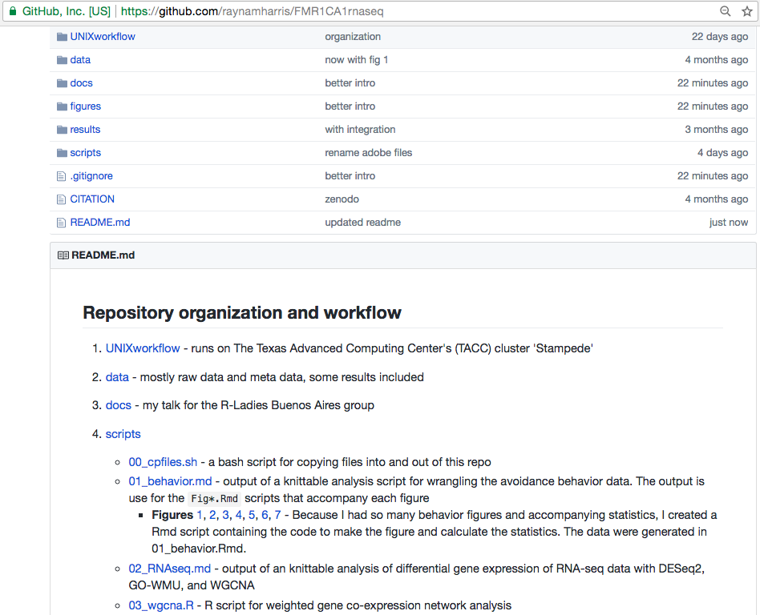
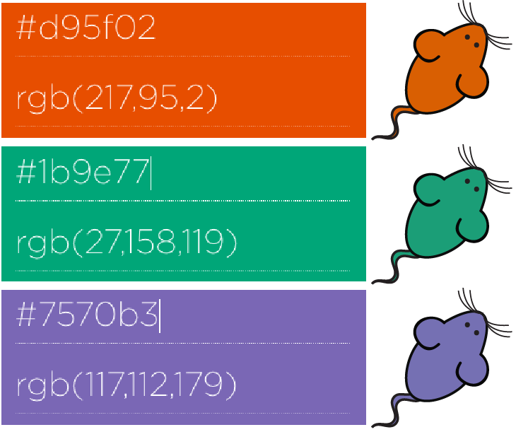
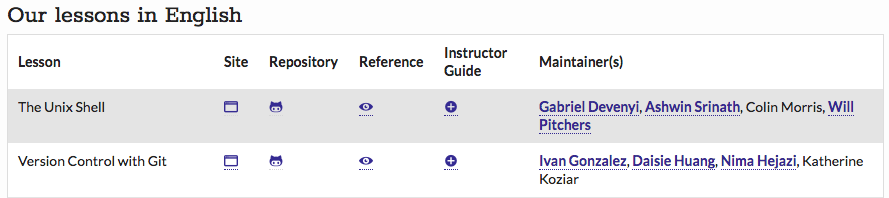
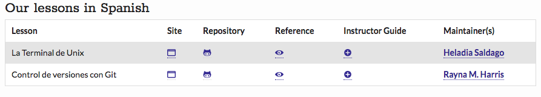
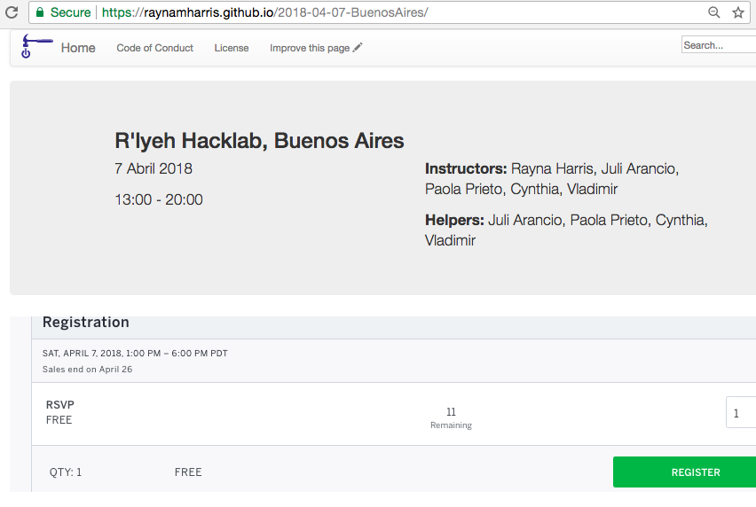
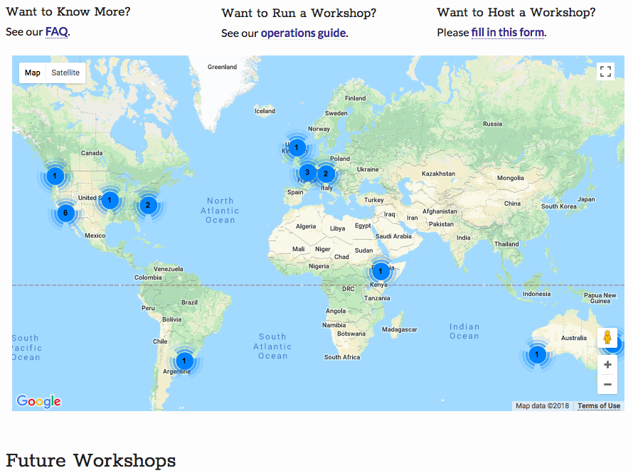

```{r setup, include=FALSE}
knitr::opts_chunk$set(echo = FALSE,
                      fig.path = '../figures/10_talk/')
library(tidyverse) # for subsetting data 
library(car) # for fancy ANOVA
library(cowplot) # for "easier"" ggplot themes
library(plyr) # data wrangling
library(colorblindr) # for color blind test

```

# La programación es importante porque permite automatizar tareas.

{width=75%}
[^3b] 

[^3b]: http://www.mclibre.org/consultar/python/otros/lenguajes-programacion.html

# R permite estadísticas reproducibles y visualización de datos

{width=75%}

# La enseñanza colaborativa también ahorra tiempo con una mayor cantidad de trabajo

{width=75%}

# Consejo 1: Usa **R Markdown** para crear y compartir documentos

{width=50%}
[^3] 

[^3]: https://rmarkdown.rstudio.com/authoring_quick_tour.html

# Consejo 2: Usa el control de versiones para colaborar con otros y con vos en el futuro

{width=75%}
[^4]

[^4]: http://technetnepal.net/blogs/shirishamaharjan/archive/2017/05/07/expand-horizons-change-attitudes-git-and-github-workshop.aspx

# Consejo 3: Documenta tu flujo de trabajo

Porque probablemente sea único y complejo

{width=75%}
[^5a]

[^5a]: https://www.blogdelfotografo.com/workflow-flujo-trabajo-foto/

# Ejemplo de archivo README.md

{width=75%}
[^5b]

[^5b]:  https://github.com/raynamharris/FMR1CA1rnaseq


# Consejo 4: Desarrolla tu propia paleta de colores

Colorbrewer[^1a] te ayuda a elegir colores amigables para daltónicos

{width=75%}

[^1a]: http://colorbrewer2.org/

# Ejemplos de paletas de colores en `ggplot`

```{r ejemplo, out.width = "225px"}
df <- read.table(header=TRUE, text='
 cond yval
    A 2
    B 2.5
    C 1.6
')

one <- ggplot(df, aes(x=cond, y=yval, fill=cond)) + geom_bar(stat="identity")

two <- ggplot(df, aes(x=cond, y=yval, fill=cond)) + geom_bar(stat="identity") + 
    scale_fill_manual(values=c("red", "green", "blue"))

three <- ggplot(df, aes(x=cond, y=yval, fill=cond)) + geom_bar(stat="identity") + 
    scale_fill_manual(values=c("#d95f02", "#1b9e77", "#7570b3"))

allthree <- plot_grid(one,two,three, nrow =1, labels = c(" Predeterminado", "     Basico", "  Personalizado"))
allthree

```

-  Basico: `+ scale_fill_manual(values=c("red", "green", "blue"))`
-  Personalizado: `+ scale_fill_manual(values=c("#d95f02", "#1b9e77", "#7570b3"))`

# Tu puedes convertir HEX a RGB para usar las mismsa paletas para las ilustraciones


[^1b]

[^1b]: https://www.webpagefx.com/web-design/hex-to-rgb/

# Consejo 5: Usa leyendas gráficas

```{r timespent, warning = F, message = F, fig.height= 5}
behavior <- read.csv("../results/behaviordata.csv", header = T)
behavior$APA2 <- factor(behavior$APA2, levels = c("yoked-consistent","consistent", "yoked-conflict","conflict")) ## relevel then rename factors treatment
behavior$Genotype <- factor(behavior$Genotype, levels = c("WT","FMR1KO")) # relevel genotype

proptime <- read.csv("../results/behaviorproptime.csv", header = T)
proptime$APA2 <- factor(proptime$APA2, levels = c("yoked-consistent","consistent", "yoked-conflict","conflict")) ## relevel then rename factors treatment
proptime$Genotype <- factor(proptime$Genotype, levels = c("WT","FMR1KO")) # relevel genotype
proptime$variable <- factor(proptime$variable, 
          levels = c("pTimeTarget", "pTimeCCW", "pTimeOPP", "pTimeCW"))

behavior$APA2 <- plyr::revalue(behavior$APA2, c("consistent" = "consistente", "conflict" = "conflicto", 
                                          "yoked-consistent" = "yoked-consistente", 
                                          "yoked-conflict" = "yoked-conflicto"))
proptime$APA2 <- plyr::revalue(proptime$APA2, c("consistent" = "consistente", "conflict" = "conflicto", 
                                          "yoked-consistent" = "yoked-consistente", 
                                          "yoked-conflict" = "yoked-conflicto"))
proptime$variable <- plyr::revalue(proptime$variable, c("pTimeTarget" = "objetivo", "pTimeCCW" = "izquierda", 
                                          "pTimeOPP" = "opuesto",  "pTimeCW" = "derecho"))

timespent <- proptime %>%
   # filter(APA2 %in% c("consistente","conflicto")) %>%
      filter(Genotype %in% c("WT")) %>%
    filter(TrainSessionComboNum == 6 ) %>%
  ggplot(aes(x = APA2, y = value,fill = variable)) + 
    geom_bar(position = "fill",stat = "identity") +
    scale_x_discrete(name="Grupo de entrenamiento") + 
  #facet_wrap(~APA2, nrow=1) +
  theme_cowplot(font_size = 14, line_size = 0.25) +
  theme(legend.title=element_blank()) +
  #theme(legend.position="none") +
  scale_y_continuous(name= "Proporción de tiempo ") +
  scale_fill_manual(values = c("#de2d26", "#e5f5e0" ,"#a1d99b", "#31a354")) + 
  geom_hline(yintercept=c(0.25,0.50, 0.75), color="black" , linetype="dashed")

image <- ggdraw() + draw_image("../figures/10_talk/talk_pista.png", scale = 1)

ggdraw() +
  draw_plot(timespent, x = 0, y = 0, width = 0.82, height = 1) +
  draw_plot(image, x = 0.7, y = 0.5, width = 0.3, height = 0.6)
```

>- Leyendas gráficas transmiten más información
>- Use **cowplot**[^2d] para agregar imágenes dentro de R

[^2d]: **cowplot** https://cran.r-project.org/web/packages/cowplot/index.html


# Punto medio resumen

- Consejo 1: Usa **R Markdown** para crear y compartir documentos
- Consejo 2: Usa el control de versiones para la colaboración
- Consejo 3: Documenta tu flujo de trabajo
- Consejo 4: Desarrolla tu propia paleta de colores
- Consejo 5: Usa leyendas gráficas

# Desarrollo colaborativo de la lección





[^2]

[^2]: https://software-carpentry.org/lessons/

# Deseo 1: Me ayudás a mejorar las nuevas lecciones en español de Software Carpentry


# Como podés ayudarme

>- Leer y comentar o editar en GitHub[^6a]
>- Participar en el **Bug BBQ**[^6b] el Abril 11 y 12
>- Hace videos de vos leyendo y codificando junto con la lección[^6c]

[^6a]: https://swcarpentry.github.io/r-novice-gapminder-es/
[^6b]: https://carpentries.github.io/2018-04-bug-bbq/ 
[^6c]: https://www.youtube.com/watch?v=bXxBeNkKmJE&list=PLNfIROxhN1JAtIbzNqSoFODe0Z_WSVL4D

# Deseo 2: Convertirse en una instructora certificada

>- Ahora, no hay instructoras en Argentina :(
>- Aplicá aquí: http://carpentries.github.io/instructor-training/
>- Usa el **Group Name** "R Ladies Buenos Aires"

{width=75%}
[^7] 

[^7]: https://software-carpentry.org/team/


# Deseo 3: ¡Asiste a nuestro primer taller de español!

{width=75%}
[^9] 

[^9]: https://raynamharris.github.io/2018-04-07-BuenosAires/

# Deseo 4: Organizar unos talleres en el futuro

{width=75%}
[^8] 

[^8]: https://software-carpentry.org/workshops/

# Deseo 5: Adoptar la práctica del desarrollo colaborativo de lecciones


[^10] 

[^10]: Devenyi et al. 2018 PLOS Comp Bio http://journals.plos.org/ploscompbiol/article?id=10.1371/journal.pcbi.1005963

# Resumen

- Consejo 1: Usa *R Markdown* para la reproducibilidad 
- Consejo 2: Usa el control de versiones para la colaboración
- Consejo 3: Documenta tu flujo de trabajo
- Consejo 4: Desarrolla tu propia paleta de colores
- Consejo 5: Usa leyendas gráficas
-
- Deseo 1: Me ayudás a mejorar las lecciones en español 
- Deseo 2: Convertirse en una instructora certificada
- Deseo 3: ¡Asiste a nuestro primer taller de español!
- Deseo 4: Organizar unos talleres en el futuro
- Deseo 5: Adoptar la práctica del desarrollo colaborativo de lecciones


# Pensamiento concluyente

>-  Yo creo que todos aprenden más cuando la ciencia y la educación están abiertas y son reproducibles
>-  Yo creo que la mejor manera de aprender es enseñando
>-  Recuerda que nadie es re buena al principio, pero todas mejoramos con la práctica
>-  Recuerda que vos podés hacer lo que quieras

# ¡Gracias por tu atención y ayuda! ¡Mantengámonos en contacto!

Email: rayna.harris@gmail.com

Twitter y GitHub y Instagram y Speaker Deck: @raynamharris

Diapositivas acá[^11a] y acá[^11b] 

[^11a]: https://github.com/raynamharris/FMR1CA1rnaseq
[^11b]:https://speakerdeck.com/raynamharris/


