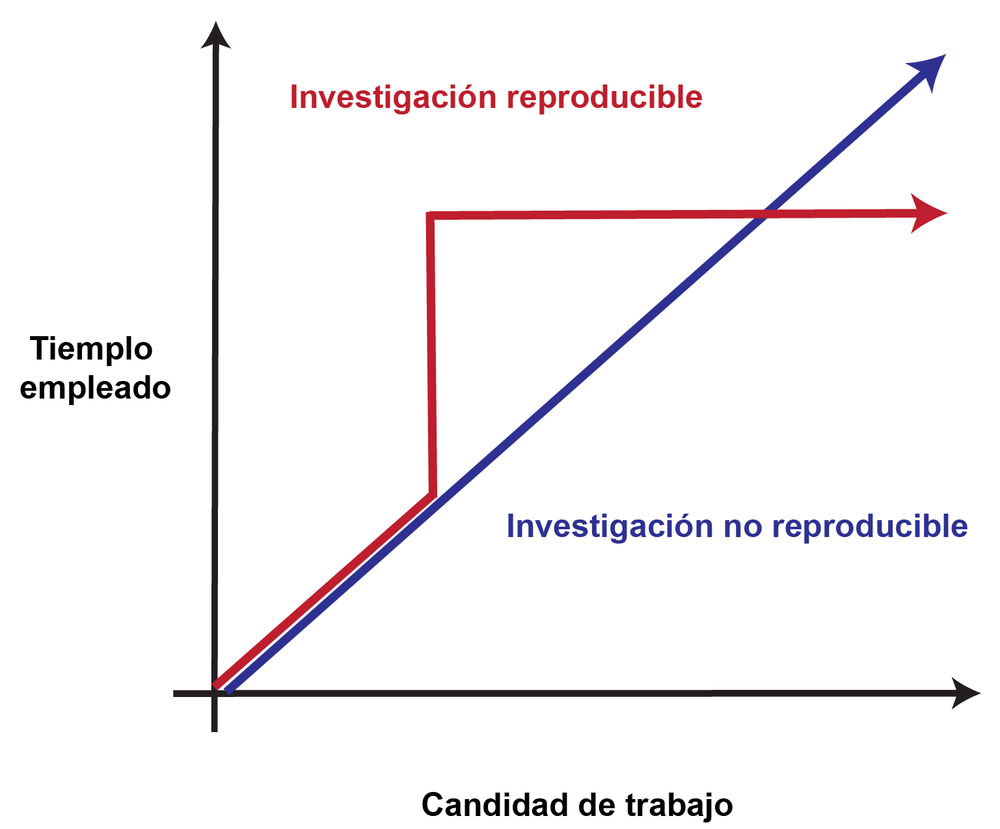
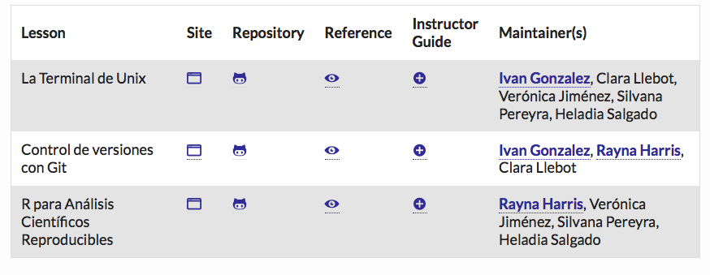
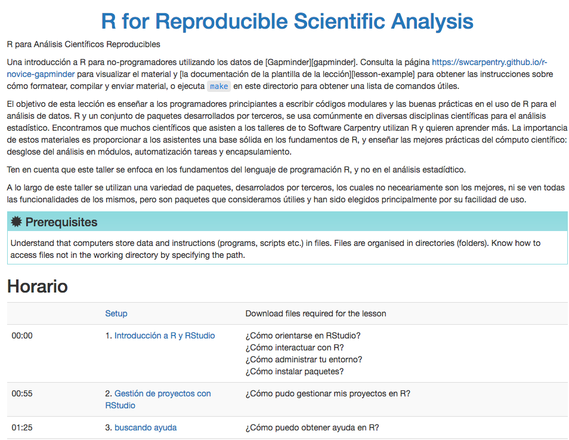
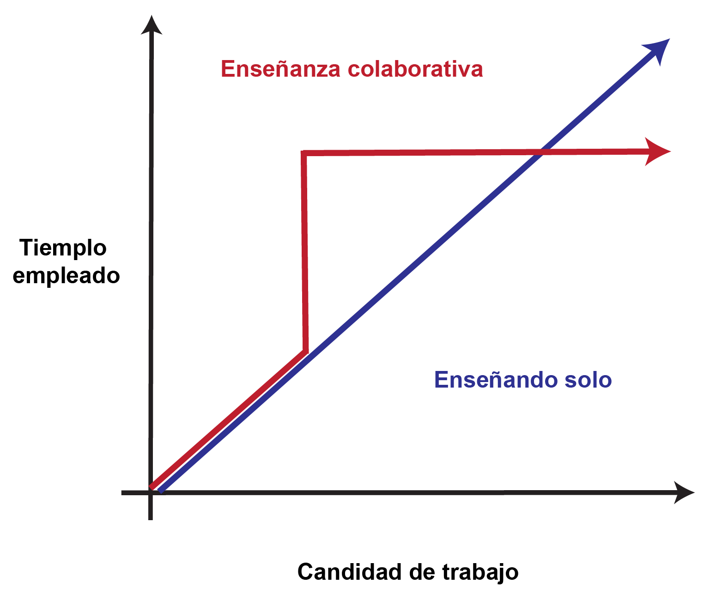
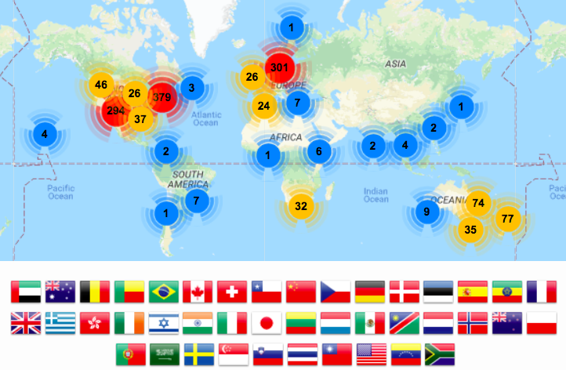
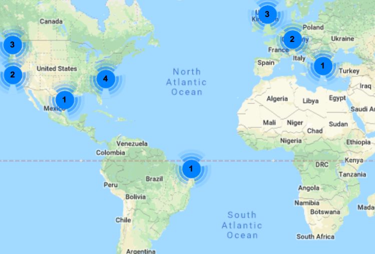
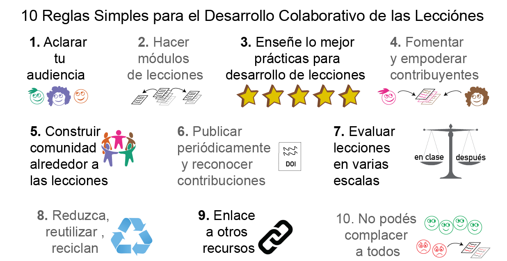
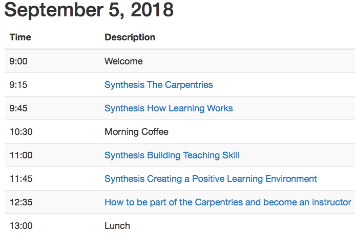

```{r setup, include=FALSE}
knitr::opts_chunk$set(echo = FALSE,
                      fig.path = '../figures/10_talk/')
```

# La programación es importante porque permite automatizar tareas.

{width=75%}
[^3b] 

[^3b]: http://www.mclibre.org/consultar/python/otros/lenguajes-programacion.html

# R permite estadísticas reproducibles y visualización de datos

{width=75%}


# Desarrollo colaborativo de la lección



[^2]

[^2]: https://software-carpentry.org/lessons/

# Las materials está abierta y disponible bajo la licencia Creative Commons Attribution 



# La enseñanza colaborativa también ahorra tiempo con una mayor cantidad de trabajo

{width=75%}


# Convertirse en una instructora certificada


>- Taller mananña: http://latin-r.com/cronograma/#session-25
>- Aplicá aquí: http://carpentries.github.io/instructor-training/
>- Usa el **Group Name** "LatinR"

{width=75%}
[^7] 

[^7]: https://software-carpentry.org/team/

# Organizar unos talleres en el futuro

{width=75%}

[^8] 

[^8]: https://software-carpentry.org/workshops/


# Deseo 5: Adoptar la práctica del desarrollo colaborativo de lecciones



[^10] 

[^10]: Devenyi et al. 2018 PLOS Comp Bio http://journals.plos.org/ploscompbiol/article?id=10.1371/journal.pcbi.1005963

# Además, enseñamos cómo enseñar mejor

{width=75%}
[^9] 

[^9]: https://raynamharris.github.io/2018-08-18-ttt-LatinAmerica/


# Pensamiento concluyente

>-  Yo creo que todos aprenden más cuando la ciencia y la educación está abiertas y reproducibles
>-  Yo creo que la mejor manera de aprender es enseñando
>-  Recuerda que nadie es re buena al principio, pero todas mejoramos con la práctica

# ¡Gracias por tu atención y ayuda! ¡Mantengámonos en contacto!

Email: rayna.harris@gmail.com

Twitter y GitHub y Instrgram y Speaker Deck: @raynamharris

Diapositivas acá[^11a] y acá[^11b] 

[^11a]: https://github.com/raynamharris/FMR1CA1rnaseq
[^11b]: https://speakerdeck.com/raynamharris/


