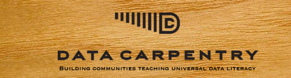
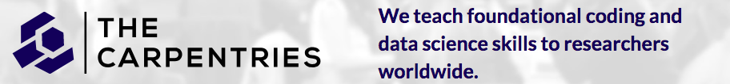

```{r setup, include=FALSE}
knitr::opts_chunk$set(echo = FALSE,
                      fig.path = '../figures/10_talk/')
```

# La programación es importante porque nos permite automatizar tareas.

{width=75%}
[^3b] 

[^3b]: http://www.mclibre.org/consultar/python/otros/lenguajes-programacion.html

# R permite generar estadísticas reproducibles y visualizar datos

{width=75%}


# Software Carpentry and Data Carpentry







# La enseñanza colaborativa también ahorra tiempo, ya que implica una menor cantidad de trabajo

{width=75%}


# Desarrollo colaborativo de la lección


[^2]

[^2]: https://software-carpentry.org/lessons/


# Los materiales se encuentran abiertos y disponibles bajo la licencia Creative Commons Attribution 


# ¿Cómo desarrollamos las lecciones de forma colaborativa?


[^10] 

[^10]: Devenyi et al. 2018 PLOS Comp Bio http://journals.plos.org/ploscompbiol/article?id=10.1371/journal.pcbi.1005963


# Además, enseñamos cómo enseñar mejor

>- Taller mananña: http://latin-r.com/cronograma/#session-25
{width=75%}
[^9] 

[^9]: https://raynamharris.github.io/2018-08-18-ttt-LatinAmerica/


# Hay instructoras certificadas en todo casi todo el mundo

>- Aplicá aquí: http://carpentries.github.io/instructor-training/
>- Usa el **Group Name** "LatinR"

{width=75%}
[^7] 

[^7]: https://software-carpentry.org/team/

# Organizar unos talleres en el futuro

{width=75%}

[^8] 

[^8]: https://software-carpentry.org/workshops/


# Algunos pensamientos para concluir

>-  Creo que todos aprenden más cuando la ciencia y la educación son abiertas y reproducibles
>-  La mejor manera de aprender es enseñando
>-  Recuerda que nadie es re buena al principio, pero todas mejoramos con la práctica

# ¡Gracias por tu atención! ¡Mantengámonos en contacto!

Rayna M. Harris @raynamharris

Florencia D'Andrea @cantoflor_87

Diapositivas acá[^11a] y acá[^11b] 

[^11a]: https://github.com/raynamharris/FMR1CA1rnaseq
[^11b]: https://speakerdeck.com/raynamharris/


