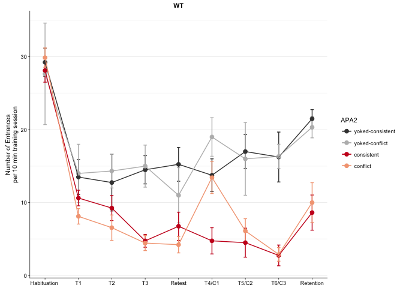
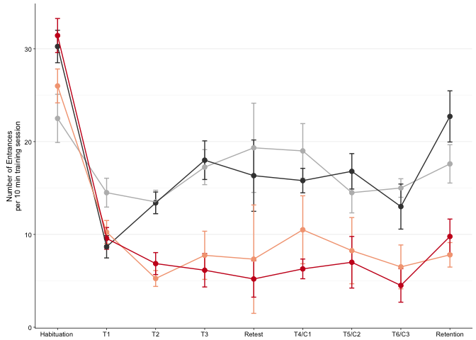
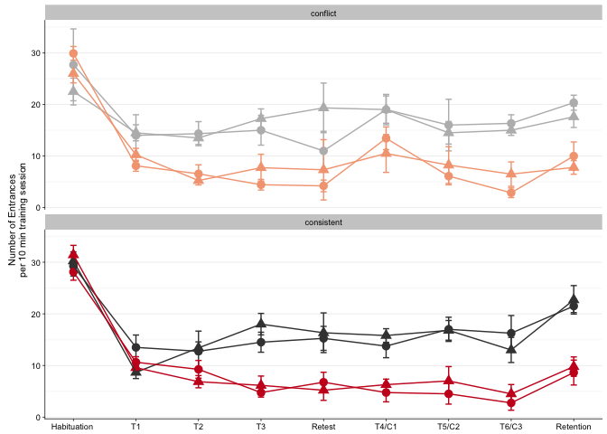
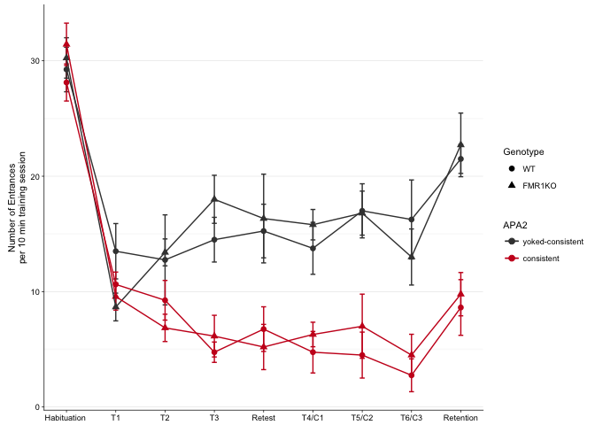
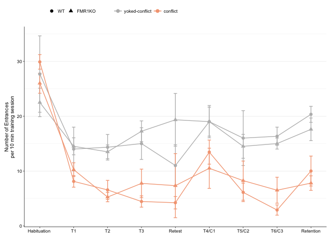

``` r
## load libraries 
library(tidyr) ## for respahing data
library(plyr) ## for renmaing factors
library(dplyr) ## for filtering and selecting rows
library(reshape2) ## for melting dataframe
library(ggplot2)
library(cowplot)


## load functions 
source("functions_behavior.R")
source("figureoptions.R")
```

``` r
## read intermediate data (raw data from video tracker program analyzed in matlab)
behavior <- read.csv("../data/fmr1.csv", header = T)

behavior$APA <- as.factor(behavior$APA)
behavior$APA2 <- as.factor(behavior$APA2)
levels(behavior$APA2)
```

    ## [1] "conflict"          "consistent"        "controlconflict"  
    ## [4] "controlconsistent"

``` r
## relevel then rename factors treatment
behavior$APA2 <- factor(behavior$APA2, levels = c("controlconsistent", "controlconflict", "consistent", "conflict"))
levels(behavior$APA2) <- c("yoked-consistent","yoked-conflict","consistent", "conflict")
levels(behavior$APA2)
```

    ## [1] "yoked-consistent" "yoked-conflict"   "consistent"      
    ## [4] "conflict"

``` r
#relevel APA
levels(behavior$APA) <- c("control","consistent","conflict")

#relevel genotype
levels(behavior$Genotype) <- c("WT","FMR1KO")

behavior$Time1stEntrLog <- log(behavior$Time1stEntr)  ## log transformation
behavior$conflict <- ifelse(grepl("conflict", behavior$APA2), "conflict", "consistent") # for splitting
levels(behavior$conflict) <- c("consistent","conflict")
behavior <- behavior[c(1,3,7,8,10,60,14:59)] # supset data
behavior <- subset(behavior, !is.na(behavior$NumEntrances)) # remove nas
```

``` r
behaviorsummaryNum <- dplyr::summarise(group_by(behavior, Genotype, APA2, conflict, TrainSessionComboNum), m = mean(NumEntrances), se = sd(NumEntrances)/sqrt(length(NumEntrances)), len = length(NumEntrances))
behaviorsummaryNum <- as.data.frame(behaviorsummaryNum)
levels(behaviorsummaryNum$Genotype) <- c("WT","FMR1KO")
levels(behaviorsummaryNum$APA2) <- c("yoked-consistent","yoked-conflict", "consistent", "conflict")
levels(behaviorsummaryNum$conflict) <- c("consistent","conflict")
```

Plotting number of entrances
----------------------------

``` r
# plotting mean and se for time to total number of entrances
numentrance1WT <- behaviorsummaryNum %>%
  filter(Genotype == "WT") %>%
  ggplot(aes(x=, TrainSessionComboNum, y=m, color=APA2)) + 
    geom_errorbar(aes(ymin=m-se, ymax=m+se, color=APA2), width=.1) +
    geom_point(size = 2) +
   geom_line() +
    scale_y_continuous(name="Number of Entrances\nper 10 min training session") +
    scale_x_continuous(name = NULL, 
                       breaks = c(1, 2, 3, 4, 5, 6, 7, 8, 9),
                       labels=c("1" = "Habituation ", "2" = "T1", "3" = "T2", 
                                "4" = "T3", "5" = "Retest", "6" = "T4/C1",
                                "7" = "T5/C2", "8" = "T6/C3", "9"= "Retention")) +
  theme_cowplot(font_size = 8, line_size = 0.25) +
  background_grid(major = "y", minor = "y") +
  scale_color_manual(values = colorvalAPA2)  + 
  labs(title = "WT")
numentrance1WT
```



``` r
pdf(file="../figures/01_behavior/numentrance1WT.pdf", width=4, height=2)
plot(numentrance1WT)
dev.off()
```

    ## quartz_off_screen 
    ##                 2

``` r
# plotting mean and se for time to total number of entrances
numentrance1FMR1 <- behaviorsummaryNum %>%
  filter(Genotype == "FMR1KO") %>%
  ggplot(aes(x=, TrainSessionComboNum, y=m, color=APA2)) + 
    geom_errorbar(aes(ymin=m-se, ymax=m+se, color=APA2), width=.1) +
    geom_point(size = 2) +
   geom_line() +
    scale_y_continuous(name="Number of Entrances\nper 10 min training session") +
    scale_x_continuous(name = NULL, 
                       breaks = c(1, 2, 3, 4, 5, 6, 7, 8, 9),
                       labels=c("1" = "Habituation ", "2" = "T1", "3" = "T2", 
                                "4" = "T3", "5" = "Retest", "6" = "T4/C1",
                                "7" = "T5/C2", "8" = "T6/C3", "9"= "Retention")) +
  theme_cowplot(font_size = 8, line_size = 0.25) +
  background_grid(major = "y", minor = "y") +
  scale_color_manual(values = colorvalAPA2) + 
  #theme(legend.position=c(0.7, 0.8))  +
  theme(legend.position="none")  + 
  labs(title = "FMR1-KO")
numentrance1FMR1
```



``` r
pdf(file="../figures/01_behavior/numentrance1FMR1.pdf", width=4, height=2)
plot(numentrance1FMR1)
dev.off()
```

    ## quartz_off_screen 
    ##                 2

``` r
numentrance1wrap <- behaviorsummaryNum %>%
  ggplot(aes(x=, TrainSessionComboNum, y=m, color=APA2, shape = Genotype)) + 
  facet_wrap(~conflict,nrow =2) +
    geom_errorbar(aes(ymin=m-se, ymax=m+se, color=APA2), width=.1) +
    geom_point(size = 3) +
   geom_line() +
    scale_y_continuous(name="Number of Entrances\nper 10 min training session") +
    scale_x_continuous(name = NULL, 
                       breaks = c(1, 2, 3, 4, 5, 6, 7, 8, 9),
                       labels=c("1" = "Habituation ", "2" = "T1", "3" = "T2", 
                                "4" = "T3", "5" = "Retest", "6" = "T4/C1",
                                "7" = "T5/C2", "8" = "T6/C3", "9"= "Retention")) +
  theme_cowplot(font_size = 8, line_size = 0.25) +
  background_grid(major = "y", minor = "y") +
  scale_color_manual(values = colorvalAPA2) 
numentrance1wrap
```



``` r
pdf(file="../figures/01_behavior/numentrance1wrap.pdf", width=4, height=4)
plot(numentrance1wrap)
dev.off()
```

    ## quartz_off_screen 
    ##                 2

``` r
numentrance1consistent<- behaviorsummaryNum %>%
  filter(conflict == "consistent") %>%
  ggplot(aes(x=, TrainSessionComboNum, y=m, color=APA2, shape=Genotype)) + 
    geom_errorbar(aes(ymin=m-se, ymax=m+se, color=APA2), width=.1) +
    geom_point(size = 2) +
   geom_line() +
    scale_y_continuous(name="Number of Entrances\nper 10 min training session") +
    scale_x_continuous(name = NULL, 
                       breaks = c(1, 2, 3, 4, 5, 6, 7, 8, 9),
                       labels=c("1" = "Habituation ", "2" = "T1", "3" = "T2", 
                                "4" = "T3", "5" = "Retest", "6" = "T4/C1",
                                "7" = "T5/C2", "8" = "T6/C3", "9"= "Retention")) +
  theme_cowplot(font_size = 8, line_size = 0.25) +
  background_grid(major = "y", minor = "y") +
  scale_color_manual(values = colorvalAPA5) +
  theme( 
        legend.position = "top",
        legend.title=element_blank(),
        legend.justification = c(0.1, 0.8))
numentrance1consistent
```



``` r
pdf(file="../figures/01_behavior/numentrance1consistent.pdf", width=4, height=2.5)
plot(numentrance1consistent)
dev.off()
```

    ## quartz_off_screen 
    ##                 2

``` r
numentrance1conflict<- behaviorsummaryNum %>%
  filter(conflict == "conflict") %>%
  ggplot(aes(x=, TrainSessionComboNum, y=m, color=APA2, shape=Genotype)) + 
    geom_errorbar(aes(ymin=m-se, ymax=m+se, color=APA2), width=.1) +
    geom_point(size = 2) +
   geom_line() +
    scale_y_continuous(name="Number of Entrances\nper 10 min training session") +
    scale_x_continuous(name = NULL, 
                       breaks = c(1, 2, 3, 4, 5, 6, 7, 8, 9),
                       labels=c("1" = "Habituation ", "2" = "T1", "3" = "T2", 
                                "4" = "T3", "5" = "Retest", "6" = "T4/C1",
                                "7" = "T5/C2", "8" = "T6/C3", "9"= "Retention")) +
  theme_cowplot(font_size = 8, line_size = 0.25) +
  background_grid(major = "y", minor = "y") +
  scale_color_manual(values = colorvalAPA4) +
  theme( 
        legend.position = "top",
        legend.title=element_blank(),
        legend.justification = c(0.1, 0.8))
numentrance1conflict
```



``` r
pdf(file="../figures/01_behavior/numentrance1conflict.pdf", width=4, height=2.5)
plot(numentrance1conflict)
dev.off()
```

    ## quartz_off_screen 
    ##                 2

Anovas ALL data
---------------

``` r
aov1 <- aov(NumEntrances ~ APA2 * Genotype * TrainSession, data=behavior)
summary(aov1) 
```

    ##                             Df Sum Sq Mean Sq F value   Pr(>F)    
    ## APA2                         3   5286  1761.9  71.621  < 2e-16 ***
    ## Genotype                     1     31    31.0   1.259    0.263    
    ## TrainSession                11  14435  1312.3  53.345  < 2e-16 ***
    ## APA2:Genotype                3     11     3.5   0.144    0.933    
    ## APA2:TrainSession           21   1758    83.7   3.402 1.36e-06 ***
    ## Genotype:TrainSession       11    161    14.6   0.595    0.833    
    ## APA2:Genotype:TrainSession  21    426    20.3   0.824    0.690    
    ## Residuals                  315   7749    24.6                     
    ## ---
    ## Signif. codes:  0 '***' 0.001 '**' 0.01 '*' 0.05 '.' 0.1 ' ' 1

``` r
hab <- behavior %>%
  filter(TrainSession == "Hab") 
aov1 <- aov(NumEntrances ~ APA2 * Genotype, data=hab)
summary(aov1) 
```

    ##               Df Sum Sq Mean Sq F value Pr(>F)
    ## APA2           3  133.4   44.48   1.717  0.181
    ## Genotype       1    2.7    2.74   0.106  0.747
    ## APA2:Genotype  3  127.6   42.55   1.643  0.197
    ## Residuals     35  906.6   25.90

``` r
T1 <- behavior %>%
  filter(TrainSession == "T1") 
aov1 <- aov(NumEntrances ~ APA2 * Genotype, data=T1)
summary(aov1) 
```

    ##               Df Sum Sq Mean Sq F value Pr(>F)  
    ## APA2           3  146.7   48.91   3.923 0.0166 *
    ## Genotype       1    3.0    2.98   0.239 0.6281  
    ## APA2:Genotype  3   54.3   18.10   1.452 0.2449  
    ## Residuals     34  423.9   12.47                 
    ## ---
    ## Signif. codes:  0 '***' 0.001 '**' 0.01 '*' 0.05 '.' 0.1 ' ' 1

``` r
T2 <- behavior %>%
  filter(TrainSession == "T2") 
aov1 <- aov(NumEntrances ~ APA2 * Genotype, data=T2)
summary(aov1) 
```

    ##               Df Sum Sq Mean Sq F value   Pr(>F)    
    ## APA2           3  423.8  141.27   7.133 0.000701 ***
    ## Genotype       1   15.0   15.05   0.760 0.389176    
    ## APA2:Genotype  3   13.2    4.39   0.222 0.880602    
    ## Residuals     36  712.9   19.80                     
    ## ---
    ## Signif. codes:  0 '***' 0.001 '**' 0.01 '*' 0.05 '.' 0.1 ' ' 1

``` r
T3 <- behavior %>%
  filter(TrainSession == "T3") 
aov1 <- aov(NumEntrances ~ APA2 * Genotype, data=T3)
summary(aov1) # 
```

    ##               Df Sum Sq Mean Sq F value   Pr(>F)    
    ## APA2           3 1071.7   357.2  24.240 1.43e-08 ***
    ## Genotype       1   59.0    59.0   4.005   0.0534 .  
    ## APA2:Genotype  3    8.2     2.7   0.184   0.9062    
    ## Residuals     34  501.1    14.7                     
    ## ---
    ## Signif. codes:  0 '***' 0.001 '**' 0.01 '*' 0.05 '.' 0.1 ' ' 1

``` r
Retest <- behavior %>%
  filter(TrainSession == "Retest") 
aov1 <- aov(NumEntrances ~ APA2 * Genotype, data=Retest)
summary(aov1) 
```

    ##               Df Sum Sq Mean Sq F value   Pr(>F)    
    ## APA2           3  841.0  280.34   8.755 0.000253 ***
    ## Genotype       1   32.2   32.22   1.006 0.323862    
    ## APA2:Genotype  3  103.1   34.38   1.074 0.375079    
    ## Residuals     30  960.6   32.02                     
    ## ---
    ## Signif. codes:  0 '***' 0.001 '**' 0.01 '*' 0.05 '.' 0.1 ' ' 1

``` r
T4 <- behavior %>%
  filter(TrainSession %in% c("T4", "C1")) 
aov1 <- aov(NumEntrances ~ APA2 * Genotype, data=T4)
summary(aov1)  
```

    ##               Df Sum Sq Mean Sq F value   Pr(>F)    
    ## APA2           3 1056.3   352.1  12.939 6.89e-06 ***
    ## Genotype       1    0.4     0.4   0.016    0.900    
    ## APA2:Genotype  3   41.7    13.9   0.511    0.677    
    ## Residuals     36  979.7    27.2                     
    ## ---
    ## Signif. codes:  0 '***' 0.001 '**' 0.01 '*' 0.05 '.' 0.1 ' ' 1

``` r
T5 <- behavior %>%
  filter(TrainSession %in% c("T5", "C2")) 
aov1 <- aov(NumEntrances ~ APA2 * Genotype, data=T5)
summary(aov1)  
```

    ##               Df Sum Sq Mean Sq F value   Pr(>F)    
    ## APA2           3  983.9   328.0  10.566 4.66e-05 ***
    ## Genotype       1   14.9    14.9   0.480    0.493    
    ## APA2:Genotype  3   22.3     7.4   0.239    0.868    
    ## Residuals     34 1055.4    31.0                     
    ## ---
    ## Signif. codes:  0 '***' 0.001 '**' 0.01 '*' 0.05 '.' 0.1 ' ' 1

``` r
T6 <- behavior %>%
  filter(TrainSession %in% c("T6", "C3")) 
aov1 <- aov(NumEntrances ~ APA2 * Genotype, data=T6)
summary(aov1)  
```

    ##               Df Sum Sq Mean Sq F value   Pr(>F)    
    ## APA2           3 1215.1   405.0  22.129 3.98e-08 ***
    ## Genotype       1    4.6     4.6   0.253    0.618    
    ## APA2:Genotype  3   68.1    22.7   1.241    0.310    
    ## Residuals     34  622.3    18.3                     
    ## ---
    ## Signif. codes:  0 '***' 0.001 '**' 0.01 '*' 0.05 '.' 0.1 ' ' 1

``` r
Retention <- behavior %>%
  filter(TrainSession == "Retention") 
aov1 <- aov(NumEntrances ~ APA2 * Genotype, data=Retention)
summary(aov1) 
```

    ##               Df Sum Sq Mean Sq F value   Pr(>F)    
    ## APA2           3 1622.5   540.8   14.32 1.44e-06 ***
    ## Genotype       1    1.5     1.5    0.04    0.843    
    ## APA2:Genotype  3   37.4    12.5    0.33    0.803    
    ## Residuals     42 1586.5    37.8                     
    ## ---
    ## Signif. codes:  0 '***' 0.001 '**' 0.01 '*' 0.05 '.' 0.1 ' ' 1

``` r
#### Gentoype
aov1 <- aov(NumEntrances ~ Genotype, data=behavior)
summary(aov1) # p = 0.0641 .
```

    ##              Df Sum Sq Mean Sq F value Pr(>F)  
    ## Genotype      1    265  264.94   3.447 0.0641 .
    ## Residuals   385  29591   76.86                 
    ## ---
    ## Signif. codes:  0 '***' 0.001 '**' 0.01 '*' 0.05 '.' 0.1 ' ' 1

``` r
aov1 <- aov(NumEntrances ~ Genotype * APA2, data=behavior)
summary(aov1) 
```

    ##                Df Sum Sq Mean Sq F value   Pr(>F)    
    ## Genotype        1    265   264.9   4.094   0.0437 *  
    ## APA2            3   5052  1683.9  26.021 2.51e-15 ***
    ## Genotype:APA2   3     13     4.5   0.069   0.9765    
    ## Residuals     379  24526    64.7                     
    ## ---
    ## Signif. codes:  0 '***' 0.001 '**' 0.01 '*' 0.05 '.' 0.1 ' ' 1

``` r
aov1 <- aov(NumEntrances ~ Genotype * APA2 * TrainSession , data=behavior)
summary(aov1) 
```

    ##                             Df Sum Sq Mean Sq F value   Pr(>F)    
    ## Genotype                     1    265   264.9  10.770  0.00115 ** 
    ## APA2                         3   5052  1683.9  68.451  < 2e-16 ***
    ## TrainSession                11  14435  1312.3  53.345  < 2e-16 ***
    ## Genotype:APA2                3     11     3.5   0.144  0.93334    
    ## Genotype:TrainSession       11    244    22.2   0.901  0.54015    
    ## APA2:TrainSession           21   1675    79.8   3.242 3.78e-06 ***
    ## Genotype:APA2:TrainSession  21    426    20.3   0.824  0.68958    
    ## Residuals                  315   7749    24.6                     
    ## ---
    ## Signif. codes:  0 '***' 0.001 '**' 0.01 '*' 0.05 '.' 0.1 ' ' 1

``` r
lm1 <- lm(NumEntrances ~ Genotype * APA2 * TrainSession , data=behavior)
summary(lm1) 
```

    ## 
    ## Call:
    ## lm(formula = NumEntrances ~ Genotype * APA2 * TrainSession, data = behavior)
    ## 
    ## Residuals:
    ##      Min       1Q   Median       3Q      Max 
    ## -12.6667  -3.0000  -0.4444   2.5000  18.0000 
    ## 
    ## Coefficients: (24 not defined because of singularities)
    ##                                                         Estimate
    ## (Intercept)                                              23.5000
    ## GenotypeFMR1KO                                           -2.7500
    ## APA2yoked-conflict                                       -4.5000
    ## APA2consistent                                          -13.5000
    ## APA2conflict                                            -10.0556
    ## TrainSessionC2                                           -7.3333
    ## TrainSessionC3                                          -10.5556
    ## TrainSessionHab                                           5.7500
    ## TrainSessionRetention                                    -2.0000
    ## TrainSessionRetest                                       -8.2500
    ## TrainSessionT1                                          -10.0000
    ## TrainSessionT2                                          -10.7500
    ## TrainSessionT3                                           -9.0000
    ## TrainSessionT4                                           -9.7500
    ## TrainSessionT5                                           -6.5000
    ## TrainSessionT6                                           -7.2500
    ## GenotypeFMR1KO:APA2yoked-conflict                         2.7500
    ## GenotypeFMR1KO:APA2consistent                             5.0000
    ## GenotypeFMR1KO:APA2conflict                              -0.1944
    ## GenotypeFMR1KO:TrainSessionC2                             5.0833
    ## GenotypeFMR1KO:TrainSessionC3                             6.5556
    ## GenotypeFMR1KO:TrainSessionHab                            3.7500
    ## GenotypeFMR1KO:TrainSessionRetention                      3.9643
    ## GenotypeFMR1KO:TrainSessionRetest                         3.8333
    ## GenotypeFMR1KO:TrainSessionT1                            -2.0833
    ## GenotypeFMR1KO:TrainSessionT2                             3.4000
    ## GenotypeFMR1KO:TrainSessionT3                             6.2500
    ## GenotypeFMR1KO:TrainSessionT4                             4.8000
    ## GenotypeFMR1KO:TrainSessionT5                             2.5500
    ## GenotypeFMR1KO:TrainSessionT6                            -0.5000
    ## APA2yoked-conflict:TrainSessionC2                         4.3333
    ## APA2consistent:TrainSessionC2                                 NA
    ## APA2conflict:TrainSessionC2                                   NA
    ## APA2yoked-conflict:TrainSessionC3                         7.8889
    ## APA2consistent:TrainSessionC3                                 NA
    ## APA2conflict:TrainSessionC3                                   NA
    ## APA2yoked-conflict:TrainSessionHab                        2.9167
    ## APA2consistent:TrainSessionHab                           12.3750
    ## APA2conflict:TrainSessionHab                             10.6944
    ## APA2yoked-conflict:TrainSessionRetention                  3.3333
    ## APA2consistent:TrainSessionRetention                      0.6250
    ## APA2conflict:TrainSessionRetention                       -1.4444
    ## APA2yoked-conflict:TrainSessionRetest                     0.2500
    ## APA2consistent:TrainSessionRetest                         5.0000
    ## APA2conflict:TrainSessionRetest                          -0.9722
    ## APA2yoked-conflict:TrainSessionT1                         5.0000
    ## APA2consistent:TrainSessionT1                            10.6250
    ## APA2conflict:TrainSessionT1                               4.6667
    ## APA2yoked-conflict:TrainSessionT2                         6.0833
    ## APA2consistent:TrainSessionT2                            10.0000
    ## APA2conflict:TrainSessionT2                               3.8611
    ## APA2yoked-conflict:TrainSessionT3                         5.0000
    ## APA2consistent:TrainSessionT3                             3.7500
    ## APA2conflict:TrainSessionT3                                   NA
    ## APA2yoked-conflict:TrainSessionT4                             NA
    ## APA2consistent:TrainSessionT4                             4.5000
    ## APA2conflict:TrainSessionT4                                   NA
    ## APA2yoked-conflict:TrainSessionT5                             NA
    ## APA2consistent:TrainSessionT5                             1.0000
    ## APA2conflict:TrainSessionT5                                   NA
    ## APA2yoked-conflict:TrainSessionT6                             NA
    ## APA2consistent:TrainSessionT6                                 NA
    ## APA2conflict:TrainSessionT6                                   NA
    ## GenotypeFMR1KO:APA2yoked-conflict:TrainSessionC2         -6.5833
    ## GenotypeFMR1KO:APA2consistent:TrainSessionC2                  NA
    ## GenotypeFMR1KO:APA2conflict:TrainSessionC2                    NA
    ## GenotypeFMR1KO:APA2yoked-conflict:TrainSessionC3         -7.8889
    ## GenotypeFMR1KO:APA2consistent:TrainSessionC3                  NA
    ## GenotypeFMR1KO:APA2conflict:TrainSessionC3                    NA
    ## GenotypeFMR1KO:APA2yoked-conflict:TrainSessionHab        -8.9167
    ## GenotypeFMR1KO:APA2consistent:TrainSessionHab            -2.6964
    ## GenotypeFMR1KO:APA2conflict:TrainSessionHab              -4.6944
    ## GenotypeFMR1KO:APA2yoked-conflict:TrainSessionRetention  -6.6976
    ## GenotypeFMR1KO:APA2consistent:TrainSessionRetention      -5.0615
    ## GenotypeFMR1KO:APA2conflict:TrainSessionRetention        -3.2198
    ## GenotypeFMR1KO:APA2yoked-conflict:TrainSessionRetest      4.5000
    ## GenotypeFMR1KO:APA2consistent:TrainSessionRetest         -7.6333
    ## GenotypeFMR1KO:APA2conflict:TrainSessionRetest            2.2222
    ## GenotypeFMR1KO:APA2yoked-conflict:TrainSessionT1          2.5833
    ## GenotypeFMR1KO:APA2consistent:TrainSessionT1             -1.2202
    ## GenotypeFMR1KO:APA2conflict:TrainSessionT1                7.1667
    ## GenotypeFMR1KO:APA2yoked-conflict:TrainSessionT2         -4.2333
    ## GenotypeFMR1KO:APA2consistent:TrainSessionT2             -8.0429
    ## GenotypeFMR1KO:APA2conflict:TrainSessionT2               -1.7611
    ## GenotypeFMR1KO:APA2yoked-conflict:TrainSessionT3         -4.0000
    ## GenotypeFMR1KO:APA2consistent:TrainSessionT3             -7.1071
    ## GenotypeFMR1KO:APA2conflict:TrainSessionT3                    NA
    ## GenotypeFMR1KO:APA2yoked-conflict:TrainSessionT4              NA
    ## GenotypeFMR1KO:APA2consistent:TrainSessionT4             -5.5143
    ## GenotypeFMR1KO:APA2conflict:TrainSessionT4                    NA
    ## GenotypeFMR1KO:APA2yoked-conflict:TrainSessionT5              NA
    ## GenotypeFMR1KO:APA2consistent:TrainSessionT5             -2.3000
    ## GenotypeFMR1KO:APA2conflict:TrainSessionT5                    NA
    ## GenotypeFMR1KO:APA2yoked-conflict:TrainSessionT6              NA
    ## GenotypeFMR1KO:APA2consistent:TrainSessionT6                  NA
    ## GenotypeFMR1KO:APA2conflict:TrainSessionT6                    NA
    ##                                                         Std. Error t value
    ## (Intercept)                                                 3.4084   6.895
    ## GenotypeFMR1KO                                              5.6672  -0.485
    ## APA2yoked-conflict                                          4.4516  -1.011
    ## APA2consistent                                              3.0373  -4.445
    ## APA2conflict                                                2.9805  -3.374
    ## TrainSessionC2                                              2.3381  -3.136
    ## TrainSessionC3                                              2.3381  -4.515
    ## TrainSessionHab                                             4.2151   1.364
    ## TrainSessionRetention                                       4.2151  -0.474
    ## TrainSessionRetest                                          4.2151  -1.957
    ## TrainSessionT1                                              4.2151  -2.372
    ## TrainSessionT2                                              4.2151  -2.550
    ## TrainSessionT3                                              2.3381  -3.849
    ## TrainSessionT4                                              4.2151  -2.313
    ## TrainSessionT5                                              4.2151  -1.542
    ## TrainSessionT6                                              4.2151  -1.720
    ## GenotypeFMR1KO:APA2yoked-conflict                           6.8167   0.403
    ## GenotypeFMR1KO:APA2consistent                               4.2715   1.171
    ## GenotypeFMR1KO:APA2conflict                                 4.8201  -0.040
    ## GenotypeFMR1KO:TrainSessionC2                               4.2151   1.206
    ## GenotypeFMR1KO:TrainSessionC3                               4.2151   1.555
    ## GenotypeFMR1KO:TrainSessionHab                              6.6646   0.563
    ## GenotypeFMR1KO:TrainSessionRetention                        6.4639   0.613
    ## GenotypeFMR1KO:TrainSessionRetest                           6.8167   0.562
    ## GenotypeFMR1KO:TrainSessionT1                               6.8167  -0.306
    ## GenotypeFMR1KO:TrainSessionT2                               6.5717   0.517
    ## GenotypeFMR1KO:TrainSessionT3                               4.2151   1.483
    ## GenotypeFMR1KO:TrainSessionT4                               6.5717   0.730
    ## GenotypeFMR1KO:TrainSessionT5                               6.5717   0.388
    ## GenotypeFMR1KO:TrainSessionT6                               6.5717  -0.076
    ## APA2yoked-conflict:TrainSessionC2                           5.0958   0.850
    ## APA2consistent:TrainSessionC2                                   NA      NA
    ## APA2conflict:TrainSessionC2                                     NA      NA
    ## APA2yoked-conflict:TrainSessionC3                           4.6762   1.687
    ## APA2consistent:TrainSessionC3                                   NA      NA
    ## APA2conflict:TrainSessionC3                                     NA      NA
    ## APA2yoked-conflict:TrainSessionHab                          5.8453   0.499
    ## APA2consistent:TrainSessionHab                              4.2954   2.881
    ## APA2conflict:TrainSessionHab                                4.2151   2.537
    ## APA2yoked-conflict:TrainSessionRetention                    5.8453   0.570
    ## APA2consistent:TrainSessionRetention                        4.2954   0.146
    ## APA2conflict:TrainSessionRetention                          4.2151  -0.343
    ## APA2yoked-conflict:TrainSessionRetest                       5.8453   0.043
    ## APA2consistent:TrainSessionRetest                           4.2954   1.164
    ## APA2conflict:TrainSessionRetest                             4.2151  -0.231
    ## APA2yoked-conflict:TrainSessionT1                           5.8453   0.855
    ## APA2consistent:TrainSessionT1                               4.2954   2.474
    ## APA2conflict:TrainSessionT1                                 4.2151   1.107
    ## APA2yoked-conflict:TrainSessionT2                           5.8453   1.041
    ## APA2consistent:TrainSessionT2                               4.2954   2.328
    ## APA2conflict:TrainSessionT2                                 4.2151   0.916
    ## APA2yoked-conflict:TrainSessionT3                           4.6762   1.069
    ## APA2consistent:TrainSessionT3                               4.2954   0.873
    ## APA2conflict:TrainSessionT3                                     NA      NA
    ## APA2yoked-conflict:TrainSessionT4                               NA      NA
    ## APA2consistent:TrainSessionT4                               4.2954   1.048
    ## APA2conflict:TrainSessionT4                                     NA      NA
    ## APA2yoked-conflict:TrainSessionT5                               NA      NA
    ## APA2consistent:TrainSessionT5                               4.2954   0.233
    ## APA2conflict:TrainSessionT5                                     NA      NA
    ## APA2yoked-conflict:TrainSessionT6                               NA      NA
    ## APA2consistent:TrainSessionT6                                   NA      NA
    ## APA2conflict:TrainSessionT6                                     NA      NA
    ## GenotypeFMR1KO:APA2yoked-conflict:TrainSessionC2            7.1111  -0.926
    ## GenotypeFMR1KO:APA2consistent:TrainSessionC2                    NA      NA
    ## GenotypeFMR1KO:APA2conflict:TrainSessionC2                      NA      NA
    ## GenotypeFMR1KO:APA2yoked-conflict:TrainSessionC3            6.9655  -1.133
    ## GenotypeFMR1KO:APA2consistent:TrainSessionC3                    NA      NA
    ## GenotypeFMR1KO:APA2conflict:TrainSessionC3                      NA      NA
    ## GenotypeFMR1KO:APA2yoked-conflict:TrainSessionHab           8.5509  -1.043
    ## GenotypeFMR1KO:APA2consistent:TrainSessionHab               6.0938  -0.442
    ## GenotypeFMR1KO:APA2conflict:TrainSessionHab                 6.6646  -0.704
    ## GenotypeFMR1KO:APA2yoked-conflict:TrainSessionRetention     8.3218  -0.805
    ## GenotypeFMR1KO:APA2consistent:TrainSessionRetention         5.8067  -0.872
    ## GenotypeFMR1KO:APA2conflict:TrainSessionRetention           6.3680  -0.506
    ## GenotypeFMR1KO:APA2yoked-conflict:TrainSessionRetest        8.7874   0.512
    ## GenotypeFMR1KO:APA2consistent:TrainSessionRetest            6.3711  -1.198
    ## GenotypeFMR1KO:APA2conflict:TrainSessionRetest              6.9655   0.319
    ## GenotypeFMR1KO:APA2yoked-conflict:TrainSessionT1            8.6700   0.298
    ## GenotypeFMR1KO:APA2consistent:TrainSessionT1                6.2598  -0.195
    ## GenotypeFMR1KO:APA2conflict:TrainSessionT1                  6.8167   1.051
    ## GenotypeFMR1KO:APA2yoked-conflict:TrainSessionT2            8.4787  -0.499
    ## GenotypeFMR1KO:APA2consistent:TrainSessionT2                5.9921  -1.342
    ## GenotypeFMR1KO:APA2conflict:TrainSessionT2                  6.5717  -0.268
    ## GenotypeFMR1KO:APA2yoked-conflict:TrainSessionT3            6.8167  -0.587
    ## GenotypeFMR1KO:APA2consistent:TrainSessionT3                6.2598  -1.135
    ## GenotypeFMR1KO:APA2conflict:TrainSessionT3                      NA      NA
    ## GenotypeFMR1KO:APA2yoked-conflict:TrainSessionT4                NA      NA
    ## GenotypeFMR1KO:APA2consistent:TrainSessionT4                5.9921  -0.920
    ## GenotypeFMR1KO:APA2conflict:TrainSessionT4                      NA      NA
    ## GenotypeFMR1KO:APA2yoked-conflict:TrainSessionT5                NA      NA
    ## GenotypeFMR1KO:APA2consistent:TrainSessionT5                6.0408  -0.381
    ## GenotypeFMR1KO:APA2conflict:TrainSessionT5                      NA      NA
    ## GenotypeFMR1KO:APA2yoked-conflict:TrainSessionT6                NA      NA
    ## GenotypeFMR1KO:APA2consistent:TrainSessionT6                    NA      NA
    ## GenotypeFMR1KO:APA2conflict:TrainSessionT6                      NA      NA
    ##                                                         Pr(>|t|)    
    ## (Intercept)                                             2.96e-11 ***
    ## GenotypeFMR1KO                                          0.627838    
    ## APA2yoked-conflict                                      0.312857    
    ## APA2consistent                                          1.22e-05 ***
    ## APA2conflict                                            0.000834 ***
    ## TrainSessionC2                                          0.001872 ** 
    ## TrainSessionC3                                          8.98e-06 ***
    ## TrainSessionHab                                         0.173495    
    ## TrainSessionRetention                                   0.635482    
    ## TrainSessionRetest                                      0.051201 .  
    ## TrainSessionT1                                          0.018272 *  
    ## TrainSessionT2                                          0.011234 *  
    ## TrainSessionT3                                          0.000143 ***
    ## TrainSessionT4                                          0.021360 *  
    ## TrainSessionT5                                          0.124059    
    ## TrainSessionT6                                          0.086413 .  
    ## GenotypeFMR1KO:APA2yoked-conflict                       0.686913    
    ## GenotypeFMR1KO:APA2consistent                           0.242660    
    ## GenotypeFMR1KO:APA2conflict                             0.967848    
    ## GenotypeFMR1KO:TrainSessionC2                           0.228729    
    ## GenotypeFMR1KO:TrainSessionC3                           0.120889    
    ## GenotypeFMR1KO:TrainSessionHab                          0.574059    
    ## GenotypeFMR1KO:TrainSessionRetention                    0.540122    
    ## GenotypeFMR1KO:TrainSessionRetest                       0.574282    
    ## GenotypeFMR1KO:TrainSessionT1                           0.760095    
    ## GenotypeFMR1KO:TrainSessionT2                           0.605262    
    ## GenotypeFMR1KO:TrainSessionT3                           0.139136    
    ## GenotypeFMR1KO:TrainSessionT4                           0.465687    
    ## GenotypeFMR1KO:TrainSessionT5                           0.698259    
    ## GenotypeFMR1KO:TrainSessionT6                           0.939401    
    ## APA2yoked-conflict:TrainSessionC2                       0.395763    
    ## APA2consistent:TrainSessionC2                                 NA    
    ## APA2conflict:TrainSessionC2                                   NA    
    ## APA2yoked-conflict:TrainSessionC3                       0.092589 .  
    ## APA2consistent:TrainSessionC3                                 NA    
    ## APA2conflict:TrainSessionC3                                   NA    
    ## APA2yoked-conflict:TrainSessionHab                      0.618143    
    ## APA2consistent:TrainSessionHab                          0.004236 ** 
    ## APA2conflict:TrainSessionHab                            0.011657 *  
    ## APA2yoked-conflict:TrainSessionRetention                0.568907    
    ## APA2consistent:TrainSessionRetention                    0.884405    
    ## APA2conflict:TrainSessionRetention                      0.732065    
    ## APA2yoked-conflict:TrainSessionRetest                   0.965912    
    ## APA2consistent:TrainSessionRetest                       0.245289    
    ## APA2conflict:TrainSessionRetest                         0.817734    
    ## APA2yoked-conflict:TrainSessionT1                       0.392985    
    ## APA2consistent:TrainSessionT1                           0.013903 *  
    ## APA2conflict:TrainSessionT1                             0.269081    
    ## APA2yoked-conflict:TrainSessionT2                       0.298801    
    ## APA2consistent:TrainSessionT2                           0.020541 *  
    ## APA2conflict:TrainSessionT2                             0.360357    
    ## APA2yoked-conflict:TrainSessionT3                       0.285781    
    ## APA2consistent:TrainSessionT3                           0.383312    
    ## APA2conflict:TrainSessionT3                                   NA    
    ## APA2yoked-conflict:TrainSessionT4                             NA    
    ## APA2consistent:TrainSessionT4                           0.295610    
    ## APA2conflict:TrainSessionT4                                   NA    
    ## APA2yoked-conflict:TrainSessionT5                             NA    
    ## APA2consistent:TrainSessionT5                           0.816062    
    ## APA2conflict:TrainSessionT5                                   NA    
    ## APA2yoked-conflict:TrainSessionT6                             NA    
    ## APA2consistent:TrainSessionT6                                 NA    
    ## APA2conflict:TrainSessionT6                                   NA    
    ## GenotypeFMR1KO:APA2yoked-conflict:TrainSessionC2        0.355267    
    ## GenotypeFMR1KO:APA2consistent:TrainSessionC2                  NA    
    ## GenotypeFMR1KO:APA2conflict:TrainSessionC2                    NA    
    ## GenotypeFMR1KO:APA2yoked-conflict:TrainSessionC3        0.258255    
    ## GenotypeFMR1KO:APA2consistent:TrainSessionC3                  NA    
    ## GenotypeFMR1KO:APA2conflict:TrainSessionC3                    NA    
    ## GenotypeFMR1KO:APA2yoked-conflict:TrainSessionHab       0.297852    
    ## GenotypeFMR1KO:APA2consistent:TrainSessionHab           0.658443    
    ## GenotypeFMR1KO:APA2conflict:TrainSessionHab             0.481716    
    ## GenotypeFMR1KO:APA2yoked-conflict:TrainSessionRetention 0.421525    
    ## GenotypeFMR1KO:APA2consistent:TrainSessionRetention     0.384057    
    ## GenotypeFMR1KO:APA2conflict:TrainSessionRetention       0.613472    
    ## GenotypeFMR1KO:APA2yoked-conflict:TrainSessionRetest    0.608941    
    ## GenotypeFMR1KO:APA2consistent:TrainSessionRetest        0.231771    
    ## GenotypeFMR1KO:APA2conflict:TrainSessionRetest          0.749912    
    ## GenotypeFMR1KO:APA2yoked-conflict:TrainSessionT1        0.765927    
    ## GenotypeFMR1KO:APA2consistent:TrainSessionT1            0.845571    
    ## GenotypeFMR1KO:APA2conflict:TrainSessionT1              0.293909    
    ## GenotypeFMR1KO:APA2yoked-conflict:TrainSessionT2        0.617922    
    ## GenotypeFMR1KO:APA2consistent:TrainSessionT2            0.180482    
    ## GenotypeFMR1KO:APA2conflict:TrainSessionT2              0.788887    
    ## GenotypeFMR1KO:APA2yoked-conflict:TrainSessionT3        0.557763    
    ## GenotypeFMR1KO:APA2consistent:TrainSessionT3            0.257086    
    ## GenotypeFMR1KO:APA2conflict:TrainSessionT3                    NA    
    ## GenotypeFMR1KO:APA2yoked-conflict:TrainSessionT4              NA    
    ## GenotypeFMR1KO:APA2consistent:TrainSessionT4            0.358139    
    ## GenotypeFMR1KO:APA2conflict:TrainSessionT4                    NA    
    ## GenotypeFMR1KO:APA2yoked-conflict:TrainSessionT5              NA    
    ## GenotypeFMR1KO:APA2consistent:TrainSessionT5            0.703647    
    ## GenotypeFMR1KO:APA2conflict:TrainSessionT5                    NA    
    ## GenotypeFMR1KO:APA2yoked-conflict:TrainSessionT6              NA    
    ## GenotypeFMR1KO:APA2consistent:TrainSessionT6                  NA    
    ## GenotypeFMR1KO:APA2conflict:TrainSessionT6                    NA    
    ## ---
    ## Signif. codes:  0 '***' 0.001 '**' 0.01 '*' 0.05 '.' 0.1 ' ' 1
    ## 
    ## Residual standard error: 4.96 on 315 degrees of freedom
    ## Multiple R-squared:  0.7405, Adjusted R-squared:  0.6819 
    ## F-statistic: 12.66 on 71 and 315 DF,  p-value: < 2.2e-16

``` r
# no difference
aov1 <- aov(NumEntrances ~ Genotype, data=hab)
summary(aov1) 
```

    ##             Df Sum Sq Mean Sq F value Pr(>F)
    ## Genotype     1    6.1   6.105   0.215  0.645
    ## Residuals   41 1164.4  28.399

``` r
aov1 <- aov(NumEntrances ~ Genotype *APA2, data=hab)
summary(aov1) 
```

    ##               Df Sum Sq Mean Sq F value Pr(>F)
    ## Genotype       1    6.1    6.11   0.236  0.630
    ## APA2           3  130.1   43.36   1.674  0.190
    ## Genotype:APA2  3  127.6   42.55   1.643  0.197
    ## Residuals     35  906.6   25.90

``` r
# effect of training
aov1 <- aov(NumEntrances ~ Genotype, data=T1)
summary(aov1) 
```

    ##             Df Sum Sq Mean Sq F value Pr(>F)
    ## Genotype     1    0.1   0.071   0.005  0.947
    ## Residuals   40  627.8  15.696

``` r
aov1 <- aov(NumEntrances ~ Genotype *APA2, data=T1)
summary(aov1) 
```

    ##               Df Sum Sq Mean Sq F value Pr(>F)  
    ## Genotype       1    0.1    0.07   0.006 0.9401  
    ## APA2           3  149.6   49.88   4.000 0.0153 *
    ## Genotype:APA2  3   54.3   18.10   1.452 0.2449  
    ## Residuals     34  423.9   12.47                 
    ## ---
    ## Signif. codes:  0 '***' 0.001 '**' 0.01 '*' 0.05 '.' 0.1 ' ' 1

``` r
# effect of training
aov1 <- aov(NumEntrances ~ Genotype, data=T2)
summary(aov1) 
```

    ##             Df Sum Sq Mean Sq F value Pr(>F)
    ## Genotype     1      0   0.019   0.001  0.979
    ## Residuals   42   1165  27.737

``` r
aov1 <- aov(NumEntrances ~ Genotype *APA2, data=T2)
summary(aov1) 
```

    ##               Df Sum Sq Mean Sq F value   Pr(>F)    
    ## Genotype       1    0.0    0.02   0.001 0.975500    
    ## APA2           3  438.8  146.28   7.386 0.000559 ***
    ## Genotype:APA2  3   13.2    4.39   0.222 0.880602    
    ## Residuals     36  712.9   19.80                     
    ## ---
    ## Signif. codes:  0 '***' 0.001 '**' 0.01 '*' 0.05 '.' 0.1 ' ' 1

``` r
# geneotyp and training is significant
aov1 <- aov(NumEntrances ~ Genotype, data=T3)
summary(aov1) 
```

    ##             Df Sum Sq Mean Sq F value Pr(>F)  
    ## Genotype     1  119.1  119.10   3.132 0.0844 .
    ## Residuals   40 1520.9   38.02                 
    ## ---
    ## Signif. codes:  0 '***' 0.001 '**' 0.01 '*' 0.05 '.' 0.1 ' ' 1

``` r
aov1 <- aov(NumEntrances ~ Genotype * APA2, data=T3)
summary(aov1) 
```

    ##               Df Sum Sq Mean Sq F value   Pr(>F)    
    ## Genotype       1  119.1   119.1   8.081  0.00751 ** 
    ## APA2           3 1011.7   337.2  22.882 2.74e-08 ***
    ## Genotype:APA2  3    8.2     2.7   0.184  0.90621    
    ## Residuals     34  501.1    14.7                     
    ## ---
    ## Signif. codes:  0 '***' 0.001 '**' 0.01 '*' 0.05 '.' 0.1 ' ' 1

``` r
## training significant
aov1 <- aov(NumEntrances ~ Genotype, data=Retest)
summary(aov1) 
```

    ##             Df Sum Sq Mean Sq F value Pr(>F)
    ## Genotype     1   97.5   97.55   1.909  0.176
    ## Residuals   36 1839.4   51.10

``` r
aov1 <- aov(NumEntrances ~ Genotype * APA2, data=Retest)
summary(aov1) 
```

    ##               Df Sum Sq Mean Sq F value   Pr(>F)    
    ## Genotype       1   97.5   97.55   3.046 0.091154 .  
    ## APA2           3  775.7  258.56   8.075 0.000432 ***
    ## Genotype:APA2  3  103.1   34.38   1.074 0.375079    
    ## Residuals     30  960.6   32.02                     
    ## ---
    ## Signif. codes:  0 '***' 0.001 '**' 0.01 '*' 0.05 '.' 0.1 ' ' 1

``` r
## training significant
aov1 <- aov(NumEntrances ~ Genotype, data=T4)
summary(aov1) 
```

    ##             Df Sum Sq Mean Sq F value Pr(>F)
    ## Genotype     1    6.3    6.27   0.127  0.723
    ## Residuals   42 2071.9   49.33

``` r
aov1 <- aov(NumEntrances ~ Genotype * APA2, data=T4)
summary(aov1) 
```

    ##               Df Sum Sq Mean Sq F value   Pr(>F)    
    ## Genotype       1    6.3     6.3   0.231    0.634    
    ## APA2           3 1050.5   350.2  12.867 7.25e-06 ***
    ## Genotype:APA2  3   41.7    13.9   0.511    0.677    
    ## Residuals     36  979.7    27.2                     
    ## ---
    ## Signif. codes:  0 '***' 0.001 '**' 0.01 '*' 0.05 '.' 0.1 ' ' 1

``` r
## training significant, genotype p<0.1
aov1 <- aov(NumEntrances ~ Genotype, data=T5)
summary(aov1) 
```

    ##             Df Sum Sq Mean Sq F value Pr(>F)
    ## Genotype     1  101.1  101.07   2.046   0.16
    ## Residuals   40 1975.5   49.39

``` r
aov1 <- aov(NumEntrances ~ Genotype * APA2, data=T5)
summary(aov1) 
```

    ##               Df Sum Sq Mean Sq F value  Pr(>F)    
    ## Genotype       1  101.1  101.07   3.256   0.080 .  
    ## APA2           3  897.8  299.25   9.640 9.5e-05 ***
    ## Genotype:APA2  3   22.3    7.43   0.239   0.868    
    ## Residuals     34 1055.4   31.04                    
    ## ---
    ## Signif. codes:  0 '***' 0.001 '**' 0.01 '*' 0.05 '.' 0.1 ' ' 1

``` r
## training significant, genotype p<0.1
aov1 <- aov(NumEntrances ~ Genotype, data=T6)
summary(aov1) 
```

    ##             Df Sum Sq Mean Sq F value Pr(>F)
    ## Genotype     1   54.7   54.67   1.179  0.284
    ## Residuals   40 1855.4   46.39

``` r
aov1 <- aov(NumEntrances ~ Genotype * APA2, data=T6)
summary(aov1) 
```

    ##               Df Sum Sq Mean Sq F value   Pr(>F)    
    ## Genotype       1   54.7    54.7   2.987    0.093 .  
    ## APA2           3 1165.0   388.3  21.217 6.32e-08 ***
    ## Genotype:APA2  3   68.1    22.7   1.241    0.310    
    ## Residuals     34  622.3    18.3                     
    ## ---
    ## Signif. codes:  0 '***' 0.001 '**' 0.01 '*' 0.05 '.' 0.1 ' ' 1

``` r
## training significant
aov1 <- aov(NumEntrances ~ Genotype, data=Retention)
summary(aov1) 
```

    ##             Df Sum Sq Mean Sq F value Pr(>F)
    ## Genotype     1     33   33.35   0.498  0.484
    ## Residuals   48   3215   66.97

``` r
aov1 <- aov(NumEntrances ~ Genotype * APA2, data=Retention)
summary(aov1) 
```

    ##               Df Sum Sq Mean Sq F value   Pr(>F)    
    ## Genotype       1   33.3    33.3   0.883    0.353    
    ## APA2           3 1590.7   530.2  14.037 1.77e-06 ***
    ## Genotype:APA2  3   37.4    12.5   0.330    0.803    
    ## Residuals     42 1586.5    37.8                     
    ## ---
    ## Signif. codes:  0 '***' 0.001 '**' 0.01 '*' 0.05 '.' 0.1 ' ' 1

Anovas Consistent only
----------------------

``` r
consistent <- behavior %>%
  filter(conflict == "consistent") 
T1 <- consistent %>%
  filter(TrainSession == "T1") 
T2 <- consistent %>%
  filter(TrainSession == "T2") 
T3 <- consistent %>%
  filter(TrainSession == "T3") 
Retest <- consistent %>%
  filter(TrainSession == "Retest") 
T4 <- consistent %>%
  filter(TrainSession %in% c("T4", "C1")) 
T5 <- consistent %>%
  filter(TrainSession %in% c("T5", "C2")) 
T6 <- consistent %>%
  filter(TrainSession %in% c("T6", "C3")) 
Retention <- consistent %>%
  filter(TrainSession == "Retention") 


# habituation not significant
aov1 <- aov(NumEntrances ~ Genotype, data=hab)
summary(aov1) 
```

    ##             Df Sum Sq Mean Sq F value Pr(>F)
    ## Genotype     1    6.1   6.105   0.215  0.645
    ## Residuals   41 1164.4  28.399

``` r
aov1 <- aov(NumEntrances ~ Genotype *APA2, data=hab)
summary(aov1) 
```

    ##               Df Sum Sq Mean Sq F value Pr(>F)
    ## Genotype       1    6.1    6.11   0.236  0.630
    ## APA2           3  130.1   43.36   1.674  0.190
    ## Genotype:APA2  3  127.6   42.55   1.643  0.197
    ## Residuals     35  906.6   25.90

``` r
# T1 genotype not signficant
aov1 <- aov(NumEntrances ~ Genotype, data=T1)
summary(aov1) 
```

    ##             Df Sum Sq Mean Sq F value Pr(>F)
    ## Genotype     1  28.44   28.44    2.55  0.126
    ## Residuals   20 223.02   11.15

``` r
aov1 <- aov(NumEntrances ~ Genotype *APA2, data=T1)
summary(aov1) 
```

    ##               Df Sum Sq Mean Sq F value Pr(>F)
    ## Genotype       1  28.44  28.438   2.569  0.126
    ## APA2           1   6.98   6.976   0.630  0.438
    ## Genotype:APA2  1  16.78  16.784   1.516  0.234
    ## Residuals     18 199.26  11.070

``` r
# T2 genotype not signficant
aov1 <- aov(NumEntrances ~ Genotype, data=T2)
summary(aov1) 
```

    ##             Df Sum Sq Mean Sq F value Pr(>F)
    ## Genotype     1    4.2   4.167   0.155  0.698
    ## Residuals   22  591.8  26.902

``` r
aov1 <- aov(NumEntrances ~ Genotype *APA2, data=T2)
summary(aov1) 
```

    ##               Df Sum Sq Mean Sq F value Pr(>F)  
    ## Genotype       1    4.2    4.17   0.192 0.6661  
    ## APA2           1  144.6  144.63   6.660 0.0179 *
    ## Genotype:APA2  1   12.9   12.90   0.594 0.4499  
    ## Residuals     20  434.3   21.72                 
    ## ---
    ## Signif. codes:  0 '***' 0.001 '**' 0.01 '*' 0.05 '.' 0.1 ' ' 1

``` r
## genotype not signficant
aov1 <- aov(NumEntrances ~ Genotype, data=T3)
summary(aov1) 
```

    ##             Df Sum Sq Mean Sq F value Pr(>F)
    ## Genotype     1   15.8   15.76   0.394  0.537
    ## Residuals   20  800.1   40.01

``` r
aov1 <- aov(NumEntrances ~ Genotype * APA2, data=T3)
summary(aov1) 
```

    ##               Df Sum Sq Mean Sq F value   Pr(>F)    
    ## Genotype       1   15.8    15.8   1.129    0.302    
    ## APA2           1  543.5   543.5  38.923 6.94e-06 ***
    ## Genotype:APA2  1    5.2     5.2   0.374    0.549    
    ## Residuals     18  251.4    14.0                     
    ## ---
    ## Signif. codes:  0 '***' 0.001 '**' 0.01 '*' 0.05 '.' 0.1 ' ' 1

``` r
## genotype not signficant
aov1 <- aov(NumEntrances ~ Genotype, data=Retest)
summary(aov1) 
```

    ##             Df Sum Sq Mean Sq F value Pr(>F)
    ## Genotype     1    0.2    0.21   0.004  0.948
    ## Residuals   18  864.8   48.04

``` r
aov1 <- aov(NumEntrances ~ Genotype * APA2, data=Retest)
summary(aov1) 
```

    ##               Df Sum Sq Mean Sq F value  Pr(>F)   
    ## Genotype       1    0.2     0.2   0.008 0.93170   
    ## APA2           1  417.4   417.4  15.189 0.00128 **
    ## Genotype:APA2  1    7.6     7.6   0.278 0.60539   
    ## Residuals     16  439.7    27.5                   
    ## ---
    ## Signif. codes:  0 '***' 0.001 '**' 0.01 '*' 0.05 '.' 0.1 ' ' 1

``` r
## genotype not signficant
aov1 <- aov(NumEntrances ~ Genotype, data=T4)
summary(aov1) 
```

    ##             Df Sum Sq Mean Sq F value Pr(>F)
    ## Genotype     1   37.5   37.50   1.025  0.322
    ## Residuals   22  804.5   36.57

``` r
aov1 <- aov(NumEntrances ~ Genotype * APA2, data=T4)
summary(aov1) 
```

    ##               Df Sum Sq Mean Sq F value   Pr(>F)    
    ## Genotype       1   37.5    37.5   2.311    0.144    
    ## APA2           1  479.7   479.7  29.565 2.54e-05 ***
    ## Genotype:APA2  1    0.4     0.4   0.023    0.882    
    ## Residuals     20  324.5    16.2                     
    ## ---
    ## Signif. codes:  0 '***' 0.001 '**' 0.01 '*' 0.05 '.' 0.1 ' ' 1

``` r
## genotype not signficant
aov1 <- aov(NumEntrances ~ Genotype, data=T5)
summary(aov1) 
```

    ##             Df Sum Sq Mean Sq F value Pr(>F)
    ## Genotype     1   44.6   44.61   0.737    0.4
    ## Residuals   21 1271.4   60.54

``` r
aov1 <- aov(NumEntrances ~ Genotype * APA2, data=T5)
summary(aov1) 
```

    ##               Df Sum Sq Mean Sq F value   Pr(>F)    
    ## Genotype       1   44.6    44.6   1.430 0.246527    
    ## APA2           1  668.8   668.8  21.435 0.000183 ***
    ## Genotype:APA2  1    9.8     9.8   0.315 0.581165    
    ## Residuals     19  592.8    31.2                     
    ## ---
    ## Signif. codes:  0 '***' 0.001 '**' 0.01 '*' 0.05 '.' 0.1 ' ' 1

``` r
## genotype not signficant
aov1 <- aov(NumEntrances ~ Genotype, data=T6)
summary(aov1) 
```

    ##             Df Sum Sq Mean Sq F value Pr(>F)
    ## Genotype     1    7.1    7.12    0.13  0.722
    ## Residuals   21 1152.8   54.90

``` r
aov1 <- aov(NumEntrances ~ Genotype * APA2, data=T6)
summary(aov1) 
```

    ##               Df Sum Sq Mean Sq F value   Pr(>F)    
    ## Genotype       1    7.1     7.1   0.288    0.598    
    ## APA2           1  649.3   649.3  26.264 6.02e-05 ***
    ## Genotype:APA2  1   33.7    33.7   1.363    0.257    
    ## Residuals     19  469.7    24.7                     
    ## ---
    ## Signif. codes:  0 '***' 0.001 '**' 0.01 '*' 0.05 '.' 0.1 ' ' 1

``` r
## genotype not signficant
aov1 <- aov(NumEntrances ~ Genotype, data=Retention)
summary(aov1) 
```

    ##             Df Sum Sq Mean Sq F value Pr(>F)
    ## Genotype     1   43.6   43.57   0.561  0.461
    ## Residuals   26 2018.9   77.65

``` r
aov1 <- aov(NumEntrances ~ Genotype * APA2, data=Retention)
summary(aov1) 
```

    ##               Df Sum Sq Mean Sq F value   Pr(>F)    
    ## Genotype       1   43.6    43.6   1.139    0.296    
    ## APA2           1 1101.0  1101.0  28.788 1.65e-05 ***
    ## Genotype:APA2  1    0.0     0.0   0.000    0.990    
    ## Residuals     24  917.9    38.2                     
    ## ---
    ## Signif. codes:  0 '***' 0.001 '**' 0.01 '*' 0.05 '.' 0.1 ' ' 1

Anovas Conflict only
--------------------

``` r
conflict <- behavior %>%
  filter(conflict == "conflict") 
T1 <- conflict %>%
  filter(TrainSession == "T1") 
T2 <- conflict %>%
  filter(TrainSession == "T2") 
T3 <- conflict %>%
  filter(TrainSession == "T3") 
Retest <- conflict %>%
  filter(TrainSession == "Retest") 
T4 <- conflict %>%
  filter(TrainSession %in% c("T4", "C1")) 
T5 <- conflict %>%
  filter(TrainSession %in% c("T5", "C2")) 
T6 <- conflict %>%
  filter(TrainSession %in% c("T6", "C3")) 
Retention <- conflict %>%
  filter(TrainSession == "Retention") 


# habituation genotype ns
aov1 <- aov(NumEntrances ~ Genotype, data=hab)
summary(aov1) 
```

    ##             Df Sum Sq Mean Sq F value Pr(>F)
    ## Genotype     1    6.1   6.105   0.215  0.645
    ## Residuals   41 1164.4  28.399

``` r
aov1 <- aov(NumEntrances ~ Genotype *APA2, data=hab)
summary(aov1) 
```

    ##               Df Sum Sq Mean Sq F value Pr(>F)
    ## Genotype       1    6.1    6.11   0.236  0.630
    ## APA2           3  130.1   43.36   1.674  0.190
    ## Genotype:APA2  3  127.6   42.55   1.643  0.197
    ## Residuals     35  906.6   25.90

``` r
# T1 genotype not signficant
aov1 <- aov(NumEntrances ~ Genotype, data=T1)
summary(aov1) 
```

    ##             Df Sum Sq Mean Sq F value Pr(>F)
    ## Genotype     1   37.4   37.41   1.988  0.176
    ## Residuals   18  338.8   18.82

``` r
aov1 <- aov(NumEntrances ~ Genotype *APA2, data=T1)
summary(aov1) 
```

    ##               Df Sum Sq Mean Sq F value Pr(>F)  
    ## Genotype       1  37.41   37.41   2.664 0.1221  
    ## APA2           1 111.31  111.31   7.928 0.0124 *
    ## Genotype:APA2  1   2.84    2.84   0.203 0.6587  
    ## Residuals     16 224.64   14.04                 
    ## ---
    ## Signif. codes:  0 '***' 0.001 '**' 0.01 '*' 0.05 '.' 0.1 ' ' 1

``` r
# T2 genotype not signficant
aov1 <- aov(NumEntrances ~ Genotype, data=T2)
summary(aov1) 
```

    ##             Df Sum Sq Mean Sq F value Pr(>F)
    ## Genotype     1    3.7   3.675    0.12  0.733
    ## Residuals   18  550.9  30.604

``` r
aov1 <- aov(NumEntrances ~ Genotype *APA2, data=T2)
summary(aov1) 
```

    ##               Df Sum Sq Mean Sq F value  Pr(>F)   
    ## Genotype       1   3.68    3.68   0.211 0.65214   
    ## APA2           1 272.00  272.00  15.619 0.00114 **
    ## Genotype:APA2  1   0.24    0.24   0.014 0.90875   
    ## Residuals     16 278.64   17.41                   
    ## ---
    ## Signif. codes:  0 '***' 0.001 '**' 0.01 '*' 0.05 '.' 0.1 ' ' 1

``` r
# T3 genotype not signficant
aov1 <- aov(NumEntrances ~ Genotype, data=T3)
summary(aov1) 
```

    ##             Df Sum Sq Mean Sq F value Pr(>F)  
    ## Genotype     1  140.8  140.83   3.723 0.0696 .
    ## Residuals   18  680.9   37.83                 
    ## ---
    ## Signif. codes:  0 '***' 0.001 '**' 0.01 '*' 0.05 '.' 0.1 ' ' 1

``` r
aov1 <- aov(NumEntrances ~ Genotype * APA2, data=T3)
summary(aov1) 
```

    ##               Df Sum Sq Mean Sq F value   Pr(>F)    
    ## Genotype       1  140.8   140.8   9.023  0.00841 ** 
    ## APA2           1  430.0   430.0  27.552 7.95e-05 ***
    ## Genotype:APA2  1    1.2     1.2   0.076  0.78689    
    ## Residuals     16  249.7    15.6                     
    ## ---
    ## Signif. codes:  0 '***' 0.001 '**' 0.01 '*' 0.05 '.' 0.1 ' ' 1

``` r
## Retest genotype not signficant
aov1 <- aov(NumEntrances ~ Genotype, data=Retest)
summary(aov1) 
```

    ##             Df Sum Sq Mean Sq F value Pr(>F)  
    ## Genotype     1  220.0  220.03    4.19 0.0575 .
    ## Residuals   16  840.2   52.52                 
    ## ---
    ## Signif. codes:  0 '***' 0.001 '**' 0.01 '*' 0.05 '.' 0.1 ' ' 1

``` r
aov1 <- aov(NumEntrances ~ Genotype * APA2, data=Retest)
summary(aov1) 
```

    ##               Df Sum Sq Mean Sq F value Pr(>F)  
    ## Genotype       1  220.0  220.03   5.914 0.0290 *
    ## APA2           1  294.8  294.82   7.924 0.0138 *
    ## Genotype:APA2  1   24.5   24.54   0.660 0.4303  
    ## Residuals     14  520.9   37.21                 
    ## ---
    ## Signif. codes:  0 '***' 0.001 '**' 0.01 '*' 0.05 '.' 0.1 ' ' 1

``` r
## genotype not signficant
aov1 <- aov(NumEntrances ~ Genotype, data=T4)
summary(aov1) 
```

    ##             Df Sum Sq Mean Sq F value Pr(>F)
    ## Genotype     1    0.0    0.03   0.001  0.979
    ## Residuals   18  869.2   48.29

``` r
aov1 <- aov(NumEntrances ~ Genotype * APA2, data=T4)
summary(aov1) 
```

    ##               Df Sum Sq Mean Sq F value Pr(>F)  
    ## Genotype       1    0.0    0.03   0.001 0.9776  
    ## APA2           1  204.8  204.76   5.000 0.0399 *
    ## Genotype:APA2  1    9.2    9.18   0.224 0.6423  
    ## Residuals     16  655.2   40.95                 
    ## ---
    ## Signif. codes:  0 '***' 0.001 '**' 0.01 '*' 0.05 '.' 0.1 ' ' 1

``` r
## genotype not signficant
aov1 <- aov(NumEntrances ~ Genotype, data=T5)
summary(aov1) 
```

    ##             Df Sum Sq Mean Sq F value Pr(>F)
    ## Genotype     1   55.6   55.64    1.35  0.261
    ## Residuals   17  700.8   41.22

``` r
aov1 <- aov(NumEntrances ~ Genotype * APA2, data=T5)
summary(aov1) 
```

    ##               Df Sum Sq Mean Sq F value Pr(>F)  
    ## Genotype       1   55.6   55.64   1.804 0.1992  
    ## APA2           1  226.2  226.23   7.335 0.0162 *
    ## Genotype:APA2  1   11.9   11.92   0.386 0.5435  
    ## Residuals     15  462.6   30.84                 
    ## ---
    ## Signif. codes:  0 '***' 0.001 '**' 0.01 '*' 0.05 '.' 0.1 ' ' 1

``` r
## genotype in geno*apa p<0.05
aov1 <- aov(NumEntrances ~ Genotype, data=T6)
summary(aov1) 
```

    ##             Df Sum Sq Mean Sq F value Pr(>F)
    ## Genotype     1   67.0   67.00   1.667  0.214
    ## Residuals   17  683.1   40.18

``` r
aov1 <- aov(NumEntrances ~ Genotype * APA2, data=T6)
summary(aov1) 
```

    ##               Df Sum Sq Mean Sq F value   Pr(>F)    
    ## Genotype       1   67.0    67.0   6.588   0.0215 *  
    ## APA2           1  506.8   506.8  49.828 3.88e-06 ***
    ## Genotype:APA2  1   23.8    23.8   2.339   0.1470    
    ## Residuals     15  152.6    10.2                     
    ## ---
    ## Signif. codes:  0 '***' 0.001 '**' 0.01 '*' 0.05 '.' 0.1 ' ' 1

``` r
## genotype not signficant
aov1 <- aov(NumEntrances ~ Genotype, data=Retention)
summary(aov1) 
```

    ##             Df Sum Sq Mean Sq F value Pr(>F)
    ## Genotype     1    0.1    0.07   0.001  0.972
    ## Residuals   20 1149.0   57.45

``` r
aov1 <- aov(NumEntrances ~ Genotype * APA2, data=Retention)
summary(aov1) 
```

    ##               Df Sum Sq Mean Sq F value  Pr(>F)   
    ## Genotype       1    0.1     0.1   0.002 0.96483   
    ## APA2           1  480.0   480.0  12.922 0.00207 **
    ## Genotype:APA2  1    0.3     0.3   0.009 0.92519   
    ## Residuals     18  668.7    37.1                   
    ## ---
    ## Signif. codes:  0 '***' 0.001 '**' 0.01 '*' 0.05 '.' 0.1 ' ' 1
