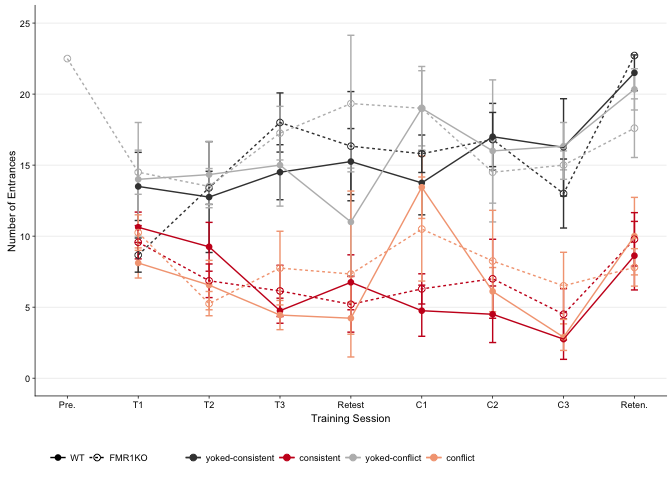
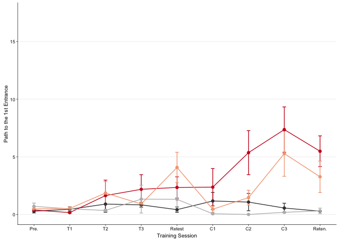
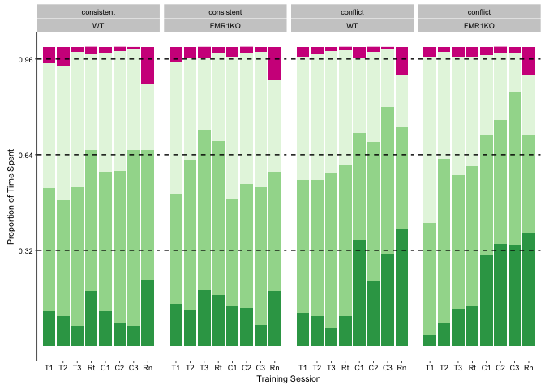
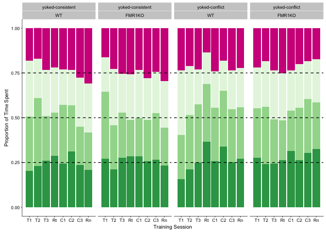
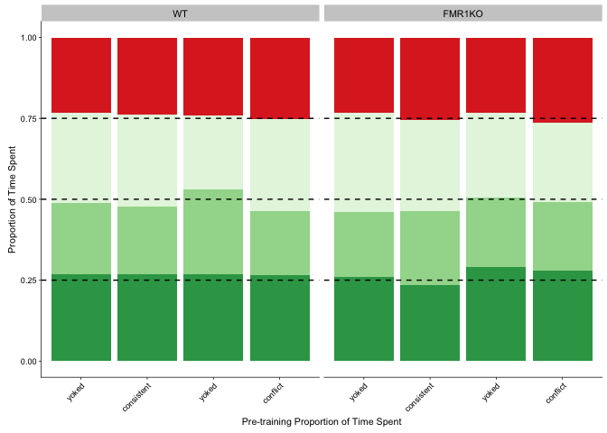
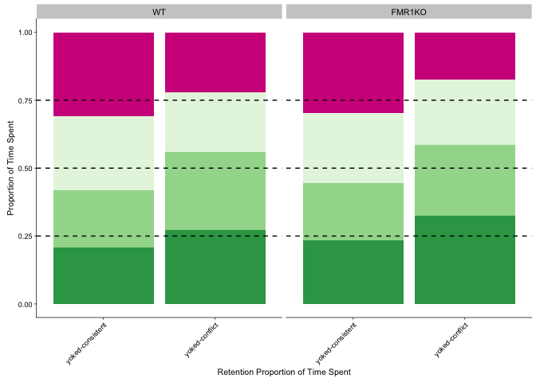
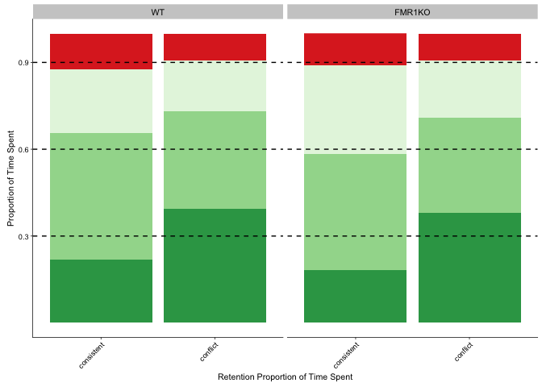
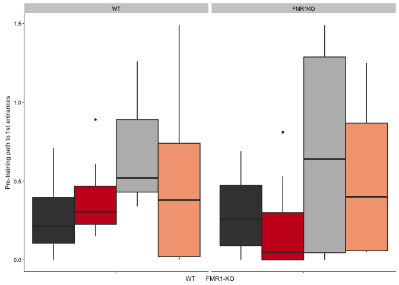
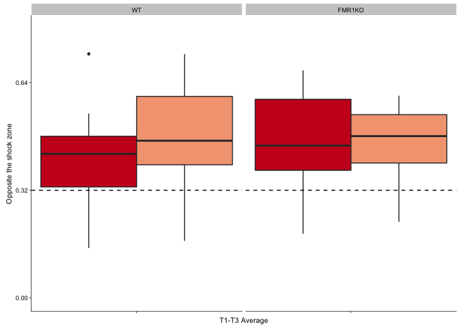

Setup - load libraries and favorite colors
==========================================

    ## load libraries 
    library(tidyr) ## for respahing data
    library(plyr) ## for renmaing factors
    library(dplyr) ## for filtering and selecting rows
    library(reshape2) ## for melting dataframe
    library(ggplot2)
    library(cowplot)
    library(pheatmap)
    library(viridis)
    library(ez) # for non-parametric ANOVA

    ## load color settings
    source("figureoptions.R")

    knitr::opts_chunk$set(fig.path = '../figures/01_behavior/')

Behavior data wrangling and sample sizes
========================================

    ## read intermediate data (raw data from video tracker program analyzed in matlab)
    behavior <- read.csv("../data/fmr1.csv", header = T)

    behavior$APA <- as.factor(behavior$APA)
    behavior$APA2 <- as.factor(behavior$APA2)

    ## relevel then rename factors treatment
    behavior$APA2 <- factor(behavior$APA2, levels = c("controlconsistent", "consistent", "controlconflict", "conflict"))
    levels(behavior$APA2) <- c("yoked-consistent","consistent", "yoked-conflict","conflict")
    levels(behavior$APA2)

    ## [1] "yoked-consistent" "consistent"       "yoked-conflict"  
    ## [4] "conflict"

    #relevel genotype
    levels(behavior$Genotype) <- c("WT","FMR1KO")
    #levels(behavior$conflict) <- c("consistent","conflict")

    behavior$Time1stEntrLog <- log(behavior$Time1stEntr)  ## log transformation
    behavior$conflict <- ifelse(grepl("conflict", behavior$APA2), "conflict", "consistent") # for splitting
    levels(behavior$conflict) <- c("consistent","conflict")
    behavior <- behavior[c(1,3,7,8,10,60,14:59)] # supset data
    behavior <- subset(behavior, !is.na(behavior$NumEntrances)) # remove nas

    # sample sizes
    behavior %>% 
      filter(TrainSessionCombo == "Retention", Genotype == "WT") %>%
      select(APA2, Genotype)  %>%  summary()

    ##                APA2     Genotype 
    ##  yoked-consistent:4   WT    :24  
    ##  consistent      :8   FMR1KO: 0  
    ##  yoked-conflict  :3              
    ##  conflict        :9

    behavior %>% 
      filter(TrainSessionCombo == "Retention", Genotype == "FMR1KO") %>%
      select(APA2, Genotype)  %>%  summary()

    ##                APA2     Genotype 
    ##  yoked-consistent:7   WT    : 0  
    ##  consistent      :9   FMR1KO:26  
    ##  yoked-conflict  :5              
    ##  conflict        :5

General overview of number of entrances to the shock zone and path to the first entrance. No statistics on these full data sets because its makes more sense to subset the data into training and non-training sessions first.
==============================================================================================================================================================================================================================

    # behaviors
    numentr <- dplyr::summarise(group_by(behavior, Genotype, APA2, TrainSessionComboNum, conflict), m = mean(NumEntrances), se = sd(NumEntrances)/sqrt(length(NumEntrances)), len = length(NumEntrances))

    pathentr <- dplyr::summarise(group_by(behavior, Genotype, APA2, TrainSessionComboNum, conflict), m = mean(Path1stEntr), se = sd(Path1stEntr)/sqrt(length(Path1stEntr)), len = length(Path1stEntr))

    levels(numentr$APA2) <- c("yoked-consistent","consistent", "yoked-conflict","conflict")
    levels(pathentr$APA2) <- c("yoked-consistent","consistent", "yoked-conflict","conflict")

    numentr$conflict = factor(numentr$conflict, levels = c("consistent","conflict"))
    pathentr$conflict = factor(numentr$conflict, levels = c("consistent","conflict"))
    numentr$measure <- "Number of Entrances"
    pathentr$measure <- "Path to the 1st Entrance"

    PathNum <- rbind(pathentr,numentr)
    PathNum$measure <- as.factor(PathNum$measure)
    write.csv(PathNum, "../data/01_behaviordatasummary.csv")

    PathNumStats <- behavior  %>% 
      filter(Genotype == "WT", TrainSessionComboNum == "6") 
    summary(aov(NumEntrances ~  APA2, data=PathNumStats))

    ##             Df Sum Sq Mean Sq F value Pr(>F)   
    ## APA2         3  586.5  195.50   6.182 0.0038 **
    ## Residuals   20  632.5   31.62                  
    ## ---
    ## Signif. codes:  0 '***' 0.001 '**' 0.01 '*' 0.05 '.' 0.1 ' ' 1

    TukeyHSD(aov(NumEntrances ~  APA2, data=PathNumStats))

    ##   Tukey multiple comparisons of means
    ##     95% family-wise confidence level
    ## 
    ## Fit: aov(formula = NumEntrances ~ APA2, data = PathNumStats)
    ## 
    ## $APA2
    ##                                       diff        lwr        upr     p adj
    ## consistent-yoked-consistent     -9.0000000 -18.638609  0.6386088 0.0725616
    ## yoked-conflict-yoked-consistent  5.2500000  -6.771457 17.2714573 0.6204062
    ## conflict-yoked-consistent       -0.3055556  -9.763988  9.1528765 0.9997256
    ## yoked-conflict-consistent       14.2500000   3.594117 24.9058830 0.0064663
    ## conflict-consistent              8.6944444   1.046285 16.3426039 0.0223441
    ## conflict-yoked-conflict         -5.5555556 -16.048744  4.9376326 0.4662747

    summary(aov(Path1stEntr ~  APA2, data=PathNumStats))

    ##             Df Sum Sq Mean Sq F value Pr(>F)
    ## APA2         3  19.78   6.595   0.838  0.489
    ## Residuals   20 157.44   7.872

    TukeyHSD(aov(Path1stEntr ~  APA2, data=PathNumStats))

    ##   Tukey multiple comparisons of means
    ##     95% family-wise confidence level
    ## 
    ## Fit: aov(formula = Path1stEntr ~ APA2, data = PathNumStats)
    ## 
    ## $APA2
    ##                                       diff       lwr      upr     p adj
    ## consistent-yoked-consistent      1.1987500 -3.610264 6.007764 0.8967535
    ## yoked-conflict-yoked-consistent -1.1100000 -7.107894 4.887894 0.9537954
    ## conflict-yoked-consistent       -0.7144444 -5.433562 4.004673 0.9737485
    ## yoked-conflict-consistent       -2.3087500 -7.625315 3.007815 0.6245700
    ## conflict-consistent             -1.9131944 -5.729109 1.902720 0.5118482
    ## conflict-yoked-conflict          0.3955556 -4.839835 5.630946 0.9965448

    PathNumStats <- behavior  %>% 
      filter(Genotype == "WT", TrainSessionComboNum == "8") 
    summary(aov(NumEntrances ~  APA2, data=PathNumStats))

    ##             Df Sum Sq Mean Sq F value   Pr(>F)    
    ## APA2         3  898.7  299.56   17.95 6.82e-06 ***
    ## Residuals   20  333.8   16.69                     
    ## ---
    ## Signif. codes:  0 '***' 0.001 '**' 0.01 '*' 0.05 '.' 0.1 ' ' 1

    TukeyHSD(aov(NumEntrances ~  APA2, data=PathNumStats))

    ##   Tukey multiple comparisons of means
    ##     95% family-wise confidence level
    ## 
    ## Fit: aov(formula = NumEntrances ~ APA2, data = PathNumStats)
    ## 
    ## $APA2
    ##                                         diff        lwr       upr
    ## consistent-yoked-consistent     -13.50000000 -20.502295 -6.497705
    ## yoked-conflict-yoked-consistent   0.08333333  -8.650063  8.816730
    ## conflict-yoked-consistent       -13.36111111 -20.232511 -6.489712
    ## yoked-conflict-consistent        13.58333333   5.842005 21.324662
    ## conflict-consistent               0.13888889  -5.417377  5.695154
    ## conflict-yoked-conflict         -13.44444444 -21.067578 -5.821311
    ##                                     p adj
    ## consistent-yoked-consistent     0.0001519
    ## yoked-conflict-yoked-consistent 0.9999929
    ## conflict-yoked-consistent       0.0001370
    ## yoked-conflict-consistent       0.0004533
    ## conflict-consistent             0.9998727
    ## conflict-yoked-conflict         0.0004282

    summary(aov(Path1stEntr ~  APA2, data=PathNumStats))

    ##             Df Sum Sq Mean Sq F value Pr(>F)  
    ## APA2         3  189.0   63.00   2.531 0.0861 .
    ## Residuals   20  497.8   24.89                 
    ## ---
    ## Signif. codes:  0 '***' 0.001 '**' 0.01 '*' 0.05 '.' 0.1 ' ' 1

    TukeyHSD(aov(Path1stEntr ~  APA2, data=PathNumStats))

    ##   Tukey multiple comparisons of means
    ##     95% family-wise confidence level
    ## 
    ## Fit: aov(formula = Path1stEntr ~ APA2, data = PathNumStats)
    ## 
    ## $APA2
    ##                                       diff        lwr       upr     p adj
    ## consistent-yoked-consistent      6.8062500  -1.744569 15.357069 0.1498115
    ## yoked-conflict-yoked-consistent -0.3708333 -11.035578 10.293911 0.9996581
    ## conflict-yoked-consistent        4.7225000  -3.668476 13.113476 0.4143225
    ## yoked-conflict-consistent       -7.1770833 -16.630369  2.276202 0.1793386
    ## conflict-consistent             -2.0837500  -8.868757  4.701257 0.8252925
    ## conflict-yoked-conflict          5.0933333  -4.215619 14.402286 0.4383742

    PathNumStats <- behavior  %>% 
      filter(Genotype == "WT", TrainSessionComboNum == "4") 
    summary(aov(NumEntrances ~  APA2, data=PathNumStats))

    ##             Df Sum Sq Mean Sq F value   Pr(>F)    
    ## APA2         3  509.2  169.75   15.81 1.67e-05 ***
    ## Residuals   20  214.7   10.74                     
    ## ---
    ## Signif. codes:  0 '***' 0.001 '**' 0.01 '*' 0.05 '.' 0.1 ' ' 1

    TukeyHSD(aov(NumEntrances ~  APA2, data=PathNumStats))

    ##   Tukey multiple comparisons of means
    ##     95% family-wise confidence level
    ## 
    ## Fit: aov(formula = NumEntrances ~ APA2, data = PathNumStats)
    ## 
    ## $APA2
    ##                                        diff        lwr       upr     p adj
    ## consistent-yoked-consistent      -9.7500000 -15.366065 -4.133935 0.0005101
    ## yoked-conflict-yoked-consistent   0.5000000  -6.504464  7.504464 0.9970800
    ## conflict-yoked-consistent       -10.0555556 -15.566638 -4.544473 0.0002910
    ## yoked-conflict-consistent        10.2500000   4.041207 16.458793 0.0008779
    ## conflict-consistent              -0.3055556  -4.761858  4.150747 0.9974087
    ## conflict-yoked-conflict         -10.5555556 -16.669553 -4.441558 0.0005423

    summary(aov(Path1stEntr ~  APA2, data=PathNumStats))

    ##             Df Sum Sq Mean Sq F value Pr(>F)
    ## APA2         3   8.35   2.782   0.549  0.655
    ## Residuals   20 101.38   5.069

    TukeyHSD(aov(Path1stEntr ~  APA2, data=PathNumStats))

    ##   Tukey multiple comparisons of means
    ##     95% family-wise confidence level
    ## 
    ## Fit: aov(formula = Path1stEntr ~ APA2, data = PathNumStats)
    ## 
    ## $APA2
    ##                                    diff       lwr      upr     p adj
    ## consistent-yoked-consistent      1.3500 -2.508926 5.208926 0.7626849
    ## yoked-conflict-yoked-consistent  0.4975 -4.315426 5.310426 0.9912981
    ## conflict-yoked-consistent        0.0775 -3.709290 3.864290 0.9999301
    ## yoked-conflict-consistent       -0.8525 -5.118703 3.413703 0.9428967
    ## conflict-consistent             -1.2725 -4.334527 1.789527 0.6560458
    ## conflict-yoked-conflict         -0.4200 -4.621066 3.781066 0.9921090

    numenrwt <- PathNum  %>% 
      #filter(TrainSessionComboNum != "1", TrainSessionComboNum != "9") %>% 
      filter(measure == "Number of Entrances") %>% 
      filter(Genotype == "WT") %>% 
      droplevels()  %>% 
      ggplot(aes(x=, TrainSessionComboNum, y=m, color=APA2, shape=Genotype)) + 
        geom_errorbar(aes(ymin=m-se, ymax=m+se), width=.1) +
        geom_point(size = 2) +
       geom_line(aes(colour=APA2, linetype=Genotype)) +
       scale_y_continuous(name= "Number of Entrances",
                          limits = c(0,35)) +
        scale_x_continuous(name="Training Session", 
                           breaks = c(1, 2, 3, 4, 5, 6, 7, 8, 9),
                           labels = c( "Pre.", "T1", "T2", "T3",
                                       "Retest", "C1", "C2" ,"C3", 
                                       "Reten.")) +
      theme_cowplot(font_size = 8, line_size = 0.25) +
      background_grid(major = "y", minor="non") +
      scale_color_manual(values = colorvalAPA00)  +
      theme(legend.title=element_blank()) +
      theme(legend.position="none") +
      scale_shape_manual(values=c(16, 1)) 
    numenrwt

    pdf(file="../figures/01_behavior/numenrwt.pdf", width=2.25, height=2)
    plot(numenrwt)
    dev.off()

    ## quartz_off_screen 
    ##                 2

    numenrfmr1 <- PathNum  %>% 
      filter(TrainSessionComboNum != "1", TrainSessionComboNum != "9") %>% 
      filter(measure == "Number of Entrances") %>% 
      filter(Genotype != "WT") %>% 
      ggplot(aes(x=, TrainSessionComboNum, y=m, color=APA2, shape=Genotype)) + 
        geom_errorbar(aes(ymin=m-se, ymax=m+se), width=.1) +
        geom_point(size = 2) +
       geom_line(linetype = 2, aes(colour=APA2)) +
       scale_y_continuous(name= "Number of Entrances",
                          limits = c(0,35)) +
        scale_x_continuous(name="Training Session", 
                           breaks = c(1, 2, 3, 4, 5, 6, 7, 8, 9),
                           labels = c( "Pre.", "T1", "T2", "T3",
                                       "Retest", "C1", "C2","C3", 
                                      "Reten.")) +
      theme_cowplot(font_size = 8, line_size = 0.25) +
      background_grid(major = "y", minor = "none") +
      scale_color_manual(values = colorvalAPA00)  +
      theme(legend.title=element_blank()) +
      theme(legend.position="none") +
      scale_shape_manual(values=c(1)) 
    numenrfmr1

    pdf(file="../figures/01_behavior/numenrfmr1.pdf", width=2.25, height=2)
    plot(numenrfmr1)
    dev.off()

    ## quartz_off_screen 
    ##                 2

    pathfmr1 <- PathNum  %>% 
      #filter(TrainSessionComboNum != "1", TrainSessionComboNum != "9") %>% 
      filter(measure == "Path to the 1st Entrance") %>% 
      filter(Genotype != "WT") %>% 
      ggplot(aes(x=, TrainSessionComboNum, y=m, color=APA2, shape=Genotype)) + 
        geom_errorbar(aes(ymin=m-se, ymax=m+se), width=.1) +
        geom_point(size = 2) +
       geom_line(linetype = 2, aes(colour=APA2)) +
       scale_y_continuous(name= "Path to the 1st Entrance",
                          limits = c(0,17.5)) +
        scale_x_continuous(name="Training Session", 
                           breaks = c(1, 2, 3, 4, 5, 6, 7, 8, 9),
                           labels = c( "Pre.", "T1", "T2", "T3",
                                       "Retest", "C1", "C2", "C3", 
                                        "Reten.")) +
      theme_cowplot(font_size = 8, line_size = 0.25) +
      background_grid(major = "y", minor = "none") +
      scale_color_manual(values = colorvalAPA00)  +
      theme(legend.title=element_blank()) +
      theme(legend.position="none") +
      scale_shape_manual(values=c(1)) 
    pathfmr1

    pdf(file="../figures/01_behavior/pathfmr1.pdf", width=2.25, height=2)
    plot(pathfmr1)
    dev.off()

    ## quartz_off_screen 
    ##                 2

    pathwt <- PathNum  %>% 
      #filter(TrainSessionComboNum != "1", TrainSessionComboNum != "9") %>% 
      filter(measure == "Path to the 1st Entrance") %>% 
      filter(Genotype == "WT") %>% 
      ggplot(aes(x=, TrainSessionComboNum, y=m, color=APA2, shape=Genotype)) + 
        geom_errorbar(aes(ymin=m-se, ymax=m+se), width=.1) +
        geom_point(size = 2) +
       geom_line(linetype = 1, aes(colour=APA2)) +
       scale_y_continuous(name= "Path to the 1st Entrance",
                          limits = c(0,17.5)) +
        scale_x_continuous(name="Training Session", 
                           breaks = c(1, 2, 3, 4, 5, 6, 7, 8, 9),
                           labels = c( "Pre.", "T1", "T2", "T3",
                                       "Retest", "C1", "C2","C3", 
                                       "Reten.")) +
      theme_cowplot(font_size = 8, line_size = 0.25) +
      background_grid(major = "y", minor = "none") +
      scale_color_manual(values = colorvalAPA00)  +
      theme(legend.title=element_blank()) +
      theme(legend.position="none") +
      scale_shape_manual(values=c(16)) 
    pathwt

    ## Warning: Removed 1 rows containing missing values (geom_errorbar).

    pdf(file="../figures/01_behavior/pathwt.pdf", width=2.25, height=2)
    plot(pathwt)

    ## Warning: Removed 1 rows containing missing values (geom_errorbar).

    dev.off()

    ## quartz_off_screen 
    ##                 2

Proption time spent before training
===================================

During the pre-training trial, all groups spend an equal amount of time
in all quadrants of the arena.

    PathNumStats <- behavior  %>% 
      filter(TrainSessionComboNum == "1") 
    summary(aov(pTimeTarget ~  APA2 * Genotype, data=PathNumStats))

    ##               Df  Sum Sq   Mean Sq F value Pr(>F)
    ## APA2           3 0.00315 0.0010494   0.472  0.704
    ## Genotype       1 0.00091 0.0009060   0.408  0.527
    ## APA2:Genotype  3 0.00088 0.0002938   0.132  0.940
    ## Residuals     35 0.07780 0.0022229

    summary(aov(pTimeOPP ~  APA2 * Genotype, data=PathNumStats))

    ##               Df  Sum Sq   Mean Sq F value Pr(>F)
    ## APA2           3 0.00528 0.0017596   1.077  0.371
    ## Genotype       1 0.00001 0.0000134   0.008  0.928
    ## APA2:Genotype  3 0.00643 0.0021428   1.312  0.286
    ## Residuals     35 0.05717 0.0016334

    summary(aov(pTimeCW ~  APA2 * Genotype, data=PathNumStats))

    ##               Df  Sum Sq   Mean Sq F value Pr(>F)
    ## APA2           3 0.00415 0.0013839   0.493  0.689
    ## Genotype       1 0.00042 0.0004178   0.149  0.702
    ## APA2:Genotype  3 0.00555 0.0018505   0.660  0.582
    ## Residuals     35 0.09820 0.0028056

    summary(aov(pTimeCCW ~  APA2 * Genotype, data=PathNumStats))

    ##               Df  Sum Sq   Mean Sq F value Pr(>F)
    ## APA2           3 0.00906 0.0030208   0.965  0.420
    ## Genotype       1 0.00004 0.0000374   0.012  0.914
    ## APA2:Genotype  3 0.00766 0.0025548   0.816  0.494
    ## Residuals     35 0.10959 0.0031311

Where do mice spend their time?
===============================

Again this first graph is a big overview that shows that consistent
trained aniamls avoid the shock zone and the clockwise area while
conflict avoid the shock zone and counter clockwise. This is
re-illustrated in the subsequent graph focusing just on the conlict
training sessions. Yoked mice show no place preference or avoidance.

    proptime <- behavior[,c(1,2,4,8,9,12,26:29)]
    proptime <- melt(proptime, id.vars = c("ID", "Genotype", "TrainSession",
                                           "APA2", "TrainSessionCombo","TrainSessionComboNum")) 

    timespent1 <- proptime %>%
      filter(APA2 %in% c("consistent","conflict")) %>%
      filter(TrainSessionComboNum != 1) %>%
      ggplot(aes(x = TrainSessionComboNum, y = value,fill = variable)) + 
        geom_bar(position = "fill",stat = "identity") +
        scale_x_continuous(name="Training Session", 
                           breaks = c(1, 2, 3, 4, 5, 6, 7, 8, 9),
                           labels = c( "P", "T1", "T2", "T3",
                                       "Rt", "C1", "C2","C3", 
                                       "Rn")) +
      facet_wrap(~APA2*Genotype, nrow=1) +
      theme_cowplot(font_size = 8, line_size = 0.25) +  theme(legend.title=element_blank()) +
        theme(legend.position="none") +
      scale_y_continuous(name= "Proportion of Time Spent",
                         breaks = c(0.32,0.64, 0.96)) +
      scale_fill_manual(values = c("#de2d26", "#e5f5e0" ,"#a1d99b", "#31a354")) + 
      geom_hline(yintercept=c(0.32,0.64, 0.96), color="black" , linetype="dashed") 
    timespent1

    timespent2 <- proptime %>%
      filter(APA2 %in% c("yoked-consistent","yoked-conflict")) %>%
        filter(TrainSessionComboNum != 1) %>%
      ggplot(aes(x = TrainSessionComboNum, y = value,fill = variable)) + 
        geom_bar(position = "fill",stat = "identity") +
        scale_x_continuous(name="Training Session", 
                           breaks = c(1, 2, 3, 4, 5, 6, 7, 8, 9),
                           labels = c( "P", "T1", "T2", "T3",
                                       "Rt", "C1", "C2","C3", 
                                       "Rn")) +
      facet_wrap(~APA2*Genotype, nrow=1) +
      theme_cowplot(font_size = 8, line_size = 0.25) +
      theme(legend.title=element_blank()) +
      theme(legend.position="none") +
      scale_y_continuous(name= "Proportion of Time Spent") +
      scale_fill_manual(values = c("#de2d26", "#e5f5e0" ,"#a1d99b", "#31a354")) + 
      geom_hline(yintercept=c(0.25,0.50, 0.75), color="black" , linetype="dashed")
    timespent2

    pdf(file="../figures/01_behavior/timespent1.pdf", width=6, height=2.25)
    plot(timespent1)
    dev.off()

    ## quartz_off_screen 
    ##                 2

    pdf(file="../figures/01_behavior/timespent2.pdf", width=6, height=2.25)
    plot(timespent2)
    dev.off()

    ## quartz_off_screen 
    ##                 2

    timespent3 <- proptime %>%
      #filter(APA2 %in% c("yoked-consistent","yoked-conflict")) %>%
      filter(TrainSessionComboNum %in% c("1")) %>%
      ggplot(aes(x = APA2, y = value,fill = variable)) + 
        geom_bar(position = "fill",stat = "identity") +
        scale_x_discrete(name="Pre-training Proportion of Time Spent",
                         labels = c("yoked", "consistent", "yoked", "conflict")) +
      facet_wrap(~Genotype, nrow=1) +
      theme_cowplot(font_size = 8, line_size = 0.25) +
      theme(legend.title=element_blank()) +
      theme(legend.position="none") +
      scale_y_continuous(name= "Proportion of Time Spent") +
      scale_fill_manual(values = c("#de2d26", "#e5f5e0" ,"#a1d99b", "#31a354")) + 
      geom_hline(yintercept=c(0.25,0.50, 0.75), color="black" , linetype="dashed") +
      theme(strip.text.x = element_text(size = 8)) +
      theme(axis.text.x = element_text(angle = 45, hjust = 1))
    timespent3

    pdf(file="../figures/01_behavior/timespent3.pdf", width=3, height=2.25)
    plot(timespent3)
    dev.off()

    ## quartz_off_screen 
    ##                 2

    timespent4 <- proptime %>%
      filter(APA2 %in% c("yoked-consistent","yoked-conflict")) %>%
      filter(TrainSessionComboNum %in% c("9")) %>%
      ggplot(aes(x = APA2, y = value,fill = variable)) + 
        geom_bar(position = "fill",stat = "identity") +
        scale_x_discrete(name="Retention Proportion of Time Spent") +
      facet_wrap(~Genotype, nrow=1) +
      theme_cowplot(font_size = 8, line_size = 0.25) +
      theme(legend.title=element_blank()) +
      theme(legend.position="none") +
      scale_y_continuous(name= "Proportion of Time Spent") +
      scale_fill_manual(values = c("#de2d26", "#e5f5e0" ,"#a1d99b", "#31a354")) + 
        geom_hline(yintercept=c(0.25,0.50, 0.75), color="black" , linetype="dashed") +
      theme(strip.text.x = element_text(size = 8)) +
      theme(axis.text.x = element_text(angle = 45, hjust = 1))
    timespent4

    timespent5 <- proptime %>%
      filter(APA2 %in% c("consistent","conflict")) %>%
      filter(TrainSessionComboNum %in% c("9")) %>%
      ggplot(aes(x = APA2, y = value,fill = variable)) + 
        geom_bar(position = "fill",stat = "identity") +
        scale_x_discrete(name="Retention Proportion of Time Spent") +
      facet_wrap(~Genotype, nrow=1) +
      theme_cowplot(font_size = 8, line_size = 0.25) +
      theme(legend.title=element_blank()) +
      theme(legend.position="none") +
      scale_y_continuous(name= "Proportion of Time Spent",
                         breaks = c(0.30,0.60, 0.90)) +
      scale_fill_manual(values = c("#de2d26", "#e5f5e0" ,"#a1d99b", "#31a354")) + 
      geom_hline(yintercept=c(0.30,0.60, 0.90), color="black" , linetype="dashed") +
      theme(strip.text.x = element_text(size = 8)) +
      theme(axis.text.x = element_text(angle = 45, hjust = 1))
    timespent5

    pdf(file="../figures/01_behavior/timespent4.pdf", width=1.75, height=2.25)
    plot(timespent4)
    dev.off()

    ## quartz_off_screen 
    ##                 2

    pdf(file="../figures/01_behavior/timespent5.pdf", width=1.75, height=2.25)
    plot(timespent5)
    dev.off()

    ## quartz_off_screen 
    ##                 2

Now - exampine space use interaction APA2 \* Genotype in trained and yoked separated
====================================================================================

    trainedtimespent <- behavior %>%
      filter(APA2 %in% c("consistent","conflict")) %>%
        filter(TrainSessionComboNum %in% c("6", "7", "8"))
    head(trainedtimespent)

    ##        ID Genotype Day TrainSession PairedPartner   conflict        APA
    ## 1 16-122A   FMR1KO   2           T4       16-122B consistent consistent
    ## 2 16-122A   FMR1KO   2           T5       16-122B consistent consistent
    ## 3 16-122A   FMR1KO   2           T6       16-122B consistent consistent
    ## 4 16-123A   FMR1KO   2           T4       16-123B consistent consistent
    ## 5 16-123A   FMR1KO   2           T5       16-123B consistent consistent
    ## 6 16-124A   FMR1KO   2           T4       16-357A consistent consistent
    ##         APA2 TrainSessionCombo         pair1         pair2
    ## 1 consistent             T4_C1 16-122A_T4_C1 16-122B_T4_C1
    ## 2 consistent             T5_C2 16-122A_T5_C2 16-122B_T5_C2
    ## 3 consistent             T6_C3 16-122A_T6_C3 16-122B_T6_C3
    ## 4 consistent             T4_C1 16-123A_T4_C1 16-123B_T4_C1
    ## 5 consistent             T5_C2 16-123A_T5_C2 16-123B_T5_C2
    ## 6 consistent             T4_C1 16-124A_T4_C1 16-357A_T4_C1
    ##   TrainSessionComboNum SdevSpeedArena Linearity.Arena. NumEntrances
    ## 1                    6           1.96           0.2697            5
    ## 2                    7           2.00           0.2821            3
    ## 3                    8           1.93           0.2718            3
    ## 4                    6           2.39           0.2379            6
    ## 5                    7           2.40           0.2798            5
    ## 6                    6           2.41           0.2648            4
    ##   Time1stEntr Path1stEntr Speed1stEntr.cm.s. Dist1stEntr.m. NumShock
    ## 1       31.47        0.43               1.22           0.40        5
    ## 2       37.30        0.71               1.53           0.23        3
    ## 3      188.60        3.41               1.48           0.24        4
    ## 4      126.23        2.58               1.18           0.42        6
    ## 5       55.13        1.00               1.97           0.35        5
    ## 6       40.10        0.81               1.53           0.27        4
    ##   MaxTimeAvoid Time2ndEntr Path2ndEntr Speed2ndEntr TimeTarget pTimeTarget
    ## 1          233       52.67        0.93         1.71      5.667      0.0151
    ## 2          325       52.67        1.07         1.59      3.034      0.0078
    ## 3          304      245.83        4.59         1.59      5.067      0.0126
    ## 4          210      185.63        3.84         1.59      5.131      0.0130
    ## 5          201      256.90        5.78         2.33      5.367      0.0137
    ## 6          301      117.17        2.66         1.53      3.468      0.0092
    ##   pTimeCCW pTimeOPP pTimeCW RayleigLength RayleigAngle PolarAvgVal
    ## 1   0.5290   0.3922  0.0638          0.57       129.63      220.68
    ## 2   0.4303   0.5199  0.0420          0.70       142.12      228.36
    ## 3   0.7609   0.2030  0.0235          0.76       110.32      202.47
    ## 4   0.3719   0.2944  0.3206          0.32       173.63      219.49
    ## 5   0.1975   0.4119  0.3769          0.41       202.53      217.89
    ## 6   0.8264   0.1635  0.0009          0.83       110.11      200.23
    ##   PolarSdVal PolarMinVal PolarMinBin Min50.RngLoBin Min50.RngHiBin
    ## 1      58.84       0e+00         350            140             70
    ## 2      50.61       0e+00           0            160            110
    ## 3      43.93       0e+00          10            120             80
    ## 4      87.53       1e-04           0            240            130
    ## 5      98.01       2e-04           0            250            150
    ## 6      35.21       0e+00           0            130            100
    ##   PolarMaxVal PolarMaxBin Max50.RngLoBin Max50.RngHiBin AnnularMinVal
    ## 1      0.0731         120             70            170        0.0019
    ## 2      0.0870         130             90            170        0.0105
    ## 3      0.1044         100             70            140        0.0013
    ## 4      0.0561         230            150            300        0.0028
    ## 5      0.0535         230            130            260        0.0052
    ## 6      0.1234         110             90            150        0.0002
    ##   AnnularMinBin AnnularMaxVal AnnularMaxBin AnnularAvg AnnularSd
    ## 1          16.9        0.3043          13.1      12.74     17.01
    ## 2           3.1        0.3448          14.5      13.78     15.22
    ## 3          16.9        0.3035          15.8      13.57     17.57
    ## 4           7.5        0.5497          15.8      15.03      9.80
    ## 5           3.1        0.4032          15.8      14.55     12.99
    ## 6           7.5        0.7482          15.8      15.47      4.61
    ##   AnnularSkewnes AnnularKurtosis     Speed1     Speed2 Time1stEntrLog
    ## 1           1.24            5.19 0.01366381 0.01765711       3.449035
    ## 2           2.44           13.07 0.01903485 0.02031517       3.618993
    ## 3           1.86            7.94 0.01808059 0.01867144       5.239628
    ## 4           3.62           24.17 0.02043888 0.02068631       4.838106
    ## 5           2.04            8.62 0.01813894 0.02249903       4.009694
    ## 6           4.74           68.30 0.02019950 0.02270206       3.691376

    summary(aov(data =  trainedtimespent, pTimeTarget ~ Genotype * APA2 ))

    ##               Df  Sum Sq   Mean Sq F value Pr(>F)
    ## Genotype       1 0.00065 0.0006531   1.179  0.281
    ## APA2           1 0.00035 0.0003529   0.637  0.427
    ## Genotype:APA2  1 0.00033 0.0003310   0.597  0.442
    ## Residuals     78 0.04322 0.0005541

    #Genotype       1 0.00065 0.0006531   1.179  0.281
    #APA2           1 0.00035 0.0003529   0.637  0.427
    #Genotype:APA2  1 0.00033 0.0003310   0.597  0.442

    summary(aov(data =  trainedtimespent, pTimeCW ~ Genotype * APA2 ))

    ##               Df Sum Sq Mean Sq F value   Pr(>F)    
    ## Genotype       1 0.0000  0.0000   0.001    0.982    
    ## APA2           1 0.8791  0.8791  38.375 2.56e-08 ***
    ## Genotype:APA2  1 0.0006  0.0006   0.027    0.871    
    ## Residuals     78 1.7869  0.0229                     
    ## ---
    ## Signif. codes:  0 '***' 0.001 '**' 0.01 '*' 0.05 '.' 0.1 ' ' 1

    #Genotype       1 0.0000  0.0000   0.001    0.982    
    #APA2           1 0.8791  0.8791  38.375 2.56e-08 ***
    #Genotype:APA2  1 0.0006  0.0006   0.027    0.871 
    TukeyHSD(aov(data =  trainedtimespent, pTimeCW ~ Genotype * APA2 ))

    ##   Tukey multiple comparisons of means
    ##     95% family-wise confidence level
    ## 
    ## Fit: aov(formula = pTimeCW ~ Genotype * APA2, data = trainedtimespent)
    ## 
    ## $Genotype
    ##                    diff         lwr        upr    p adj
    ## FMR1KO-WT -0.0007857052 -0.06941043 0.06783902 0.981873
    ## 
    ## $APA2
    ##                         diff       lwr       upr p adj
    ## conflict-consistent 0.205344 0.1387124 0.2719755     0
    ## 
    ## $`Genotype:APA2`
    ##                                         diff         lwr       upr
    ## FMR1KO:consistent-WT:consistent   0.02397566 -0.09804438 0.1459957
    ## WT:conflict-WT:consistent         0.20514213  0.09366727 0.3166170
    ## FMR1KO:conflict-WT:consistent     0.24057083  0.10008441 0.3810573
    ## WT:conflict-FMR1KO:consistent     0.18116647  0.06217945 0.3001535
    ## FMR1KO:conflict-FMR1KO:consistent 0.21659518  0.07007657 0.3631138
    ## FMR1KO:conflict-WT:conflict       0.03542870 -0.10243157 0.1732890
    ##                                       p adj
    ## FMR1KO:consistent-WT:consistent   0.9550673
    ## WT:conflict-WT:consistent         0.0000389
    ## FMR1KO:conflict-WT:consistent     0.0001379
    ## WT:conflict-FMR1KO:consistent     0.0008182
    ## FMR1KO:conflict-FMR1KO:consistent 0.0012165
    ## FMR1KO:conflict-WT:conflict       0.9063729

    #FMR1KO:consistent-WT:consistent   0.02397566 -0.09804438 0.1459957 0.9550673
    #WT:conflict-WT:consistent         0.20514213  0.09366727 0.3166170 0.0000389
    #FMR1KO:conflict-WT:consistent     0.24057083  0.10008441 0.3810573 0.0001379
    #WT:conflict-FMR1KO:consistent     0.18116647  0.06217945 0.3001535 0.0008182
    #FMR1KO:conflict-FMR1KO:consistent 0.21659518  0.07007657 0.3631138 0.0012165
    #FMR1KO:conflict-WT:conflict       0.03542870 -0.10243157 0.1732890 0.9063729

    summary(aov(data =  trainedtimespent, pTimeOPP ~ Genotype * APA2 ))

    ##               Df Sum Sq Mean Sq F value Pr(>F)
    ## Genotype       1 0.0617 0.06168   2.146  0.147
    ## APA2           1 0.0309 0.03088   1.074  0.303
    ## Genotype:APA2  1 0.0634 0.06339   2.206  0.142
    ## Residuals     78 2.2417 0.02874

    #Genotype       1 0.0617 0.06168   2.146  0.147
    #APA2           1 0.0309 0.03088   1.074  0.303
    #Genotype:APA2  1 0.0634 0.06339   2.206  0.142

    summary(aov(data =  trainedtimespent, pTimeCCW ~ Genotype * APA2 ))

    ##               Df Sum Sq Mean Sq F value   Pr(>F)    
    ## Genotype       1 0.0512  0.0512   1.963    0.165    
    ## APA2           1 0.6094  0.6094  23.366 6.58e-06 ***
    ## Genotype:APA2  1 0.0668  0.0668   2.560    0.114    
    ## Residuals     78 2.0342  0.0261                     
    ## ---
    ## Signif. codes:  0 '***' 0.001 '**' 0.01 '*' 0.05 '.' 0.1 ' ' 1

    #Genotype       1 0.0512  0.0512   1.963    0.165    
    #APA2           1 0.6094  0.6094  23.366 6.58e-06 ***
    #Genotype:APA2  1 0.0668  0.0668   2.560    0.114 

    TukeyHSD(aov(data =  trainedtimespent, pTimeCCW ~ Genotype * APA2 ))

    ##   Tukey multiple comparisons of means
    ##     95% family-wise confidence level
    ## 
    ## Fit: aov(formula = pTimeCCW ~ Genotype * APA2, data = trainedtimespent)
    ## 
    ## $Genotype
    ##                 diff         lwr       upr     p adj
    ## FMR1KO-WT 0.05152245 -0.02169689 0.1247418 0.1652085
    ## 
    ## $APA2
    ##                           diff        lwr         upr   p adj
    ## conflict-consistent -0.1709606 -0.2420533 -0.09986782 7.9e-06
    ## 
    ## $`Genotype:APA2`
    ##                                          diff         lwr         upr
    ## FMR1KO:consistent-WT:consistent    0.07931096 -0.05087865  0.20950058
    ## WT:conflict-WT:consistent         -0.13039352 -0.24933193 -0.01145511
    ## FMR1KO:conflict-WT:consistent     -0.17080833 -0.32070071 -0.02091596
    ## WT:conflict-FMR1KO:consistent     -0.20970448 -0.33665801 -0.08275096
    ## FMR1KO:conflict-FMR1KO:consistent -0.25011930 -0.40644773 -0.09379087
    ## FMR1KO:conflict-WT:conflict       -0.04041481 -0.18750522  0.10667559
    ##                                       p adj
    ## FMR1KO:consistent-WT:consistent   0.3850072
    ## WT:conflict-WT:consistent         0.0259978
    ## FMR1KO:conflict-WT:consistent     0.0190587
    ## WT:conflict-FMR1KO:consistent     0.0002467
    ## FMR1KO:conflict-FMR1KO:consistent 0.0004019
    ## FMR1KO:conflict-WT:conflict       0.8883106

    #FMR1KO:consistent-WT:consistent    0.07931096 -0.05087865  0.20950058 0.3850072
    #WT:conflict-WT:consistent         -0.13039352 -0.24933193 -0.01145511 0.0259978
    #FMR1KO:conflict-WT:consistent     -0.17080833 -0.32070071 -0.02091596 0.0190587
    #WT:conflict-FMR1KO:consistent     -0.20970448 -0.33665801 -0.08275096 0.0002467
    #FMR1KO:conflict-FMR1KO:consistent -0.25011930 -0.40644773 -0.09379087 0.0004019
    #FMR1KO:conflict-WT:conflict       -0.04041481 -0.18750522  0.10667559 0.8883106

    timeccw <- behavior %>%
      filter(APA2 %in% c("consistent","conflict")) %>%
        filter(TrainSessionComboNum %in% c("6", "7", "8")) %>% 
      ggplot(aes(x = as.numeric(TrainSessionComboNum), y = pTimeCCW, fill=APA2)) +
      geom_boxplot(outlier.size=0.8) +
      facet_wrap(~Genotype) +
      scale_fill_manual(values = c("#ca0020", "#f4a582")) +  
     scale_x_continuous(name="C1-C3 Average", 
                           breaks = c(1, 2, 3, 4, 5, 6, 7, 8, 9),
                           labels = NULL) +
      geom_hline(yintercept=c(0.32), color="black" , linetype="dashed") + 
        scale_y_continuous(name = "Counter Clockwise",
          breaks = c(0,0.32, 0.64),
                         limits= c(0,0.8)) +
      theme_cowplot(font_size = 8, line_size = 0.25) +
      theme(legend.position="none")
    timeccw

    ## Warning: Removed 1 rows containing non-finite values (stat_boxplot).

    timecw <- behavior %>%
      filter(APA2 %in% c("consistent","conflict")) %>%
        filter(TrainSessionComboNum %in% c("6", "7", "8")) %>% 
      ggplot(aes(x = as.numeric(TrainSessionComboNum), y = pTimeCW, fill=APA2)) +
      geom_boxplot(outlier.size=0.8) +
      facet_wrap(~Genotype) +
      scale_fill_manual(values = c("#ca0020", "#f4a582")) +  
     scale_x_continuous(name="C1-C3 Average", 
                           breaks = c(1, 2, 3, 4, 5, 6, 7, 8, 9),
                           labels = NULL) +
      geom_hline(yintercept=c(0.32), color="black" , linetype="dashed") + 
        scale_y_continuous(name = "Clockwise",
                           breaks = c(0,0.32, 0.64),
                         limits= c(0,0.8)) +
      theme_cowplot(font_size = 8, line_size = 0.25) +
     theme(legend.position="none")
    timecw

    timet <- behavior %>%
      filter(APA2 %in% c("consistent","conflict")) %>%
        filter(TrainSessionComboNum %in% c("6", "7", "8")) %>% 
      ggplot(aes(x = as.numeric(TrainSessionComboNum), y = pTimeTarget, fill=APA2)) +
      geom_boxplot(outlier.size=0.8) +
      facet_wrap(~Genotype) +
      scale_fill_manual(values = c("#ca0020", "#f4a582")) +  
     scale_x_continuous(name="C1-C3 Average", 
                           breaks = c(1, 2, 3, 4, 5, 6, 7, 8, 9),
                           labels = NULL) +
        scale_y_continuous(name = "Shock zone",
                           breaks = c(0,0.04, 0.08, 0.12),
                             limits= c(0,0.14)) +
      #geom_hline(yintercept=c(0.04), color="black" , linetype="dashed") + 
      theme_cowplot(font_size = 8, line_size = 0.25) +
     theme(legend.position="none")
    timet

    timeopp <- behavior %>%
      filter(APA2 %in% c("consistent","conflict")) %>%
        filter(TrainSessionComboNum %in% c("6", "7", "8")) %>% 
      ggplot(aes(x = as.numeric(TrainSessionComboNum), y = pTimeOPP, fill=APA2)) +
      geom_boxplot(outlier.size=0.8) +
      facet_wrap(~Genotype) +
      scale_fill_manual(values = c("#ca0020", "#f4a582")) + 
        scale_y_continuous(name = "Opposite the shock zone",
                           breaks = c(0,0.32, 0.64),
                         limits= c(0,0.8)) +
     scale_x_continuous(name="C1-C3 Average", 
                           breaks = c(1, 2, 3, 4, 5, 6, 7, 8, 9),
                           labels = NULL) +
      geom_hline(yintercept=c(0.32), color="black" , linetype="dashed") + 
      theme_cowplot(font_size = 8, line_size = 0.25) +
     theme(legend.position="none")
    timeopp

    ## Warning: Removed 3 rows containing non-finite values (stat_boxplot).

    pdf(file="../figures/01_behavior/timecw.pdf", width=1.5, height=2)
    plot(timecw)
    dev.off()

    ## quartz_off_screen 
    ##                 2

    pdf(file="../figures/01_behavior/timeccw.pdf", width=1.5, height=2)
    plot(timeccw)

    ## Warning: Removed 1 rows containing non-finite values (stat_boxplot).

    dev.off()

    ## quartz_off_screen 
    ##                 2

    pdf(file="../figures/01_behavior/timet.pdf", width=1.5, height=2)
    plot(timet)
    dev.off()

    ## quartz_off_screen 
    ##                 2

    pdf(file="../figures/01_behavior/timeopp.pdf", width=1.5, height=2)
    plot(timeopp)

    ## Warning: Removed 3 rows containing non-finite values (stat_boxplot).

    dev.off()

    ## quartz_off_screen 
    ##                 2

    timeccw <- behavior %>%
      filter(APA2 %in% c("consistent","conflict")) %>%
        filter(TrainSessionComboNum %in% c("2", "3", "4")) %>% 
      ggplot(aes(x = as.numeric(TrainSessionComboNum), y = pTimeCCW, fill=APA2)) +
      geom_boxplot(outlier.size=0.8) +
      facet_wrap(~Genotype) +
      scale_fill_manual(values = c("#ca0020", "#f4a582")) +  
     scale_x_continuous(name="T1-T3 Average", 
                           breaks = c(1, 2, 3, 4, 5, 6, 7, 8, 9),
                           labels = NULL) +
      geom_hline(yintercept=c(0.32), color="black" , linetype="dashed") + 
        scale_y_continuous(name = "Counter Clockwise",
          breaks = c(0,0.32, 0.64),
                         limits= c(0,0.8)) +
      theme_cowplot(font_size = 8, line_size = 0.25) +
      theme(legend.position="none")
    timeccw

    ## Warning: Removed 1 rows containing non-finite values (stat_boxplot).

    timecw <- behavior %>%
      filter(APA2 %in% c("consistent","conflict")) %>%
        filter(TrainSessionComboNum %in% c("2", "3", "4")) %>% 
      ggplot(aes(x = as.numeric(TrainSessionComboNum), y = pTimeCW, fill=APA2)) +
      geom_boxplot(outlier.size=0.8) +
      facet_wrap(~Genotype) +
      scale_fill_manual(values = c("#ca0020", "#f4a582")) +  
     scale_x_continuous(name="T1-T3 Average", 
                           breaks = c(1, 2, 3, 4, 5, 6, 7, 8, 9),
                           labels = NULL) +
      geom_hline(yintercept=c(0.32), color="black" , linetype="dashed") + 
        scale_y_continuous(name = "Counter Clockwise",
          breaks = c(0,0.32, 0.64),
                         limits= c(0,0.8)) +
      theme_cowplot(font_size = 8, line_size = 0.25) +
      theme(legend.position="none")
    timecw

    timeopp <- behavior %>%
      filter(APA2 %in% c("consistent","conflict")) %>%
        filter(TrainSessionComboNum %in% c("2", "3", "4")) %>% 
      ggplot(aes(x = as.numeric(TrainSessionComboNum), y = pTimeOPP, fill=APA2)) +
      geom_boxplot(outlier.size=0.8) +
      facet_wrap(~Genotype) +
      scale_fill_manual(values = c("#ca0020", "#f4a582")) + 
        scale_y_continuous(name = "Opposite the shock zone",
                           breaks = c(0,0.32, 0.64),
                         limits= c(0,0.8)) +
     scale_x_continuous(name="T1-T3 Average", 
                           breaks = c(1, 2, 3, 4, 5, 6, 7, 8, 9),
                           labels = NULL) +
      geom_hline(yintercept=c(0.32), color="black" , linetype="dashed") + 
      theme_cowplot(font_size = 8, line_size = 0.25) +
     theme(legend.position="none")
    timeopp

    timet <- behavior %>%
      filter(APA2 %in% c("consistent","conflict")) %>%
        filter(TrainSessionComboNum %in% c("2", "3", "4")) %>% 
      ggplot(aes(x = as.numeric(TrainSessionComboNum), y = pTimeTarget, fill=APA2)) +
      geom_boxplot(outlier.size=0.8) +
      facet_wrap(~Genotype) +
      scale_fill_manual(values = c("#ca0020", "#f4a582")) +  
     scale_x_continuous(name="T1-T3 Average", 
                           breaks = c(1, 2, 3, 4, 5, 6, 7, 8, 9),
                           labels = NULL) +
        scale_y_continuous(name = "Shock zone",
                           breaks = c(0,0.04, 0.08, 0.12),
                             limits= c(0,0.14)) +
      geom_hline(yintercept=c(0.04), color="black" , linetype="dashed") + 
      theme_cowplot(font_size = 8, line_size = 0.25) +
     theme(legend.position="none")
    timet

    ## Warning: Removed 3 rows containing non-finite values (stat_boxplot).

For Loops for Stats on Everything!! Not used for manuscript
===========================================================

    slim1 <- behavior[,c(2,4,8,13:52)]
    slim2 <- slim1 %>% filter(TrainSession == "Hab") 
    Genotype <- slim2[,1]
    APA <- slim2[,3]
    slim3 <- slim2[,c(4:43)]

    for(y in names(slim3)){
      ymod<- summary(aov(slim3[[y]] ~ Genotype * APA))
      cat(paste('\nDependent var:', y, '\n'))
      print(ymod)
    }

    ## 
    ## Dependent var: SdevSpeedArena 
    ##              Df Sum Sq Mean Sq F value Pr(>F)
    ## Genotype      1  0.017 0.01695   0.096  0.758
    ## APA           3  0.669 0.22288   1.263  0.302
    ## Genotype:APA  3  0.586 0.19547   1.108  0.359
    ## Residuals    35  6.177 0.17649               
    ## 
    ## Dependent var: Linearity.Arena. 
    ##              Df  Sum Sq   Mean Sq F value Pr(>F)
    ## Genotype      1 0.00005 0.0000531   0.026  0.874
    ## APA           3 0.00450 0.0015009   0.722  0.546
    ## Genotype:APA  3 0.00123 0.0004116   0.198  0.897
    ## Residuals    35 0.07278 0.0020793               
    ## 
    ## Dependent var: NumEntrances 
    ##              Df Sum Sq Mean Sq F value Pr(>F)
    ## Genotype      1    6.1    6.11   0.236  0.630
    ## APA           3  130.1   43.36   1.674  0.190
    ## Genotype:APA  3  127.6   42.55   1.643  0.197
    ## Residuals    35  906.6   25.90               
    ## 
    ## Dependent var: Time1stEntr 
    ##              Df Sum Sq Mean Sq F value Pr(>F)
    ## Genotype      1    3.1    3.05   0.039  0.845
    ## APA           3  302.7  100.90   1.286  0.294
    ## Genotype:APA  3  179.3   59.77   0.762  0.523
    ## Residuals    35 2746.6   78.48               
    ## 
    ## Dependent var: Path1stEntr 
    ##              Df Sum Sq Mean Sq F value Pr(>F)
    ## Genotype      1  0.025 0.02459   0.124  0.727
    ## APA           3  0.946 0.31535   1.589  0.210
    ## Genotype:APA  3  0.098 0.03277   0.165  0.919
    ## Residuals    35  6.947 0.19848               
    ## 
    ## Dependent var: Speed1stEntr.cm.s. 
    ##              Df Sum Sq Mean Sq F value Pr(>F)
    ## Genotype      1    8.0   8.018   0.366  0.549
    ## APA           3   44.0  14.655   0.669  0.577
    ## Genotype:APA  3   51.0  17.013   0.776  0.515
    ## Residuals    35  766.8  21.910               
    ## 
    ## Dependent var: Dist1stEntr.m. 
    ##              Df Sum Sq Mean Sq F value  Pr(>F)   
    ## Genotype      1 0.0017 0.00173   0.061 0.80562   
    ## APA           3 0.3922 0.13073   4.653 0.00771 **
    ## Genotype:APA  3 0.0361 0.01205   0.429 0.73368   
    ## Residuals    35 0.9834 0.02810                   
    ## ---
    ## Signif. codes:  0 '***' 0.001 '**' 0.01 '*' 0.05 '.' 0.1 ' ' 1
    ## 
    ## Dependent var: NumShock 
    ##              Df Sum Sq Mean Sq F value Pr(>F)
    ## Genotype      1      0    0.01   0.000  0.994
    ## APA           3    245   81.83   0.886  0.458
    ## Genotype:APA  3     93   31.07   0.336  0.799
    ## Residuals    35   3233   92.37               
    ## 
    ## Dependent var: MaxTimeAvoid 
    ##              Df Sum Sq Mean Sq F value Pr(>F)
    ## Genotype      1      6     5.9   0.011  0.916
    ## APA           3   3382  1127.4   2.148  0.112
    ## Genotype:APA  3    485   161.6   0.308  0.819
    ## Residuals    35  18367   524.8               
    ## 
    ## Dependent var: Time2ndEntr 
    ##              Df Sum Sq Mean Sq F value Pr(>F)  
    ## Genotype      1   40.2   40.24   0.666 0.4198  
    ## APA           3  682.6  227.54   3.768 0.0192 *
    ## Genotype:APA  3  401.2  133.75   2.215 0.1037  
    ## Residuals    35 2113.4   60.38                 
    ## ---
    ## Signif. codes:  0 '***' 0.001 '**' 0.01 '*' 0.05 '.' 0.1 ' ' 1
    ## 
    ## Dependent var: Path2ndEntr 
    ##              Df Sum Sq Mean Sq F value  Pr(>F)   
    ## Genotype      1  0.011  0.0110   0.063 0.80367   
    ## APA           3  2.308  0.7693   4.404 0.00991 **
    ## Genotype:APA  3  0.433  0.1444   0.827 0.48811   
    ## Residuals    35  6.114  0.1747                   
    ## ---
    ## Signif. codes:  0 '***' 0.001 '**' 0.01 '*' 0.05 '.' 0.1 ' ' 1
    ## 
    ## Dependent var: Speed2ndEntr 
    ##              Df Sum Sq Mean Sq F value Pr(>F)  
    ## Genotype      1    0.7    0.72   0.056  0.815  
    ## APA           3   37.4   12.47   0.963  0.421  
    ## Genotype:APA  3  151.0   50.32   3.884  0.017 *
    ## Residuals    35  453.4   12.95                 
    ## ---
    ## Signif. codes:  0 '***' 0.001 '**' 0.01 '*' 0.05 '.' 0.1 ' ' 1
    ## 
    ## Dependent var: TimeTarget 
    ##              Df Sum Sq Mean Sq F value Pr(>F)
    ## Genotype      1     35    34.6   0.095  0.760
    ## APA           3    684   227.9   0.626  0.603
    ## Genotype:APA  3     88    29.3   0.081  0.970
    ## Residuals    35  12733   363.8               
    ## 
    ## Dependent var: pTimeTarget 
    ##              Df  Sum Sq   Mean Sq F value Pr(>F)
    ## Genotype      1 0.00040 0.0003954   0.178  0.676
    ## APA           3 0.00366 0.0012196   0.549  0.652
    ## Genotype:APA  3 0.00088 0.0002938   0.132  0.940
    ## Residuals    35 0.07780 0.0022229               
    ## 
    ## Dependent var: pTimeCCW 
    ##              Df  Sum Sq   Mean Sq F value Pr(>F)
    ## Genotype      1 0.00008 0.0000753   0.024  0.878
    ## APA           3 0.00902 0.0030082   0.961  0.422
    ## Genotype:APA  3 0.00766 0.0025548   0.816  0.494
    ## Residuals    35 0.10959 0.0031311               
    ## 
    ## Dependent var: pTimeOPP 
    ##              Df  Sum Sq   Mean Sq F value Pr(>F)
    ## Genotype      1 0.00007 0.0000709   0.043  0.836
    ## APA           3 0.00522 0.0017405   1.066  0.376
    ## Genotype:APA  3 0.00643 0.0021428   1.312  0.286
    ## Residuals    35 0.05717 0.0016334               
    ## 
    ## Dependent var: pTimeCW 
    ##              Df  Sum Sq   Mean Sq F value Pr(>F)
    ## Genotype      1 0.00039 0.0003894   0.139  0.712
    ## APA           3 0.00418 0.0013934   0.497  0.687
    ## Genotype:APA  3 0.00555 0.0018505   0.660  0.582
    ## Residuals    35 0.09820 0.0028056               
    ## 
    ## Dependent var: RayleigLength 
    ##              Df  Sum Sq  Mean Sq F value Pr(>F)
    ## Genotype      1 0.00070 0.000698   0.169  0.684
    ## APA           3 0.00387 0.001291   0.312  0.816
    ## Genotype:APA  3 0.02303 0.007676   1.857  0.155
    ## Residuals    35 0.14466 0.004133               
    ## 
    ## Dependent var: RayleigAngle 
    ##              Df Sum Sq Mean Sq F value Pr(>F)
    ## Genotype      1      2       2   0.000  0.992
    ## APA           3  13670    4557   0.313  0.816
    ## Genotype:APA  3  21666    7222   0.496  0.687
    ## Residuals    35 509123   14546               
    ## 
    ## Dependent var: PolarAvgVal 
    ##              Df Sum Sq Mean Sq F value Pr(>F)
    ## Genotype      1      1    1.17   0.009  0.926
    ## APA           3    773  257.81   1.914  0.145
    ## Genotype:APA  3    116   38.65   0.287  0.835
    ## Residuals    35   4715  134.72               
    ## 
    ## Dependent var: PolarSdVal 
    ##              Df Sum Sq Mean Sq F value Pr(>F)
    ## Genotype      1    0.0    0.05   0.001  0.970
    ## APA           3   13.5    4.50   0.137  0.937
    ## Genotype:APA  3   70.7   23.55   0.717  0.548
    ## Residuals    35 1149.1   32.83               
    ## 
    ## Dependent var: PolarMinVal 
    ##              Df    Sum Sq   Mean Sq F value Pr(>F)
    ## Genotype      1 2.000e-08 1.800e-08   0.003  0.955
    ## APA           3 2.999e-05 9.997e-06   1.754  0.174
    ## Genotype:APA  3 7.630e-06 2.545e-06   0.447  0.721
    ## Residuals    35 1.994e-04 5.699e-06               
    ## 
    ## Dependent var: PolarMinBin 
    ##              Df Sum Sq Mean Sq F value Pr(>F)
    ## Genotype      1   3175    3175   0.335  0.566
    ## APA           3  11675    3892   0.411  0.746
    ## Genotype:APA  3  12673    4224   0.446  0.722
    ## Residuals    35 331394    9468               
    ## 
    ## Dependent var: Min50.RngLoBin 
    ##              Df Sum Sq Mean Sq F value Pr(>F)
    ## Genotype      1    286     286   0.042  0.839
    ## APA           3  28346    9449   1.377  0.266
    ## Genotype:APA  3   7191    2397   0.349  0.790
    ## Residuals    35 240204    6863               
    ## 
    ## Dependent var: Min50.RngHiBin 
    ##              Df Sum Sq Mean Sq F value Pr(>F)
    ## Genotype      1   5612    5612   0.353  0.556
    ## APA           3   1250     417   0.026  0.994
    ## Genotype:APA  3  43355   14452   0.910  0.446
    ## Residuals    35 555644   15876               
    ## 
    ## Dependent var: PolarMaxVal 
    ##              Df    Sum Sq   Mean Sq F value  Pr(>F)   
    ## Genotype      1 0.0000051 5.140e-06   0.183 0.67150   
    ## APA           3 0.0000825 2.749e-05   0.977 0.41445   
    ## Genotype:APA  3 0.0003867 1.289e-04   4.583 0.00827 **
    ## Residuals    35 0.0009843 2.812e-05                   
    ## ---
    ## Signif. codes:  0 '***' 0.001 '**' 0.01 '*' 0.05 '.' 0.1 ' ' 1
    ## 
    ## Dependent var: PolarMaxBin 
    ##              Df Sum Sq Mean Sq F value Pr(>F)  
    ## Genotype      1   6851    6851   0.746 0.3935  
    ## APA           3  98528   32843   3.578 0.0234 *
    ## Genotype:APA  3   6791    2264   0.247 0.8632  
    ## Residuals    35 321278    9179                 
    ## ---
    ## Signif. codes:  0 '***' 0.001 '**' 0.01 '*' 0.05 '.' 0.1 ' ' 1
    ## 
    ## Dependent var: Max50.RngLoBin 
    ##              Df Sum Sq Mean Sq F value Pr(>F)
    ## Genotype      1   2977    2977   0.176  0.677
    ## APA           3  18709    6236   0.369  0.776
    ## Genotype:APA  3  36563   12188   0.722  0.546
    ## Residuals    35 591114   16889               
    ## 
    ## Dependent var: Max50.RngHiBin 
    ##              Df Sum Sq Mean Sq F value Pr(>F)
    ## Genotype      1   1131    1131   0.136  0.715
    ## APA           3  44676   14892   1.785  0.168
    ## Genotype:APA  3   7960    2653   0.318  0.812
    ## Residuals    35 292079    8345               
    ## 
    ## Dependent var: AnnularMinVal 
    ##              Df   Sum Sq   Mean Sq F value Pr(>F)  
    ## Genotype      1 0.000393 0.0003931   0.940 0.3390  
    ## APA           3 0.005065 0.0016883   4.035 0.0145 *
    ## Genotype:APA  3 0.001090 0.0003634   0.869 0.4665  
    ## Residuals    35 0.014643 0.0004184                 
    ## ---
    ## Signif. codes:  0 '***' 0.001 '**' 0.01 '*' 0.05 '.' 0.1 ' ' 1
    ## 
    ## Dependent var: AnnularMinBin 
    ##              Df Sum Sq Mean Sq F value Pr(>F)  
    ## Genotype      1   6.19   6.190   3.416  0.073 .
    ## APA           3  11.38   3.792   2.093  0.119  
    ## Genotype:APA  3   2.37   0.791   0.437  0.728  
    ## Residuals    35  63.43   1.812                 
    ## ---
    ## Signif. codes:  0 '***' 0.001 '**' 0.01 '*' 0.05 '.' 0.1 ' ' 1
    ## 
    ## Dependent var: AnnularMaxVal 
    ##              Df  Sum Sq  Mean Sq F value Pr(>F)  
    ## Genotype      1 0.00696 0.006956   2.947 0.0949 .
    ## APA           3 0.00450 0.001502   0.636 0.5968  
    ## Genotype:APA  3 0.00259 0.000862   0.365 0.7785  
    ## Residuals    35 0.08262 0.002361                 
    ## ---
    ## Signif. codes:  0 '***' 0.001 '**' 0.01 '*' 0.05 '.' 0.1 ' ' 1
    ## 
    ## Dependent var: AnnularMaxBin 
    ##              Df Sum Sq Mean Sq F value Pr(>F)  
    ## Genotype      1   3.14   3.137   1.543  0.222  
    ## APA           3   8.53   2.842   1.398  0.260  
    ## Genotype:APA  3  18.25   6.082   2.991  0.044 *
    ## Residuals    35  71.16   2.033                 
    ## ---
    ## Signif. codes:  0 '***' 0.001 '**' 0.01 '*' 0.05 '.' 0.1 ' ' 1
    ## 
    ## Dependent var: AnnularAvg 
    ##              Df Sum Sq Mean Sq F value Pr(>F)
    ## Genotype      1  0.126  0.1262   0.432  0.515
    ## APA           3  1.580  0.5268   1.804  0.164
    ## Genotype:APA  3  0.228  0.0761   0.261  0.853
    ## Residuals    35 10.218  0.2920               
    ## 
    ## Dependent var: AnnularSd 
    ##              Df Sum Sq Mean Sq F value Pr(>F)
    ## Genotype      1   0.51   0.512   0.128  0.723
    ## APA           3  23.52   7.841   1.954  0.139
    ## Genotype:APA  3   2.17   0.722   0.180  0.909
    ## Residuals    35 140.47   4.013               
    ## 
    ## Dependent var: AnnularSkewnes 
    ##              Df Sum Sq Mean Sq F value Pr(>F)
    ## Genotype      1 0.0524 0.05239   0.688  0.412
    ## APA           3 0.2159 0.07195   0.945  0.429
    ## Genotype:APA  3 0.0825 0.02750   0.361  0.781
    ## Residuals    35 2.6645 0.07613               
    ## 
    ## Dependent var: AnnularKurtosis 
    ##              Df Sum Sq Mean Sq F value Pr(>F)
    ## Genotype      1   0.02  0.0193   0.018  0.895
    ## APA           3   4.85  1.6165   1.489  0.235
    ## Genotype:APA  3   2.33  0.7758   0.714  0.550
    ## Residuals    35  38.01  1.0859               
    ## 
    ## Dependent var: Speed1 
    ##              Df   Sum Sq   Mean Sq F value Pr(>F)  
    ## Genotype      1 0.001660 0.0016604   3.300 0.0778 .
    ## APA           3 0.000774 0.0002580   0.513 0.6761  
    ## Genotype:APA  3 0.001233 0.0004110   0.817 0.4933  
    ## Residuals    35 0.017608 0.0005031                 
    ## ---
    ## Signif. codes:  0 '***' 0.001 '**' 0.01 '*' 0.05 '.' 0.1 ' ' 1
    ## 
    ## Dependent var: Speed2 
    ##              Df   Sum Sq   Mean Sq F value Pr(>F)  
    ## Genotype      1 0.000280 0.0002805   3.059 0.0890 .
    ## APA           3 0.000478 0.0001595   1.740 0.1768  
    ## Genotype:APA  3 0.000995 0.0003317   3.618 0.0224 *
    ## Residuals    35 0.003209 0.0000917                 
    ## ---
    ## Signif. codes:  0 '***' 0.001 '**' 0.01 '*' 0.05 '.' 0.1 ' ' 1
    ## 
    ## Dependent var: Time1stEntrLog 
    ##              Df Sum Sq Mean Sq F value Pr(>F)
    ## Genotype      1   2.17   2.166   1.321  0.258
    ## APA           3   2.72   0.906   0.553  0.650
    ## Genotype:APA  3   5.13   1.709   1.042  0.386
    ## Residuals    35  57.39   1.640
