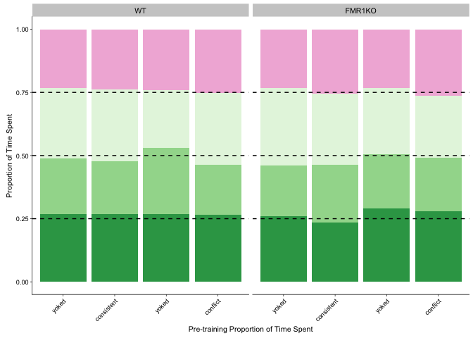
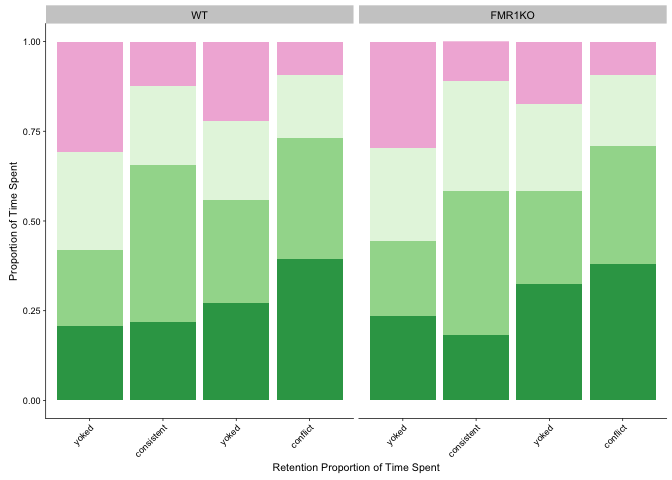
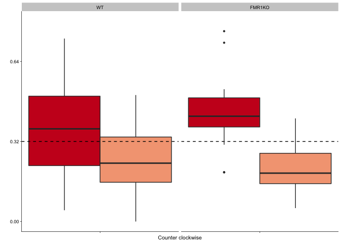
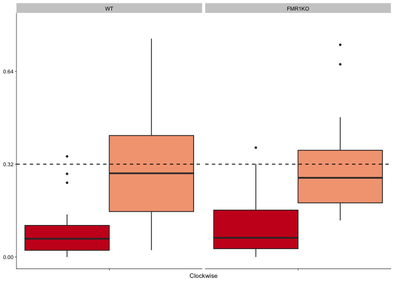
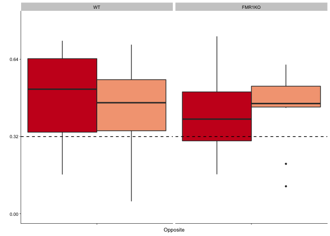
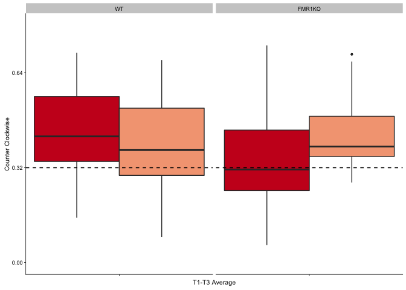
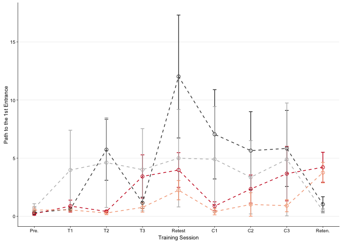

Experimental design
===================

    ## [1] "yoked-consistent" "consistent"       "yoked-conflict"  
    ## [4] "conflict"

    ##                APA2     Genotype 
    ##  yoked-consistent:4   WT    :24  
    ##  consistent      :8   FMR1KO: 0  
    ##  yoked-conflict  :3              
    ##  conflict        :9

    ##                APA2     Genotype 
    ##  yoked-consistent:7   WT    : 0  
    ##  consistent      :9   FMR1KO:26  
    ##  yoked-conflict  :5              
    ##  conflict        :5

Where do mice spend their time?
===============================

During the pre-training trial, all groups spend an equal amount of time
in all quadrants of the arena.

    PathNumStats <- behavior  %>% 
      filter(TrainSessionComboNum == "1") 
    summary(aov(pTimeTarget ~  APA2 * Genotype, data=PathNumStats))

    ##               Df  Sum Sq   Mean Sq F value Pr(>F)
    ## APA2           3 0.00315 0.0010494   0.472  0.704
    ## Genotype       1 0.00091 0.0009060   0.408  0.527
    ## APA2:Genotype  3 0.00088 0.0002938   0.132  0.940
    ## Residuals     35 0.07780 0.0022229

    summary(aov(pTimeOPP ~  APA2 * Genotype, data=PathNumStats))

    ##               Df  Sum Sq   Mean Sq F value Pr(>F)
    ## APA2           3 0.00528 0.0017596   1.077  0.371
    ## Genotype       1 0.00001 0.0000134   0.008  0.928
    ## APA2:Genotype  3 0.00643 0.0021428   1.312  0.286
    ## Residuals     35 0.05717 0.0016334

    summary(aov(pTimeTarget ~  APA2 * Genotype, data=PathNumStats))

    ##               Df  Sum Sq   Mean Sq F value Pr(>F)
    ## APA2           3 0.00315 0.0010494   0.472  0.704
    ## Genotype       1 0.00091 0.0009060   0.408  0.527
    ## APA2:Genotype  3 0.00088 0.0002938   0.132  0.940
    ## Residuals     35 0.07780 0.0022229

    summary(aov(pTimeCCW ~  APA2 * Genotype, data=PathNumStats))

    ##               Df  Sum Sq   Mean Sq F value Pr(>F)
    ## APA2           3 0.00906 0.0030208   0.965  0.420
    ## Genotype       1 0.00004 0.0000374   0.012  0.914
    ## APA2:Genotype  3 0.00766 0.0025548   0.816  0.494
    ## Residuals     35 0.10959 0.0031311

This next graph is a big overview that shows that consistent trained
aniamls avoid the shock zone and the clockwise area while conflict avoid
the shock zone and counter clockwise. This is re-illustrated in the
subsequent graph focusing just on the conlict training sessions. Yoked
mice show no place preference or avoidance.

Time spent figure
=================

    ## quartz_off_screen 
    ##                 2

    ## quartz_off_screen 
    ##                 2

    ## quartz_off_screen 
    ##                 2

    ## quartz_off_screen 
    ##                 2

Now - exampine space use interaction APA2 \* Genotype in trained and yoked separated
====================================================================================

Proportion time spent trained only
==================================

    ##               Df  Sum Sq   Mean Sq F value Pr(>F)
    ## Genotype       1 0.00065 0.0006531   1.179  0.281
    ## APA2           1 0.00035 0.0003529   0.637  0.427
    ## Genotype:APA2  1 0.00033 0.0003310   0.597  0.442
    ## Residuals     78 0.04322 0.0005541

    ##               Df Sum Sq Mean Sq F value   Pr(>F)    
    ## Genotype       1 0.0000  0.0000   0.001    0.982    
    ## APA2           1 0.8791  0.8791  38.375 2.56e-08 ***
    ## Genotype:APA2  1 0.0006  0.0006   0.027    0.871    
    ## Residuals     78 1.7869  0.0229                     
    ## ---
    ## Signif. codes:  0 '***' 0.001 '**' 0.01 '*' 0.05 '.' 0.1 ' ' 1

    ##   Tukey multiple comparisons of means
    ##     95% family-wise confidence level
    ## 
    ## Fit: aov(formula = pTimeCW ~ Genotype * APA2, data = trainedtimespent)
    ## 
    ## $Genotype
    ##                    diff         lwr        upr    p adj
    ## FMR1KO-WT -0.0007857052 -0.06941043 0.06783902 0.981873
    ## 
    ## $APA2
    ##                         diff       lwr       upr p adj
    ## conflict-consistent 0.205344 0.1387124 0.2719755     0
    ## 
    ## $`Genotype:APA2`
    ##                                         diff         lwr       upr
    ## FMR1KO:consistent-WT:consistent   0.02397566 -0.09804438 0.1459957
    ## WT:conflict-WT:consistent         0.20514213  0.09366727 0.3166170
    ## FMR1KO:conflict-WT:consistent     0.24057083  0.10008441 0.3810573
    ## WT:conflict-FMR1KO:consistent     0.18116647  0.06217945 0.3001535
    ## FMR1KO:conflict-FMR1KO:consistent 0.21659518  0.07007657 0.3631138
    ## FMR1KO:conflict-WT:conflict       0.03542870 -0.10243157 0.1732890
    ##                                       p adj
    ## FMR1KO:consistent-WT:consistent   0.9550673
    ## WT:conflict-WT:consistent         0.0000389
    ## FMR1KO:conflict-WT:consistent     0.0001379
    ## WT:conflict-FMR1KO:consistent     0.0008182
    ## FMR1KO:conflict-FMR1KO:consistent 0.0012165
    ## FMR1KO:conflict-WT:conflict       0.9063729

    ##               Df Sum Sq Mean Sq F value Pr(>F)
    ## Genotype       1 0.0617 0.06168   2.146  0.147
    ## APA2           1 0.0309 0.03088   1.074  0.303
    ## Genotype:APA2  1 0.0634 0.06339   2.206  0.142
    ## Residuals     78 2.2417 0.02874

    ##               Df Sum Sq Mean Sq F value   Pr(>F)    
    ## Genotype       1 0.0512  0.0512   1.963    0.165    
    ## APA2           1 0.6094  0.6094  23.366 6.58e-06 ***
    ## Genotype:APA2  1 0.0668  0.0668   2.560    0.114    
    ## Residuals     78 2.0342  0.0261                     
    ## ---
    ## Signif. codes:  0 '***' 0.001 '**' 0.01 '*' 0.05 '.' 0.1 ' ' 1

    ##   Tukey multiple comparisons of means
    ##     95% family-wise confidence level
    ## 
    ## Fit: aov(formula = pTimeCCW ~ Genotype * APA2, data = trainedtimespent)
    ## 
    ## $Genotype
    ##                 diff         lwr       upr     p adj
    ## FMR1KO-WT 0.05152245 -0.02169689 0.1247418 0.1652085
    ## 
    ## $APA2
    ##                           diff        lwr         upr   p adj
    ## conflict-consistent -0.1709606 -0.2420533 -0.09986782 7.9e-06
    ## 
    ## $`Genotype:APA2`
    ##                                          diff         lwr         upr
    ## FMR1KO:consistent-WT:consistent    0.07931096 -0.05087865  0.20950058
    ## WT:conflict-WT:consistent         -0.13039352 -0.24933193 -0.01145511
    ## FMR1KO:conflict-WT:consistent     -0.17080833 -0.32070071 -0.02091596
    ## WT:conflict-FMR1KO:consistent     -0.20970448 -0.33665801 -0.08275096
    ## FMR1KO:conflict-FMR1KO:consistent -0.25011930 -0.40644773 -0.09379087
    ## FMR1KO:conflict-WT:conflict       -0.04041481 -0.18750522  0.10667559
    ##                                       p adj
    ## FMR1KO:consistent-WT:consistent   0.3850072
    ## WT:conflict-WT:consistent         0.0259978
    ## FMR1KO:conflict-WT:consistent     0.0190587
    ## WT:conflict-FMR1KO:consistent     0.0002467
    ## FMR1KO:conflict-FMR1KO:consistent 0.0004019
    ## FMR1KO:conflict-WT:conflict       0.8883106

    ## quartz_off_screen 
    ##                 2

    ## quartz_off_screen 
    ##                 2

    ## quartz_off_screen 
    ##                 2

    ## quartz_off_screen 
    ##                 2

General overview of number of entrances to the shock zone and path to the first entrance. No statistics on these full data sets because its makes more sense to subset the data into training and non-training sessions first.
==============================================================================================================================================================================================================================

    ## quartz_off_screen 
    ##                 2

    ## quartz_off_screen 
    ##                 2

    ## quartz_off_screen 
    ##                 2

    ## quartz_off_screen 
    ##                 2

    ##               Df Sum Sq Mean Sq F value Pr(>F)
    ## APA2           3  133.4   44.48   1.717  0.181
    ## Genotype       1    2.7    2.74   0.106  0.747
    ## APA2:Genotype  3  127.6   42.55   1.643  0.197
    ## Residuals     35  906.6   25.90

    ##               Df Sum Sq Mean Sq F value Pr(>F)
    ## APA2           3  0.943 0.31429   1.583  0.211
    ## Genotype       1  0.028 0.02777   0.140  0.711
    ## APA2:Genotype  3  0.098 0.03277   0.165  0.919
    ## Residuals     35  6.947 0.19848
