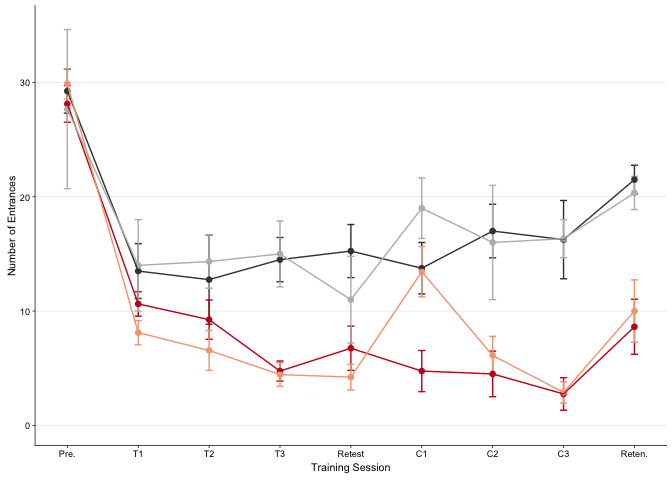
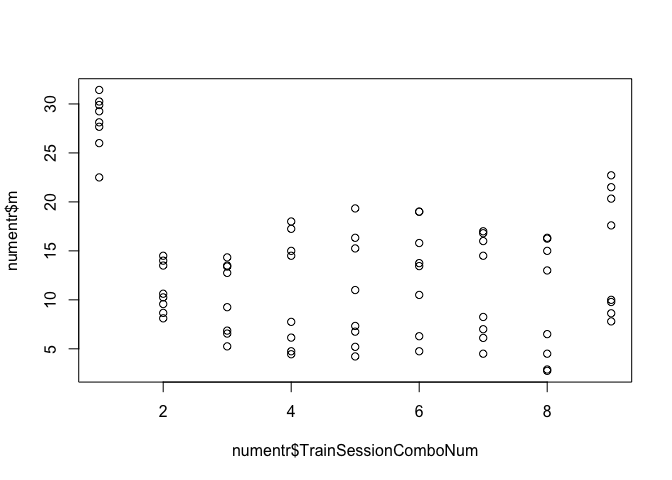

    ## load libraries 
    library(tidyr) ## for respahing data
    library(plyr) ## for renmaing factors
    library(dplyr) ## for filtering and selecting rows
    library(reshape2) ## for melting dataframe
    library(ggplot2)
    library(cowplot)
    library(pheatmap)
    library(viridis)
    library(ez) # for non-parametric ANOVA

    ## load color settings
    source("figureoptions.R")

    knitr::opts_chunk$set(fig.path = '../figures/01_behavior/')

    ## read intermediate data (raw data from video tracker program analyzed in matlab)
    behavior <- read.csv("../data/fmr1.csv", header = T)

    behavior$APA <- as.factor(behavior$APA)
    behavior$APA2 <- as.factor(behavior$APA2)

    ## relevel then rename factors treatment
    behavior$APA2 <- factor(behavior$APA2, levels = c("controlconsistent", "consistent", "controlconflict", "conflict"))
    levels(behavior$APA2) <- c("yoked-consistent","consistent", "yoked-conflict","conflict")
    levels(behavior$APA2)

    ## [1] "yoked-consistent" "consistent"       "yoked-conflict"  
    ## [4] "conflict"

    #relevel genotype
    levels(behavior$Genotype) <- c("WT","FMR1KO")
    #levels(behavior$conflict) <- c("consistent","conflict")

    behavior$Time1stEntrLog <- log(behavior$Time1stEntr)  ## log transformation
    behavior$conflict <- ifelse(grepl("conflict", behavior$APA2), "conflict", "consistent") # for splitting
    levels(behavior$conflict) <- c("consistent","conflict")
    behavior <- behavior[c(1,3,7,8,10,60,14:59)] # supset data
    behavior <- subset(behavior, !is.na(behavior$NumEntrances)) # remove nas

    # sample sizes
    behavior %>% 
      filter(TrainSessionCombo == "Retention") %>%
      select(APA2)  %>%  summary()

    ##                APA2   
    ##  yoked-consistent:11  
    ##  consistent      :17  
    ##  yoked-conflict  : 8  
    ##  conflict        :14

    behavior %>% 
      filter(TrainSessionCombo == "Retention", Genotype == "WT") %>%
      select(APA2, Genotype)  %>%  summary()

    ##                APA2     Genotype 
    ##  yoked-consistent:4   WT    :24  
    ##  consistent      :8   FMR1KO: 0  
    ##  yoked-conflict  :3              
    ##  conflict        :9

    behavior %>% 
      filter(TrainSessionCombo == "Retention", Genotype == "FMR1KO") %>%
      select(APA2, Genotype)  %>%  summary()

    ##                APA2     Genotype 
    ##  yoked-consistent:7   WT    : 0  
    ##  consistent      :9   FMR1KO:26  
    ##  yoked-conflict  :5              
    ##  conflict        :5

    # num entrances
    numentr <- dplyr::summarise(group_by(behavior, Genotype, APA2, TrainSessionComboNum, conflict), m = mean(NumEntrances), se = sd(NumEntrances)/sqrt(length(NumEntrances)), len = length(NumEntrances))

    ptime <- dplyr::summarise(group_by(behavior, Genotype, APA2, TrainSessionComboNum, conflict), m = mean(pTimeTarget), se = sd(pTimeTarget)/sqrt(length(pTimeTarget)), len = length(pTimeTarget))

    levels(numentr$APA2) <- c("yoked-consistent","consistent", "yoked-conflict","conflict")
    numentr$conflict = factor(numentr$conflict, levels = c("consistent","conflict"))
    levels(numentr$conflict) <- c("Initial learning","Cognitive discrimination")

    oneplot <- ggplot(numentr, aes(x=, TrainSessionComboNum, y=m, color=APA2, shape=Genotype)) + 
        geom_errorbar(aes(ymin=m-se, ymax=m+se), width=.1) +
        geom_point(size = 2) +
       geom_line(aes(colour=APA2, linetype=Genotype)) +
       scale_y_continuous(name= "Number of Entrances") +
        scale_x_continuous(name="Training Session", 
                           breaks = c(1, 2, 3, 4, 5, 6, 7, 8, 9),
                           labels = c( "Pre.", "T1", "T2", "T3",
                                       "Retest", "T4/C1", "T5/C2", 
                                       "T6/C3", "Reten.")) +
      theme_cowplot(font_size = 8, line_size = 0.25) +
      #background_grid(major = "y", minor = "y") +
      scale_color_manual(values = colorvalAPA00)  +
      theme(legend.title=element_blank()) +
      #theme(legend.position="none") +
      scale_shape_manual(values=c(16, 1)) 
    oneplot

    pdf(file="../figures/01_behavior/oneplot.pdf", width=6, height=3)
    plot(oneplot)
    dev.off()

    ## quartz_off_screen 
    ##                 2

    twoplot <- ggplot(numentr, aes(x=, TrainSessionComboNum, y=m, color=APA2, shape=Genotype)) + 
        geom_errorbar(aes(ymin=m-se, ymax=m+se), width=.1) +
        geom_point(size = 2) +
       geom_line(aes(colour=APA2, linetype=Genotype)) +
       scale_y_continuous(name= "Number of Entrances") +
        scale_x_continuous(name="Training Session", 
                           breaks = c(1, 2, 3, 4, 5, 6, 7, 8, 9),
                           labels = c( "Pre.", "T1", "T2", "T3",
                                       "Retest", "T4/C1", "T5/C2", "T6/C3", "Reten.")) +
      theme_cowplot(font_size = 8, line_size = 0.25) +
      background_grid(major = "y", minor = "y") +
      scale_color_manual(values = colorvalAPA00)  +
      theme(legend.title=element_blank()) +
      #theme(legend.position="none") +
      scale_shape_manual(values=c(16, 1)) +
      facet_wrap(~conflict, nrow = 2) 
    twoplot

    pdf(file="../figures/01_behavior/twoplot.pdf", width=4.5, height=4)
    plot(twoplot)
    dev.off()

    ## quartz_off_screen 
    ##                 2

Anovas Consistent only - No significant effect of genotype
----------------------------------------------------------

    consistent <- behavior %>%
      filter(conflict == "consistent")  %>%
      droplevels()

    m1 = aov(NumEntrances ~  Genotype + APA2 + TrainSessionCombo + Genotype * APA2  , data=consistent)
    summary(m1)

    ##                    Df Sum Sq Mean Sq F value Pr(>F)    
    ## Genotype            1     92    92.4   3.551  0.061 .  
    ## APA2                1   3029  3028.8 116.354 <2e-16 ***
    ## TrainSessionCombo   8   8626  1078.2  41.420 <2e-16 ***
    ## Genotype:APA2       1      1     0.7   0.025  0.874    
    ## Residuals         197   5128    26.0                   
    ## ---
    ## Signif. codes:  0 '***' 0.001 '**' 0.01 '*' 0.05 '.' 0.1 ' ' 1

    TukeyHSD(m1)

    ##   Tukey multiple comparisons of means
    ##     95% family-wise confidence level
    ## 
    ## Fit: aov(formula = NumEntrances ~ Genotype + APA2 + TrainSessionCombo + Genotype * APA2, data = consistent)
    ## 
    ## $Genotype
    ##               diff         lwr      upr    p adj
    ## FMR1KO-WT 1.330766 -0.06196487 2.723498 0.060992
    ## 
    ## $APA2
    ##                                 diff       lwr       upr p adj
    ## consistent-yoked-consistent -7.89679 -9.343586 -6.449994     0
    ## 
    ## $TrainSessionCombo
    ##                         diff        lwr         upr     p adj
    ## Retention-Hab    -15.7732787 -20.276739 -11.2698182 0.0000000
    ## Retest-Hab       -20.1476636 -25.040487 -15.2548404 0.0000000
    ## T1-Hab           -18.8953392 -23.667721 -14.1229572 0.0000000
    ## T2-Hab           -19.9292724 -24.598914 -15.2596303 0.0000000
    ## T3-Hab           -20.6680665 -25.440449 -15.8956844 0.0000000
    ## T4_C1-Hab        -20.9292724 -25.598914 -16.2596303 0.0000000
    ## T5_C2-Hab        -20.0404540 -24.759512 -15.3213963 0.0000000
    ## T6_C3-Hab        -22.2578453 -26.976903 -17.5387876 0.0000000
    ## Retest-Retention  -4.3743849  -9.059614   0.3108440 0.0882442
    ## T1-Retention      -3.1220605  -7.681368   1.4372466 0.4441016
    ## T2-Retention      -4.1559937  -8.607646   0.2956587 0.0882946
    ## T3-Retention      -4.8947878  -9.454095  -0.3354806 0.0250875
    ## T4_C1-Retention   -5.1559937  -9.607646  -0.7043413 0.0105595
    ## T5_C2-Retention   -4.2671753  -8.770636   0.2362852 0.0787022
    ## T6_C3-Retention   -6.4845666 -10.988027  -1.9811061 0.0003646
    ## T1-Retest          1.2523243  -3.691949   6.1965981 0.9969211
    ## T2-Retest          0.2183912  -4.626789   5.0635713 1.0000000
    ## T3-Retest         -0.5204029  -5.464677   4.4238709 0.9999958
    ## T4_C1-Retest      -0.7816088  -5.626789   4.0635713 0.9998866
    ## T5_C2-Retest       0.1072096  -4.785614   5.0000327 1.0000000
    ## T6_C3-Retest      -2.1101817  -7.003005   2.7826414 0.9137005
    ## T2-T1             -1.0339332  -5.757458   3.6895912 0.9989093
    ## T3-T1             -1.7727273  -6.597844   3.0523899 0.9651187
    ## T4_C1-T1          -2.0339332  -6.757458   2.6895912 0.9144254
    ## T5_C2-T1          -1.1451148  -5.917497   3.6272673 0.9978955
    ## T6_C3-T1          -3.3625061  -8.134888   1.4098760 0.4033509
    ## T3-T2             -0.7387941  -5.462318   3.9847303 0.9999103
    ## T4_C1-T2          -1.0000000  -5.619698   3.6196980 0.9989938
    ## T5_C2-T2          -0.1111816  -4.780824   4.5584605 1.0000000
    ## T6_C3-T2          -2.3285729  -6.998215   2.3410692 0.8229393
    ## T4_C1-T3          -0.2612059  -4.984730   4.4623185 1.0000000
    ## T5_C2-T3           0.6276125  -4.144770   5.3999946 0.9999762
    ## T6_C3-T3          -1.5897788  -6.362161   3.1826033 0.9808767
    ## T5_C2-T4_C1        0.8888184  -3.780824   5.5584605 0.9996081
    ## T6_C3-T4_C1       -1.3285729  -5.998215   3.3410692 0.9931656
    ## T6_C3-T5_C2       -2.2173913  -6.936449   2.5016664 0.8663585
    ## 
    ## $`Genotype:APA2`
    ##                                                   diff        lwr
    ## FMR1KO:yoked-consistent-WT:yoked-consistent  0.6852697  -2.351775
    ## WT:consistent-WT:yoked-consistent           -8.0474479 -10.745933
    ## FMR1KO:consistent-WT:yoked-consistent       -7.1289323  -9.907336
    ## WT:consistent-FMR1KO:yoked-consistent       -8.7327176 -11.339702
    ## FMR1KO:consistent-FMR1KO:yoked-consistent   -7.8142020 -10.503825
    ## FMR1KO:consistent-WT:consistent              0.9185156  -1.381974
    ##                                                   upr     p adj
    ## FMR1KO:yoked-consistent-WT:yoked-consistent  3.722314 0.9366202
    ## WT:consistent-WT:yoked-consistent           -5.348963 0.0000000
    ## FMR1KO:consistent-WT:yoked-consistent       -4.350529 0.0000000
    ## WT:consistent-FMR1KO:yoked-consistent       -6.125733 0.0000000
    ## FMR1KO:consistent-FMR1KO:yoked-consistent   -5.124579 0.0000000
    ## FMR1KO:consistent-WT:consistent              3.219005 0.7293828

    hab <- consistent %>%
      filter(TrainSession == "Hab") 
    T1 <- consistent %>%
      filter(TrainSession == "T1") 
    T2 <- consistent %>%
      filter(TrainSession == "T2") 
    T3 <- consistent %>%
      filter(TrainSession == "T3") 
    Retest <- consistent %>%
      filter(TrainSession == "Retest") 
    T4 <- consistent %>%
      filter(TrainSession %in% c("T4", "C1")) 
    T5 <- consistent %>%
      filter(TrainSession %in% c("T5", "C2")) 
    T6 <- consistent %>%
      filter(TrainSession %in% c("T6", "C3")) 
    Retention <- consistent %>%
      filter(TrainSession == "Retention") 

    summary(aov(NumEntrances ~ Genotype * APA2, data=hab)) 

    ##               Df Sum Sq Mean Sq F value Pr(>F)
    ## Genotype       1   35.9   35.87   1.852  0.190
    ## APA2           1    0.0    0.00   0.000  1.000
    ## Genotype:APA2  1    6.9    6.91   0.357  0.557
    ## Residuals     19  368.1   19.37

    summary(aov(NumEntrances ~ Genotype * APA2, data=T1)) 

    ##               Df Sum Sq Mean Sq F value Pr(>F)
    ## Genotype       1  28.44  28.438   2.569  0.126
    ## APA2           1   6.98   6.976   0.630  0.438
    ## Genotype:APA2  1  16.78  16.784   1.516  0.234
    ## Residuals     18 199.26  11.070

    summary(aov(NumEntrances ~ Genotype * APA2, data=T2)) 

    ##               Df Sum Sq Mean Sq F value Pr(>F)  
    ## Genotype       1    4.2    4.17   0.192 0.6661  
    ## APA2           1  144.6  144.63   6.660 0.0179 *
    ## Genotype:APA2  1   12.9   12.90   0.594 0.4499  
    ## Residuals     20  434.3   21.72                 
    ## ---
    ## Signif. codes:  0 '***' 0.001 '**' 0.01 '*' 0.05 '.' 0.1 ' ' 1

    summary(aov(NumEntrances ~ Genotype * APA2, data=T3))

    ##               Df Sum Sq Mean Sq F value   Pr(>F)    
    ## Genotype       1   15.8    15.8   1.129    0.302    
    ## APA2           1  543.5   543.5  38.923 6.94e-06 ***
    ## Genotype:APA2  1    5.2     5.2   0.374    0.549    
    ## Residuals     18  251.4    14.0                     
    ## ---
    ## Signif. codes:  0 '***' 0.001 '**' 0.01 '*' 0.05 '.' 0.1 ' ' 1

    summary(aov(NumEntrances ~ Genotype * APA2, data=Retest)) 

    ##               Df Sum Sq Mean Sq F value  Pr(>F)   
    ## Genotype       1    0.2     0.2   0.008 0.93170   
    ## APA2           1  417.4   417.4  15.189 0.00128 **
    ## Genotype:APA2  1    7.6     7.6   0.278 0.60539   
    ## Residuals     16  439.7    27.5                   
    ## ---
    ## Signif. codes:  0 '***' 0.001 '**' 0.01 '*' 0.05 '.' 0.1 ' ' 1

    summary(aov(NumEntrances ~ Genotype * APA2, data=T4)) 

    ##               Df Sum Sq Mean Sq F value   Pr(>F)    
    ## Genotype       1   37.5    37.5   2.311    0.144    
    ## APA2           1  479.7   479.7  29.565 2.54e-05 ***
    ## Genotype:APA2  1    0.4     0.4   0.023    0.882    
    ## Residuals     20  324.5    16.2                     
    ## ---
    ## Signif. codes:  0 '***' 0.001 '**' 0.01 '*' 0.05 '.' 0.1 ' ' 1

    summary(aov(NumEntrances ~ Genotype * APA2, data=T5)) 

    ##               Df Sum Sq Mean Sq F value   Pr(>F)    
    ## Genotype       1   44.6    44.6   1.430 0.246527    
    ## APA2           1  668.8   668.8  21.435 0.000183 ***
    ## Genotype:APA2  1    9.8     9.8   0.315 0.581165    
    ## Residuals     19  592.8    31.2                     
    ## ---
    ## Signif. codes:  0 '***' 0.001 '**' 0.01 '*' 0.05 '.' 0.1 ' ' 1

    summary(aov(NumEntrances ~ Genotype * APA2, data=T6)) 

    ##               Df Sum Sq Mean Sq F value   Pr(>F)    
    ## Genotype       1    7.1     7.1   0.288    0.598    
    ## APA2           1  649.3   649.3  26.264 6.02e-05 ***
    ## Genotype:APA2  1   33.7    33.7   1.363    0.257    
    ## Residuals     19  469.7    24.7                     
    ## ---
    ## Signif. codes:  0 '***' 0.001 '**' 0.01 '*' 0.05 '.' 0.1 ' ' 1

    summary(aov(NumEntrances ~ Genotype * APA2, data=Retention)) 

    ##               Df Sum Sq Mean Sq F value   Pr(>F)    
    ## Genotype       1   43.6    43.6   1.139    0.296    
    ## APA2           1 1101.0  1101.0  28.788 1.65e-05 ***
    ## Genotype:APA2  1    0.0     0.0   0.000    0.990    
    ## Residuals     24  917.9    38.2                     
    ## ---
    ## Signif. codes:  0 '***' 0.001 '**' 0.01 '*' 0.05 '.' 0.1 ' ' 1

Anovas Conflict only
--------------------

    conflict <- behavior %>%
      filter(conflict == "conflict") %>%
      droplevels()

    m1 = lm(NumEntrances ~  Genotype + TrainSessionCombo + Genotype*TrainSessionCombo, data=conflict)
    summary(m1)

    ## 
    ## Call:
    ## lm(formula = NumEntrances ~ Genotype + TrainSessionCombo + Genotype * 
    ##     TrainSessionCombo, data = conflict)
    ## 
    ## Residuals:
    ##      Min       1Q   Median       3Q      Max 
    ## -14.3333  -4.1667  -0.7667   4.2083  15.4167 
    ## 
    ## Coefficients:
    ##                                           Estimate Std. Error t value
    ## (Intercept)                                 29.333      1.824  16.083
    ## GenotypeFMR1KO                              -5.083      2.884  -1.763
    ## TrainSessionComboRetention                 -16.750      2.579  -6.494
    ## TrainSessionComboRetest                    -23.417      2.579  -9.078
    ## TrainSessionComboT1                        -19.750      2.579  -7.657
    ## TrainSessionComboT2                        -20.833      2.579  -8.077
    ## TrainSessionComboT3                        -22.250      2.579  -8.626
    ## TrainSessionComboT4_C1                     -14.500      2.579  -5.622
    ## TrainSessionComboT5_C2                     -21.424      2.637  -8.123
    ## TrainSessionComboT6_C3                     -23.083      2.579  -8.949
    ## GenotypeFMR1KO:TrainSessionComboRetention    5.200      3.954   1.315
    ## GenotypeFMR1KO:TrainSessionComboRetest      12.500      4.277   2.922
    ## GenotypeFMR1KO:TrainSessionComboT1           7.875      4.078   1.931
    ## GenotypeFMR1KO:TrainSessionComboT2           5.958      4.078   1.461
    ## GenotypeFMR1KO:TrainSessionComboT3          10.500      4.078   2.575
    ## GenotypeFMR1KO:TrainSessionComboT4_C1        5.000      4.078   1.226
    ## GenotypeFMR1KO:TrainSessionComboT5_C2        8.549      4.115   2.077
    ## GenotypeFMR1KO:TrainSessionComboT6_C3        8.976      4.165   2.155
    ##                                           Pr(>|t|)    
    ## (Intercept)                                < 2e-16 ***
    ## GenotypeFMR1KO                             0.07986 .  
    ## TrainSessionComboRetention                1.01e-09 ***
    ## TrainSessionComboRetest                   3.92e-16 ***
    ## TrainSessionComboT1                       1.70e-12 ***
    ## TrainSessionComboT2                       1.52e-13 ***
    ## TrainSessionComboT3                       5.95e-15 ***
    ## TrainSessionComboT4_C1                    8.23e-08 ***
    ## TrainSessionComboT5_C2                    1.16e-13 ***
    ## TrainSessionComboT6_C3                    8.56e-16 ***
    ## GenotypeFMR1KO:TrainSessionComboRetention  0.19036    
    ## GenotypeFMR1KO:TrainSessionComboRetest     0.00398 ** 
    ## GenotypeFMR1KO:TrainSessionComboT1         0.05526 .  
    ## GenotypeFMR1KO:TrainSessionComboT2         0.14599    
    ## GenotypeFMR1KO:TrainSessionComboT3         0.01094 *  
    ## GenotypeFMR1KO:TrainSessionComboT4_C1      0.22201    
    ## GenotypeFMR1KO:TrainSessionComboT5_C2      0.03936 *  
    ## GenotypeFMR1KO:TrainSessionComboT6_C3      0.03264 *  
    ## ---
    ## Signif. codes:  0 '***' 0.001 '**' 0.01 '*' 0.05 '.' 0.1 ' ' 1
    ## 
    ## Residual standard error: 6.318 on 160 degrees of freedom
    ## Multiple R-squared:  0.5079, Adjusted R-squared:  0.4557 
    ## F-statistic: 9.715 on 17 and 160 DF,  p-value: < 2.2e-16

    m1 = aov(NumEntrances ~  Genotype + APA2 + TrainSessionCombo + Genotype * APA2  , data=conflict)
    summary(m1)

    ##                    Df Sum Sq Mean Sq F value   Pr(>F)    
    ## Genotype            1    186   185.8   6.269   0.0132 *  
    ## APA2                1   2017  2016.8  68.069 4.64e-14 ***
    ## TrainSessionCombo   8   5856   732.0  24.706  < 2e-16 ***
    ## Genotype:APA2       1      3     3.0   0.101   0.7509    
    ## Residuals         166   4918    29.6                     
    ## ---
    ## Signif. codes:  0 '***' 0.001 '**' 0.01 '*' 0.05 '.' 0.1 ' ' 1

    TukeyHSD(m1)

    ##   Tukey multiple comparisons of means
    ##     95% family-wise confidence level
    ## 
    ## Fit: aov(formula = NumEntrances ~ Genotype + APA2 + TrainSessionCombo + Genotype * APA2, data = conflict)
    ## 
    ## $Genotype
    ##               diff       lwr      upr     p adj
    ## FMR1KO-WT 2.086218 0.4411924 3.731244 0.0132497
    ## 
    ## $APA2
    ##                              diff       lwr       upr p adj
    ## conflict-yoked-conflict -6.852357 -8.549568 -5.155146     0
    ## 
    ## $TrainSessionCombo
    ##                         diff         lwr         upr     p adj
    ## Retention-Hab    -14.7774433 -20.0634126  -9.4914740 0.0000000
    ## Retest-Hab       -18.7720138 -24.3306324 -13.2133952 0.0000000
    ## T1-Hab           -16.6000000 -22.0103621 -11.1896379 0.0000000
    ## T2-Hab           -18.4500000 -23.8603621 -13.0396379 0.0000000
    ## T3-Hab           -18.0500000 -23.4603621 -12.6396379 0.0000000
    ## T4_C1-Hab        -12.5000000 -17.9103621  -7.0896379 0.0000000
    ## T5_C2-Hab        -17.6857445 -23.1668332 -12.2046557 0.0000000
    ## T6_C3-Hab        -19.3567280 -24.8378167 -13.8756392 0.0000000
    ## Retest-Retention  -3.9945705  -9.4321890   1.4430479 0.3428037
    ## T1-Retention      -1.8225567  -7.1085260   3.4634126 0.9758551
    ## T2-Retention      -3.6725567  -8.9585260   1.6134126 0.4211013
    ## T3-Retention      -3.2725567  -8.5585260   2.0134126 0.5830461
    ## T4_C1-Retention    2.2774433  -3.0085260   7.5634126 0.9129406
    ## T5_C2-Retention   -2.9083012  -8.2666394   2.4500369 0.7420989
    ## T6_C3-Retention   -4.5792847  -9.9376229   0.7790534 0.1608819
    ## T1-Retest          2.1720138  -3.3866048   7.7306324 0.9491669
    ## T2-Retest          0.3220138  -5.2366048   5.8806324 1.0000000
    ## T3-Retest          0.7220138  -4.8366048   6.2806324 0.9999778
    ## T4_C1-Retest       6.2720138   0.7133952  11.8306324 0.0145773
    ## T5_C2-Retest       1.0862693  -4.5412130   6.7137516 0.9995545
    ## T6_C3-Retest      -0.5847142  -6.2121965   5.0427681 0.9999961
    ## T2-T1             -1.8500000  -7.2603621   3.5603621 0.9770655
    ## T3-T1             -1.4500000  -6.8603621   3.9603621 0.9953486
    ## T4_C1-T1           4.1000000  -1.3103621   9.5103621 0.3008923
    ## T5_C2-T1          -1.0857445  -6.5668332   4.3953443 0.9994609
    ## T6_C3-T1          -2.7567280  -8.2378167   2.7243608 0.8139034
    ## T3-T2              0.4000000  -5.0103621   5.8103621 0.9999997
    ## T4_C1-T2           5.9500000   0.5396379  11.3603621 0.0194743
    ## T5_C2-T2           0.7642555  -4.7168332   6.2453443 0.9999617
    ## T6_C3-T2          -0.9067280  -6.3878167   4.5743608 0.9998594
    ## T4_C1-T3           5.5500000   0.1396379  10.9603621 0.0395831
    ## T5_C2-T3           0.3642555  -5.1168332   5.8453443 0.9999999
    ## T6_C3-T3          -1.3067280  -6.7878167   4.1743608 0.9979430
    ## T5_C2-T4_C1       -5.1857445 -10.6668332   0.2953443 0.0794519
    ## T6_C3-T4_C1       -6.8567280 -12.3378167  -1.3756392 0.0038496
    ## T6_C3-T5_C2       -1.6709835  -7.2218979   3.8799309 0.9898452
    ## 
    ## $`Genotype:APA2`
    ##                                               diff        lwr       upr
    ## FMR1KO:yoked-conflict-WT:yoked-conflict -0.1029878  -3.760456  3.554480
    ## WT:conflict-WT:yoked-conflict           -7.6091256 -10.793316 -4.424935
    ## FMR1KO:conflict-WT:yoked-conflict       -7.1457403 -10.781492 -3.509989
    ## WT:conflict-FMR1KO:yoked-conflict       -7.5061377 -10.363654 -4.648621
    ## FMR1KO:conflict-FMR1KO:yoked-conflict   -7.0427525 -10.396113 -3.689392
    ## FMR1KO:conflict-WT:conflict              0.4633853  -2.366283  3.293053
    ##                                             p adj
    ## FMR1KO:yoked-conflict-WT:yoked-conflict 0.9998595
    ## WT:conflict-WT:yoked-conflict           0.0000000
    ## FMR1KO:conflict-WT:yoked-conflict       0.0000054
    ## WT:conflict-FMR1KO:yoked-conflict       0.0000000
    ## FMR1KO:conflict-FMR1KO:yoked-conflict   0.0000011
    ## FMR1KO:conflict-WT:conflict             0.9741355

    hab <- conflict %>%
      filter(TrainSession == "Hab") 
    T1 <- conflict %>%
      filter(TrainSession == "T1") 
    T2 <- conflict %>%
      filter(TrainSession == "T2") 
    T3 <- conflict %>%
      filter(TrainSession == "T3") 
    Retest <- conflict %>%
      filter(TrainSession == "Retest") 
    T4 <- conflict %>%
      filter(TrainSession %in% c("T4", "C1")) 
    T5 <- conflict %>%
      filter(TrainSession %in% c("T5", "C2")) 
    T6 <- conflict %>%
      filter(TrainSession %in% c("T6", "C3")) 
    Retention <- conflict %>%
      filter(TrainSession == "Retention") 

    summary(aov(NumEntrances ~ Genotype * APA2, data=hab)) # . genotype

    ##               Df Sum Sq Mean Sq F value Pr(>F)  
    ## Genotype       1  124.0  124.03   3.685 0.0729 .
    ## APA2           1   33.9   33.88   1.007 0.3306  
    ## Genotype:APA2  1    1.7    1.73   0.051 0.8236  
    ## Residuals     16  538.6   33.66                 
    ## ---
    ## Signif. codes:  0 '***' 0.001 '**' 0.01 '*' 0.05 '.' 0.1 ' ' 1

    summary(aov(NumEntrances ~ Genotype * APA2, data=T1)) 

    ##               Df Sum Sq Mean Sq F value Pr(>F)  
    ## Genotype       1  37.41   37.41   2.664 0.1221  
    ## APA2           1 111.31  111.31   7.928 0.0124 *
    ## Genotype:APA2  1   2.84    2.84   0.203 0.6587  
    ## Residuals     16 224.64   14.04                 
    ## ---
    ## Signif. codes:  0 '***' 0.001 '**' 0.01 '*' 0.05 '.' 0.1 ' ' 1

    summary(aov(NumEntrances ~ Genotype * APA2, data=T2)) 

    ##               Df Sum Sq Mean Sq F value  Pr(>F)   
    ## Genotype       1   3.68    3.68   0.211 0.65214   
    ## APA2           1 272.00  272.00  15.619 0.00114 **
    ## Genotype:APA2  1   0.24    0.24   0.014 0.90875   
    ## Residuals     16 278.64   17.41                   
    ## ---
    ## Signif. codes:  0 '***' 0.001 '**' 0.01 '*' 0.05 '.' 0.1 ' ' 1

    summary(aov(NumEntrances ~ Genotype * APA2, data=T3))     # ** significant

    ##               Df Sum Sq Mean Sq F value   Pr(>F)    
    ## Genotype       1  140.8   140.8   9.023  0.00841 ** 
    ## APA2           1  430.0   430.0  27.552 7.95e-05 ***
    ## Genotype:APA2  1    1.2     1.2   0.076  0.78689    
    ## Residuals     16  249.7    15.6                     
    ## ---
    ## Signif. codes:  0 '***' 0.001 '**' 0.01 '*' 0.05 '.' 0.1 ' ' 1

    summary(aov(NumEntrances ~ Genotype * APA2, data=Retest)) # * significant

    ##               Df Sum Sq Mean Sq F value Pr(>F)  
    ## Genotype       1  220.0  220.03   5.914 0.0290 *
    ## APA2           1  294.8  294.82   7.924 0.0138 *
    ## Genotype:APA2  1   24.5   24.54   0.660 0.4303  
    ## Residuals     14  520.9   37.21                 
    ## ---
    ## Signif. codes:  0 '***' 0.001 '**' 0.01 '*' 0.05 '.' 0.1 ' ' 1

    summary(aov(NumEntrances ~ Genotype * APA2, data=T4)) 

    ##               Df Sum Sq Mean Sq F value Pr(>F)  
    ## Genotype       1    0.0    0.03   0.001 0.9776  
    ## APA2           1  204.8  204.76   5.000 0.0399 *
    ## Genotype:APA2  1    9.2    9.18   0.224 0.6423  
    ## Residuals     16  655.2   40.95                 
    ## ---
    ## Signif. codes:  0 '***' 0.001 '**' 0.01 '*' 0.05 '.' 0.1 ' ' 1

    TukeyHSD(aov(NumEntrances ~ Genotype * APA2, data=T4))

    ##   Tukey multiple comparisons of means
    ##     95% family-wise confidence level
    ## 
    ## Fit: aov(formula = NumEntrances ~ Genotype * APA2, data = T4)
    ## 
    ## $Genotype
    ##                  diff       lwr      upr     p adj
    ## FMR1KO-WT -0.08333333 -6.275322 6.108655 0.9775921
    ## 
    ## $APA2
    ##                              diff       lwr        upr     p adj
    ## conflict-yoked-conflict -6.483516 -12.84334 -0.1236929 0.0461905
    ## 
    ## $`Genotype:APA2`
    ##                                                  diff       lwr       upr
    ## FMR1KO:yoked-conflict-WT:yoked-conflict  3.552714e-15 -13.98343 13.983426
    ## WT:conflict-WT:yoked-conflict           -5.555556e+00 -17.76129  6.650179
    ## FMR1KO:conflict-WT:yoked-conflict       -8.500000e+00 -22.48343  5.483426
    ## WT:conflict-FMR1KO:yoked-conflict       -5.555556e+00 -16.55766  5.446545
    ## FMR1KO:conflict-FMR1KO:yoked-conflict   -8.500000e+00 -21.44614  4.446137
    ## FMR1KO:conflict-WT:conflict             -2.944444e+00 -13.94655  8.057656
    ##                                             p adj
    ## FMR1KO:yoked-conflict-WT:yoked-conflict 1.0000000
    ## WT:conflict-WT:yoked-conflict           0.5746811
    ## FMR1KO:conflict-WT:yoked-conflict       0.3369872
    ## WT:conflict-FMR1KO:yoked-conflict       0.4914578
    ## FMR1KO:conflict-FMR1KO:yoked-conflict   0.2755856
    ## FMR1KO:conflict-WT:conflict             0.8686351

    summary(aov(NumEntrances ~ Genotype * APA2, data=T5)) 

    ##               Df Sum Sq Mean Sq F value Pr(>F)  
    ## Genotype       1   55.6   55.64   1.804 0.1992  
    ## APA2           1  226.2  226.23   7.335 0.0162 *
    ## Genotype:APA2  1   11.9   11.92   0.386 0.5435  
    ## Residuals     15  462.6   30.84                 
    ## ---
    ## Signif. codes:  0 '***' 0.001 '**' 0.01 '*' 0.05 '.' 0.1 ' ' 1

    summary(aov(NumEntrances ~ Genotype * APA2, data=T6))     # * significant

    ##               Df Sum Sq Mean Sq F value   Pr(>F)    
    ## Genotype       1   67.0    67.0   6.588   0.0215 *  
    ## APA2           1  506.8   506.8  49.828 3.88e-06 ***
    ## Genotype:APA2  1   23.8    23.8   2.339   0.1470    
    ## Residuals     15  152.6    10.2                     
    ## ---
    ## Signif. codes:  0 '***' 0.001 '**' 0.01 '*' 0.05 '.' 0.1 ' ' 1

    summary(aov(NumEntrances ~ Genotype * APA2, data=Retention)) 

    ##               Df Sum Sq Mean Sq F value  Pr(>F)   
    ## Genotype       1    0.1     0.1   0.002 0.96483   
    ## APA2           1  480.0   480.0  12.922 0.00207 **
    ## Genotype:APA2  1    0.3     0.3   0.009 0.92519   
    ## Residuals     18  668.7    37.1                   
    ## ---
    ## Signif. codes:  0 '***' 0.001 '**' 0.01 '*' 0.05 '.' 0.1 ' ' 1

Mann-Whitney Conflict-trained only
----------------------------------

    conflict <- behavior %>%
      filter(APA2 == "conflict") %>%
      droplevels()

    m1 = aov(NumEntrances ~  Genotype + TrainSessionCombo + Genotype*TrainSessionCombo, data=conflict)
    summary(m1)

    ##                            Df Sum Sq Mean Sq F value Pr(>F)    
    ## Genotype                    1      5     5.1   0.202  0.654    
    ## TrainSessionCombo           8   6002   750.3  29.566 <2e-16 ***
    ## Genotype:TrainSessionCombo  8    197    24.6   0.970  0.464    
    ## Residuals                  99   2512    25.4                   
    ## ---
    ## Signif. codes:  0 '***' 0.001 '**' 0.01 '*' 0.05 '.' 0.1 ' ' 1

    TukeyHSD(m1)

    ##   Tukey multiple comparisons of means
    ##     95% family-wise confidence level
    ## 
    ## Fit: aov(formula = NumEntrances ~ Genotype + TrainSessionCombo + Genotype * TrainSessionCombo, data = conflict)
    ## 
    ## $Genotype
    ##                diff      lwr      upr     p adj
    ## FMR1KO-WT 0.4537037 -1.54847 2.455877 0.6539568
    ## 
    ## $TrainSessionCombo
    ##                         diff         lwr         upr     p adj
    ## Retention-Hab    -19.5004579 -25.6540014 -13.3469144 0.0000000
    ## Retest-Hab       -23.6661325 -30.0618134 -17.2704515 0.0000000
    ## T1-Hab           -19.9230769 -26.1895389 -13.6566150 0.0000000
    ## T2-Hab           -22.5384615 -28.8049235 -16.2719996 0.0000000
    ## T3-Hab           -23.2307692 -29.4972312 -16.9643073 0.0000000
    ## T4_C1-Hab        -16.1538462 -22.4203081  -9.8873842 0.0000000
    ## T5_C2-Hab        -21.9230769 -28.1895389 -15.6566150 0.0000000
    ## T6_C3-Hab        -24.6923077 -30.9587697 -18.4258457 0.0000000
    ## Retest-Retention  -4.1656746 -10.4507591   2.1194099 0.4779737
    ## T1-Retention      -0.4226190  -6.5761625   5.7309244 0.9999998
    ## T2-Retention      -3.0380037  -9.1915472   3.1155398 0.8207071
    ## T3-Retention      -3.7303114  -9.8838549   2.4232321 0.6000149
    ## T4_C1-Retention    3.3466117  -2.8069318   9.5001552 0.7298967
    ## T5_C2-Retention   -2.4226190  -8.5761625   3.7309244 0.9432529
    ## T6_C3-Retention   -5.1918498 -11.3453933   0.9616937 0.1701471
    ## T1-Retest          3.7430556  -2.6526254  10.1387365 0.6449501
    ## T2-Retest          1.1276709  -5.2680100   7.5233519 0.9997474
    ## T3-Retest          0.4353632  -5.9603177   6.8310442 0.9999998
    ## T4_C1-Retest       7.5122863   1.1166054  13.9079673 0.0094574
    ## T5_C2-Retest       1.7430556  -4.6526254   8.1387365 0.9942865
    ## T6_C3-Retest      -1.0261752  -7.4218562   5.3695058 0.9998756
    ## T2-T1             -2.6153846  -8.8818466   3.6510774 0.9218653
    ## T3-T1             -3.3076923  -9.5741543   2.9587697 0.7606240
    ## T4_C1-T1           3.7692308  -2.4972312  10.0356927 0.6101833
    ## T5_C2-T1          -2.0000000  -8.2664620   4.2664620 0.9838805
    ## T6_C3-T1          -4.7692308 -11.0356927   1.4972312 0.2883343
    ## T3-T2             -0.6923077  -6.9587697   5.5741543 0.9999929
    ## T4_C1-T2           6.3846154   0.1181534  12.6510774 0.0423589
    ## T5_C2-T2           0.6153846  -5.6510774   6.8818466 0.9999972
    ## T6_C3-T2          -2.1538462  -8.4203081   4.1126158 0.9744146
    ## T4_C1-T3           7.0769231   0.8104611  13.3433850 0.0149551
    ## T5_C2-T3           1.3076923  -4.9587697   7.5741543 0.9991258
    ## T6_C3-T3          -1.4615385  -7.7280004   4.8049235 0.9980588
    ## T5_C2-T4_C1       -5.7692308 -12.0356927   0.4972312 0.0964121
    ## T6_C3-T4_C1       -8.5384615 -14.8049235  -2.2719996 0.0011876
    ## T6_C3-T5_C2       -2.7692308  -9.0356927   3.4972312 0.8947072
    ## 
    ## $`Genotype:TrainSessionCombo`
    ##                                        diff         lwr        upr
    ## FMR1KO:Hab-WT:Hab               -3.88888889 -14.7345851   6.956807
    ## WT:Retention-WT:Hab            -19.88888889 -28.3969530 -11.380825
    ## FMR1KO:Retention-WT:Hab        -22.08888889 -32.1557661 -12.022012
    ## WT:Retest-WT:Hab               -25.66666667 -34.1747308 -17.158603
    ## FMR1KO:Retest-WT:Hab           -22.55555556 -34.5877752 -10.523336
    ## WT:T1-WT:Hab                   -21.77777778 -30.2858419 -13.269714
    ## FMR1KO:T1-WT:Hab               -19.63888889 -30.4845851  -8.793193
    ## WT:T2-WT:Hab                   -23.33333333 -31.8413974 -14.825269
    ## FMR1KO:T2-WT:Hab               -24.63888889 -35.4845851 -13.793193
    ## WT:T3-WT:Hab                   -25.44444444 -33.9525085 -16.936380
    ## FMR1KO:T3-WT:Hab               -22.13888889 -32.9845851 -11.293193
    ## WT:T4_C1-WT:Hab                -16.44444444 -24.9525085  -7.936380
    ## FMR1KO:T4_C1-WT:Hab            -19.38888889 -30.2345851  -8.543193
    ## WT:T5_C2-WT:Hab                -23.77777778 -32.2858419 -15.269714
    ## FMR1KO:T5_C2-WT:Hab            -21.63888889 -32.4845851 -10.793193
    ## WT:T6_C3-WT:Hab                -27.00000000 -35.5080641 -18.491936
    ## FMR1KO:T6_C3-WT:Hab            -23.38888889 -34.2345851 -12.543193
    ## WT:Retention-FMR1KO:Hab        -16.00000000 -26.8456962  -5.154304
    ## FMR1KO:Retention-FMR1KO:Hab    -18.20000000 -30.3071875  -6.092813
    ## WT:Retest-FMR1KO:Hab           -21.77777778 -32.6234740 -10.932082
    ## FMR1KO:Retest-FMR1KO:Hab       -18.66666667 -32.4513060  -4.882027
    ## WT:T1-FMR1KO:Hab               -17.88888889 -28.7345851  -7.043193
    ## FMR1KO:T1-FMR1KO:Hab           -15.75000000 -28.5120961  -2.987904
    ## WT:T2-FMR1KO:Hab               -19.44444444 -30.2901407  -8.598748
    ## FMR1KO:T2-FMR1KO:Hab           -20.75000000 -33.5120961  -7.987904
    ## WT:T3-FMR1KO:Hab               -21.55555556 -32.4012518 -10.709859
    ## FMR1KO:T3-FMR1KO:Hab           -18.25000000 -31.0120961  -5.487904
    ## WT:T4_C1-FMR1KO:Hab            -12.55555556 -23.4012518  -1.709859
    ## FMR1KO:T4_C1-FMR1KO:Hab        -15.50000000 -28.2620961  -2.737904
    ## WT:T5_C2-FMR1KO:Hab            -19.88888889 -30.7345851  -9.043193
    ## FMR1KO:T5_C2-FMR1KO:Hab        -17.75000000 -30.5120961  -4.987904
    ## WT:T6_C3-FMR1KO:Hab            -23.11111111 -33.9568073 -12.265415
    ## FMR1KO:T6_C3-FMR1KO:Hab        -19.50000000 -32.2620961  -6.737904
    ## FMR1KO:Retention-WT:Retention   -2.20000000 -12.2668772   7.866877
    ## WT:Retest-WT:Retention          -5.77777778 -14.2858419   2.730286
    ## FMR1KO:Retest-WT:Retention      -2.66666667 -14.6988863   9.365553
    ## WT:T1-WT:Retention              -1.88888889 -10.3969530   6.619175
    ## FMR1KO:T1-WT:Retention           0.25000000 -10.5956962  11.095696
    ## WT:T2-WT:Retention              -3.44444444 -11.9525085   5.063620
    ## FMR1KO:T2-WT:Retention          -4.75000000 -15.5956962   6.095696
    ## WT:T3-WT:Retention              -5.55555556 -14.0636196   2.952509
    ## FMR1KO:T3-WT:Retention          -2.25000000 -13.0956962   8.595696
    ## WT:T4_C1-WT:Retention            3.44444444  -5.0636196  11.952509
    ## FMR1KO:T4_C1-WT:Retention        0.50000000 -10.3456962  11.345696
    ## WT:T5_C2-WT:Retention           -3.88888889 -12.3969530   4.619175
    ## FMR1KO:T5_C2-WT:Retention       -1.75000000 -12.5956962   9.095696
    ## WT:T6_C3-WT:Retention           -7.11111111 -15.6191752   1.396953
    ## FMR1KO:T6_C3-WT:Retention       -3.50000000 -14.3456962   7.345696
    ## WT:Retest-FMR1KO:Retention      -3.57777778 -13.6446550   6.489099
    ## FMR1KO:Retest-FMR1KO:Retention  -0.46666667 -13.6473029  12.713970
    ## WT:T1-FMR1KO:Retention           0.31111111  -9.7557661  10.377988
    ## FMR1KO:T1-FMR1KO:Retention       2.45000000  -9.6571875  14.557187
    ## WT:T2-FMR1KO:Retention          -1.24444444 -11.3113216   8.822433
    ## FMR1KO:T2-FMR1KO:Retention      -2.55000000 -14.6571875   9.557187
    ## WT:T3-FMR1KO:Retention          -3.35555556 -13.4224327   6.711322
    ## FMR1KO:T3-FMR1KO:Retention      -0.05000000 -12.1571875  12.057187
    ## WT:T4_C1-FMR1KO:Retention        5.64444444  -4.4224327  15.711322
    ## FMR1KO:T4_C1-FMR1KO:Retention    2.70000000  -9.4071875  14.807187
    ## WT:T5_C2-FMR1KO:Retention       -1.68888889 -11.7557661   8.377988
    ## FMR1KO:T5_C2-FMR1KO:Retention    0.45000000 -11.6571875  12.557187
    ## WT:T6_C3-FMR1KO:Retention       -4.91111111 -14.9779883   5.155766
    ## FMR1KO:T6_C3-FMR1KO:Retention   -1.30000000 -13.4071875  10.807187
    ## FMR1KO:Retest-WT:Retest          3.11111111  -8.9211085  15.143331
    ## WT:T1-WT:Retest                  3.88888889  -4.6191752  12.396953
    ## FMR1KO:T1-WT:Retest              6.02777778  -4.8179184  16.873474
    ## WT:T2-WT:Retest                  2.33333333  -6.1747308  10.841397
    ## FMR1KO:T2-WT:Retest              1.02777778  -9.8179184  11.873474
    ## WT:T3-WT:Retest                  0.22222222  -8.2858419   8.730286
    ## FMR1KO:T3-WT:Retest              3.52777778  -7.3179184  14.373474
    ## WT:T4_C1-WT:Retest               9.22222222   0.7141581  17.730286
    ## FMR1KO:T4_C1-WT:Retest           6.27777778  -4.5679184  17.123474
    ## WT:T5_C2-WT:Retest               1.88888889  -6.6191752  10.396953
    ## FMR1KO:T5_C2-WT:Retest           4.02777778  -6.8179184  14.873474
    ## WT:T6_C3-WT:Retest              -1.33333333  -9.8413974   7.174731
    ## FMR1KO:T6_C3-WT:Retest           2.27777778  -8.5679184  13.123474
    ## WT:T1-FMR1KO:Retest              0.77777778 -11.2544418  12.809997
    ## FMR1KO:T1-FMR1KO:Retest          2.91666667 -10.8679726  16.701306
    ## WT:T2-FMR1KO:Retest             -0.77777778 -12.8099974  11.254442
    ## FMR1KO:T2-FMR1KO:Retest         -2.08333333 -15.8679726  11.701306
    ## WT:T3-FMR1KO:Retest             -2.88888889 -14.9211085   9.143331
    ## FMR1KO:T3-FMR1KO:Retest          0.41666667 -13.3679726  14.201306
    ## WT:T4_C1-FMR1KO:Retest           6.11111111  -5.9211085  18.143331
    ## FMR1KO:T4_C1-FMR1KO:Retest       3.16666667 -10.6179726  16.951306
    ## WT:T5_C2-FMR1KO:Retest          -1.22222222 -13.2544418  10.809997
    ## FMR1KO:T5_C2-FMR1KO:Retest       0.91666667 -12.8679726  14.701306
    ## WT:T6_C3-FMR1KO:Retest          -4.44444444 -16.4766641   7.587775
    ## FMR1KO:T6_C3-FMR1KO:Retest      -0.83333333 -14.6179726  12.951306
    ## FMR1KO:T1-WT:T1                  2.13888889  -8.7068073  12.984585
    ## WT:T2-WT:T1                     -1.55555556 -10.0636196   6.952509
    ## FMR1KO:T2-WT:T1                 -2.86111111 -13.7068073   7.984585
    ## WT:T3-WT:T1                     -3.66666667 -12.1747308   4.841397
    ## FMR1KO:T3-WT:T1                 -0.36111111 -11.2068073  10.484585
    ## WT:T4_C1-WT:T1                   5.33333333  -3.1747308  13.841397
    ## FMR1KO:T4_C1-WT:T1               2.38888889  -8.4568073  13.234585
    ## WT:T5_C2-WT:T1                  -2.00000000 -10.5080641   6.508064
    ## FMR1KO:T5_C2-WT:T1               0.13888889 -10.7068073  10.984585
    ## WT:T6_C3-WT:T1                  -5.22222222 -13.7302863   3.285842
    ## FMR1KO:T6_C3-WT:T1              -1.61111111 -12.4568073   9.234585
    ## WT:T2-FMR1KO:T1                 -3.69444444 -14.5401407   7.151252
    ## FMR1KO:T2-FMR1KO:T1             -5.00000000 -17.7620961   7.762096
    ## WT:T3-FMR1KO:T1                 -5.80555556 -16.6512518   5.040141
    ## FMR1KO:T3-FMR1KO:T1             -2.50000000 -15.2620961  10.262096
    ## WT:T4_C1-FMR1KO:T1               3.19444444  -7.6512518  14.040141
    ## FMR1KO:T4_C1-FMR1KO:T1           0.25000000 -12.5120961  13.012096
    ## WT:T5_C2-FMR1KO:T1              -4.13888889 -14.9845851   6.706807
    ## FMR1KO:T5_C2-FMR1KO:T1          -2.00000000 -14.7620961  10.762096
    ## WT:T6_C3-FMR1KO:T1              -7.36111111 -18.2068073   3.484585
    ## FMR1KO:T6_C3-FMR1KO:T1          -3.75000000 -16.5120961   9.012096
    ## FMR1KO:T2-WT:T2                 -1.30555556 -12.1512518   9.540141
    ## WT:T3-WT:T2                     -2.11111111 -10.6191752   6.396953
    ## FMR1KO:T3-WT:T2                  1.19444444  -9.6512518  12.040141
    ## WT:T4_C1-WT:T2                   6.88888889  -1.6191752  15.396953
    ## FMR1KO:T4_C1-WT:T2               3.94444444  -6.9012518  14.790141
    ## WT:T5_C2-WT:T2                  -0.44444444  -8.9525085   8.063620
    ## FMR1KO:T5_C2-WT:T2               1.69444444  -9.1512518  12.540141
    ## WT:T6_C3-WT:T2                  -3.66666667 -12.1747308   4.841397
    ## FMR1KO:T6_C3-WT:T2              -0.05555556 -10.9012518  10.790141
    ## WT:T3-FMR1KO:T2                 -0.80555556 -11.6512518  10.040141
    ## FMR1KO:T3-FMR1KO:T2              2.50000000 -10.2620961  15.262096
    ## WT:T4_C1-FMR1KO:T2               8.19444444  -2.6512518  19.040141
    ## FMR1KO:T4_C1-FMR1KO:T2           5.25000000  -7.5120961  18.012096
    ## WT:T5_C2-FMR1KO:T2               0.86111111  -9.9845851  11.706807
    ## FMR1KO:T5_C2-FMR1KO:T2           3.00000000  -9.7620961  15.762096
    ## WT:T6_C3-FMR1KO:T2              -2.36111111 -13.2068073   8.484585
    ## FMR1KO:T6_C3-FMR1KO:T2           1.25000000 -11.5120961  14.012096
    ## FMR1KO:T3-WT:T3                  3.30555556  -7.5401407  14.151252
    ## WT:T4_C1-WT:T3                   9.00000000   0.4919359  17.508064
    ## FMR1KO:T4_C1-WT:T3               6.05555556  -4.7901407  16.901252
    ## WT:T5_C2-WT:T3                   1.66666667  -6.8413974  10.174731
    ## FMR1KO:T5_C2-WT:T3               3.80555556  -7.0401407  14.651252
    ## WT:T6_C3-WT:T3                  -1.55555556 -10.0636196   6.952509
    ## FMR1KO:T6_C3-WT:T3               2.05555556  -8.7901407  12.901252
    ## WT:T4_C1-FMR1KO:T3               5.69444444  -5.1512518  16.540141
    ## FMR1KO:T4_C1-FMR1KO:T3           2.75000000 -10.0120961  15.512096
    ## WT:T5_C2-FMR1KO:T3              -1.63888889 -12.4845851   9.206807
    ## FMR1KO:T5_C2-FMR1KO:T3           0.50000000 -12.2620961  13.262096
    ## WT:T6_C3-FMR1KO:T3              -4.86111111 -15.7068073   5.984585
    ## FMR1KO:T6_C3-FMR1KO:T3          -1.25000000 -14.0120961  11.512096
    ## FMR1KO:T4_C1-WT:T4_C1           -2.94444444 -13.7901407   7.901252
    ## WT:T5_C2-WT:T4_C1               -7.33333333 -15.8413974   1.174731
    ## FMR1KO:T5_C2-WT:T4_C1           -5.19444444 -16.0401407   5.651252
    ## WT:T6_C3-WT:T4_C1              -10.55555556 -19.0636196  -2.047491
    ## FMR1KO:T6_C3-WT:T4_C1           -6.94444444 -17.7901407   3.901252
    ## WT:T5_C2-FMR1KO:T4_C1           -4.38888889 -15.2345851   6.456807
    ## FMR1KO:T5_C2-FMR1KO:T4_C1       -2.25000000 -15.0120961  10.512096
    ## WT:T6_C3-FMR1KO:T4_C1           -7.61111111 -18.4568073   3.234585
    ## FMR1KO:T6_C3-FMR1KO:T4_C1       -4.00000000 -16.7620961   8.762096
    ## FMR1KO:T5_C2-WT:T5_C2            2.13888889  -8.7068073  12.984585
    ## WT:T6_C3-WT:T5_C2               -3.22222222 -11.7302863   5.285842
    ## FMR1KO:T6_C3-WT:T5_C2            0.38888889 -10.4568073  11.234585
    ## WT:T6_C3-FMR1KO:T5_C2           -5.36111111 -16.2068073   5.484585
    ## FMR1KO:T6_C3-FMR1KO:T5_C2       -1.75000000 -14.5120961  11.012096
    ## FMR1KO:T6_C3-WT:T6_C3            3.61111111  -7.2345851  14.456807
    ##                                    p adj
    ## FMR1KO:Hab-WT:Hab              0.9979959
    ## WT:Retention-WT:Hab            0.0000000
    ## FMR1KO:Retention-WT:Hab        0.0000000
    ## WT:Retest-WT:Hab               0.0000000
    ## FMR1KO:Retest-WT:Hab           0.0000002
    ## WT:T1-WT:Hab                   0.0000000
    ## FMR1KO:T1-WT:Hab               0.0000005
    ## WT:T2-WT:Hab                   0.0000000
    ## FMR1KO:T2-WT:Hab               0.0000000
    ## WT:T3-WT:Hab                   0.0000000
    ## FMR1KO:T3-WT:Hab               0.0000000
    ## WT:T4_C1-WT:Hab                0.0000001
    ## FMR1KO:T4_C1-WT:Hab            0.0000008
    ## WT:T5_C2-WT:Hab                0.0000000
    ## FMR1KO:T5_C2-WT:Hab            0.0000000
    ## WT:T6_C3-WT:Hab                0.0000000
    ## FMR1KO:T6_C3-WT:Hab            0.0000000
    ## WT:Retention-FMR1KO:Hab        0.0001053
    ## FMR1KO:Retention-FMR1KO:Hab    0.0000691
    ## WT:Retest-FMR1KO:Hab           0.0000000
    ## FMR1KO:Retest-FMR1KO:Hab       0.0006120
    ## WT:T1-FMR1KO:Hab               0.0000071
    ## FMR1KO:T1-FMR1KO:Hab           0.0031351
    ## WT:T2-FMR1KO:Hab               0.0000007
    ## FMR1KO:T2-FMR1KO:Hab           0.0000104
    ## WT:T3-FMR1KO:Hab               0.0000000
    ## FMR1KO:T3-FMR1KO:Hab           0.0002056
    ## WT:T4_C1-FMR1KO:Hab            0.0082870
    ## FMR1KO:T4_C1-FMR1KO:Hab        0.0040437
    ## WT:T5_C2-FMR1KO:Hab            0.0000004
    ## FMR1KO:T5_C2-FMR1KO:Hab        0.0003630
    ## WT:T6_C3-FMR1KO:Hab            0.0000000
    ## FMR1KO:T6_C3-FMR1KO:Hab        0.0000475
    ## FMR1KO:Retention-WT:Retention  0.9999976
    ## WT:Retest-WT:Retention         0.5852613
    ## FMR1KO:Retest-WT:Retention     0.9999970
    ## WT:T1-WT:Retention             0.9999969
    ## FMR1KO:T1-WT:Retention         1.0000000
    ## WT:T2-WT:Retention             0.9921013
    ## FMR1KO:T2-WT:Retention         0.9822374
    ## WT:T3-WT:Retention             0.6532264
    ## FMR1KO:T3-WT:Retention         0.9999989
    ## WT:T4_C1-WT:Retention          0.9921013
    ## FMR1KO:T4_C1-WT:Retention      1.0000000
    ## WT:T5_C2-WT:Retention          0.9731739
    ## FMR1KO:T5_C2-WT:Retention      1.0000000
    ## WT:T6_C3-WT:Retention          0.2233689
    ## FMR1KO:T6_C3-WT:Retention      0.9994509
    ## WT:Retest-FMR1KO:Retention     0.9981964
    ## FMR1KO:Retest-FMR1KO:Retention 1.0000000
    ## WT:T1-FMR1KO:Retention         1.0000000
    ## FMR1KO:T1-FMR1KO:Retention     0.9999992
    ## WT:T2-FMR1KO:Retention         1.0000000
    ## FMR1KO:T2-FMR1KO:Retention     0.9999986
    ## WT:T3-FMR1KO:Retention         0.9991749
    ## FMR1KO:T3-FMR1KO:Retention     1.0000000
    ## WT:T4_C1-FMR1KO:Retention      0.8577218
    ## FMR1KO:T4_C1-FMR1KO:Retention  0.9999967
    ## WT:T5_C2-FMR1KO:Retention      1.0000000
    ## FMR1KO:T5_C2-FMR1KO:Retention  1.0000000
    ## WT:T6_C3-FMR1KO:Retention      0.9517074
    ## FMR1KO:T6_C3-FMR1KO:Retention  1.0000000
    ## FMR1KO:Retest-WT:Retest        0.9999721
    ## WT:T1-WT:Retest                0.9731739
    ## FMR1KO:T1-WT:Retest            0.8661425
    ## WT:T2-WT:Retest                0.9999365
    ## FMR1KO:T2-WT:Retest            1.0000000
    ## WT:T3-WT:Retest                1.0000000
    ## FMR1KO:T3-WT:Retest            0.9993930
    ## WT:T4_C1-WT:Retest             0.0199413
    ## FMR1KO:T4_C1-WT:Retest         0.8241580
    ## WT:T5_C2-WT:Retest             0.9999969
    ## FMR1KO:T5_C2-WT:Retest         0.9969787
    ## WT:T6_C3-WT:Retest             1.0000000
    ## FMR1KO:T6_C3-WT:Retest         0.9999987
    ## WT:T1-FMR1KO:Retest            1.0000000
    ## FMR1KO:T1-FMR1KO:Retest        0.9999985
    ## WT:T2-FMR1KO:Retest            1.0000000
    ## FMR1KO:T2-FMR1KO:Retest        1.0000000
    ## WT:T3-FMR1KO:Retest            0.9999903
    ## FMR1KO:T3-FMR1KO:Retest        1.0000000
    ## WT:T4_C1-FMR1KO:Retest         0.9322959
    ## FMR1KO:T4_C1-FMR1KO:Retest     0.9999949
    ## WT:T5_C2-FMR1KO:Retest         1.0000000
    ## FMR1KO:T5_C2-FMR1KO:Retest     1.0000000
    ## WT:T6_C3-FMR1KO:Retest         0.9971610
    ## FMR1KO:T6_C3-FMR1KO:Retest     1.0000000
    ## FMR1KO:T1-WT:T1                0.9999995
    ## WT:T2-WT:T1                    0.9999998
    ## FMR1KO:T2-WT:T1                0.9999630
    ## WT:T3-WT:T1                    0.9848738
    ## FMR1KO:T3-WT:T1                1.0000000
    ## WT:T4_C1-WT:T1                 0.7183770
    ## FMR1KO:T4_C1-WT:T1             0.9999973
    ## WT:T5_C2-WT:T1                 0.9999929
    ## FMR1KO:T5_C2-WT:T1             1.0000000
    ## WT:T6_C3-WT:T1                 0.7492432
    ## FMR1KO:T6_C3-WT:T1             1.0000000
    ## WT:T2-FMR1KO:T1                0.9989209
    ## FMR1KO:T2-FMR1KO:T1            0.9944710
    ## WT:T3-FMR1KO:T1                0.8979690
    ## FMR1KO:T3-FMR1KO:T1            0.9999995
    ## WT:T4_C1-FMR1KO:T1             0.9998330
    ## FMR1KO:T4_C1-FMR1KO:T1         1.0000000
    ## WT:T5_C2-FMR1KO:T1             0.9958779
    ## FMR1KO:T5_C2-FMR1KO:T1         1.0000000
    ## WT:T6_C3-FMR1KO:T1             0.5862644
    ## FMR1KO:T6_C3-FMR1KO:T1         0.9998382
    ## FMR1KO:T2-WT:T2                1.0000000
    ## WT:T3-WT:T2                    0.9999845
    ## FMR1KO:T3-WT:T2                1.0000000
    ## WT:T4_C1-WT:T2                 0.2714821
    ## FMR1KO:T4_C1-WT:T2             0.9976311
    ## WT:T5_C2-WT:T2                 1.0000000
    ## FMR1KO:T5_C2-WT:T2             1.0000000
    ## WT:T6_C3-WT:T2                 0.9848738
    ## FMR1KO:T6_C3-WT:T2             1.0000000
    ## WT:T3-FMR1KO:T2                1.0000000
    ## FMR1KO:T3-FMR1KO:T2            0.9999995
    ## WT:T4_C1-FMR1KO:T2             0.3897734
    ## FMR1KO:T4_C1-FMR1KO:T2         0.9906362
    ## WT:T5_C2-FMR1KO:T2             1.0000000
    ## FMR1KO:T5_C2-FMR1KO:T2         0.9999929
    ## WT:T6_C3-FMR1KO:T2             0.9999977
    ## FMR1KO:T6_C3-FMR1KO:T2         1.0000000
    ## FMR1KO:T3-WT:T3                0.9997374
    ## WT:T4_C1-WT:T3                 0.0268048
    ## FMR1KO:T4_C1-WT:T3             0.8617950
    ## WT:T5_C2-WT:T3                 0.9999995
    ## FMR1KO:T5_C2-WT:T3             0.9984528
    ## WT:T6_C3-WT:T3                 0.9999998
    ## FMR1KO:T6_C3-WT:T3             0.9999997
    ## WT:T4_C1-FMR1KO:T3             0.9118994
    ## FMR1KO:T4_C1-FMR1KO:T3         0.9999980
    ## WT:T5_C2-FMR1KO:T3             1.0000000
    ## FMR1KO:T5_C2-FMR1KO:T3         1.0000000
    ## WT:T6_C3-FMR1KO:T3             0.9777415
    ## FMR1KO:T6_C3-FMR1KO:T3         1.0000000
    ## FMR1KO:T4_C1-WT:T4_C1          0.9999448
    ## WT:T5_C2-WT:T4_C1              0.1814590
    ## FMR1KO:T5_C2-WT:T4_C1          0.9588977
    ## WT:T6_C3-WT:T4_C1              0.0028778
    ## FMR1KO:T6_C3-WT:T4_C1          0.6853395
    ## WT:T5_C2-FMR1KO:T4_C1          0.9921385
    ## FMR1KO:T5_C2-FMR1KO:T4_C1      0.9999999
    ## WT:T6_C3-FMR1KO:T4_C1          0.5256596
    ## FMR1KO:T6_C3-FMR1KO:T4_C1      0.9996221
    ## FMR1KO:T5_C2-WT:T5_C2          0.9999995
    ## WT:T6_C3-WT:T5_C2              0.9962180
    ## FMR1KO:T6_C3-WT:T5_C2          1.0000000
    ## WT:T6_C3-FMR1KO:T5_C2          0.9459544
    ## FMR1KO:T6_C3-FMR1KO:T5_C2      1.0000000
    ## FMR1KO:T6_C3-WT:T6_C3          0.9991863

    hab <- conflict %>%
      filter(TrainSession == "Hab") 
    T1 <- conflict %>%
      filter(TrainSession == "T1") 
    T2 <- conflict %>%
      filter(TrainSession == "T2") 
    T3 <- conflict %>%
      filter(TrainSession == "T3") 
    Retest <- conflict %>%
      filter(TrainSession == "Retest") 
    T4 <- conflict %>%
      filter(TrainSession %in% c("T4", "C1")) 
    T5 <- conflict %>%
      filter(TrainSession %in% c("T5", "C2")) 
    T6 <- conflict %>%
      filter(TrainSession %in% c("T6", "C3")) 
    Retention <- conflict %>%
      filter(TrainSession == "Retention") 

    wilcox.test(NumEntrances ~ Genotype,  data=hab) 

    ## Warning in wilcox.test.default(x = c(28L, 37L, 32L, 30L, 34L, 24L, 30L, :
    ## cannot compute exact p-value with ties

    ## 
    ##  Wilcoxon rank sum test with continuity correction
    ## 
    ## data:  NumEntrances by Genotype
    ## W = 27, p-value = 0.1854
    ## alternative hypothesis: true location shift is not equal to 0

    wilcox.test(NumEntrances ~ Genotype, data=T1)

    ## Warning in wilcox.test.default(x = c(9L, 6L, 13L, 5L, 6L, 5L, 12L, 11L, :
    ## cannot compute exact p-value with ties

    ## 
    ##  Wilcoxon rank sum test with continuity correction
    ## 
    ## data:  NumEntrances by Genotype
    ## W = 10.5, p-value = 0.27
    ## alternative hypothesis: true location shift is not equal to 0

    wilcox.test(NumEntrances ~ Genotype, data=T2) 

    ## Warning in wilcox.test.default(x = c(5L, 8L, 19L, 1L, 2L, 5L, 5L, 8L, 6L:
    ## cannot compute exact p-value with ties

    ## 
    ##  Wilcoxon rank sum test with continuity correction
    ## 
    ## data:  NumEntrances by Genotype
    ## W = 19, p-value = 0.9375
    ## alternative hypothesis: true location shift is not equal to 0

    wilcox.test(NumEntrances ~ Genotype, data=T3)    

    ## Warning in wilcox.test.default(x = c(2L, 6L, 4L, 11L, 4L, 2L, 2L, 2L, 7L:
    ## cannot compute exact p-value with ties

    ## 
    ##  Wilcoxon rank sum test with continuity correction
    ## 
    ## data:  NumEntrances by Genotype
    ## W = 10, p-value = 0.2379
    ## alternative hypothesis: true location shift is not equal to 0

    wilcox.test(NumEntrances ~ Genotype, data=Retest) 

    ## Warning in wilcox.test.default(x = c(2L, 10L, 4L, 10L, 3L, 3L, 2L, 1L, 3L:
    ## cannot compute exact p-value with ties

    ## 
    ##  Wilcoxon rank sum test with continuity correction
    ## 
    ## data:  NumEntrances by Genotype
    ## W = 15.5, p-value = 0.7777
    ## alternative hypothesis: true location shift is not equal to 0

    wilcox.test(NumEntrances ~ Genotype, data=T4) 

    ## 
    ##  Wilcoxon rank sum test
    ## 
    ## data:  NumEntrances by Genotype
    ## W = 23, p-value = 0.5035
    ## alternative hypothesis: true location shift is not equal to 0

    wilcox.test(NumEntrances ~ Genotype, data=T5) 

    ## Warning in wilcox.test.default(x = c(5L, 8L, 8L, 3L, 3L, 6L, 18L, 2L, 2L:
    ## cannot compute exact p-value with ties

    ## 
    ##  Wilcoxon rank sum test with continuity correction
    ## 
    ## data:  NumEntrances by Genotype
    ## W = 14.5, p-value = 0.6402
    ## alternative hypothesis: true location shift is not equal to 0

    wilcox.test(NumEntrances ~ Genotype, data=T6)     # . p = 0.099

    ## Warning in wilcox.test.default(x = c(2L, 2L, 4L, 0L, 2L, 9L, 5L, 2L, 0L), :
    ## cannot compute exact p-value with ties

    ## 
    ##  Wilcoxon rank sum test with continuity correction
    ## 
    ## data:  NumEntrances by Genotype
    ## W = 7, p-value = 0.09944
    ## alternative hypothesis: true location shift is not equal to 0

    wilcox.test(NumEntrances ~ Genotype, data=Retention)

    ## Warning in wilcox.test.default(x = c(6L, 28L, 12L, 3L, 7L, 2L, 15L, 4L, :
    ## cannot compute exact p-value with ties

    ## 
    ##  Wilcoxon rank sum test with continuity correction
    ## 
    ## data:  NumEntrances by Genotype
    ## W = 23.5, p-value = 0.9467
    ## alternative hypothesis: true location shift is not equal to 0

Mann-Whitney conflict-yoked only
--------------------------------

    yoked <- behavior %>%
      filter(APA2 == "yoked-conflict")  %>%
      droplevels()

    m1 = aov(NumEntrances ~  Genotype + TrainSessionCombo + Genotype*TrainSessionCombo, data=yoked)
    summary(m1)

    ##                            Df Sum Sq Mean Sq F value Pr(>F)  
    ## Genotype                    1    0.1    0.11   0.004 0.9505  
    ## TrainSessionCombo           8  644.8   80.60   2.796 0.0138 *
    ## Genotype:TrainSessionCombo  8  179.6   22.45   0.779 0.6234  
    ## Residuals                  43 1239.3   28.82                 
    ## ---
    ## Signif. codes:  0 '***' 0.001 '**' 0.01 '*' 0.05 '.' 0.1 ' ' 1

    hab <- yoked %>%
      filter(TrainSession == "Hab") 
    T1 <- yoked %>%
      filter(TrainSession == "T1") 
    T2 <- yoked %>%
      filter(TrainSession == "T2") 
    T3 <- yoked %>%
      filter(TrainSession == "T3") 
    Retest <- yoked %>%
      filter(TrainSession == "Retest") 
    T4 <- yoked %>%
      filter(TrainSession %in% c("T4", "C1")) 
    T5 <- yoked %>%
      filter(TrainSession %in% c("T5", "C2")) 
    T6 <- yoked %>%
      filter(TrainSession %in% c("T6", "C3")) 
    Retention <- yoked %>%
      filter(TrainSession == "Retention") 

    wilcox.test(NumEntrances ~ Genotype, data=hab) 

    ## 
    ##  Wilcoxon rank sum test
    ## 
    ## data:  NumEntrances by Genotype
    ## W = 8, p-value = 0.6286
    ## alternative hypothesis: true location shift is not equal to 0

    wilcox.test(NumEntrances ~ Genotype, data=T1)

    ## Warning in wilcox.test.default(x = c(22L, 10L, 10L), y = c(14L, 13L, 19L, :
    ## cannot compute exact p-value with ties

    ## 
    ##  Wilcoxon rank sum test with continuity correction
    ## 
    ## data:  NumEntrances by Genotype
    ## W = 4, p-value = 0.5926
    ## alternative hypothesis: true location shift is not equal to 0

    wilcox.test(NumEntrances ~ Genotype, data=T2) 

    ## Warning in wilcox.test.default(x = c(19L, 12L, 12L), y = c(16L, 14L, 14L, :
    ## cannot compute exact p-value with ties

    ## 
    ##  Wilcoxon rank sum test with continuity correction
    ## 
    ## data:  NumEntrances by Genotype
    ## W = 6, p-value = 1
    ## alternative hypothesis: true location shift is not equal to 0

    wilcox.test(NumEntrances ~ Genotype, data=T3)    

    ## Warning in wilcox.test.default(x = c(15L, 20L, 10L), y = c(20L, 17L, 20L, :
    ## cannot compute exact p-value with ties

    ## 
    ##  Wilcoxon rank sum test with continuity correction
    ## 
    ## data:  NumEntrances by Genotype
    ## W = 4, p-value = 0.5821
    ## alternative hypothesis: true location shift is not equal to 0

    wilcox.test(NumEntrances ~ Genotype, data=Retest) 

    ## 
    ##  Wilcoxon rank sum test
    ## 
    ## data:  NumEntrances by Genotype
    ## W = 2, p-value = 0.4
    ## alternative hypothesis: true location shift is not equal to 0

    wilcox.test(NumEntrances ~ Genotype, data=T4) 

    ## 
    ##  Wilcoxon rank sum test
    ## 
    ## data:  NumEntrances by Genotype
    ## W = 7, p-value = 0.8571
    ## alternative hypothesis: true location shift is not equal to 0

    wilcox.test(NumEntrances ~ Genotype, data=T5) 

    ## Warning in wilcox.test.default(x = c(11L, 21L), y = c(17L, 8L, 16L, 17L)):
    ## cannot compute exact p-value with ties

    ## 
    ##  Wilcoxon rank sum test with continuity correction
    ## 
    ## data:  NumEntrances by Genotype
    ## W = 5, p-value = 0.8143
    ## alternative hypothesis: true location shift is not equal to 0

    wilcox.test(NumEntrances ~ Genotype, data=T6)     

    ## Warning in wilcox.test.default(x = c(13L, 18L, 18L), y = c(13L, 16L, 16L:
    ## cannot compute exact p-value with ties

    ## 
    ##  Wilcoxon rank sum test with continuity correction
    ## 
    ## data:  NumEntrances by Genotype
    ## W = 6.5, p-value = 0.4936
    ## alternative hypothesis: true location shift is not equal to 0

    wilcox.test(NumEntrances ~ Genotype, data=Retention)

    ## Warning in wilcox.test.default(x = c(20L, 23L, 18L), y = c(14L, 23L, 12L, :
    ## cannot compute exact p-value with ties

    ## 
    ##  Wilcoxon rank sum test with continuity correction
    ## 
    ## data:  NumEntrances by Genotype
    ## W = 10, p-value = 0.5462
    ## alternative hypothesis: true location shift is not equal to 0

Mann-Whitney consistent-trained only
------------------------------------

    consistent <- behavior %>%
      filter(APA2 == "consistent") %>%
      droplevels()

    m1 = aov(NumEntrances ~  Genotype + TrainSessionCombo + Genotype*TrainSessionCombo, data=consistent)
    summary(m1)

    ##                             Df Sum Sq Mean Sq F value Pr(>F)    
    ## Genotype                     1     34    34.0   1.522  0.220    
    ## TrainSessionCombo            8   7480   935.0  41.798 <2e-16 ***
    ## Genotype:TrainSessionCombo   8    108    13.5   0.604  0.773    
    ## Residuals                  115   2573    22.4                   
    ## ---
    ## Signif. codes:  0 '***' 0.001 '**' 0.01 '*' 0.05 '.' 0.1 ' ' 1

    hab <- consistent %>%
      filter(TrainSession == "Hab") 
    T1 <- consistent %>%
      filter(TrainSession == "T1") 
    T2 <- consistent %>%
      filter(TrainSession == "T2") 
    T3 <- consistent %>%
      filter(TrainSession == "T3") 
    Retest <- consistent %>%
      filter(TrainSession == "Retest") 
    T4 <- consistent %>%
      filter(TrainSession %in% c("T4", "C1")) 
    T5 <- consistent %>%
      filter(TrainSession %in% c("T5", "C2")) 
    T6 <- consistent %>%
      filter(TrainSession %in% c("T6", "C3")) 
    Retention <- consistent %>%
      filter(TrainSession == "Retention") 

    wilcox.test(NumEntrances ~ Genotype,  data=hab) 

    ## Warning in wilcox.test.default(x = c(27L, 30L, 29L, 25L, 36L, 29L, 29L, :
    ## cannot compute exact p-value with ties

    ## 
    ##  Wilcoxon rank sum test with continuity correction
    ## 
    ## data:  NumEntrances by Genotype
    ## W = 15.5, p-value = 0.1623
    ## alternative hypothesis: true location shift is not equal to 0

    wilcox.test(NumEntrances ~ Genotype, data=T1)

    ## Warning in wilcox.test.default(x = c(16L, 8L, 12L, 10L, 8L, 11L, 7L, 13L:
    ## cannot compute exact p-value with ties

    ## 
    ##  Wilcoxon rank sum test with continuity correction
    ## 
    ## data:  NumEntrances by Genotype
    ## W = 33.5, p-value = 0.5597
    ## alternative hypothesis: true location shift is not equal to 0

    wilcox.test(NumEntrances ~ Genotype, data=T2) 

    ## Warning in wilcox.test.default(x = c(9L, 14L, 9L, 1L, 9L, 4L, 13L, 15L), :
    ## cannot compute exact p-value with ties

    ## 
    ##  Wilcoxon rank sum test with continuity correction
    ## 
    ## data:  NumEntrances by Genotype
    ## W = 39.5, p-value = 0.199
    ## alternative hypothesis: true location shift is not equal to 0

    wilcox.test(NumEntrances ~ Genotype, data=T3)    

    ## Warning in wilcox.test.default(x = c(3L, 5L, 9L, 2L, 6L, 2L, 7L, 4L), y =
    ## c(8L, : cannot compute exact p-value with ties

    ## 
    ##  Wilcoxon rank sum test with continuity correction
    ## 
    ## data:  NumEntrances by Genotype
    ## W = 24.5, p-value = 0.7263
    ## alternative hypothesis: true location shift is not equal to 0

    wilcox.test(NumEntrances ~ Genotype, data=Retest) 

    ## Warning in wilcox.test.default(x = c(8L, 3L, 19L, 1L, 5L, 7L, 7L, 4L), y =
    ## c(3L, : cannot compute exact p-value with ties

    ## 
    ##  Wilcoxon rank sum test with continuity correction
    ## 
    ## data:  NumEntrances by Genotype
    ## W = 24.5, p-value = 0.5532
    ## alternative hypothesis: true location shift is not equal to 0

    wilcox.test(NumEntrances ~ Genotype, data=T4) 

    ## Warning in wilcox.test.default(x = c(1L, 2L, 13L, 0L, 2L, 2L, 12L, 6L), :
    ## cannot compute exact p-value with ties

    ## 
    ##  Wilcoxon rank sum test with continuity correction
    ## 
    ## data:  NumEntrances by Genotype
    ## W = 18, p-value = 0.2681
    ## alternative hypothesis: true location shift is not equal to 0

    wilcox.test(NumEntrances ~ Genotype, data=T5) 

    ## Warning in wilcox.test.default(x = c(1L, 2L, 14L, 0L, 1L, 2L, 13L, 3L), :
    ## cannot compute exact p-value with ties

    ## 
    ##  Wilcoxon rank sum test with continuity correction
    ## 
    ## data:  NumEntrances by Genotype
    ## W = 15, p-value = 0.2677
    ## alternative hypothesis: true location shift is not equal to 0

    wilcox.test(NumEntrances ~ Genotype, data=T6)     

    ## Warning in wilcox.test.default(x = c(0L, 1L, 7L, 0L, 1L, 1L, 11L, 1L), y =
    ## c(3L, : cannot compute exact p-value with ties

    ## 
    ##  Wilcoxon rank sum test with continuity correction
    ## 
    ## data:  NumEntrances by Genotype
    ## W = 14.5, p-value = 0.2369
    ## alternative hypothesis: true location shift is not equal to 0

    wilcox.test(NumEntrances ~ Genotype, data=Retention)

    ## Warning in wilcox.test.default(x = c(11L, 5L, 16L, 1L, 1L, 6L, 20L, 9L), :
    ## cannot compute exact p-value with ties

    ## 
    ##  Wilcoxon rank sum test with continuity correction
    ## 
    ## data:  NumEntrances by Genotype
    ## W = 31, p-value = 0.664
    ## alternative hypothesis: true location shift is not equal to 0

Mann-Whitney consistent-yoked only
----------------------------------

    yoked <- behavior %>%
      filter(APA2 == "yoked-consistent") %>%
      droplevels()

    m1 = aov(NumEntrances ~  Genotype + TrainSessionCombo + Genotype*TrainSessionCombo, data=yoked)
    summary(m1)

    ##                            Df Sum Sq Mean Sq F value   Pr(>F)    
    ## Genotype                    1    5.1    5.06   0.206    0.652    
    ## TrainSessionCombo           8 2063.1  257.89  10.496 5.85e-09 ***
    ## Genotype:TrainSessionCombo  8  102.2   12.77   0.520    0.837    
    ## Residuals                  58 1425.1   24.57                     
    ## ---
    ## Signif. codes:  0 '***' 0.001 '**' 0.01 '*' 0.05 '.' 0.1 ' ' 1

    hab <- yoked %>%
      filter(TrainSession == "Hab") 
    T1 <- yoked %>%
      filter(TrainSession == "T1") 
    T2 <- yoked %>%
      filter(TrainSession == "T2") 
    T3 <- yoked %>%
      filter(TrainSession == "T3") 
    Retest <- yoked %>%
      filter(TrainSession == "Retest") 
    T4 <- yoked %>%
      filter(TrainSession %in% c("T4", "C1")) 
    T5 <- yoked %>%
      filter(TrainSession %in% c("T5", "C2")) 
    T6 <- yoked %>%
      filter(TrainSession %in% c("T6", "C3")) 
    Retention <- yoked %>%
      filter(TrainSession == "Retention") 

    wilcox.test(NumEntrances ~ Genotype, data=hab) 

    ## Warning in wilcox.test.default(x = c(33L, 32L, 25L, 27L), y = c(32L, 32L, :
    ## cannot compute exact p-value with ties

    ## 
    ##  Wilcoxon rank sum test with continuity correction
    ## 
    ## data:  NumEntrances by Genotype
    ## W = 8, p-value = 1
    ## alternative hypothesis: true location shift is not equal to 0

    wilcox.test(NumEntrances ~ Genotype, data=T1)

    ## Warning in wilcox.test.default(x = c(17L, 11L, 18L, 8L), y = c(11L, 8L, :
    ## cannot compute exact p-value with ties

    ## 
    ##  Wilcoxon rank sum test with continuity correction
    ## 
    ## data:  NumEntrances by Genotype
    ## W = 10, p-value = 0.2076
    ## alternative hypothesis: true location shift is not equal to 0

    wilcox.test(NumEntrances ~ Genotype, data=T2) 

    ## Warning in wilcox.test.default(x = c(19L, 12L, 18L, 2L), y = c(12L, 14L, :
    ## cannot compute exact p-value with ties

    ## 
    ##  Wilcoxon rank sum test with continuity correction
    ## 
    ## data:  NumEntrances by Genotype
    ## W = 11.5, p-value = 0.8049
    ## alternative hypothesis: true location shift is not equal to 0

    wilcox.test(NumEntrances ~ Genotype, data=T3)    

    ## 
    ##  Wilcoxon rank sum test
    ## 
    ## data:  NumEntrances by Genotype
    ## W = 2, p-value = 0.2286
    ## alternative hypothesis: true location shift is not equal to 0

    wilcox.test(NumEntrances ~ Genotype, data=Retest) 

    ## 
    ##  Wilcoxon rank sum test
    ## 
    ## data:  NumEntrances by Genotype
    ## W = 5, p-value = 0.8571
    ## alternative hypothesis: true location shift is not equal to 0

    wilcox.test(NumEntrances ~ Genotype, data=T4) 

    ## Warning in wilcox.test.default(x = c(19L, 10L, 10L, 16L), y = c(14L, 14L, :
    ## cannot compute exact p-value with ties

    ## 
    ##  Wilcoxon rank sum test with continuity correction
    ## 
    ## data:  NumEntrances by Genotype
    ## W = 7, p-value = 0.5298
    ## alternative hypothesis: true location shift is not equal to 0

    wilcox.test(NumEntrances ~ Genotype, data=T5) 

    ## Warning in wilcox.test.default(x = c(24L, 15L, 15L, 14L), y = c(17L, 21L, :
    ## cannot compute exact p-value with ties

    ## 
    ##  Wilcoxon rank sum test with continuity correction
    ## 
    ## data:  NumEntrances by Genotype
    ## W = 11, p-value = 0.9017
    ## alternative hypothesis: true location shift is not equal to 0

    wilcox.test(NumEntrances ~ Genotype, data=T6)     

    ## Warning in wilcox.test.default(x = c(26L, 12L, 11L, 16L), y = c(14L, 21L, :
    ## cannot compute exact p-value with ties

    ## 
    ##  Wilcoxon rank sum test with continuity correction
    ## 
    ## data:  NumEntrances by Genotype
    ## W = 12.5, p-value = 0.6228
    ## alternative hypothesis: true location shift is not equal to 0

    wilcox.test(NumEntrances ~ Genotype, data=Retention)

    ## Warning in wilcox.test.default(x = c(24L, 22L, 18L, 22L), y = c(20L, 27L, :
    ## cannot compute exact p-value with ties

    ## 
    ##  Wilcoxon rank sum test with continuity correction
    ## 
    ## data:  NumEntrances by Genotype
    ## W = 12.5, p-value = 0.8484
    ## alternative hypothesis: true location shift is not equal to 0

anova habituation
-----------------

    slim1 <- behavior[,c(2,4,8,13:52)]
    slim2 <- slim1 %>% filter(TrainSession == "Hab") 
    Genotype <- slim2[,1]
    APA <- slim2[,3]
    slim3 <- slim2[,c(4:43)]

    for(y in names(slim3)){
      ymod<- summary(aov(slim3[[y]] ~ Genotype * APA))
      cat(paste('\nDependent var:', y, '\n'))
      print(ymod)
    }

    ## 
    ## Dependent var: SdevSpeedArena 
    ##              Df Sum Sq Mean Sq F value Pr(>F)
    ## Genotype      1  0.017 0.01695   0.096  0.758
    ## APA           3  0.669 0.22288   1.263  0.302
    ## Genotype:APA  3  0.586 0.19547   1.108  0.359
    ## Residuals    35  6.177 0.17649               
    ## 
    ## Dependent var: Linearity.Arena. 
    ##              Df  Sum Sq   Mean Sq F value Pr(>F)
    ## Genotype      1 0.00005 0.0000531   0.026  0.874
    ## APA           3 0.00450 0.0015009   0.722  0.546
    ## Genotype:APA  3 0.00123 0.0004116   0.198  0.897
    ## Residuals    35 0.07278 0.0020793               
    ## 
    ## Dependent var: NumEntrances 
    ##              Df Sum Sq Mean Sq F value Pr(>F)
    ## Genotype      1    6.1    6.11   0.236  0.630
    ## APA           3  130.1   43.36   1.674  0.190
    ## Genotype:APA  3  127.6   42.55   1.643  0.197
    ## Residuals    35  906.6   25.90               
    ## 
    ## Dependent var: Time1stEntr 
    ##              Df Sum Sq Mean Sq F value Pr(>F)
    ## Genotype      1    3.1    3.05   0.039  0.845
    ## APA           3  302.7  100.90   1.286  0.294
    ## Genotype:APA  3  179.3   59.77   0.762  0.523
    ## Residuals    35 2746.6   78.48               
    ## 
    ## Dependent var: Path1stEntr 
    ##              Df Sum Sq Mean Sq F value Pr(>F)
    ## Genotype      1  0.025 0.02459   0.124  0.727
    ## APA           3  0.946 0.31535   1.589  0.210
    ## Genotype:APA  3  0.098 0.03277   0.165  0.919
    ## Residuals    35  6.947 0.19848               
    ## 
    ## Dependent var: Speed1stEntr.cm.s. 
    ##              Df Sum Sq Mean Sq F value Pr(>F)
    ## Genotype      1    8.0   8.018   0.366  0.549
    ## APA           3   44.0  14.655   0.669  0.577
    ## Genotype:APA  3   51.0  17.013   0.776  0.515
    ## Residuals    35  766.8  21.910               
    ## 
    ## Dependent var: Dist1stEntr.m. 
    ##              Df Sum Sq Mean Sq F value  Pr(>F)   
    ## Genotype      1 0.0017 0.00173   0.061 0.80562   
    ## APA           3 0.3922 0.13073   4.653 0.00771 **
    ## Genotype:APA  3 0.0361 0.01205   0.429 0.73368   
    ## Residuals    35 0.9834 0.02810                   
    ## ---
    ## Signif. codes:  0 '***' 0.001 '**' 0.01 '*' 0.05 '.' 0.1 ' ' 1
    ## 
    ## Dependent var: NumShock 
    ##              Df Sum Sq Mean Sq F value Pr(>F)
    ## Genotype      1      0    0.01   0.000  0.994
    ## APA           3    245   81.83   0.886  0.458
    ## Genotype:APA  3     93   31.07   0.336  0.799
    ## Residuals    35   3233   92.37               
    ## 
    ## Dependent var: MaxTimeAvoid 
    ##              Df Sum Sq Mean Sq F value Pr(>F)
    ## Genotype      1      6     5.9   0.011  0.916
    ## APA           3   3382  1127.4   2.148  0.112
    ## Genotype:APA  3    485   161.6   0.308  0.819
    ## Residuals    35  18367   524.8               
    ## 
    ## Dependent var: Time2ndEntr 
    ##              Df Sum Sq Mean Sq F value Pr(>F)  
    ## Genotype      1   40.2   40.24   0.666 0.4198  
    ## APA           3  682.6  227.54   3.768 0.0192 *
    ## Genotype:APA  3  401.2  133.75   2.215 0.1037  
    ## Residuals    35 2113.4   60.38                 
    ## ---
    ## Signif. codes:  0 '***' 0.001 '**' 0.01 '*' 0.05 '.' 0.1 ' ' 1
    ## 
    ## Dependent var: Path2ndEntr 
    ##              Df Sum Sq Mean Sq F value  Pr(>F)   
    ## Genotype      1  0.011  0.0110   0.063 0.80367   
    ## APA           3  2.308  0.7693   4.404 0.00991 **
    ## Genotype:APA  3  0.433  0.1444   0.827 0.48811   
    ## Residuals    35  6.114  0.1747                   
    ## ---
    ## Signif. codes:  0 '***' 0.001 '**' 0.01 '*' 0.05 '.' 0.1 ' ' 1
    ## 
    ## Dependent var: Speed2ndEntr 
    ##              Df Sum Sq Mean Sq F value Pr(>F)  
    ## Genotype      1    0.7    0.72   0.056  0.815  
    ## APA           3   37.4   12.47   0.963  0.421  
    ## Genotype:APA  3  151.0   50.32   3.884  0.017 *
    ## Residuals    35  453.4   12.95                 
    ## ---
    ## Signif. codes:  0 '***' 0.001 '**' 0.01 '*' 0.05 '.' 0.1 ' ' 1
    ## 
    ## Dependent var: TimeTarget 
    ##              Df Sum Sq Mean Sq F value Pr(>F)
    ## Genotype      1     35    34.6   0.095  0.760
    ## APA           3    684   227.9   0.626  0.603
    ## Genotype:APA  3     88    29.3   0.081  0.970
    ## Residuals    35  12733   363.8               
    ## 
    ## Dependent var: pTimeTarget 
    ##              Df  Sum Sq   Mean Sq F value Pr(>F)
    ## Genotype      1 0.00040 0.0003954   0.178  0.676
    ## APA           3 0.00366 0.0012196   0.549  0.652
    ## Genotype:APA  3 0.00088 0.0002938   0.132  0.940
    ## Residuals    35 0.07780 0.0022229               
    ## 
    ## Dependent var: pTimeCCW 
    ##              Df  Sum Sq   Mean Sq F value Pr(>F)
    ## Genotype      1 0.00008 0.0000753   0.024  0.878
    ## APA           3 0.00902 0.0030082   0.961  0.422
    ## Genotype:APA  3 0.00766 0.0025548   0.816  0.494
    ## Residuals    35 0.10959 0.0031311               
    ## 
    ## Dependent var: pTimeOPP 
    ##              Df  Sum Sq   Mean Sq F value Pr(>F)
    ## Genotype      1 0.00007 0.0000709   0.043  0.836
    ## APA           3 0.00522 0.0017405   1.066  0.376
    ## Genotype:APA  3 0.00643 0.0021428   1.312  0.286
    ## Residuals    35 0.05717 0.0016334               
    ## 
    ## Dependent var: pTimeCW 
    ##              Df  Sum Sq   Mean Sq F value Pr(>F)
    ## Genotype      1 0.00039 0.0003894   0.139  0.712
    ## APA           3 0.00418 0.0013934   0.497  0.687
    ## Genotype:APA  3 0.00555 0.0018505   0.660  0.582
    ## Residuals    35 0.09820 0.0028056               
    ## 
    ## Dependent var: RayleigLength 
    ##              Df  Sum Sq  Mean Sq F value Pr(>F)
    ## Genotype      1 0.00070 0.000698   0.169  0.684
    ## APA           3 0.00387 0.001291   0.312  0.816
    ## Genotype:APA  3 0.02303 0.007676   1.857  0.155
    ## Residuals    35 0.14466 0.004133               
    ## 
    ## Dependent var: RayleigAngle 
    ##              Df Sum Sq Mean Sq F value Pr(>F)
    ## Genotype      1      2       2   0.000  0.992
    ## APA           3  13670    4557   0.313  0.816
    ## Genotype:APA  3  21666    7222   0.496  0.687
    ## Residuals    35 509123   14546               
    ## 
    ## Dependent var: PolarAvgVal 
    ##              Df Sum Sq Mean Sq F value Pr(>F)
    ## Genotype      1      1    1.17   0.009  0.926
    ## APA           3    773  257.81   1.914  0.145
    ## Genotype:APA  3    116   38.65   0.287  0.835
    ## Residuals    35   4715  134.72               
    ## 
    ## Dependent var: PolarSdVal 
    ##              Df Sum Sq Mean Sq F value Pr(>F)
    ## Genotype      1    0.0    0.05   0.001  0.970
    ## APA           3   13.5    4.50   0.137  0.937
    ## Genotype:APA  3   70.7   23.55   0.717  0.548
    ## Residuals    35 1149.1   32.83               
    ## 
    ## Dependent var: PolarMinVal 
    ##              Df    Sum Sq   Mean Sq F value Pr(>F)
    ## Genotype      1 2.000e-08 1.800e-08   0.003  0.955
    ## APA           3 2.999e-05 9.997e-06   1.754  0.174
    ## Genotype:APA  3 7.630e-06 2.545e-06   0.447  0.721
    ## Residuals    35 1.994e-04 5.699e-06               
    ## 
    ## Dependent var: PolarMinBin 
    ##              Df Sum Sq Mean Sq F value Pr(>F)
    ## Genotype      1   3175    3175   0.335  0.566
    ## APA           3  11675    3892   0.411  0.746
    ## Genotype:APA  3  12673    4224   0.446  0.722
    ## Residuals    35 331394    9468               
    ## 
    ## Dependent var: Min50.RngLoBin 
    ##              Df Sum Sq Mean Sq F value Pr(>F)
    ## Genotype      1    286     286   0.042  0.839
    ## APA           3  28346    9449   1.377  0.266
    ## Genotype:APA  3   7191    2397   0.349  0.790
    ## Residuals    35 240204    6863               
    ## 
    ## Dependent var: Min50.RngHiBin 
    ##              Df Sum Sq Mean Sq F value Pr(>F)
    ## Genotype      1   5612    5612   0.353  0.556
    ## APA           3   1250     417   0.026  0.994
    ## Genotype:APA  3  43355   14452   0.910  0.446
    ## Residuals    35 555644   15876               
    ## 
    ## Dependent var: PolarMaxVal 
    ##              Df    Sum Sq   Mean Sq F value  Pr(>F)   
    ## Genotype      1 0.0000051 5.140e-06   0.183 0.67150   
    ## APA           3 0.0000825 2.749e-05   0.977 0.41445   
    ## Genotype:APA  3 0.0003867 1.289e-04   4.583 0.00827 **
    ## Residuals    35 0.0009843 2.812e-05                   
    ## ---
    ## Signif. codes:  0 '***' 0.001 '**' 0.01 '*' 0.05 '.' 0.1 ' ' 1
    ## 
    ## Dependent var: PolarMaxBin 
    ##              Df Sum Sq Mean Sq F value Pr(>F)  
    ## Genotype      1   6851    6851   0.746 0.3935  
    ## APA           3  98528   32843   3.578 0.0234 *
    ## Genotype:APA  3   6791    2264   0.247 0.8632  
    ## Residuals    35 321278    9179                 
    ## ---
    ## Signif. codes:  0 '***' 0.001 '**' 0.01 '*' 0.05 '.' 0.1 ' ' 1
    ## 
    ## Dependent var: Max50.RngLoBin 
    ##              Df Sum Sq Mean Sq F value Pr(>F)
    ## Genotype      1   2977    2977   0.176  0.677
    ## APA           3  18709    6236   0.369  0.776
    ## Genotype:APA  3  36563   12188   0.722  0.546
    ## Residuals    35 591114   16889               
    ## 
    ## Dependent var: Max50.RngHiBin 
    ##              Df Sum Sq Mean Sq F value Pr(>F)
    ## Genotype      1   1131    1131   0.136  0.715
    ## APA           3  44676   14892   1.785  0.168
    ## Genotype:APA  3   7960    2653   0.318  0.812
    ## Residuals    35 292079    8345               
    ## 
    ## Dependent var: AnnularMinVal 
    ##              Df   Sum Sq   Mean Sq F value Pr(>F)  
    ## Genotype      1 0.000393 0.0003931   0.940 0.3390  
    ## APA           3 0.005065 0.0016883   4.035 0.0145 *
    ## Genotype:APA  3 0.001090 0.0003634   0.869 0.4665  
    ## Residuals    35 0.014643 0.0004184                 
    ## ---
    ## Signif. codes:  0 '***' 0.001 '**' 0.01 '*' 0.05 '.' 0.1 ' ' 1
    ## 
    ## Dependent var: AnnularMinBin 
    ##              Df Sum Sq Mean Sq F value Pr(>F)  
    ## Genotype      1   6.19   6.190   3.416  0.073 .
    ## APA           3  11.38   3.792   2.093  0.119  
    ## Genotype:APA  3   2.37   0.791   0.437  0.728  
    ## Residuals    35  63.43   1.812                 
    ## ---
    ## Signif. codes:  0 '***' 0.001 '**' 0.01 '*' 0.05 '.' 0.1 ' ' 1
    ## 
    ## Dependent var: AnnularMaxVal 
    ##              Df  Sum Sq  Mean Sq F value Pr(>F)  
    ## Genotype      1 0.00696 0.006956   2.947 0.0949 .
    ## APA           3 0.00450 0.001502   0.636 0.5968  
    ## Genotype:APA  3 0.00259 0.000862   0.365 0.7785  
    ## Residuals    35 0.08262 0.002361                 
    ## ---
    ## Signif. codes:  0 '***' 0.001 '**' 0.01 '*' 0.05 '.' 0.1 ' ' 1
    ## 
    ## Dependent var: AnnularMaxBin 
    ##              Df Sum Sq Mean Sq F value Pr(>F)  
    ## Genotype      1   3.14   3.137   1.543  0.222  
    ## APA           3   8.53   2.842   1.398  0.260  
    ## Genotype:APA  3  18.25   6.082   2.991  0.044 *
    ## Residuals    35  71.16   2.033                 
    ## ---
    ## Signif. codes:  0 '***' 0.001 '**' 0.01 '*' 0.05 '.' 0.1 ' ' 1
    ## 
    ## Dependent var: AnnularAvg 
    ##              Df Sum Sq Mean Sq F value Pr(>F)
    ## Genotype      1  0.126  0.1262   0.432  0.515
    ## APA           3  1.580  0.5268   1.804  0.164
    ## Genotype:APA  3  0.228  0.0761   0.261  0.853
    ## Residuals    35 10.218  0.2920               
    ## 
    ## Dependent var: AnnularSd 
    ##              Df Sum Sq Mean Sq F value Pr(>F)
    ## Genotype      1   0.51   0.512   0.128  0.723
    ## APA           3  23.52   7.841   1.954  0.139
    ## Genotype:APA  3   2.17   0.722   0.180  0.909
    ## Residuals    35 140.47   4.013               
    ## 
    ## Dependent var: AnnularSkewnes 
    ##              Df Sum Sq Mean Sq F value Pr(>F)
    ## Genotype      1 0.0524 0.05239   0.688  0.412
    ## APA           3 0.2159 0.07195   0.945  0.429
    ## Genotype:APA  3 0.0825 0.02750   0.361  0.781
    ## Residuals    35 2.6645 0.07613               
    ## 
    ## Dependent var: AnnularKurtosis 
    ##              Df Sum Sq Mean Sq F value Pr(>F)
    ## Genotype      1   0.02  0.0193   0.018  0.895
    ## APA           3   4.85  1.6165   1.489  0.235
    ## Genotype:APA  3   2.33  0.7758   0.714  0.550
    ## Residuals    35  38.01  1.0859               
    ## 
    ## Dependent var: Speed1 
    ##              Df   Sum Sq   Mean Sq F value Pr(>F)  
    ## Genotype      1 0.001660 0.0016604   3.300 0.0778 .
    ## APA           3 0.000774 0.0002580   0.513 0.6761  
    ## Genotype:APA  3 0.001233 0.0004110   0.817 0.4933  
    ## Residuals    35 0.017608 0.0005031                 
    ## ---
    ## Signif. codes:  0 '***' 0.001 '**' 0.01 '*' 0.05 '.' 0.1 ' ' 1
    ## 
    ## Dependent var: Speed2 
    ##              Df   Sum Sq   Mean Sq F value Pr(>F)  
    ## Genotype      1 0.000280 0.0002805   3.059 0.0890 .
    ## APA           3 0.000478 0.0001595   1.740 0.1768  
    ## Genotype:APA  3 0.000995 0.0003317   3.618 0.0224 *
    ## Residuals    35 0.003209 0.0000917                 
    ## ---
    ## Signif. codes:  0 '***' 0.001 '**' 0.01 '*' 0.05 '.' 0.1 ' ' 1
    ## 
    ## Dependent var: Time1stEntrLog 
    ##              Df Sum Sq Mean Sq F value Pr(>F)
    ## Genotype      1   2.17   2.166   1.321  0.258
    ## APA           3   2.72   0.906   0.553  0.650
    ## Genotype:APA  3   5.13   1.709   1.042  0.386
    ## Residuals    35  57.39   1.640

anova conflict
--------------

    slim1 <- behavior[,c(2,9,8,13:52)]
    slim2 <- slim1 %>% filter(TrainSessionCombo == "T4_C1", APA2 == "conflict") 
    Genotype <- slim2[,1]
    APA <- slim2[,3]
    slim3 <- slim2[,c(4:43)]

    for(y in names(slim3)){
      ymod<- summary(aov(slim3[[y]] ~ Genotype ))
      cat(paste('\nDependent var:', y, '\n'))
      print(ymod)
    }

    ## 
    ## Dependent var: SdevSpeedArena 
    ##             Df Sum Sq Mean Sq F value Pr(>F)
    ## Genotype     1 0.0169 0.01687    0.44  0.521
    ## Residuals   11 0.4215 0.03832               
    ## 
    ## Dependent var: Linearity.Arena. 
    ##             Df  Sum Sq  Mean Sq F value Pr(>F)
    ## Genotype     1 0.00038 0.000382   0.103  0.754
    ## Residuals   11 0.04072 0.003701               
    ## 
    ## Dependent var: NumEntrances 
    ##             Df Sum Sq Mean Sq F value Pr(>F)
    ## Genotype     1   24.0   24.01   0.519  0.486
    ## Residuals   11  509.2   46.29               
    ## 
    ## Dependent var: Time1stEntr 
    ##             Df Sum Sq Mean Sq F value Pr(>F)
    ## Genotype     1      2     2.1   0.002  0.969
    ## Residuals   11  14114  1283.1               
    ## 
    ## Dependent var: Path1stEntr 
    ##             Df Sum Sq Mean Sq F value Pr(>F)
    ## Genotype     1  0.009  0.0085   0.016  0.902
    ## Residuals   11  5.870  0.5336               
    ## 
    ## Dependent var: Speed1stEntr.cm.s. 
    ##             Df Sum Sq Mean Sq F value Pr(>F)
    ## Genotype     1   8.97   8.967   0.829  0.382
    ## Residuals   11 118.97  10.816               
    ## 
    ## Dependent var: Dist1stEntr.m. 
    ##             Df Sum Sq Mean Sq F value Pr(>F)
    ## Genotype     1 0.0637  0.0637   0.459  0.512
    ## Residuals   11 1.5263  0.1388               
    ## 
    ## Dependent var: NumShock 
    ##             Df Sum Sq Mean Sq F value Pr(>F)
    ## Genotype     1   44.3   44.31   0.466  0.509
    ## Residuals   11 1046.0   95.09               
    ## 
    ## Dependent var: MaxTimeAvoid 
    ##             Df Sum Sq Mean Sq F value Pr(>F)
    ## Genotype     1    164     164   0.032   0.86
    ## Residuals   11  55557    5051               
    ## 
    ## Dependent var: Time2ndEntr 
    ##             Df Sum Sq Mean Sq F value Pr(>F)
    ## Genotype     1   8333    8333   0.992  0.341
    ## Residuals   11  92437    8403               
    ## 
    ## Dependent var: Path2ndEntr 
    ##             Df Sum Sq Mean Sq F value Pr(>F)
    ## Genotype     1   4.38   4.375   0.944  0.352
    ## Residuals   11  51.00   4.636               
    ## 
    ## Dependent var: Speed2ndEntr 
    ##             Df Sum Sq Mean Sq F value Pr(>F)
    ## Genotype     1   0.69   0.689    0.17  0.688
    ## Residuals   11  44.47   4.043               
    ## 
    ## Dependent var: TimeTarget 
    ##             Df Sum Sq Mean Sq F value Pr(>F)
    ## Genotype     1   82.3   82.31   0.412  0.534
    ## Residuals   11 2196.1  199.65               
    ## 
    ## Dependent var: pTimeTarget 
    ##             Df   Sum Sq   Mean Sq F value Pr(>F)
    ## Genotype     1 0.000362 0.0003623   0.316  0.585
    ## Residuals   11 0.012613 0.0011466               
    ## 
    ## Dependent var: pTimeCCW 
    ##             Df  Sum Sq  Mean Sq F value Pr(>F)
    ## Genotype     1 0.00093 0.000927   0.081  0.781
    ## Residuals   11 0.12551 0.011410               
    ## 
    ## Dependent var: pTimeOPP 
    ##             Df Sum Sq Mean Sq F value Pr(>F)
    ## Genotype     1 0.0053 0.00530   0.188  0.673
    ## Residuals   11 0.3103 0.02821               
    ## 
    ## Dependent var: pTimeCW 
    ##             Df Sum Sq Mean Sq F value Pr(>F)
    ## Genotype     1 0.0071 0.00711   0.216  0.651
    ## Residuals   11 0.3624 0.03294               
    ## 
    ## Dependent var: RayleigLength 
    ##             Df  Sum Sq Mean Sq F value Pr(>F)
    ## Genotype     1 0.03627 0.03627   1.499  0.246
    ## Residuals   11 0.26622 0.02420               
    ## 
    ## Dependent var: RayleigAngle 
    ##             Df Sum Sq Mean Sq F value Pr(>F)
    ## Genotype     1     68      68   0.015  0.906
    ## Residuals   11  50565    4597               
    ## 
    ## Dependent var: PolarAvgVal 
    ##             Df Sum Sq Mean Sq F value Pr(>F)
    ## Genotype     1    214   214.3   0.174  0.685
    ## Residuals   11  13541  1231.0               
    ## 
    ## Dependent var: PolarSdVal 
    ##             Df Sum Sq Mean Sq F value Pr(>F)
    ## Genotype     1     43    42.7   0.095  0.764
    ## Residuals   11   4968   451.6               
    ## 
    ## Dependent var: PolarMinVal 
    ##             Df    Sum Sq   Mean Sq F value Pr(>F)
    ## Genotype     1 8.200e-08 8.210e-08   0.103  0.754
    ## Residuals   11 8.766e-06 7.969e-07               
    ## 
    ## Dependent var: PolarMinBin 
    ##             Df Sum Sq Mean Sq F value Pr(>F)  
    ## Genotype     1  56892   56892   4.395   0.06 .
    ## Residuals   11 142400   12945                 
    ## ---
    ## Signif. codes:  0 '***' 0.001 '**' 0.01 '*' 0.05 '.' 0.1 ' ' 1
    ## 
    ## Dependent var: Min50.RngLoBin 
    ##             Df Sum Sq Mean Sq F value Pr(>F)
    ## Genotype     1    262     262   0.046  0.834
    ## Residuals   11  62231    5657               
    ## 
    ## Dependent var: Min50.RngHiBin 
    ##             Df Sum Sq Mean Sq F value Pr(>F)
    ## Genotype     1     36      36   0.008  0.932
    ## Residuals   11  52564    4779               
    ## 
    ## Dependent var: PolarMaxVal 
    ##             Df    Sum Sq   Mean Sq F value Pr(>F)
    ## Genotype     1 0.0002507 0.0002506   1.045  0.329
    ## Residuals   11 0.0026391 0.0002399               
    ## 
    ## Dependent var: PolarMaxBin 
    ##             Df Sum Sq Mean Sq F value Pr(>F)
    ## Genotype     1   2267    2267   0.489  0.499
    ## Residuals   11  50964    4633               
    ## 
    ## Dependent var: Max50.RngLoBin 
    ##             Df Sum Sq Mean Sq F value Pr(>F)
    ## Genotype     1     69      69   0.019  0.894
    ## Residuals   11  40700    3700               
    ## 
    ## Dependent var: Max50.RngHiBin 
    ##             Df Sum Sq Mean Sq F value Pr(>F)
    ## Genotype     1   1888    1888   0.438  0.522
    ## Residuals   11  47389    4308               
    ## 
    ## Dependent var: AnnularMinVal 
    ##             Df    Sum Sq   Mean Sq F value Pr(>F)
    ## Genotype     1 0.0000642 6.417e-05    1.11  0.315
    ## Residuals   11 0.0006362 5.784e-05               
    ## 
    ## Dependent var: AnnularMinBin 
    ##             Df Sum Sq Mean Sq F value Pr(>F)
    ## Genotype     1   6.42   6.417   0.395  0.543
    ## Residuals   11 178.72  16.247               
    ## 
    ## Dependent var: AnnularMaxVal 
    ##             Df  Sum Sq  Mean Sq F value Pr(>F)
    ## Genotype     1 0.00045 0.000452   0.036  0.854
    ## Residuals   11 0.13946 0.012679               
    ## 
    ## Dependent var: AnnularMaxBin 
    ##             Df Sum Sq Mean Sq F value Pr(>F)  
    ## Genotype     1  2.693  2.6928   6.025  0.032 *
    ## Residuals   11  4.916  0.4469                 
    ## ---
    ## Signif. codes:  0 '***' 0.001 '**' 0.01 '*' 0.05 '.' 0.1 ' ' 1
    ## 
    ## Dependent var: AnnularAvg 
    ##             Df Sum Sq Mean Sq F value Pr(>F)
    ## Genotype     1  0.056 0.05623    0.18   0.68
    ## Residuals   11  3.442 0.31292               
    ## 
    ## Dependent var: AnnularSd 
    ##             Df Sum Sq Mean Sq F value Pr(>F)  
    ## Genotype     1  73.37   73.37    6.73  0.025 *
    ## Residuals   11 119.92   10.90                 
    ## ---
    ## Signif. codes:  0 '***' 0.001 '**' 0.01 '*' 0.05 '.' 0.1 ' ' 1
    ## 
    ## Dependent var: AnnularSkewnes 
    ##             Df Sum Sq Mean Sq F value Pr(>F)
    ## Genotype     1  0.592  0.5924   1.494  0.247
    ## Residuals   11  4.363  0.3966               
    ## 
    ## Dependent var: AnnularKurtosis 
    ##             Df Sum Sq Mean Sq F value Pr(>F)
    ## Genotype     1   76.3    76.3   2.535   0.14
    ## Residuals   11  331.2    30.1               
    ## 
    ## Dependent var: Speed1 
    ##             Df    Sum Sq   Mean Sq F value Pr(>F)
    ## Genotype     1 0.0000042 4.220e-06   0.032  0.861
    ## Residuals   11 0.0014493 1.318e-04               
    ## 
    ## Dependent var: Speed2 
    ##             Df    Sum Sq   Mean Sq F value Pr(>F)
    ## Genotype     1 0.0000107 1.065e-05   0.217   0.65
    ## Residuals   11 0.0005393 4.903e-05               
    ## 
    ## Dependent var: Time1stEntrLog 
    ##             Df Sum Sq Mean Sq F value Pr(>F)
    ## Genotype     1   0.04   0.041    0.01  0.921
    ## Residuals   11  42.93   3.903

    # * AnnularSd, AnnularMaxBin 
    # . PolarMinBin 

    slim1 <- behavior[,c(2,9,8,13:52)]
    slim2 <- slim1 %>% filter(TrainSessionCombo == "T3", APA2 == "conflict") 
    Genotype <- slim2[,1]
    APA <- slim2[,3]
    slim3 <- slim2[,c(4:43)]

    for(y in names(slim3)){
      ymod<- summary(aov(slim3[[y]] ~ Genotype ))
      cat(paste('\nDependent var:', y, '\n'))
      print(ymod)
    }

    ## 
    ## Dependent var: SdevSpeedArena 
    ##             Df Sum Sq Mean Sq F value Pr(>F)
    ## Genotype     1 0.0093 0.00933   0.087  0.773
    ## Residuals   11 1.1757 0.10688               
    ## 
    ## Dependent var: Linearity.Arena. 
    ##             Df   Sum Sq   Mean Sq F value Pr(>F)
    ## Genotype     1 0.000426 0.0004256   0.229  0.642
    ## Residuals   11 0.020468 0.0018607               
    ## 
    ## Dependent var: NumEntrances 
    ##             Df Sum Sq Mean Sq F value Pr(>F)
    ## Genotype     1  30.26   30.26    2.12  0.173
    ## Residuals   11 156.97   14.27               
    ## 
    ## Dependent var: Time1stEntr 
    ##             Df Sum Sq Mean Sq F value Pr(>F)
    ## Genotype     1    362   362.2   0.476  0.504
    ## Residuals   11   8366   760.5               
    ## 
    ## Dependent var: Path1stEntr 
    ##             Df Sum Sq Mean Sq F value Pr(>F)
    ## Genotype     1  0.062  0.0623   0.173  0.685
    ## Residuals   11  3.952  0.3593               
    ## 
    ## Dependent var: Speed1stEntr.cm.s. 
    ##             Df Sum Sq Mean Sq F value Pr(>F)
    ## Genotype     1   0.21   0.211   0.022  0.885
    ## Residuals   11 106.33   9.666               
    ## 
    ## Dependent var: Dist1stEntr.m. 
    ##             Df Sum Sq Mean Sq F value Pr(>F)
    ## Genotype     1 0.1123 0.11231   2.743  0.126
    ## Residuals   11 0.4504 0.04094               
    ## 
    ## Dependent var: NumShock 
    ##             Df Sum Sq Mean Sq F value Pr(>F)
    ## Genotype     1  79.59   79.59   2.961  0.113
    ## Residuals   11 295.64   26.88               
    ## 
    ## Dependent var: MaxTimeAvoid 
    ##             Df Sum Sq Mean Sq F value Pr(>F)  
    ## Genotype     1  59456   59456   4.789 0.0511 .
    ## Residuals   11 136580   12416                 
    ## ---
    ## Signif. codes:  0 '***' 0.001 '**' 0.01 '*' 0.05 '.' 0.1 ' ' 1
    ## 
    ## Dependent var: Time2ndEntr 
    ##             Df Sum Sq Mean Sq F value Pr(>F)
    ## Genotype     1  12280   12280   0.321  0.583
    ## Residuals   11 421285   38299               
    ## 
    ## Dependent var: Path2ndEntr 
    ##             Df Sum Sq Mean Sq F value Pr(>F)
    ## Genotype     1   9.12   9.122   0.408  0.536
    ## Residuals   11 246.07  22.370               
    ## 
    ## Dependent var: Speed2ndEntr 
    ##             Df Sum Sq Mean Sq F value Pr(>F)
    ## Genotype     1   2.22   2.224   0.153  0.703
    ## Residuals   11 160.21  14.564               
    ## 
    ## Dependent var: TimeTarget 
    ##             Df Sum Sq Mean Sq F value Pr(>F)
    ## Genotype     1  179.7  179.73   3.095  0.106
    ## Residuals   11  638.7   58.06               
    ## 
    ## Dependent var: pTimeTarget 
    ##             Df   Sum Sq   Mean Sq F value Pr(>F)
    ## Genotype     1 0.001094 0.0010942   3.164  0.103
    ## Residuals   11 0.003805 0.0003459               
    ## 
    ## Dependent var: pTimeCCW 
    ##             Df Sum Sq Mean Sq F value Pr(>F)
    ## Genotype     1 0.0003 0.00032   0.011   0.92
    ## Residuals   11 0.3329 0.03026               
    ## 
    ## Dependent var: pTimeOPP 
    ##             Df  Sum Sq Mean Sq F value Pr(>F)
    ## Genotype     1 0.01561 0.01561   0.684  0.426
    ## Residuals   11 0.25123 0.02284               
    ## 
    ## Dependent var: pTimeCW 
    ##             Df  Sum Sq  Mean Sq F value Pr(>F)
    ## Genotype     1 0.01203 0.012029   2.622  0.134
    ## Residuals   11 0.05047 0.004588               
    ## 
    ## Dependent var: RayleigLength 
    ##             Df  Sum Sq Mean Sq F value Pr(>F)
    ## Genotype     1 0.05321 0.05321   3.168  0.103
    ## Residuals   11 0.18476 0.01680               
    ## 
    ## Dependent var: RayleigAngle 
    ##             Df Sum Sq Mean Sq F value Pr(>F)
    ## Genotype     1     29    29.5   0.071  0.795
    ## Residuals   11   4597   417.9               
    ## 
    ## Dependent var: PolarAvgVal 
    ##             Df Sum Sq Mean Sq F value Pr(>F)
    ## Genotype     1  187.7   187.7   0.727  0.412
    ## Residuals   11 2840.0   258.2               
    ## 
    ## Dependent var: PolarSdVal 
    ##             Df Sum Sq Mean Sq F value Pr(>F)
    ## Genotype     1    437   437.0   2.995  0.111
    ## Residuals   11   1605   145.9               
    ## 
    ## Dependent var: PolarMinVal 
    ##             Df    Sum Sq   Mean Sq F value Pr(>F)
    ## Genotype     1 4.561e-06 4.561e-06   2.814  0.122
    ## Residuals   11 1.783e-05 1.621e-06               
    ## 
    ## Dependent var: PolarMinBin 
    ##             Df Sum Sq Mean Sq F value Pr(>F)
    ## Genotype     1  42503   42503   1.657  0.224
    ## Residuals   11 282189   25654               
    ## 
    ## Dependent var: Min50.RngLoBin 
    ##             Df Sum Sq Mean Sq F value Pr(>F)
    ## Genotype     1    694   694.2   0.743  0.407
    ## Residuals   11  10275   934.1               
    ## 
    ## Dependent var: Min50.RngHiBin 
    ##             Df Sum Sq Mean Sq F value Pr(>F)
    ## Genotype     1     94    94.2   0.139  0.717
    ## Residuals   11   7475   679.5               
    ## 
    ## Dependent var: PolarMaxVal 
    ##             Df   Sum Sq   Mean Sq F value Pr(>F)
    ## Genotype     1 0.000889 0.0008887   1.926  0.193
    ## Residuals   11 0.005075 0.0004613               
    ## 
    ## Dependent var: PolarMaxBin 
    ##             Df Sum Sq Mean Sq F value Pr(>F)
    ## Genotype     1    513   513.0   0.566  0.467
    ## Residuals   11   9964   905.8               
    ## 
    ## Dependent var: Max50.RngLoBin 
    ##             Df Sum Sq Mean Sq F value Pr(>F)
    ## Genotype     1     62    61.8   0.085  0.777
    ## Residuals   11   8031   730.1               
    ## 
    ## Dependent var: Max50.RngHiBin 
    ##             Df Sum Sq Mean Sq F value Pr(>F)
    ## Genotype     1   2311    2311   1.641  0.226
    ## Residuals   11  15489    1408               
    ## 
    ## Dependent var: AnnularMinVal 
    ##             Df    Sum Sq   Mean Sq F value Pr(>F)  
    ## Genotype     1 0.0003708 0.0003708   3.771 0.0782 .
    ## Residuals   11 0.0010818 0.0000983                 
    ## ---
    ## Signif. codes:  0 '***' 0.001 '**' 0.01 '*' 0.05 '.' 0.1 ' ' 1
    ## 
    ## Dependent var: AnnularMinBin 
    ##             Df Sum Sq Mean Sq F value Pr(>F)
    ## Genotype     1   46.0   46.05   1.584  0.234
    ## Residuals   11  319.7   29.06               
    ## 
    ## Dependent var: AnnularMaxVal 
    ##             Df  Sum Sq  Mean Sq F value Pr(>F)
    ## Genotype     1 0.00002 0.000024   0.001   0.97
    ## Residuals   11 0.17715 0.016105               
    ## 
    ## Dependent var: AnnularMaxBin 
    ##             Df Sum Sq Mean Sq F value Pr(>F)
    ## Genotype     1  1.872   1.872   1.279  0.282
    ## Residuals   11 16.096   1.463               
    ## 
    ## Dependent var: AnnularAvg 
    ##             Df Sum Sq Mean Sq F value Pr(>F)
    ## Genotype     1  1.078  1.0779   1.746  0.213
    ## Residuals   11  6.792  0.6174               
    ## 
    ## Dependent var: AnnularSd 
    ##             Df Sum Sq Mean Sq F value Pr(>F)  
    ## Genotype     1   76.9   76.90   3.568 0.0856 .
    ## Residuals   11  237.1   21.56                 
    ## ---
    ## Signif. codes:  0 '***' 0.001 '**' 0.01 '*' 0.05 '.' 0.1 ' ' 1
    ## 
    ## Dependent var: AnnularSkewnes 
    ##             Df Sum Sq Mean Sq F value Pr(>F)
    ## Genotype     1  0.918  0.9182    1.44  0.255
    ## Residuals   11  7.012  0.6375               
    ## 
    ## Dependent var: AnnularKurtosis 
    ##             Df Sum Sq Mean Sq F value Pr(>F)
    ## Genotype     1   56.5   56.54   1.322  0.275
    ## Residuals   11  470.6   42.78               
    ## 
    ## Dependent var: Speed1 
    ##             Df    Sum Sq   Mean Sq F value Pr(>F)
    ## Genotype     1 0.0000433 4.330e-05   0.944  0.352
    ## Residuals   11 0.0005045 4.587e-05               
    ## 
    ## Dependent var: Speed2 
    ##             Df    Sum Sq   Mean Sq F value Pr(>F)
    ## Genotype     1 6.590e-06 6.590e-06   0.263  0.618
    ## Residuals   11 2.759e-04 2.508e-05               
    ## 
    ## Dependent var: Time1stEntrLog 
    ##             Df Sum Sq Mean Sq F value Pr(>F)
    ## Genotype     1  3.836   3.836   2.504  0.142
    ## Residuals   11 16.847   1.532

    # . AnnularSd, AnnularMinVal, MaxTimeAvoid 

habituation genotype
--------------------

    slim1 <- behavior[,c(2,9,8,13:52)]
    slim2 <- slim1 %>% filter(TrainSessionCombo == "Hab") 
    Genotype <- slim2[,1]
    APA <- slim2[,3]
    slim3 <- slim2[,c(4:43)]

    for(y in names(slim3)){
      ymod<- summary(aov(slim3[[y]] ~ Genotype ))
      cat(paste('\nDependent var:', y, '\n'))
      print(ymod)
    }

    ## 
    ## Dependent var: SdevSpeedArena 
    ##             Df Sum Sq Mean Sq F value Pr(>F)
    ## Genotype     1  0.017 0.01695   0.094  0.761
    ## Residuals   41  7.432 0.18127               
    ## 
    ## Dependent var: Linearity.Arena. 
    ##             Df  Sum Sq   Mean Sq F value Pr(>F)
    ## Genotype     1 0.00005 0.0000531   0.028  0.869
    ## Residuals   41 0.07851 0.0019150               
    ## 
    ## Dependent var: NumEntrances 
    ##             Df Sum Sq Mean Sq F value Pr(>F)
    ## Genotype     1    6.1   6.105   0.215  0.645
    ## Residuals   41 1164.4  28.399               
    ## 
    ## Dependent var: Time1stEntr 
    ##             Df Sum Sq Mean Sq F value Pr(>F)
    ## Genotype     1      3    3.05   0.039  0.845
    ## Residuals   41   3229   78.75               
    ## 
    ## Dependent var: Path1stEntr 
    ##             Df Sum Sq Mean Sq F value Pr(>F)
    ## Genotype     1  0.025 0.02459   0.126  0.724
    ## Residuals   41  7.991 0.19491               
    ## 
    ## Dependent var: Speed1stEntr.cm.s. 
    ##             Df Sum Sq Mean Sq F value Pr(>F)
    ## Genotype     1    8.0   8.018   0.381   0.54
    ## Residuals   41  861.8  21.021               
    ## 
    ## Dependent var: Dist1stEntr.m. 
    ##             Df Sum Sq Mean Sq F value Pr(>F)
    ## Genotype     1 0.0017 0.00173    0.05  0.824
    ## Residuals   41 1.4117 0.03443               
    ## 
    ## Dependent var: NumShock 
    ##             Df Sum Sq Mean Sq F value Pr(>F)
    ## Genotype     1      0    0.01       0  0.994
    ## Residuals   41   3572   87.11               
    ## 
    ## Dependent var: MaxTimeAvoid 
    ##             Df Sum Sq Mean Sq F value Pr(>F)
    ## Genotype     1      6     5.9   0.011  0.917
    ## Residuals   41  22234   542.3               
    ## 
    ## Dependent var: Time2ndEntr 
    ##             Df Sum Sq Mean Sq F value Pr(>F)
    ## Genotype     1     40   40.24   0.516  0.477
    ## Residuals   41   3197   77.98               
    ## 
    ## Dependent var: Path2ndEntr 
    ##             Df Sum Sq Mean Sq F value Pr(>F)
    ## Genotype     1  0.011 0.01096   0.051  0.823
    ## Residuals   41  8.855 0.21597               
    ## 
    ## Dependent var: Speed2ndEntr 
    ##             Df Sum Sq Mean Sq F value Pr(>F)
    ## Genotype     1    0.7   0.722   0.046  0.831
    ## Residuals   41  641.8  15.653               
    ## 
    ## Dependent var: TimeTarget 
    ##             Df Sum Sq Mean Sq F value Pr(>F)
    ## Genotype     1     35    34.6   0.105  0.747
    ## Residuals   41  13504   329.4               
    ## 
    ## Dependent var: pTimeTarget 
    ##             Df  Sum Sq   Mean Sq F value Pr(>F)
    ## Genotype     1 0.00040 0.0003954   0.197   0.66
    ## Residuals   41 0.08234 0.0020084               
    ## 
    ## Dependent var: pTimeCCW 
    ##             Df  Sum Sq  Mean Sq F value Pr(>F)
    ## Genotype     1 0.00008 7.53e-05   0.024  0.877
    ## Residuals   41 0.12628 3.08e-03               
    ## 
    ## Dependent var: pTimeOPP 
    ##             Df  Sum Sq   Mean Sq F value Pr(>F)
    ## Genotype     1 0.00007 0.0000709   0.042  0.838
    ## Residuals   41 0.06882 0.0016785               
    ## 
    ## Dependent var: pTimeCW 
    ##             Df  Sum Sq   Mean Sq F value Pr(>F)
    ## Genotype     1 0.00039 0.0003894   0.148  0.703
    ## Residuals   41 0.10793 0.0026324               
    ## 
    ## Dependent var: RayleigLength 
    ##             Df Sum Sq  Mean Sq F value Pr(>F)
    ## Genotype     1 0.0007 0.000698   0.167  0.685
    ## Residuals   41 0.1716 0.004184               
    ## 
    ## Dependent var: RayleigAngle 
    ##             Df Sum Sq Mean Sq F value Pr(>F)
    ## Genotype     1      2       2       0  0.991
    ## Residuals   41 544459   13279               
    ## 
    ## Dependent var: PolarAvgVal 
    ##             Df Sum Sq Mean Sq F value Pr(>F)
    ## Genotype     1      1    1.17   0.009  0.927
    ## Residuals   41   5605  136.70               
    ## 
    ## Dependent var: PolarSdVal 
    ##             Df Sum Sq Mean Sq F value Pr(>F)
    ## Genotype     1      0   0.048   0.002  0.968
    ## Residuals   41   1233  30.080               
    ## 
    ## Dependent var: PolarMinVal 
    ##             Df    Sum Sq   Mean Sq F value Pr(>F)
    ## Genotype     1 2.000e-08 1.800e-08   0.003  0.956
    ## Residuals   41 2.371e-04 5.782e-06               
    ## 
    ## Dependent var: PolarMinBin 
    ##             Df Sum Sq Mean Sq F value Pr(>F)
    ## Genotype     1   3175    3175   0.366  0.549
    ## Residuals   41 355741    8677               
    ## 
    ## Dependent var: Min50.RngLoBin 
    ##             Df Sum Sq Mean Sq F value Pr(>F)
    ## Genotype     1    286     286   0.043  0.838
    ## Residuals   41 275741    6725               
    ## 
    ## Dependent var: Min50.RngHiBin 
    ##             Df Sum Sq Mean Sq F value Pr(>F)
    ## Genotype     1   5612    5612   0.383  0.539
    ## Residuals   41 600248   14640               
    ## 
    ## Dependent var: PolarMaxVal 
    ##             Df    Sum Sq   Mean Sq F value Pr(>F)
    ## Genotype     1 0.0000051 5.140e-06   0.145  0.705
    ## Residuals   41 0.0014535 3.545e-05               
    ## 
    ## Dependent var: PolarMaxBin 
    ##             Df Sum Sq Mean Sq F value Pr(>F)
    ## Genotype     1   6851    6851   0.658  0.422
    ## Residuals   41 426596   10405               
    ## 
    ## Dependent var: Max50.RngLoBin 
    ##             Df Sum Sq Mean Sq F value Pr(>F)
    ## Genotype     1   2977    2977   0.189  0.666
    ## Residuals   41 646386   15766               
    ## 
    ## Dependent var: Max50.RngHiBin 
    ##             Df Sum Sq Mean Sq F value Pr(>F)
    ## Genotype     1   1131    1131   0.135  0.716
    ## Residuals   41 344715    8408               
    ## 
    ## Dependent var: AnnularMinVal 
    ##             Df   Sum Sq   Mean Sq F value Pr(>F)
    ## Genotype     1 0.000393 0.0003931   0.775  0.384
    ## Residuals   41 0.020798 0.0005073               
    ## 
    ## Dependent var: AnnularMinBin 
    ##             Df Sum Sq Mean Sq F value Pr(>F)  
    ## Genotype     1   6.19   6.190   3.289 0.0771 .
    ## Residuals   41  77.18   1.882                 
    ## ---
    ## Signif. codes:  0 '***' 0.001 '**' 0.01 '*' 0.05 '.' 0.1 ' ' 1
    ## 
    ## Dependent var: AnnularMaxVal 
    ##             Df  Sum Sq  Mean Sq F value Pr(>F)  
    ## Genotype     1 0.00696 0.006956   3.179  0.082 .
    ## Residuals   41 0.08971 0.002188                 
    ## ---
    ## Signif. codes:  0 '***' 0.001 '**' 0.01 '*' 0.05 '.' 0.1 ' ' 1
    ## 
    ## Dependent var: AnnularMaxBin 
    ##             Df Sum Sq Mean Sq F value Pr(>F)
    ## Genotype     1   3.14   3.137   1.313  0.258
    ## Residuals   41  97.93   2.389               
    ## 
    ## Dependent var: AnnularAvg 
    ##             Df Sum Sq Mean Sq F value Pr(>F)
    ## Genotype     1  0.126  0.1262    0.43  0.516
    ## Residuals   41 12.027  0.2933               
    ## 
    ## Dependent var: AnnularSd 
    ##             Df Sum Sq Mean Sq F value Pr(>F)
    ## Genotype     1   0.51   0.512   0.126  0.724
    ## Residuals   41 166.16   4.053               
    ## 
    ## Dependent var: AnnularSkewnes 
    ##             Df Sum Sq Mean Sq F value Pr(>F)
    ## Genotype     1 0.0524 0.05239   0.725  0.399
    ## Residuals   41 2.9629 0.07226               
    ## 
    ## Dependent var: AnnularKurtosis 
    ##             Df Sum Sq Mean Sq F value Pr(>F)
    ## Genotype     1   0.02  0.0193   0.017  0.895
    ## Residuals   41  45.18  1.1020               
    ## 
    ## Dependent var: Speed1 
    ##             Df  Sum Sq   Mean Sq F value Pr(>F)  
    ## Genotype     1 0.00166 0.0016604   3.471 0.0696 .
    ## Residuals   41 0.01962 0.0004784                 
    ## ---
    ## Signif. codes:  0 '***' 0.001 '**' 0.01 '*' 0.05 '.' 0.1 ' ' 1
    ## 
    ## Dependent var: Speed2 
    ##             Df   Sum Sq   Mean Sq F value Pr(>F)
    ## Genotype     1 0.000280 0.0002805   2.456  0.125
    ## Residuals   41 0.004682 0.0001142               
    ## 
    ## Dependent var: Time1stEntrLog 
    ##             Df Sum Sq Mean Sq F value Pr(>F)
    ## Genotype     1   2.17   2.166   1.361   0.25
    ## Residuals   41  65.23   1.591

    # . Speed1, AnnularMinBin 

retention genotype
------------------

    slim1 <- behavior[,c(2,9,8,13:52)]
    slim2 <- slim1 %>% filter(TrainSessionCombo == "Retention") 
    Genotype <- slim2[,1]
    APA <- slim2[,3]
    slim3 <- slim2[,c(4:43)]

    for(y in names(slim3)){
      ymod<- summary(aov(slim3[[y]] ~ Genotype * APA ))
      cat(paste('\nDependent var:', y, '\n'))
      print(ymod)
    }

    ## 
    ## Dependent var: SdevSpeedArena 
    ##              Df Sum Sq Mean Sq F value Pr(>F)  
    ## Genotype      1  0.291  0.2915   1.635 0.2080  
    ## APA           3  1.758  0.5859   3.287 0.0298 *
    ## Genotype:APA  3  0.307  0.1024   0.574 0.6352  
    ## Residuals    42  7.487  0.1783                 
    ## ---
    ## Signif. codes:  0 '***' 0.001 '**' 0.01 '*' 0.05 '.' 0.1 ' ' 1
    ## 
    ## Dependent var: Linearity.Arena. 
    ##              Df  Sum Sq  Mean Sq F value Pr(>F)
    ## Genotype      1 0.00033 0.000329   0.062  0.805
    ## APA           3 0.02984 0.009946   1.865  0.150
    ## Genotype:APA  3 0.00814 0.002715   0.509  0.678
    ## Residuals    42 0.22392 0.005331               
    ## 
    ## Dependent var: NumEntrances 
    ##              Df Sum Sq Mean Sq F value   Pr(>F)    
    ## Genotype      1   33.3    33.3   0.883    0.353    
    ## APA           3 1590.7   530.2  14.037 1.77e-06 ***
    ## Genotype:APA  3   37.4    12.5   0.330    0.803    
    ## Residuals    42 1586.5    37.8                     
    ## ---
    ## Signif. codes:  0 '***' 0.001 '**' 0.01 '*' 0.05 '.' 0.1 ' ' 1
    ## 
    ## Dependent var: Time1stEntr 
    ##              Df Sum Sq Mean Sq F value  Pr(>F)    
    ## Genotype      1  16373   16373   0.987 0.32615    
    ## APA           3 333963  111321   6.711 0.00084 ***
    ## Genotype:APA  3  25213    8404   0.507 0.67980    
    ## Residuals    42 696671   16587                    
    ## ---
    ## Signif. codes:  0 '***' 0.001 '**' 0.01 '*' 0.05 '.' 0.1 ' ' 1
    ## 
    ## Dependent var: Path1stEntr 
    ##              Df Sum Sq Mean Sq F value  Pr(>F)   
    ## Genotype      1    4.4    4.40   0.477 0.49371   
    ## APA           3  162.1   54.03   5.851 0.00196 **
    ## Genotype:APA  3    8.8    2.94   0.318 0.81215   
    ## Residuals    42  387.8    9.23                   
    ## ---
    ## Signif. codes:  0 '***' 0.001 '**' 0.01 '*' 0.05 '.' 0.1 ' ' 1
    ## 
    ## Dependent var: Speed1stEntr.cm.s. 
    ##              Df Sum Sq Mean Sq F value Pr(>F)
    ## Genotype      1    7.7   7.677   0.552  0.462
    ## APA           3   65.2  21.736   1.563  0.213
    ## Genotype:APA  3   20.8   6.930   0.498  0.686
    ## Residuals    42  584.3  13.911               
    ## 
    ## Dependent var: Dist1stEntr.m. 
    ##              Df Sum Sq Mean Sq F value   Pr(>F)    
    ## Genotype      1  0.041  0.0409   0.278 0.600486    
    ## APA           3  3.808  1.2694   8.644 0.000139 ***
    ## Genotype:APA  3  0.128  0.0426   0.290 0.832501    
    ## Residuals    42  6.168  0.1469                     
    ## ---
    ## Signif. codes:  0 '***' 0.001 '**' 0.01 '*' 0.05 '.' 0.1 ' ' 1
    ## 
    ## Dependent var: NumShock 
    ##              Df Sum Sq Mean Sq F value   Pr(>F)    
    ## Genotype      1     94      94   0.241    0.626    
    ## APA           3  12811    4270  10.921 1.97e-05 ***
    ## Genotype:APA  3    377     126   0.321    0.810    
    ## Residuals    42  16423     391                     
    ## ---
    ## Signif. codes:  0 '***' 0.001 '**' 0.01 '*' 0.05 '.' 0.1 ' ' 1
    ## 
    ## Dependent var: MaxTimeAvoid 
    ##              Df Sum Sq Mean Sq F value   Pr(>F)    
    ## Genotype      1  38313   38313   3.196 0.081054 .  
    ## APA           3 254517   84839   7.076 0.000591 ***
    ## Genotype:APA  3  10341    3447   0.288 0.834141    
    ## Residuals    42 503548   11989                     
    ## ---
    ## Signif. codes:  0 '***' 0.001 '**' 0.01 '*' 0.05 '.' 0.1 ' ' 1
    ## 
    ## Dependent var: Time2ndEntr 
    ##              Df Sum Sq Mean Sq F value   Pr(>F)    
    ## Genotype      1  42088   42088   1.924 0.172740    
    ## APA           3 574685  191562   8.757 0.000125 ***
    ## Genotype:APA  3  28691    9564   0.437 0.727550    
    ## Residuals    42 918788   21876                     
    ## ---
    ## Signif. codes:  0 '***' 0.001 '**' 0.01 '*' 0.05 '.' 0.1 ' ' 1
    ## 
    ## Dependent var: Path2ndEntr 
    ##              Df Sum Sq Mean Sq F value   Pr(>F)    
    ## Genotype      1   12.0   12.02   0.955 0.334118    
    ## APA           3  288.6   96.21   7.641 0.000347 ***
    ## Genotype:APA  3    9.3    3.11   0.247 0.863035    
    ## Residuals    42  528.8   12.59                     
    ## ---
    ## Signif. codes:  0 '***' 0.001 '**' 0.01 '*' 0.05 '.' 0.1 ' ' 1
    ## 
    ## Dependent var: Speed2ndEntr 
    ##              Df Sum Sq Mean Sq F value  Pr(>F)   
    ## Genotype      1  116.4  116.39  10.577 0.00226 **
    ## APA           3   21.8    7.25   0.659 0.58190   
    ## Genotype:APA  3   40.6   13.55   1.231 0.31040   
    ## Residuals    42  462.2   11.00                   
    ## ---
    ## Signif. codes:  0 '***' 0.001 '**' 0.01 '*' 0.05 '.' 0.1 ' ' 1
    ## 
    ## Dependent var: TimeTarget 
    ##              Df Sum Sq Mean Sq F value   Pr(>F)    
    ## Genotype      1    171     171   0.110    0.742    
    ## APA           3  49915   16638  10.741 2.29e-05 ***
    ## Genotype:APA  3   1215     405   0.261    0.853    
    ## Residuals    42  65059    1549                     
    ## ---
    ## Signif. codes:  0 '***' 0.001 '**' 0.01 '*' 0.05 '.' 0.1 ' ' 1
    ## 
    ## Dependent var: pTimeTarget 
    ##              Df Sum Sq Mean Sq F value   Pr(>F)    
    ## Genotype      1 0.0025 0.00249   0.278    0.600    
    ## APA           3 0.3169 0.10563  11.798 9.73e-06 ***
    ## Genotype:APA  3 0.0029 0.00097   0.108    0.955    
    ## Residuals    42 0.3760 0.00895                     
    ## ---
    ## Signif. codes:  0 '***' 0.001 '**' 0.01 '*' 0.05 '.' 0.1 ' ' 1
    ## 
    ## Dependent var: pTimeCCW 
    ##              Df Sum Sq  Mean Sq F value Pr(>F)  
    ## Genotype      1 0.0289 0.028896   2.926 0.0946 .
    ## APA           3 0.0519 0.017302   1.752 0.1711  
    ## Genotype:APA  3 0.0167 0.005554   0.562 0.6429  
    ## Residuals    42 0.4148 0.009876                 
    ## ---
    ## Signif. codes:  0 '***' 0.001 '**' 0.01 '*' 0.05 '.' 0.1 ' ' 1
    ## 
    ## Dependent var: pTimeOPP 
    ##              Df Sum Sq Mean Sq F value  Pr(>F)   
    ## Genotype      1 0.0156 0.01558   0.915 0.34424   
    ## APA           3 0.3045 0.10149   5.962 0.00176 **
    ## Genotype:APA  3 0.0025 0.00083   0.049 0.98550   
    ## Residuals    42 0.7149 0.01702                   
    ## ---
    ## Signif. codes:  0 '***' 0.001 '**' 0.01 '*' 0.05 '.' 0.1 ' ' 1
    ## 
    ## Dependent var: pTimeCW 
    ##              Df Sum Sq Mean Sq F value   Pr(>F)    
    ## Genotype      1 0.0090 0.00903   0.777 0.383205    
    ## APA           3 0.3046 0.10153   8.732 0.000128 ***
    ## Genotype:APA  3 0.0130 0.00432   0.372 0.773696    
    ## Residuals    42 0.4883 0.01163                     
    ## ---
    ## Signif. codes:  0 '***' 0.001 '**' 0.01 '*' 0.05 '.' 0.1 ' ' 1
    ## 
    ## Dependent var: RayleigLength 
    ##              Df Sum Sq Mean Sq F value   Pr(>F)    
    ## Genotype      1 0.0860 0.08600   2.950 0.093226 .  
    ## APA           3 0.6136 0.20453   7.017 0.000626 ***
    ## Genotype:APA  3 0.0737 0.02457   0.843 0.478122    
    ## Residuals    42 1.2243 0.02915                     
    ## ---
    ## Signif. codes:  0 '***' 0.001 '**' 0.01 '*' 0.05 '.' 0.1 ' ' 1
    ## 
    ## Dependent var: RayleigAngle 
    ##              Df Sum Sq Mean Sq F value Pr(>F)   
    ## Genotype      1  34326   34326   6.537 0.0143 * 
    ## APA           3  20704    6901   1.314 0.2824   
    ## Genotype:APA  3  91096   30365   5.783 0.0021 **
    ## Residuals    42 220551    5251                  
    ## ---
    ## Signif. codes:  0 '***' 0.001 '**' 0.01 '*' 0.05 '.' 0.1 ' ' 1
    ## 
    ## Dependent var: PolarAvgVal 
    ##              Df Sum Sq Mean Sq F value   Pr(>F)    
    ## Genotype      1    159     159   0.253    0.618    
    ## APA           3  27909    9303  14.848 9.83e-07 ***
    ## Genotype:APA  3    509     170   0.271    0.846    
    ## Residuals    42  26316     627                     
    ## ---
    ## Signif. codes:  0 '***' 0.001 '**' 0.01 '*' 0.05 '.' 0.1 ' ' 1
    ## 
    ## Dependent var: PolarSdVal 
    ##              Df Sum Sq Mean Sq F value Pr(>F)  
    ## Genotype      1    289   289.1   1.031  0.316  
    ## APA           3   3237  1079.0   3.850  0.016 *
    ## Genotype:APA  3    223    74.4   0.266  0.850  
    ## Residuals    42  11770   280.2                 
    ## ---
    ## Signif. codes:  0 '***' 0.001 '**' 0.01 '*' 0.05 '.' 0.1 ' ' 1
    ## 
    ## Dependent var: PolarMinVal 
    ##              Df    Sum Sq   Mean Sq F value   Pr(>F)    
    ## Genotype      1 0.0000312 3.117e-05   1.620    0.210    
    ## APA           3 0.0005290 1.763e-04   9.162 8.76e-05 ***
    ## Genotype:APA  3 0.0000432 1.441e-05   0.748    0.529    
    ## Residuals    42 0.0008083 1.925e-05                     
    ## ---
    ## Signif. codes:  0 '***' 0.001 '**' 0.01 '*' 0.05 '.' 0.1 ' ' 1
    ## 
    ## Dependent var: PolarMinBin 
    ##              Df Sum Sq Mean Sq F value Pr(>F)
    ## Genotype      1  11742   11742   0.642  0.427
    ## APA           3  37200   12400   0.678  0.570
    ## Genotype:APA  3  32158   10719   0.586  0.627
    ## Residuals    42 768108   18288               
    ## 
    ## Dependent var: Min50.RngLoBin 
    ##              Df Sum Sq Mean Sq F value Pr(>F)  
    ## Genotype      1   1101    1101   0.186 0.6684  
    ## APA           3  70381   23460   3.967 0.0141 *
    ## Genotype:APA  3    932     311   0.053 0.9839  
    ## Residuals    42 248394    5914                 
    ## ---
    ## Signif. codes:  0 '***' 0.001 '**' 0.01 '*' 0.05 '.' 0.1 ' ' 1
    ## 
    ## Dependent var: Min50.RngHiBin 
    ##              Df Sum Sq Mean Sq F value Pr(>F)  
    ## Genotype      1  35158   35158   4.405 0.0419 *
    ## APA           3  39477   13159   1.649 0.1926  
    ## Genotype:APA  3  15740    5247   0.657 0.5828  
    ## Residuals    42 335186    7981                 
    ## ---
    ## Signif. codes:  0 '***' 0.001 '**' 0.01 '*' 0.05 '.' 0.1 ' ' 1
    ## 
    ## Dependent var: PolarMaxVal 
    ##              Df   Sum Sq   Mean Sq F value Pr(>F)   
    ## Genotype      1 0.000830 0.0008296   2.932 0.0942 . 
    ## APA           3 0.004280 0.0014266   5.041 0.0045 **
    ## Genotype:APA  3 0.000619 0.0002063   0.729 0.5405   
    ## Residuals    42 0.011886 0.0002830                  
    ## ---
    ## Signif. codes:  0 '***' 0.001 '**' 0.01 '*' 0.05 '.' 0.1 ' ' 1
    ## 
    ## Dependent var: PolarMaxBin 
    ##              Df Sum Sq Mean Sq F value Pr(>F)
    ## Genotype      1    720     720   0.104  0.749
    ## APA           3  45706   15235   2.197  0.103
    ## Genotype:APA  3  42764   14255   2.055  0.121
    ## Residuals    42 291307    6936               
    ## 
    ## Dependent var: Max50.RngLoBin 
    ##              Df Sum Sq Mean Sq F value Pr(>F)
    ## Genotype      1  13760   13760   1.546  0.221
    ## APA           3  24323    8108   0.911  0.444
    ## Genotype:APA  3  10856    3619   0.406  0.749
    ## Residuals    42 373893    8902               
    ## 
    ## Dependent var: Max50.RngHiBin 
    ##              Df Sum Sq Mean Sq F value Pr(>F)  
    ## Genotype      1     21      21   0.003 0.9549  
    ## APA           3  71879   23960   3.787 0.0172 *
    ## Genotype:APA  3   2597     866   0.137 0.9375  
    ## Residuals    42 265754    6327                 
    ## ---
    ## Signif. codes:  0 '***' 0.001 '**' 0.01 '*' 0.05 '.' 0.1 ' ' 1
    ## 
    ## Dependent var: AnnularMinVal 
    ##              Df   Sum Sq   Mean Sq F value Pr(>F)
    ## Genotype      1 0.000593 0.0005927   1.832  0.183
    ## APA           3 0.001242 0.0004141   1.280  0.294
    ## Genotype:APA  3 0.001314 0.0004378   1.354  0.270
    ## Residuals    42 0.013585 0.0003235               
    ## 
    ## Dependent var: AnnularMinBin 
    ##              Df Sum Sq Mean Sq F value Pr(>F)  
    ## Genotype      1   12.5   12.47   0.398 0.5314  
    ## APA           3  212.3   70.77   2.260 0.0954 .
    ## Genotype:APA  3   62.0   20.66   0.660 0.5814  
    ## Residuals    42 1315.3   31.32                 
    ## ---
    ## Signif. codes:  0 '***' 0.001 '**' 0.01 '*' 0.05 '.' 0.1 ' ' 1
    ## 
    ## Dependent var: AnnularMaxVal 
    ##              Df  Sum Sq  Mean Sq F value Pr(>F)
    ## Genotype      1 0.00031 0.000314   0.068  0.795
    ## APA           3 0.02451 0.008171   1.778  0.166
    ## Genotype:APA  3 0.00536 0.001787   0.389  0.762
    ## Residuals    42 0.19306 0.004597               
    ## 
    ## Dependent var: AnnularMaxBin 
    ##              Df Sum Sq Mean Sq F value Pr(>F)  
    ## Genotype      1   2.30   2.295   1.144 0.2909  
    ## APA           3  18.55   6.182   3.082 0.0375 *
    ## Genotype:APA  3  11.82   3.940   1.964 0.1340  
    ## Residuals    42  84.24   2.006                 
    ## ---
    ## Signif. codes:  0 '***' 0.001 '**' 0.01 '*' 0.05 '.' 0.1 ' ' 1
    ## 
    ## Dependent var: AnnularAvg 
    ##              Df Sum Sq Mean Sq F value  Pr(>F)   
    ## Genotype      1   0.48   0.483   0.354 0.55504   
    ## APA           3  19.10   6.366   4.669 0.00665 **
    ## Genotype:APA  3   1.87   0.623   0.457 0.71377   
    ## Residuals    42  57.27   1.364                   
    ## ---
    ## Signif. codes:  0 '***' 0.001 '**' 0.01 '*' 0.05 '.' 0.1 ' ' 1
    ## 
    ## Dependent var: AnnularSd 
    ##              Df Sum Sq Mean Sq F value   Pr(>F)    
    ## Genotype      1    5.2    5.25   0.397 0.531867    
    ## APA           3  284.2   94.74   7.174 0.000539 ***
    ## Genotype:APA  3   10.8    3.60   0.273 0.844825    
    ## Residuals    42  554.7   13.21                     
    ## ---
    ## Signif. codes:  0 '***' 0.001 '**' 0.01 '*' 0.05 '.' 0.1 ' ' 1
    ## 
    ## Dependent var: AnnularSkewnes 
    ##              Df Sum Sq Mean Sq F value Pr(>F)  
    ## Genotype      1  0.102  0.1023   0.278  0.601  
    ## APA           3  3.654  1.2179   3.312  0.029 *
    ## Genotype:APA  3  0.411  0.1370   0.373  0.773  
    ## Residuals    42 15.443  0.3677                 
    ## ---
    ## Signif. codes:  0 '***' 0.001 '**' 0.01 '*' 0.05 '.' 0.1 ' ' 1
    ## 
    ## Dependent var: AnnularKurtosis 
    ##              Df Sum Sq Mean Sq F value Pr(>F)  
    ## Genotype      1    6.8    6.80   0.663 0.4202  
    ## APA           3   97.1   32.36   3.154 0.0346 *
    ## Genotype:APA  3    3.6    1.20   0.117 0.9497  
    ## Residuals    42  431.0   10.26                 
    ## ---
    ## Signif. codes:  0 '***' 0.001 '**' 0.01 '*' 0.05 '.' 0.1 ' ' 1
    ## 
    ## Dependent var: Speed1 
    ##              Df   Sum Sq   Mean Sq F value Pr(>F)
    ## Genotype      1 0.000016 1.570e-05   0.133  0.717
    ## APA           3 0.000250 8.319e-05   0.704  0.555
    ## Genotype:APA  3 0.000180 5.992e-05   0.507  0.679
    ## Residuals    42 0.004962 1.181e-04               
    ## 
    ## Dependent var: Speed2 
    ##              Df    Sum Sq   Mean Sq F value Pr(>F)
    ## Genotype      1 0.0000507 0.0000507   0.693  0.410
    ## APA           3 0.0003928 0.0001309   1.791  0.164
    ## Genotype:APA  3 0.0000429 0.0000143   0.196  0.899
    ## Residuals    42 0.0030703 0.0000731               
    ## 
    ## Dependent var: Time1stEntrLog 
    ##              Df Sum Sq Mean Sq F value   Pr(>F)    
    ## Genotype      1   0.74   0.739   0.387    0.537    
    ## APA           3  65.34  21.779  11.415 1.32e-05 ***
    ## Genotype:APA  3   3.37   1.122   0.588    0.626    
    ## Residuals    42  80.14   1.908                     
    ## ---
    ## Signif. codes:  0 '***' 0.001 '**' 0.01 '*' 0.05 '.' 0.1 ' ' 1

    # ** Speed2ndEntr
    # * RayleigAngle 
    # . Min50.RngHiBin, RayleigLength, pTimeCCW, MaxTimeAvoid
