Summary of treatment and genotype differences from the retention session on the last day
========================================================================================

Groups ananlyzed individually
-----------------------------

### Yoked consistent

**RayleigAngle** is significantly different between WT and FMR1-KO when
examining the yoked-consistent group in isolation (ANOVA and t-test). We
have RNA sequencing data to compare with this behavioral data.

    ## [1] "RayleigAngle"
    ##             Df Sum Sq Mean Sq F value Pr(>F)  
    ## Genotype     1  89179   89179   8.477 0.0173 *
    ## Residuals    9  94685   10521                 
    ## ---
    ## Signif. codes:  0 '***' 0.001 '**' 0.01 '*' 0.05 '.' 0.1 ' ' 1
    ## 
    ##  Welch Two Sample t-test
    ## 
    ## data:  variable by Genotype
    ## t = -3.7015, df = 7.9898, p-value = 0.006043
    ## alternative hypothesis: true difference in means is not equal to 0
    ## 95 percent confidence interval:
    ##  -303.81050  -70.54021
    ## sample estimates:
    ##     mean in group WT mean in group FMR1KO 
    ##              41.3975             228.5729

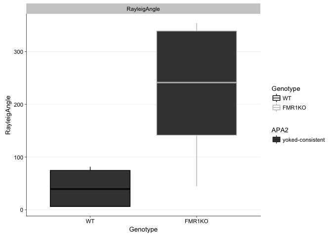

### Consistent

**Speed2ndEntr and Max50.RngLoBin** are significantly different between
WT and FMR1-KO when examining the consistent group in isolation (ANOVA
and t-test).

    ## [1] "Speed2ndEntr"
    ##             Df Sum Sq Mean Sq F value Pr(>F)  
    ## Genotype     1  54.15   54.15   4.841 0.0439 *
    ## Residuals   15 167.78   11.19                 
    ## ---
    ## Signif. codes:  0 '***' 0.001 '**' 0.01 '*' 0.05 '.' 0.1 ' ' 1
    ## 
    ##  Welch Two Sample t-test
    ## 
    ## data:  variable by Genotype
    ## t = -2.1314, df = 10.871, p-value = 0.05673
    ## alternative hypothesis: true difference in means is not equal to 0
    ## 95 percent confidence interval:
    ##  -7.2735027  0.1221139
    ## sample estimates:
    ##     mean in group WT mean in group FMR1KO 
    ##             3.188750             6.764444

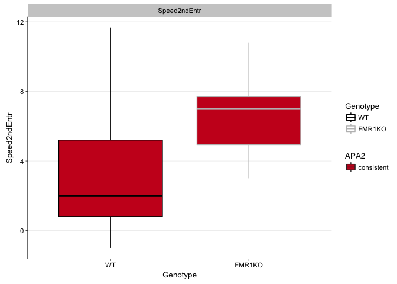

    ## [1] "Max50.RngHiBin"
    ##             Df Sum Sq Mean Sq F value Pr(>F)
    ## Genotype     1     64      64   0.019  0.892
    ## Residuals   15  50289    3353               
    ## 
    ##  Welch Two Sample t-test
    ## 
    ## data:  variable by Genotype
    ## t = 0.13555, df = 12.658, p-value = 0.8943
    ## alternative hypothesis: true difference in means is not equal to 0
    ## 95 percent confidence interval:
    ##  -58.26060  66.03838
    ## sample estimates:
    ##     mean in group WT mean in group FMR1KO 
    ##             225.0000             221.1111

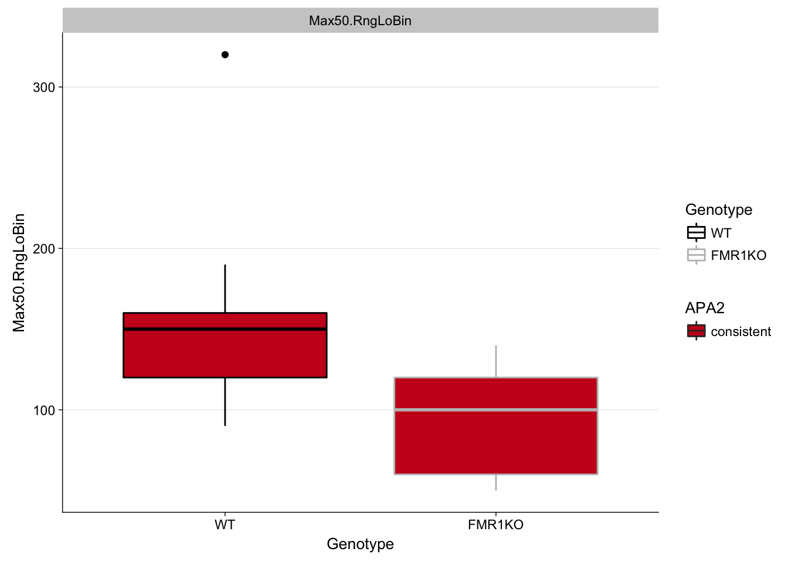

### Yoked conflict

**Speed2ndEntr amd RayleigAngle** are significantly different between WT
and FMR1-KO when examining the yoked conflict group in isolation (ANOVA
and t-test).

    ## [1] "Speed2ndEntr"
    ##             Df Sum Sq Mean Sq F value Pr(>F)  
    ## Genotype     1  77.60   77.60   6.566 0.0428 *
    ## Residuals    6  70.91   11.82                 
    ## ---
    ## Signif. codes:  0 '***' 0.001 '**' 0.01 '*' 0.05 '.' 0.1 ' ' 1
    ## 
    ##  Welch Two Sample t-test
    ## 
    ## data:  variable by Genotype
    ## t = -3.401, df = 4.1052, p-value = 0.02617
    ## alternative hypothesis: true difference in means is not equal to 0
    ## 95 percent confidence interval:
    ##  -11.632648  -1.234018
    ## sample estimates:
    ##     mean in group WT mean in group FMR1KO 
    ##             1.846667             8.280000

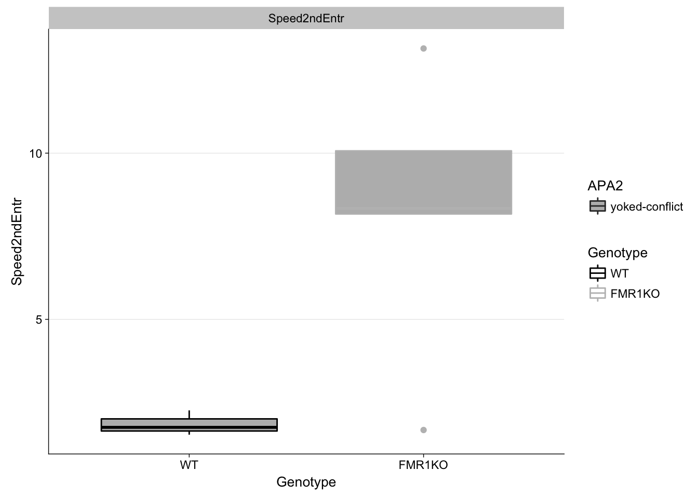

    ## [1] "RayleigAngle"
    ##             Df Sum Sq Mean Sq F value Pr(>F)  
    ## Genotype     1  44530   44530   7.358  0.035 *
    ## Residuals    6  36311    6052                 
    ## ---
    ## Signif. codes:  0 '***' 0.001 '**' 0.01 '*' 0.05 '.' 0.1 ' ' 1
    ## 
    ##  Welch Two Sample t-test
    ## 
    ## data:  variable by Genotype
    ## t = -2.3728, df = 2.9436, p-value = 0.09991
    ## alternative hypothesis: true difference in means is not equal to 0
    ## 95 percent confidence interval:
    ##  -363.05768   54.84035
    ## sample estimates:
    ##     mean in group WT mean in group FMR1KO 
    ##             93.55333            247.66200

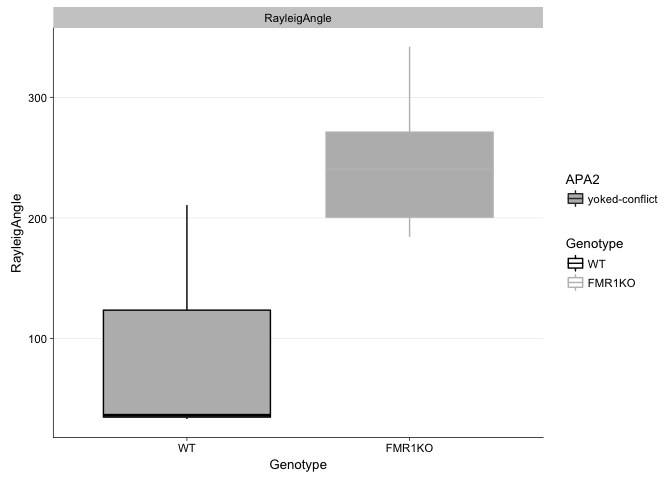

### Conflict

**Speed2ndEntr** is significantly different between WT and FMR1-KO when
examining the conflict group in isolation (ANOVA and t-test).

    ## [1] "Speed2ndEntr"
    ##             Df Sum Sq Mean Sq F value Pr(>F)  
    ## Genotype     1  32.32   32.32   4.759 0.0498 *
    ## Residuals   12  81.49    6.79                 
    ## ---
    ## Signif. codes:  0 '***' 0.001 '**' 0.01 '*' 0.05 '.' 0.1 ' ' 1
    ## 
    ##  Welch Two Sample t-test
    ## 
    ## data:  variable by Genotype
    ## t = -1.9917, df = 6.509, p-value = 0.08976
    ## alternative hypothesis: true difference in means is not equal to 0
    ## 95 percent confidence interval:
    ##  -6.993861  0.652083
    ## sample estimates:
    ##     mean in group WT mean in group FMR1KO 
    ##             3.801111             6.972000

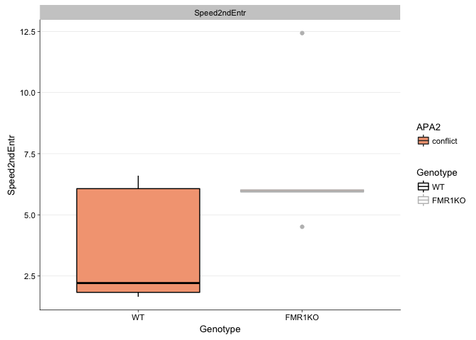

### Multiple groups analyzed at once

When controlling for training, Speed2ndEntr, RayleigAngle, and
Min50.RngHiBin are significantly different between WT and FMR1-KO.
Number of entrances and path to 1st entrance are not.

    ## [1] "Speed2ndEntr"
    ##               Df Sum Sq Mean Sq F value  Pr(>F)   
    ## Genotype       1  116.4  116.39  10.577 0.00226 **
    ## APA2           3   21.8    7.25   0.659 0.58190   
    ## Genotype:APA2  3   40.6   13.55   1.231 0.31040   
    ## Residuals     42  462.2   11.00                   
    ## ---
    ## Signif. codes:  0 '***' 0.001 '**' 0.01 '*' 0.05 '.' 0.1 ' ' 1

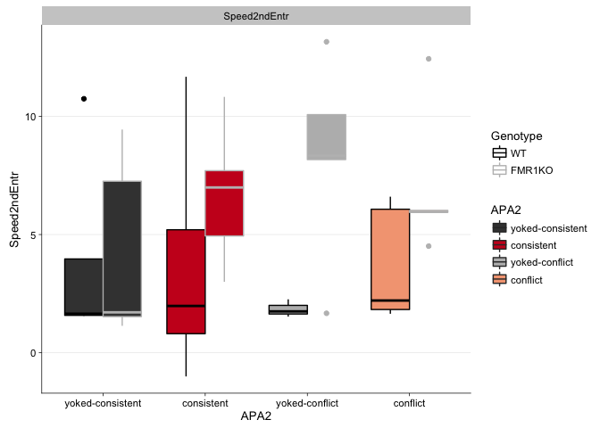

    ## [1] "RayleigAngle"
    ##               Df Sum Sq Mean Sq F value Pr(>F)   
    ## Genotype       1  34326   34326   6.537 0.0143 * 
    ## APA2           3  20704    6901   1.314 0.2824   
    ## Genotype:APA2  3  91096   30365   5.783 0.0021 **
    ## Residuals     42 220551    5251                  
    ## ---
    ## Signif. codes:  0 '***' 0.001 '**' 0.01 '*' 0.05 '.' 0.1 ' ' 1

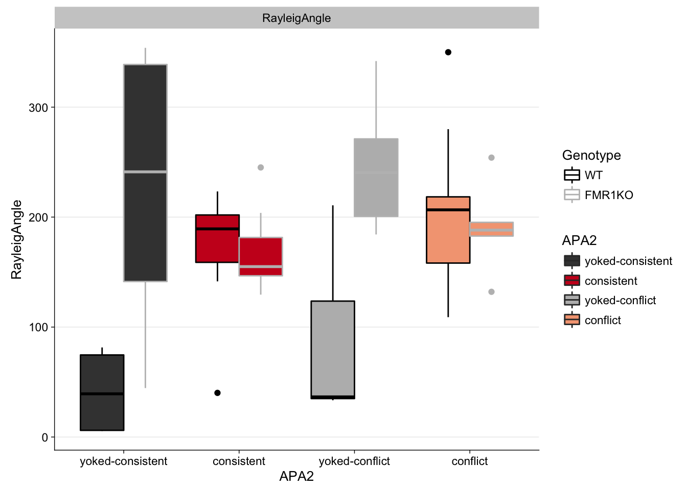

    ## [1] "Min50.RngHiBin"
    ##               Df Sum Sq Mean Sq F value Pr(>F)  
    ## Genotype       1  35158   35158   4.405 0.0419 *
    ## APA2           3  39477   13159   1.649 0.1926  
    ## Genotype:APA2  3  15740    5247   0.657 0.5828  
    ## Residuals     42 335186    7981                 
    ## ---
    ## Signif. codes:  0 '***' 0.001 '**' 0.01 '*' 0.05 '.' 0.1 ' ' 1

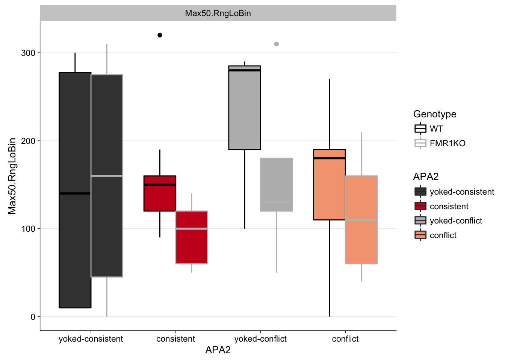

    ## [1] "NumEntrances"
    ##               Df Sum Sq Mean Sq F value   Pr(>F)    
    ## Genotype       1   33.3    33.3   0.883    0.353    
    ## APA2           3 1590.7   530.2  14.037 1.77e-06 ***
    ## Genotype:APA2  3   37.4    12.5   0.330    0.803    
    ## Residuals     42 1586.5    37.8                     
    ## ---
    ## Signif. codes:  0 '***' 0.001 '**' 0.01 '*' 0.05 '.' 0.1 ' ' 1

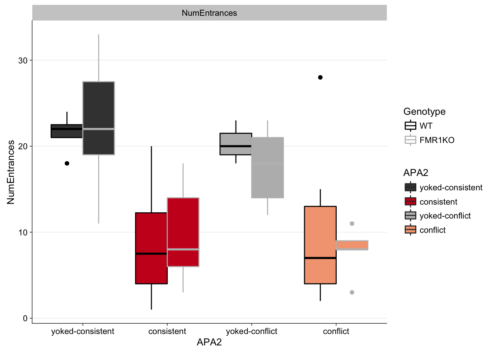

    ## [1] "Time1stEntr"
    ##               Df Sum Sq Mean Sq F value  Pr(>F)    
    ## Genotype       1  16373   16373   0.987 0.32615    
    ## APA2           3 333963  111321   6.711 0.00084 ***
    ## Genotype:APA2  3  25213    8404   0.507 0.67980    
    ## Residuals     42 696671   16587                    
    ## ---
    ## Signif. codes:  0 '***' 0.001 '**' 0.01 '*' 0.05 '.' 0.1 ' ' 1

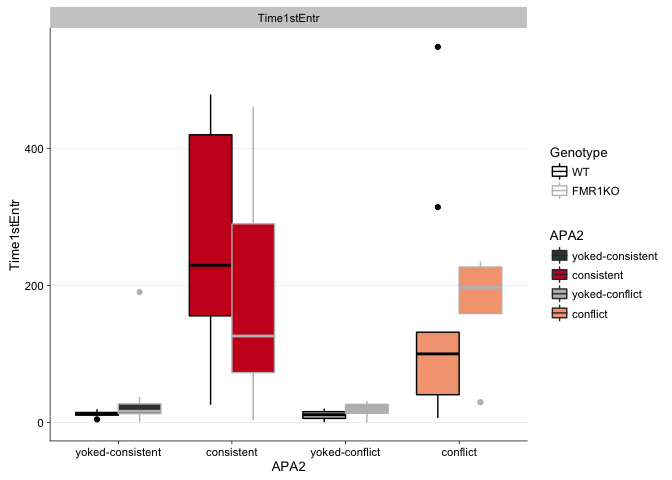

    ## [1] "Path1stEntr"
    ##               Df Sum Sq Mean Sq F value  Pr(>F)   
    ## Genotype       1    4.4    4.40   0.477 0.49371   
    ## APA2           3  162.1   54.03   5.851 0.00196 **
    ## Genotype:APA2  3    8.8    2.94   0.318 0.81215   
    ## Residuals     42  387.8    9.23                   
    ## ---
    ## Signif. codes:  0 '***' 0.001 '**' 0.01 '*' 0.05 '.' 0.1 ' ' 1

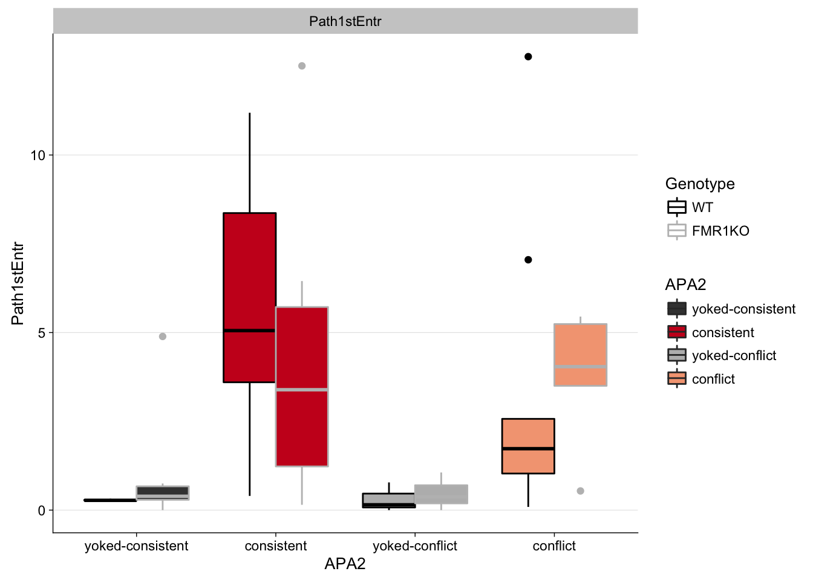
