RNAseq gene expression analysis with DESeq2
-------------------------------------------

This workflow was modified from the DESeq2 tutorial found at: <https://www.bioconductor.org/packages/release/bioc/vignettes/DESeq2/inst/doc/DESeq2.pdf>

First I load a handful of packages for data wrangling, gene expression analysis, data visualization, and statistics.

We are ready to calculate differential gene expression using the DESeq package. For simplicity, I will use the standard nameing of "countData" and "colData" for the gene counts and gene information, respectively.

    ##  Genotype    APA           daytime        daytime2       daytime3
    ##  FMR1:8   Yoked:16   afternoon :2   afternoon :10   daytime  :8  
    ##  WT  :8              beforenoon:6   beforenoon: 6   nighttime:8  
    ##                      evening   :5                                
    ##                      nighttime :3

Total Gene Counts Per Sample
----------------------------

this could say something about data before normalization

    ## [1] 22485    16

    ## [1] 22485    16

    ##  16-116B  16-117D  16-118B  16-118D  16-119B  16-119D  16-120B  16-120D 
    ## 2.082858 1.437951 2.903268 2.191553 2.619744 2.593812 2.869718 2.194511 
    ##  16-122B  16-122D  16-123B  16-123D  16-124D  16-125B  16-125D  16-126B 
    ## 2.778324 3.203040 0.846916 2.551592 2.595799 0.485904 2.054411 2.700689

    ## 
    ##    0    1    2    3    4    5    6    7    8    9   10   11   12   13   14 
    ## 5081  425  334  312  223  183  179  162  135  130  137  105  103   95   93 
    ##   15   16   17   18   19   20   21   22   23   24   25   26   27   28   29 
    ##   78  103   77   75   67   82   68   59   65   68   57   52   61   51   53

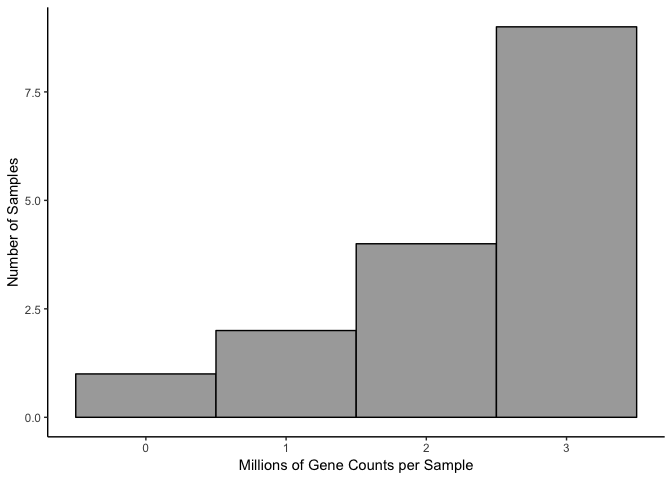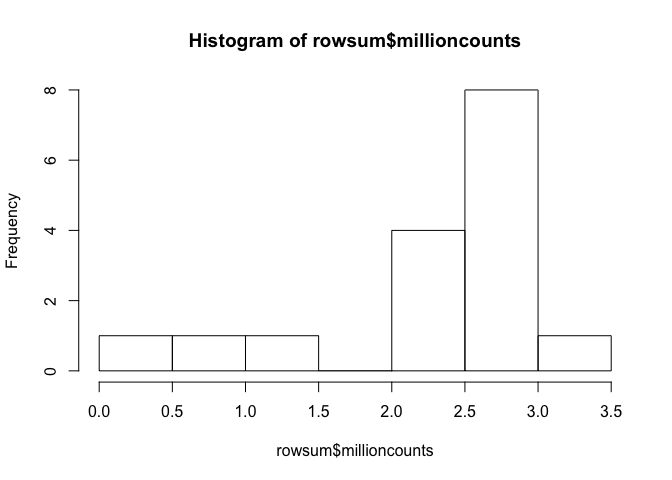

DeSeq2
------

    ## class: DESeqDataSet 
    ## dim: 22485 16 
    ## metadata(1): version
    ## assays(1): counts
    ## rownames(22485): 0610007P14Rik 0610009B22Rik ... Zzef1 Zzz3
    ## rowData names(0):
    ## colnames(16): 16-116B 16-117D ... 16-125D 16-126B
    ## colData names(8): RNAseqID Mouse ... daytime2 daytime3

    ## class: DESeqDataSet 
    ## dim: 16979 16 
    ## metadata(1): version
    ## assays(1): counts
    ## rownames(16979): 0610007P14Rik 0610009B22Rik ... Zzef1 Zzz3
    ## rowData names(0):
    ## colnames(16): 16-116B 16-117D ... 16-125D 16-126B
    ## colData names(8): RNAseqID Mouse ... daytime2 daytime3

PCA
---

    ## [1] 54 16  9  5  3  2  2  2  2

    ##             Df Sum Sq Mean Sq F value Pr(>F)
    ## Genotype     1   54.8   54.82   1.163  0.299
    ## Residuals   14  660.0   47.14

    ##             Df Sum Sq Mean Sq F value Pr(>F)
    ## Genotype     1   28.2   28.20   2.197   0.16
    ## Residuals   14  179.7   12.84

    ##             Df Sum Sq Mean Sq F value Pr(>F)
    ## Genotype     1  14.66  14.661   1.992   0.18
    ## Residuals   14 103.07   7.362

    ##             Df Sum Sq Mean Sq F value Pr(>F)
    ## Genotype     1   0.02   0.021   0.004  0.948
    ## Residuals   14  66.49   4.749

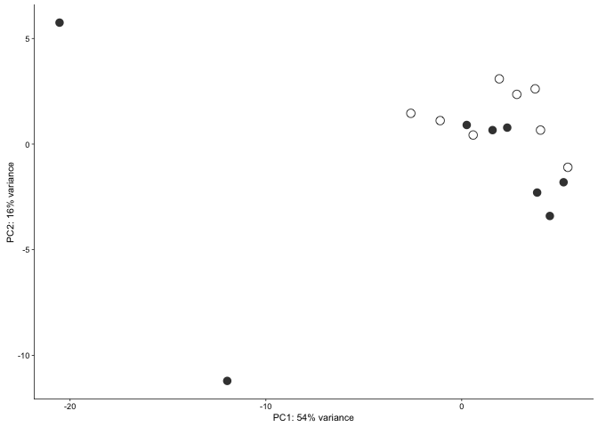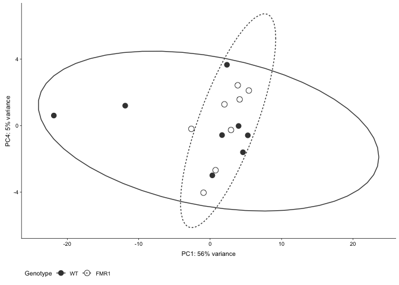

    ## quartz_off_screen 
    ##                 2

    ## quartz_off_screen 
    ##                 2

Number of differentially expressed genes per two-way contrast
=============================================================

    ## [1] 29

    ## 
    ## out of 16917 with nonzero total read count
    ## adjusted p-value < 0.1
    ## LFC > 0 (up)     : 13, 0.077% 
    ## LFC < 0 (down)   : 16, 0.095% 
    ## outliers [1]     : 0, 0% 
    ## low counts [2]   : 6293, 37% 
    ## (mean count < 10)
    ## [1] see 'cooksCutoff' argument of ?results
    ## [2] see 'independentFiltering' argument of ?results

    ## log2 fold change (MAP): Genotype FMR1 vs WT 
    ## Wald test p-value: Genotype FMR1 vs WT 
    ## DataFrame with 20 rows and 6 columns
    ##           baseMean log2FoldChange      lfcSE       stat       pvalue
    ##          <numeric>      <numeric>  <numeric>  <numeric>    <numeric>
    ## Ccnd2     43.99689     -1.8572662 0.16016256 -11.596132 4.311281e-31
    ## Fmr1      77.54058     -1.0999523 0.15694873  -7.008354 2.411375e-12
    ## Kcnt1     69.17765     -0.8121867 0.16122731  -5.037525 4.715890e-07
    ## Arel1    718.10450      0.3544819 0.07386369   4.799135 1.593521e-06
    ## Slc29a4   18.12739     -0.6881522 0.16806055  -4.094668 4.227738e-05
    ## ...            ...            ...        ...        ...          ...
    ## Fibcd1  1486.45413      0.2002234 0.05452206   3.672338 0.0002403411
    ## Grin1   2880.63646      0.2661368 0.07221541   3.685319 0.0002284160
    ## Laptm4a  235.32818     -0.4293355 0.11382405  -3.771923 0.0001619944
    ## Mtus1     15.70662     -0.6174893 0.16296253  -3.789149 0.0001511643
    ## Ncdn    8100.27182      0.1707820 0.04683268   3.646641 0.0002656902
    ##                 padj
    ##            <numeric>
    ## Ccnd2   4.607035e-27
    ## Fmr1    1.288398e-08
    ## Kcnt1   1.679800e-03
    ## Arel1   4.257091e-03
    ## Slc29a4 9.035521e-02
    ## ...              ...
    ## Fibcd1    0.09933341
    ## Grin1     0.09933341
    ## Laptm4a   0.09933341
    ## Mtus1     0.09933341
    ## Ncdn      0.09933341

    ##         gene         padj        lfc
    ## 6      Ccnd2 4.607035e-27 -1.8572662
    ## 13      Fmr1 1.288398e-08 -1.0999523
    ## 15     Kcnt1 1.679800e-03 -0.8121867
    ## 2      Arel1 4.257091e-03  0.3544819
    ## 24   Slc29a4 9.035521e-02 -0.6881522
    ## 10    Efcab6 9.923844e-02 -0.6767416
    ## 26     Sstr3 9.923844e-02 -0.6729482
    ## 1       Apc2 9.933341e-02  0.3624314
    ## 3       Brf1 9.933341e-02  0.4607804
    ## 4    Cacna1g 9.933341e-02 -0.5563997
    ## 5       Car4 9.933341e-02 -0.6530049
    ## 7      Cpne7 9.933341e-02 -0.5195620
    ## 8       Cry2 9.933341e-02  0.3672937
    ## 9       Dlx1 9.933341e-02 -0.6151019
    ## 11     Fgfr1 9.933341e-02 -0.3824715
    ## 12    Fibcd1 9.933341e-02  0.2002234
    ## 14     Grin1 9.933341e-02  0.2661368
    ## 16   Laptm4a 9.933341e-02 -0.4293355
    ## 17     Mtus1 9.933341e-02 -0.6174893
    ## 18      Ncdn 9.933341e-02  0.1707820
    ## 19      Plat 9.933341e-02 -0.5396718
    ## 20    Pnmal2 9.933341e-02  0.3144891
    ## 21     Prpf8 9.933341e-02  0.3478673
    ## 22 Serpina3n 9.933341e-02 -0.4769215
    ## 23     Sidt1 9.933341e-02  0.3978328
    ## 25    Slc8a2 9.933341e-02  0.2202670
    ## 27      Tnik 9.933341e-02  0.3904730
    ## 28     Wipf3 9.933341e-02  0.2778451
    ## 29      Xbp1 9.933341e-02 -0.5057252

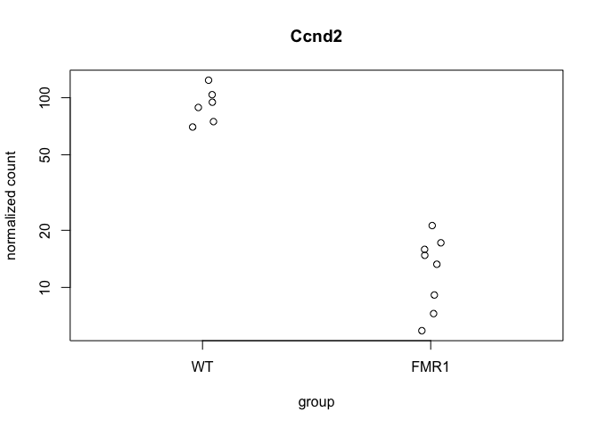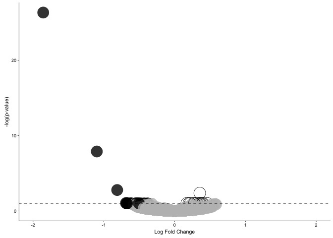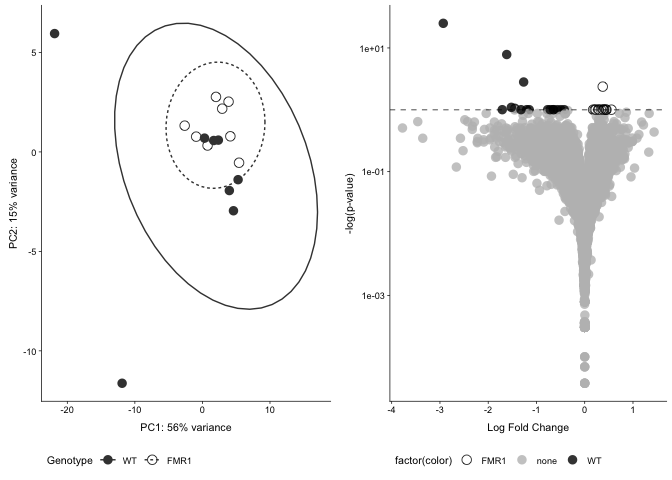

    ## quartz_off_screen 
    ##                 2

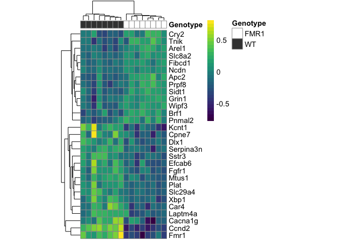

Daytime 2
---------

    ## class: DESeqDataSet 
    ## dim: 22485 16 
    ## metadata(1): version
    ## assays(1): counts
    ## rownames(22485): 0610007P14Rik 0610009B22Rik ... Zzef1 Zzz3
    ## rowData names(0):
    ## colnames(16): 16-116B 16-117D ... 16-125D 16-126B
    ## colData names(8): RNAseqID Mouse ... daytime2 daytime3

    ## class: DESeqDataSet 
    ## dim: 16979 16 
    ## metadata(1): version
    ## assays(1): counts
    ## rownames(16979): 0610007P14Rik 0610009B22Rik ... Zzef1 Zzz3
    ## rowData names(0):
    ## colnames(16): 16-116B 16-117D ... 16-125D 16-126B
    ## colData names(8): RNAseqID Mouse ... daytime2 daytime3

    ## [1] 337

    ## log2 fold change (MAP): daytime2 afternoon vs beforenoon 
    ## Wald test p-value: daytime2 afternoon vs beforenoon 
    ## DataFrame with 10 rows and 6 columns
    ##           baseMean log2FoldChange      lfcSE      stat       pvalue
    ##          <numeric>      <numeric>  <numeric> <numeric>    <numeric>
    ## Cck      588.80246     -0.6350744 0.13009251 -4.881714 1.051678e-06
    ## Srrm2   1882.70766      0.2807543 0.05746930  4.885292 1.032759e-06
    ## Ctsb     867.49785     -0.3369583 0.07345542 -4.587248 4.491263e-06
    ## Irs2     376.36499      0.6326652 0.13580481  4.658636 3.183107e-06
    ## Laptm4a  235.32818     -0.4971941 0.10927261 -4.550034 5.363717e-06
    ## Ndufb7    38.50238     -0.8602495 0.18544286 -4.638892 3.502814e-06
    ## Nrgn    3194.30034     -0.3990034 0.08614294 -4.631876 3.623679e-06
    ## Ube2m    161.30997     -0.4559715 0.09981091 -4.568353 4.915722e-06
    ## Scand1    55.77737     -0.7230971 0.15987947 -4.522764 6.103730e-06
    ## Sepw1    764.67921     -0.5183379 0.11528367 -4.496195 6.918027e-06
    ##                padj
    ##           <numeric>
    ## Cck     0.004417049
    ## Srrm2   0.004417049
    ## Ctsb    0.005631902
    ## Irs2    0.005631902
    ## Laptm4a 0.005631902
    ## Ndufb7  0.005631902
    ## Nrgn    0.005631902
    ## Ube2m   0.005631902
    ## Scand1  0.005696815
    ## Sepw1   0.005811142

    ## 
    ## out of 16936 with nonzero total read count
    ## adjusted p-value < 0.1
    ## LFC > 0 (up)     : 146, 0.86% 
    ## LFC < 0 (down)   : 191, 1.1% 
    ## outliers [1]     : 33, 0.19% 
    ## low counts [2]   : 8546, 50% 
    ## (mean count < 26)
    ## [1] see 'cooksCutoff' argument of ?results
    ## [2] see 'independentFiltering' argument of ?results

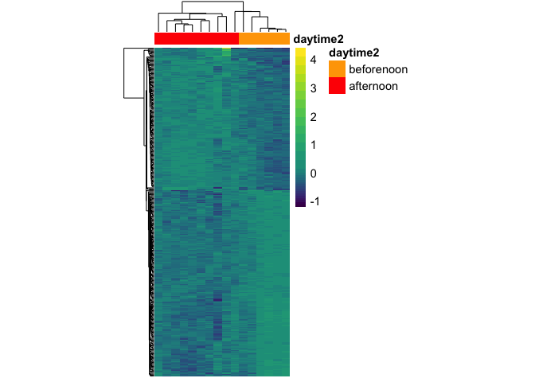

Daytime 3 - daytime nighttime
-----------------------------

    ## class: DESeqDataSet 
    ## dim: 22485 16 
    ## metadata(1): version
    ## assays(1): counts
    ## rownames(22485): 0610007P14Rik 0610009B22Rik ... Zzef1 Zzz3
    ## rowData names(0):
    ## colnames(16): 16-116B 16-117D ... 16-125D 16-126B
    ## colData names(8): RNAseqID Mouse ... daytime2 daytime3

    ## class: DESeqDataSet 
    ## dim: 16979 16 
    ## metadata(1): version
    ## assays(1): counts
    ## rownames(16979): 0610007P14Rik 0610009B22Rik ... Zzef1 Zzz3
    ## rowData names(0):
    ## colnames(16): 16-116B 16-117D ... 16-125D 16-126B
    ## colData names(8): RNAseqID Mouse ... daytime2 daytime3

    ## [1] 530

    ## log2 fold change (MAP): daytime3 nighttime vs daytime 
    ## Wald test p-value: daytime3 nighttime vs daytime 
    ## DataFrame with 20 rows and 6 columns
    ##          baseMean log2FoldChange      lfcSE      stat       pvalue
    ##         <numeric>      <numeric>  <numeric> <numeric>    <numeric>
    ## Efna3    181.3672     -0.5476312 0.09766881 -5.607023 2.058368e-08
    ## Mif      111.3487     -0.7186259 0.12918912 -5.562588 2.658023e-08
    ## Fkbp4    143.0442     -0.6114104 0.11215853 -5.451306 5.000125e-08
    ## Cox4i1   350.4879     -0.6230585 0.12034535 -5.177254 2.251752e-07
    ## Nedd4l   534.9398      0.3429340 0.06696366  5.121195 3.036055e-07
    ## ...           ...            ...        ...       ...          ...
    ## Laptm4a  235.3282     -0.5076397 0.10820731 -4.691362 2.713917e-06
    ## Lsamp   1186.4206      0.3987008 0.08594989  4.638759 3.505070e-06
    ## Kbtbd11  721.2242      0.3339773 0.07250264  4.606416 4.096679e-06
    ## Rbfox2   751.8005      0.2934002 0.06397542  4.586139 4.515182e-06
    ## Rps25     94.3567     -0.6672838 0.14618214 -4.564742 5.001082e-06
    ##                 padj
    ##            <numeric>
    ## Efna3   0.0000853757
    ## Mif     0.0000853757
    ## Fkbp4   0.0001070694
    ## Cox4i1  0.0003250603
    ## Nedd4l  0.0003250603
    ## ...              ...
    ## Laptm4a  0.001089638
    ## Lsamp    0.001324504
    ## Kbtbd11  0.001462059
    ## Rbfox2   0.001526607
    ## Rps25    0.001606348

    ## 
    ## out of 16917 with nonzero total read count
    ## adjusted p-value < 0.1
    ## LFC > 0 (up)     : 287, 1.7% 
    ## LFC < 0 (down)   : 243, 1.4% 
    ## outliers [1]     : 0, 0% 
    ## low counts [2]   : 10555, 62% 
    ## (mean count < 49)
    ## [1] see 'cooksCutoff' argument of ?results
    ## [2] see 'independentFiltering' argument of ?results

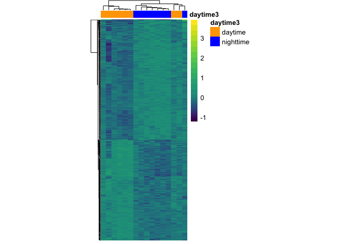

Daytime - all four options
--------------------------

    ## class: DESeqDataSet 
    ## dim: 22485 16 
    ## metadata(1): version
    ## assays(1): counts
    ## rownames(22485): 0610007P14Rik 0610009B22Rik ... Zzef1 Zzz3
    ## rowData names(0):
    ## colnames(16): 16-116B 16-117D ... 16-125D 16-126B
    ## colData names(8): RNAseqID Mouse ... daytime2 daytime3

    ## class: DESeqDataSet 
    ## dim: 16979 16 
    ## metadata(1): version
    ## assays(1): counts
    ## rownames(16979): 0610007P14Rik 0610009B22Rik ... Zzef1 Zzz3
    ## rowData names(0):
    ## colnames(16): 16-116B 16-117D ... 16-125D 16-126B
    ## colData names(8): RNAseqID Mouse ... daytime2 daytime3

    ## [1] 388

    ## [1] 14

    ## [1] 0

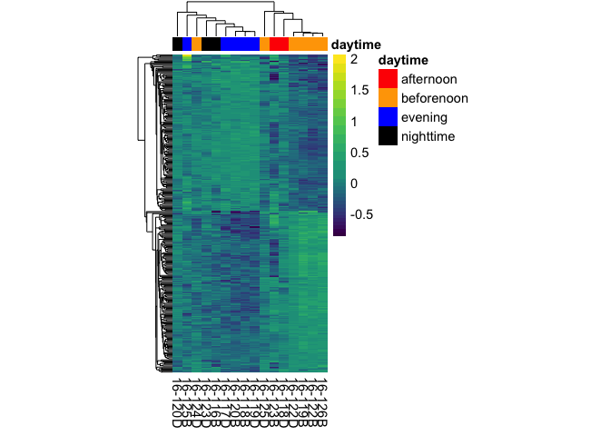

Daytime3 and FMR1 - all data points
-----------------------------------

    ## class: DESeqDataSet 
    ## dim: 16979 16 
    ## metadata(1): version
    ## assays(1): counts
    ## rownames(16979): 0610007P14Rik 0610009B22Rik ... Zzef1 Zzz3
    ## rowData names(0):
    ## colnames(16): 16-116B 16-117D ... 16-125D 16-126B
    ## colData names(8): RNAseqID Mouse ... daytime2 daytime3

    ## [1] 281

    ## [1] 51

    ## [1] 5

    ## [1] 1923

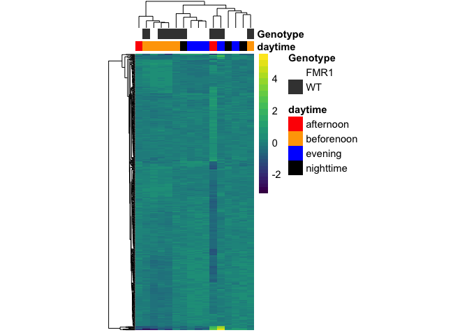

Daytime3 and FMR1 - no outliers removed
---------------------------------------

    ## class: DESeqDataSet 
    ## dim: 16979 16 
    ## metadata(1): version
    ## assays(1): counts
    ## rownames(16979): 0610007P14Rik 0610009B22Rik ... Zzef1 Zzz3
    ## rowData names(0):
    ## colnames(16): 16-116B 16-117D ... 16-125D 16-126B
    ## colData names(8): RNAseqID Mouse ... daytime2 daytime3

    ## [1] 11

    ## [1] 2

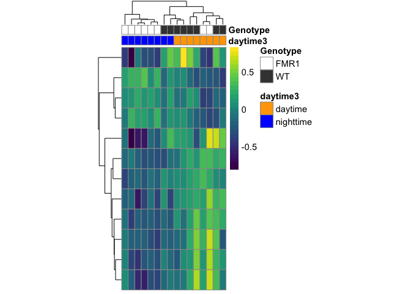

Daytime 3 and genotype - 2 samples removed
------------------------------------------

    ## class: DESeqDataSet 
    ## dim: 16979 16 
    ## metadata(1): version
    ## assays(1): counts
    ## rownames(16979): 0610007P14Rik 0610009B22Rik ... Zzef1 Zzz3
    ## rowData names(0):
    ## colnames(16): 16-116B 16-117D ... 16-125D 16-126B
    ## colData names(8): RNAseqID Mouse ... daytime2 daytime3

    ## [1] 281

    ## [1] 51

    ## [1] 5

    ## [1] 1923

Daytime3 and FMR1 - no outliers removed
---------------------------------------

    ## class: DESeqDataSet 
    ## dim: 16894 14 
    ## metadata(1): version
    ## assays(1): counts
    ## rownames(16894): 0610007P14Rik 0610009B22Rik ... Zzef1 Zzz3
    ## rowData names(0):
    ## colnames(14): 16-116B 16-117D ... 16-125D 16-126B
    ## colData names(7): RNAseqID Mouse ... daytime daytime3

    ## [1] 243

    ## [1] 2

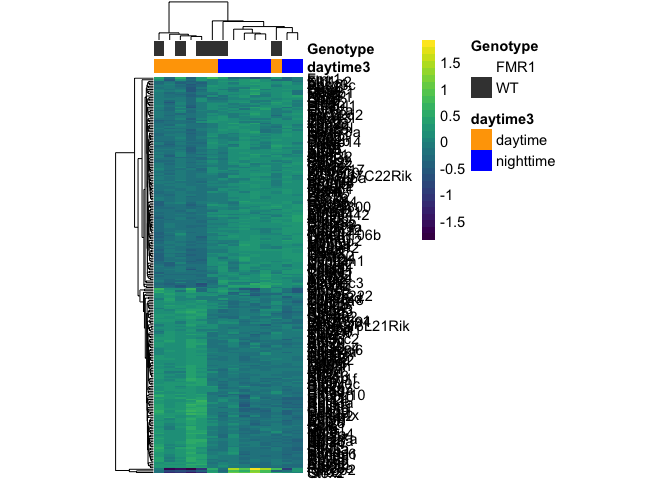

Write the files
---------------
