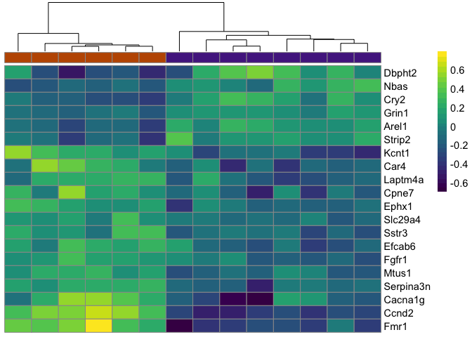
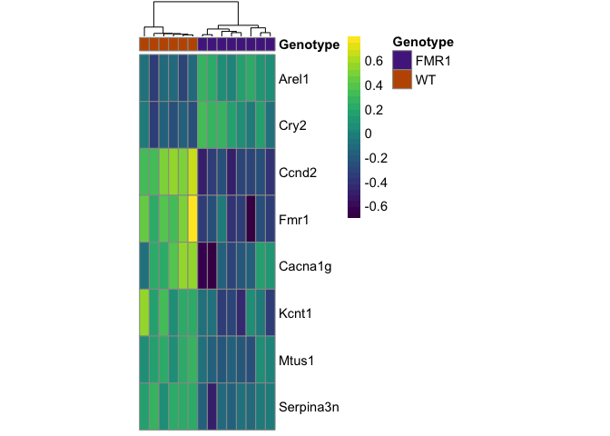

RNAseq gene expression analysis with DESeq2
-------------------------------------------

This workflow was modified from the DESeq2 tutorial found at: <https://www.bioconductor.org/packages/release/bioc/vignettes/DESeq2/inst/doc/DESeq2.pdf>

First I load a handful of packages for data wrangling, gene expression analysis, data visualization, and statistics.

``` r
library(dplyr) ## for filtering and selecting rows
library(plyr) ## for renmaing factors
library(reshape2) ## for melting dataframe
library(DESeq2) ## for gene expression analysis
library(edgeR)  ## for basic read counts status
library(magrittr) ## to use the weird pipe
library(genefilter)  ## for PCA fuction
library(ggplot2)
library(cowplot) ## for some easy to use themes
library(car) ## stats
library(VennDiagram) ## venn diagrams
library(pheatmap) ## awesome heatmaps
library(viridis) # for awesome color pallette
library(magrittr) ## to use the weird pipe
library(ggrepel) ## for labeling volcano plot

## load functions 
source("figureoptions.R")
source("functions_RNAseq.R")

## set output file for figures 
knitr::opts_chunk$set(fig.path = '../figures/02_RNAseq/')
```

We are ready to calculate differential gene expression using the DESeq package. For simplicity, I will use the standard nameing of "countData" and "colData" for the gene counts and gene information, respectively.

``` r
colData <- read.csv("../data/fmr1ColData.csv", header = T)
countData <- read.csv("../data/fmr1CountData.csv", header = T, check.names = F, row.names = 1)

## remove outliers
colData <- colData %>% 
  filter(RNAseqID != "16-123B")  %>% 
  filter(RNAseqID != "16-125B") %>% 
  droplevels()

savecols <- as.character(colData$RNAseqID) 
savecols <- as.vector(savecols) 
countData <- countData %>% dplyr::select(one_of(savecols)) 

# colData must be factors
cols = c(1:6)
colData[,cols] %<>% lapply(function(x) as.factor(as.character(x)))

# summary data
colData %>% select(Genotype, APA)  %>%  summary()
```

    ##  Genotype    APA    
    ##  FMR1:8   Yoked:14  
    ##  WT  :6

Total Gene Counts Per Sample
----------------------------

this could say something about data before normalization

``` r
## stats
dim(countData)
```

    ## [1] 22485    14

``` r
counts <- countData
dim( counts )
```

    ## [1] 22485    14

``` r
colSums( counts ) / 1e06  # in millions of reads
```

    ##  16-116B  16-117D  16-118B  16-118D  16-119B  16-119D  16-120B  16-120D 
    ## 2.082858 1.437951 2.903268 2.191553 2.619744 2.593812 2.869718 2.194511 
    ##  16-122B  16-122D  16-123D  16-124D  16-125D  16-126B 
    ## 2.778324 3.203040 2.551592 2.595799 2.054411 2.700689

``` r
table( rowSums( counts ) )[ 1:30 ] # Number of genes with low counts
```

    ## 
    ##    0    1    2    3    4    5    6    7    8    9   10   11   12   13   14 
    ## 5159  432  366  319  241  179  188  162  124  146  123  109  100   87   81 
    ##   15   16   17   18   19   20   21   22   23   24   25   26   27   28   29 
    ##   95   91   68   73   86   65   76   57   65   71   51   60   52   43   54

``` r
rowsum <- as.data.frame(colSums( counts ) / 1e06 )
names(rowsum)[1] <- "millioncounts"
rowsum$sample <- row.names(rowsum)

ggplot(rowsum, aes(x=millioncounts)) + 
  geom_histogram(binwidth = 1, colour = "black", fill = "darkgrey") +
  theme_classic() +
  scale_x_continuous(name = "Millions of Gene Counts per Sample",
                     breaks = seq(0, 8, 1),
                     limits=c(0, 8)) +
  scale_y_continuous(name = "Number of Samples")
```


DeSeq2
------

``` r
## create DESeq object using the factor Genotyp
dds <- DESeqDataSetFromMatrix(countData = countData,
                              colData = colData,
                              design = ~ Genotype)

dds$Genotype <- factor(dds$Genotype, levels=c("WT", "FMR1")) ## specify the factor levels 

dds # view the DESeq object - note numnber of genes
```

    ## class: DESeqDataSet 
    ## dim: 22485 14 
    ## metadata(1): version
    ## assays(1): counts
    ## rownames(22485): 0610007P14Rik 0610009B22Rik ... Zzef1 Zzz3
    ## rowData names(0):
    ## colnames(14): 16-116B 16-117D ... 16-125D 16-126B
    ## colData names(6): RNAseqID Mouse ... Date daytime

``` r
dds <- dds[ rowSums(counts(dds)) > 1, ]  # Pre-filtering genes with 0 counts
dds # view number of genes afternormalization and the number of samples
```

    ## class: DESeqDataSet 
    ## dim: 16894 14 
    ## metadata(1): version
    ## assays(1): counts
    ## rownames(16894): 0610007P14Rik 0610009B22Rik ... Zzef1 Zzz3
    ## rowData names(0):
    ## colnames(14): 16-116B 16-117D ... 16-125D 16-126B
    ## colData names(6): RNAseqID Mouse ... Date daytime

``` r
dds <- DESeq(dds) # Differential expression analysis
```

    ## estimating size factors

    ## estimating dispersions

    ## gene-wise dispersion estimates

    ## mean-dispersion relationship

    ## final dispersion estimates

    ## fitting model and testing

    ## -- replacing outliers and refitting for 134 genes
    ## -- DESeq argument 'minReplicatesForReplace' = 7 
    ## -- original counts are preserved in counts(dds)

    ## estimating dispersions

    ## fitting model and testing

``` r
rld <- rlog(dds, blind=FALSE) ## log transformed data
rlddf <- assay(rld)

vsd <- getVarianceStabilizedData(dds)
```

PCA
---

``` r
# create the dataframe using my function pcadataframe
pcadata <- pcadataframe(rld, intgroup=c("Genotype"), returnData=TRUE)
percentVar <- round(100 * attr(pcadata, "percentVar"))
percentVar
```

    ## [1] 43 15  6  6  5  4  4  4  3

``` r
aov1 <- aov(PC1 ~ Genotype, data=pcadata)
summary(aov1) 
```

    ##             Df Sum Sq Mean Sq F value Pr(>F)
    ## Genotype     1  41.95   41.95   2.505  0.139
    ## Residuals   12 200.97   16.75

``` r
aov2 <- aov(PC2 ~ Genotype, data=pcadata)
summary(aov2) 
```

    ##             Df Sum Sq Mean Sq F value Pr(>F)
    ## Genotype     1   2.37   2.371   0.337  0.572
    ## Residuals   12  84.39   7.033

``` r
aov3 <- aov(PC3 ~ Genotype, data=pcadata)
summary(aov3) 
```

    ##             Df Sum Sq Mean Sq F value Pr(>F)
    ## Genotype     1   2.92   2.921   1.029   0.33
    ## Residuals   12  34.07   2.839

``` r
aov4 <- aov(PC4 ~ Genotype, data=pcadata)
summary(aov4) 
```

    ##             Df Sum Sq Mean Sq F value Pr(>F)  
    ## Genotype     1  12.43   12.43   6.755 0.0233 *
    ## Residuals   12  22.09    1.84                 
    ## ---
    ## Signif. codes:  0 '***' 0.001 '**' 0.01 '*' 0.05 '.' 0.1 ' ' 1

``` r
pcadata$Genotype <- factor(pcadata$Genotype, levels=c("WT", "FMR1"))

PCA12 <- plotPCs(pcadata, 1, 2, aescolor = pcadata$Genotype, colorname = " ", aesshape = pcadata$Genotype, shapename = " ",  colorvalues = colorvalGenotype)
PCA12
```


``` r
PCA34 <- plotPCs(pcadata, 3, 4,  aescolor = pcadata$Genotype, colorname = " ", aesshape = pcadata$Genotype, shapename = " ",  colorvalues = colorvalGenotype)
PCA34
```


``` r
# pdf the same pca plots descripbed above of the above
pdf(file="../figures/02_RNAseq/PCA12.pdf", width=3, height=2.5)
plot(PCA12)
dev.off()
```

    ## quartz_off_screen 
    ##                 2

``` r
pdf(file="../figures/02_RNAseq/PCA34.pdf", width=3, height=2.5)
plot(PCA34)
dev.off()
```

    ## quartz_off_screen 
    ##                 2

Number of differentially expressed genes per two-way contrast
=============================================================

``` r
#calculate significance of all two way comparisions
# see source "functions_RNAseq.R" 

contrast1 <- resvals(contrastvector = c("Genotype", "FMR1", "WT"), mypval = 0.05) # 8
```

    ## [1] 8

``` r
contrast2 <- resvals(contrastvector = c("Genotype", "FMR1", "WT"), mypval = 0.2) # 20
```

    ## [1] 20

``` r
contrast3 <- resvals(contrastvector = c("Genotype", "FMR1", "WT"), mypval = 0.1) # 11
```

    ## [1] 11

``` r
# gene list
res <- results(dds, contrast =c("Genotype", "FMR1", "WT"), independentFiltering = F, alpha = 0.2)
resOrdered <- res[order(res$padj),]
head(resOrdered, 20)
```

    ## log2 fold change (MAP): Genotype FMR1 vs WT 
    ## Wald test p-value: Genotype FMR1 vs WT 
    ## DataFrame with 20 rows and 6 columns
    ##           baseMean log2FoldChange      lfcSE       stat       pvalue
    ##          <numeric>      <numeric>  <numeric>  <numeric>    <numeric>
    ## Ccnd2     46.67797     -1.5818867 0.14281653 -11.076356 1.633885e-28
    ## Fmr1      93.47210     -1.0773829 0.13916618  -7.741701 9.809573e-15
    ## Arel1    886.18923      0.3785902 0.07530677   5.027306 4.974185e-07
    ## Cry2     508.25058      0.4323033 0.09101104   4.750010 2.034066e-06
    ## Kcnt1     72.55067     -0.6511921 0.14092433  -4.620864 3.821461e-06
    ## ...            ...            ...        ...        ...          ...
    ## Grin1   3655.43619      0.2007506 0.05274456   3.806091 0.0001411802
    ## Nbas      88.50852      0.4873811 0.12719309   3.831821 0.0001271984
    ## Strip2   280.42853      0.3873443 0.10332144   3.748924 0.0001775947
    ## Slc29a4   18.46852     -0.5236567 0.14119369  -3.708783 0.0002082581
    ## Laptm4a  281.37258     -0.4007639 0.10853889  -3.692353 0.0002221885
    ##                 padj
    ##            <numeric>
    ## Ccnd2   2.752932e-24
    ## Fmr1    8.264075e-11
    ## Arel1   2.793668e-03
    ## Cry2    8.567995e-03
    ## Kcnt1   1.287756e-02
    ## ...              ...
    ## Grin1      0.1438294
    ## Nbas       0.1438294
    ## Strip2     0.1662385
    ## Slc29a4    0.1846811
    ## Laptm4a    0.1871827

``` r
data <- data.frame(gene = row.names(res), padj = (res$padj), lfc = res$log2FoldChange)
data <- na.omit(data)
data <- filter(data, padj < 0.1)
data[order(data$padj),]
```

    ##         gene         padj        lfc
    ## 4      Ccnd2 2.752932e-24 -1.5818867
    ## 7       Fmr1 8.264075e-11 -1.0773829
    ## 1      Arel1 2.793668e-03  0.3785902
    ## 5       Cry2 8.567995e-03  0.4323033
    ## 8      Kcnt1 1.287756e-02 -0.6511921
    ## 2    Cacna1g 4.884930e-02 -0.5805430
    ## 9      Mtus1 4.884930e-02 -0.5788129
    ## 10 Serpina3n 4.884930e-02 -0.4908262
    ## 3       Car4 7.100994e-02 -0.5900355
    ## 6      Ephx1 7.100994e-02 -0.5889576
    ## 11     Sstr3 9.886082e-02 -0.5721731

``` r
res <- results(dds, contrast =c("Genotype", "FMR1", "WT"), independentFiltering = T, alpha = 0.05)
summary(res)
```

    ## 
    ## out of 16871 with nonzero total read count
    ## adjusted p-value < 0.05
    ## LFC > 0 (up)     : 2, 0.012% 
    ## LFC < 0 (down)   : 6, 0.036% 
    ## outliers [1]     : 45, 0.27% 
    ## low counts [2]   : 23, 0.14% 
    ## (mean count < 0)
    ## [1] see 'cooksCutoff' argument of ?results
    ## [2] see 'independentFiltering' argument of ?results

``` r
topGene <- rownames(res)[which.min(res$padj)]
plotCounts(dds, gene = topGene, intgroup=c("Genotype"))
```


``` r
resOrdered <- res[order(res$padj),]
head(resOrdered, 10)
```

    ## log2 fold change (MAP): Genotype FMR1 vs WT 
    ## Wald test p-value: Genotype FMR1 vs WT 
    ## DataFrame with 10 rows and 6 columns
    ##            baseMean log2FoldChange      lfcSE       stat       pvalue
    ##           <numeric>      <numeric>  <numeric>  <numeric>    <numeric>
    ## Ccnd2      46.67797     -1.5818867 0.14281653 -11.076356 1.633885e-28
    ## Fmr1       93.47210     -1.0773829 0.13916618  -7.741701 9.809573e-15
    ## Arel1     886.18923      0.3785902 0.07530677   5.027306 4.974185e-07
    ## Cry2      508.25058      0.4323033 0.09101104   4.750010 2.034066e-06
    ## Kcnt1      72.55067     -0.6511921 0.14092433  -4.620864 3.821461e-06
    ## Cacna1g   189.89551     -0.5805430 0.13527607  -4.291543 1.774361e-05
    ## Mtus1      18.57150     -0.5788129 0.13638252  -4.244040 2.195308e-05
    ## Serpina3n 133.33547     -0.4908262 0.11598815  -4.231693 2.319392e-05
    ## Car4       51.78762     -0.5900355 0.14407291  -4.095395 4.214490e-05
    ## Ephx1      39.42961     -0.5889576 0.14354308  -4.103002 4.078234e-05
    ##                   padj
    ##              <numeric>
    ## Ccnd2     2.749174e-24
    ## Fmr1      8.252794e-11
    ## Arel1     2.789855e-03
    ## Cry2      8.556300e-03
    ## Kcnt1     1.285998e-02
    ## Cacna1g   4.878262e-02
    ## Mtus1     4.878262e-02
    ## Serpina3n 4.878262e-02
    ## Car4      7.091301e-02
    ## Ephx1     7.091301e-02

``` r
data <- data.frame(gene = row.names(res),
                   pvalue = -log10(res$padj), 
                   lfc = res$log2FoldChange)
data <- na.omit(data)
data <- data %>%
  mutate(color = ifelse(data$lfc > 0 & data$pvalue > 1.3, 
                        yes = "FMR1", 
                        no = ifelse(data$lfc < 0 & data$pvalue > 1.3, 
                                    yes = "WT", 
                                    no = "none")))
top_labelled <- top_n(data, n = 5, wt = lfc)


# Color corresponds to fold change directionality
colored <- ggplot(data, aes(x = lfc, y = pvalue)) + 
  geom_point(aes(color = factor(color)), size = 0.8, alpha = 0.5, na.rm = T) + # add gene points
  theme_bw(base_size = 8) + # clean up theme
  theme(legend.position = "none") + # remove legend 
  scale_color_manual(values = volcanoGenotype) + 
  theme(panel.grid.minor=element_blank(),
        panel.grid.major=element_blank()) + 
  scale_x_continuous(name="log2 (consistent/yoked)",
                     limits=c(-2, 2)) +
  scale_y_log10(name="-log10 (adjusted p-value)") +
  geom_hline(yintercept = 1.3,  size = 0.25, linetype = 2 ) +
  #geom_text(data=filter(data, pvalue>1.4), aes(label=gene), size = 1, nudge_x = 0.4) +
  geom_text(data=filter(data, pvalue>1.4), aes(label=gene), size = 0.8, nudge_x = 0.3)
colored
```


``` r
pdf(file="../figures/02_RNAseq/volcano.pdf", width=1.5, height=1.75)
plot(colored)
dev.off()
```

    ## quartz_off_screen 
    ##                 2





Write the two files
-------------------

``` r
write.csv(vsd, file = "../data/02_vsd.csv", row.names = T)
write.csv(rlddf, file = "../data/02_rlddf.csv", row.names = T)
write.csv(colData, file = "../data/02_colData.csv", row.names = T)
```
