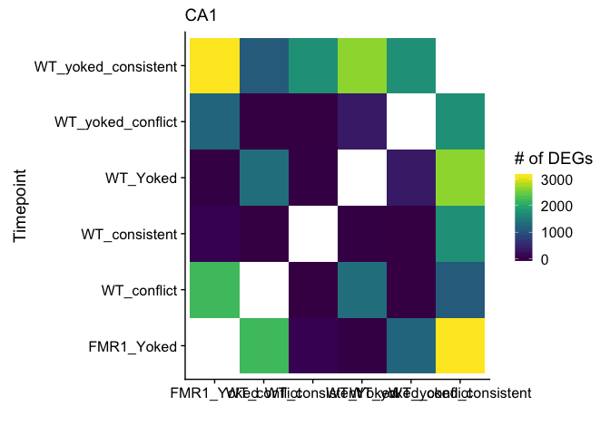
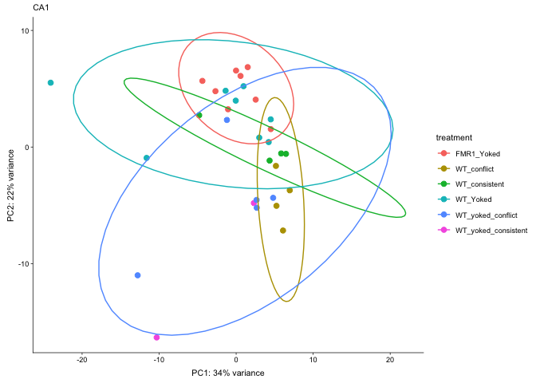
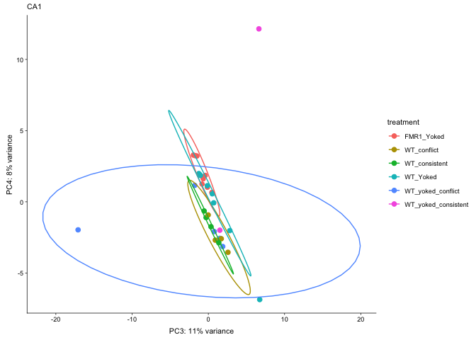
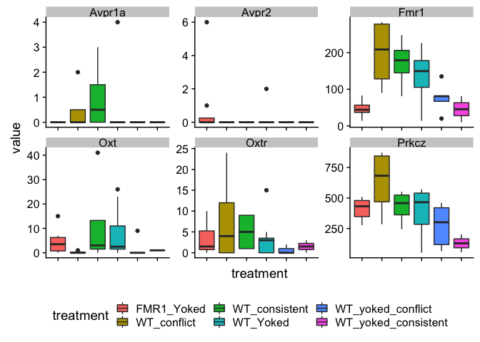
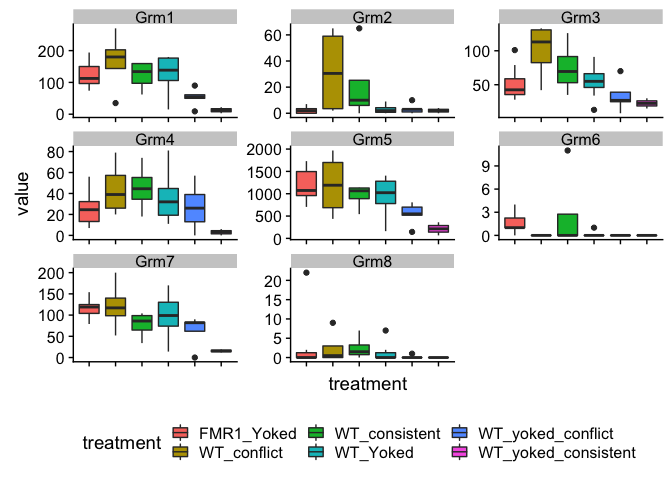

CA1 setup for deseq
-------------------

    # data from other rnaseq study
    # fiture to keep only ca1 samples
    int.colData <- read.csv("~/GitHub/IntegrativeProjectWT2015/data/02a_colData.csv", check.names = F)
    int.countData <- read.csv("~/GitHub/IntegrativeProjectWT2015/data/02a_countData.csv", check.names = F)

    int.colData <- int.colData %>%
          dplyr::filter(Punch == "CA1") %>%
          droplevels()

    names(int.countData)[1]<-"geneID"
    row.names(int.countData) <- int.countData$geneID

    savecols <- as.character(int.colData$RNAseqID) 
    savecols <- as.vector(savecols) 

    int.countData <- int.countData %>% dplyr::select(one_of(savecols)) 

    # data from this fmr1 study
    fmr.colData <- read.csv("../data/fmr1ColData.csv", header = T)
    fmr.countData <- read.csv("../data/fmr1CountData.csv", header = T, check.names = F, row.names = 1)

    # confirm proper subsetting
    print(ncol(fmr.countData) == nrow(fmr.colData))

    ## [1] TRUE

    print(ncol(int.countData) == nrow(int.colData))

    ## [1] TRUE

    # fill in details to make datasets mergable
    int.colData$Genotype <- "WT"
    fmr.colData$APA2 <- "yoked_consistent"
    fmr.colData$Punch <- "CA1"

    fmr.colData$treatment <- paste(fmr.colData$Genotype, fmr.colData$APA, sep = "_")
    int.colData$treatment <- paste(int.colData$Genotype, int.colData$APA, sep = "_")

    int.colData <- int.colData %>% select(RNAseqID, Mouse, Punch, Genotype, APA2, treatment)
    fmr.colData <- fmr.colData %>% select(RNAseqID, Mouse, Punch, Genotype, APA2, treatment)

    colData <- rbind(fmr.colData, int.colData)

    fmr.countData$geneID <- row.names(fmr.countData)
    int.countData$geneID <- row.names(int.countData)

    countData <- inner_join(fmr.countData, int.countData)

    ## Joining, by = "geneID"

    colData$Punch <- as.factor(colData$Punch)
    colData$treatment <- as.factor(colData$treatment)
    row.names(countData) <- countData$geneID
    countData$geneID <- NULL
    row.names(colData) <- colData$RNAseqID
    head(colData)

    ##         RNAseqID   Mouse Punch Genotype             APA2  treatment
    ## 16-116B  16-116B 16-116B   CA1     FMR1 yoked_consistent FMR1_Yoked
    ## 16-117D  16-117D 16-117D   CA1     FMR1 yoked_consistent FMR1_Yoked
    ## 16-118B  16-118B 16-118B   CA1     FMR1 yoked_consistent FMR1_Yoked
    ## 16-118D  16-118D 16-118D   CA1     FMR1 yoked_consistent FMR1_Yoked
    ## 16-119B  16-119B 16-119B   CA1     FMR1 yoked_consistent FMR1_Yoked
    ## 16-119D  16-119D 16-119D   CA1     FMR1 yoked_consistent FMR1_Yoked

     # check that row and col lenghts are equal
    print(ncol(countData) == nrow(colData))

    ## [1] TRUE

    dds <- DESeqDataSetFromMatrix(countData = countData,
                                  colData = colData,
                                  design = ~ treatment )
    dds <- dds[ rowSums(counts(dds)) > 2, ] ## pre-filter genes 
    dds <- DESeq(dds) # Differential expression analysis

    ## estimating size factors

    ## estimating dispersions

    ## gene-wise dispersion estimates

    ## mean-dispersion relationship

    ## final dispersion estimates

    ## fitting model and testing

    ## -- replacing outliers and refitting for 116 genes
    ## -- DESeq argument 'minReplicatesForReplace' = 7 
    ## -- original counts are preserved in counts(dds)

    ## estimating dispersions

    ## fitting model and testing

    vsd <- vst(dds, blind=FALSE) # variance stabilized 

    #create list of groups
    a <- levels(colData$treatment)
    b <- a

    numDEGs <- function(group1, group2){
      res <- results(dds, contrast = c("treatment", group1, group2), independentFiltering = T)
      sumpadj <- sum(res$padj < 0.1, na.rm = TRUE)
      return(sumpadj)
    }

    # comapre all contrasts, save to datafrmes
    dat=data.frame()
    for (i in a){
      for (j in b){
        if (i != j) {
          k <- paste(i,j, sep = "") #assigns usique rownames
          dat[k,1]<-i               
          dat[k,2]<-j
          dat[k,3]<- numDEGs(i,j) #caluculates number of DEGs
        }
      }
    }

    head(dat)

    ##                                        V1                  V2   V3
    ## FMR1_YokedWT_conflict          FMR1_Yoked         WT_conflict 2206
    ## FMR1_YokedWT_consistent        FMR1_Yoked       WT_consistent  134
    ## FMR1_YokedWT_Yoked             FMR1_Yoked            WT_Yoked    6
    ## FMR1_YokedWT_yoked_conflict    FMR1_Yoked   WT_yoked_conflict 1224
    ## FMR1_YokedWT_yoked_consistent  FMR1_Yoked WT_yoked_consistent 3103
    ## WT_conflictFMR1_Yoked         WT_conflict          FMR1_Yoked 2206

    # widen data to create table of degs
    rownames(dat) <- NULL #remove row names
    dat_wide <- spread(dat, V2, V3)
    print(dat_wide) 

    ##                    V1 FMR1_Yoked WT_conflict WT_consistent WT_Yoked
    ## 1          FMR1_Yoked         NA        2206           134        6
    ## 2         WT_conflict       2206          NA             0     1339
    ## 3       WT_consistent        134           0            NA        4
    ## 4            WT_Yoked          6        1339             4       NA
    ## 5   WT_yoked_conflict       1224           2             1      353
    ## 6 WT_yoked_consistent       3103        1108          1733     2645
    ##   WT_yoked_conflict WT_yoked_consistent
    ## 1              1224                3103
    ## 2                 2                1108
    ## 3                 1                1733
    ## 4               353                2645
    ## 5                NA                1738
    ## 6              1738                  NA

    # set factors
    allcontrasts <- dat %>%
      ggplot( aes(V1, V2)) +
        geom_tile(aes(fill = V3)) +
        scale_fill_viridis(na.value="#FFFFFF00") + 
        xlab(" ") + ylab("Timepoint") +
        labs(fill = "# of DEGs",
             subtitle = "CA1")
    plot(allcontrasts)

    # create the dataframe using my function pcadataframe
    pcadataframe <- function (object, intgroup = "condition", ntop = 500, returnData = FALSE) 
    {
      rv <- rowVars(assay(object))
      select <- order(rv, decreasing = TRUE)[seq_len(min(ntop, length(rv)))]
      pca <- prcomp(t(assay(object)[select, ]))
      percentVar <- pca$sdev^2/sum(pca$sdev^2)
      if (!all(intgroup %in% names(colData(object)))) {
        stop("the argument 'intgroup' should specify columns of colData(dds)")
      }
      intgroup.df <- as.data.frame(colData(object)[, intgroup, 
                                                   drop = FALSE])
      group <- if (length(intgroup) > 1) {
        factor(apply(intgroup.df, 1, paste, collapse = " : "))
      }
      else {
        colData(object)[[intgroup]]
      }
      d <- data.frame(PC1 = pca$x[, 1], PC2 = pca$x[, 2], PC3 = pca$x[, 3], PC4 = pca$x[, 4],PC5 = pca$x[, 5],PC6 = pca$x[, 6],group = group, 
                      intgroup.df, name = colnames(object))
      if (returnData) {
        attr(d, "percentVar") <- percentVar[1:6]
        return(d)
      }
    }

    pcadata <- pcadataframe(vsd, intgroup=c("treatment"), returnData=TRUE)
    percentVar <- round(100 * attr(pcadata, "percentVar"))
    percentVar

    ## [1] 34 22 11  8  4  3

    pca12 <- ggplot(pcadata, aes(PC1, PC2,color = treatment)) + 
      geom_point(size = 2, alpha = 1) +
      stat_ellipse(type = "t") +
      xlab(paste0("PC1: ", percentVar[1],"% variance")) +
      ylab(paste0("PC2: ", percentVar[2],"% variance")) +
      theme_cowplot(font_size = 8, line_size = 0.25) +
      labs(subtitle = "CA1")
    print(pca12)

    ## Too few points to calculate an ellipse

    ## Warning: Removed 1 rows containing missing values (geom_path).

    print(summary(aov(PC1 ~ treatment, data=pcadata)))

    ##             Df Sum Sq Mean Sq F value Pr(>F)
    ## treatment    5  282.5   56.50   1.272  0.307
    ## Residuals   25 1110.4   44.42

    print(TukeyHSD(aov(PC1 ~ treatment, data=pcadata), which = "treatment"))

    ##   Tukey multiple comparisons of means
    ##     95% family-wise confidence level
    ## 
    ## Fit: aov(formula = PC1 ~ treatment, data = pcadata)
    ## 
    ## $treatment
    ##                                             diff        lwr       upr
    ## WT_conflict-FMR1_Yoked                 5.7389442  -6.838506 18.316395
    ## WT_consistent-FMR1_Yoked               2.8417994  -9.735651 15.419250
    ## WT_Yoked-FMR1_Yoked                   -3.1781556 -13.447601  7.091290
    ## WT_yoked_conflict-FMR1_Yoked          -0.8933379 -12.602307 10.815631
    ## WT_yoked_consistent-FMR1_Yoked        -4.1323124 -20.369731 12.105106
    ## WT_consistent-WT_conflict             -2.8971448 -17.420333 11.626044
    ## WT_Yoked-WT_conflict                  -8.9170999 -21.494550  3.660350
    ## WT_yoked_conflict-WT_conflict         -6.6322821 -20.410189  7.145624
    ## WT_yoked_consistent-WT_conflict       -9.8712566 -27.658457  7.915944
    ## WT_Yoked-WT_consistent                -6.0199550 -18.597405  6.557495
    ## WT_yoked_conflict-WT_consistent       -3.7351373 -17.513044 10.042769
    ## WT_yoked_consistent-WT_consistent     -6.9741118 -24.761313 10.813089
    ## WT_yoked_conflict-WT_Yoked             2.2848178  -9.424151 13.993787
    ## WT_yoked_consistent-WT_Yoked          -0.9541567 -17.191575 15.283262
    ## WT_yoked_consistent-WT_yoked_conflict -3.2389745 -20.423043 13.945094
    ##                                           p adj
    ## WT_conflict-FMR1_Yoked                0.7230715
    ## WT_consistent-FMR1_Yoked              0.9806742
    ## WT_Yoked-FMR1_Yoked                   0.9280668
    ## WT_yoked_conflict-FMR1_Yoked          0.9998881
    ## WT_yoked_consistent-FMR1_Yoked        0.9676843
    ## WT_consistent-WT_conflict             0.9889102
    ## WT_Yoked-WT_conflict                  0.2795551
    ## WT_yoked_conflict-WT_conflict         0.6773533
    ## WT_yoked_consistent-WT_conflict       0.5380068
    ## WT_Yoked-WT_consistent                0.6824286
    ## WT_yoked_conflict-WT_consistent       0.9578672
    ## WT_yoked_consistent-WT_consistent     0.8287155
    ## WT_yoked_conflict-WT_Yoked            0.9899644
    ## WT_yoked_consistent-WT_Yoked          0.9999692
    ## WT_yoked_consistent-WT_yoked_conflict 0.9914299

    print(summary(aov(PC2 ~ treatment, data=pcadata))) 

    ##             Df Sum Sq Mean Sq F value   Pr(>F)    
    ## treatment    5  653.7  130.75   13.23 2.35e-06 ***
    ## Residuals   25  247.1    9.88                     
    ## ---
    ## Signif. codes:  0 '***' 0.001 '**' 0.01 '*' 0.05 '.' 0.1 ' ' 1

    print(TukeyHSD(aov(PC2 ~ treatment, data=pcadata), which = "treatment")) 

    ##   Tukey multiple comparisons of means
    ##     95% family-wise confidence level
    ## 
    ## Fit: aov(formula = PC2 ~ treatment, data = pcadata)
    ## 
    ## $treatment
    ##                                              diff        lwr       upr
    ## WT_conflict-FMR1_Yoked                 -9.2330594 -15.165964 -3.300155
    ## WT_consistent-FMR1_Yoked               -4.7437616 -10.676666  1.189143
    ## WT_Yoked-FMR1_Yoked                    -2.0744991  -6.918695  2.769697
    ## WT_yoked_conflict-FMR1_Yoked           -9.4059896 -14.929223 -3.882756
    ## WT_yoked_consistent-FMR1_Yoked        -15.4154373 -23.074784 -7.756091
    ## WT_consistent-WT_conflict               4.4892978  -2.361430 11.340025
    ## WT_Yoked-WT_conflict                    7.1585603   1.225656 13.091464
    ## WT_yoked_conflict-WT_conflict          -0.1729301  -6.672101  6.326241
    ## WT_yoked_consistent-WT_conflict        -6.1823779 -14.572771  2.208016
    ## WT_Yoked-WT_consistent                  2.6692625  -3.263642  8.602167
    ## WT_yoked_conflict-WT_consistent        -4.6622280 -11.161399  1.836943
    ## WT_yoked_consistent-WT_consistent     -10.6716757 -19.062069 -2.281282
    ## WT_yoked_conflict-WT_Yoked             -7.3314905 -12.854724 -1.808257
    ## WT_yoked_consistent-WT_Yoked          -13.3409382 -21.000285 -5.681592
    ## WT_yoked_consistent-WT_yoked_conflict  -6.0094477 -14.115338  2.096442
    ##                                           p adj
    ## WT_conflict-FMR1_Yoked                0.0008062
    ## WT_consistent-FMR1_Yoked              0.1732402
    ## WT_Yoked-FMR1_Yoked                   0.7716268
    ## WT_yoked_conflict-FMR1_Yoked          0.0002571
    ## WT_yoked_consistent-FMR1_Yoked        0.0000236
    ## WT_consistent-WT_conflict             0.3599386
    ## WT_Yoked-WT_conflict                  0.0116109
    ## WT_yoked_conflict-WT_conflict         0.9999994
    ## WT_yoked_consistent-WT_conflict       0.2428901
    ## WT_Yoked-WT_consistent                0.7343893
    ## WT_yoked_conflict-WT_consistent       0.2681528
    ## WT_yoked_consistent-WT_consistent     0.0071454
    ## WT_yoked_conflict-WT_Yoked            0.0047009
    ## WT_yoked_consistent-WT_Yoked          0.0001901
    ## WT_yoked_consistent-WT_yoked_conflict 0.2372677

    pca34 <- ggplot(pcadata, aes(PC3, PC4,color = treatment)) + 
      geom_point(size = 2, alpha = 1) +
      stat_ellipse(type = "t") +
      xlab(paste0("PC3: ", percentVar[3],"% variance")) +
      ylab(paste0("PC4: ", percentVar[4],"% variance")) +
      theme_cowplot(font_size = 8, line_size = 0.25) +
      labs(subtitle = "CA1")
    print(pca34)

    ## Too few points to calculate an ellipse

    ## Warning: Removed 1 rows containing missing values (geom_path).

    print(summary(aov(PC4 ~ treatment, data=pcadata))) 

    ##             Df Sum Sq Mean Sq F value Pr(>F)  
    ## treatment    5  133.2  26.632   3.519 0.0152 *
    ## Residuals   25  189.2   7.569                 
    ## ---
    ## Signif. codes:  0 '***' 0.001 '**' 0.01 '*' 0.05 '.' 0.1 ' ' 1

    print(TukeyHSD(aov(PC4 ~ treatment, data=pcadata), which = "treatment")) 

    ##   Tukey multiple comparisons of means
    ##     95% family-wise confidence level
    ## 
    ## Fit: aov(formula = PC4 ~ treatment, data = pcadata)
    ## 
    ## $treatment
    ##                                             diff        lwr        upr
    ## WT_conflict-FMR1_Yoked                -4.4555726 -9.6474796  0.7363344
    ## WT_consistent-FMR1_Yoked              -3.6110621 -8.8029691  1.5808449
    ## WT_Yoked-FMR1_Yoked                   -2.2101259 -6.4493002  2.0290485
    ## WT_yoked_conflict-FMR1_Yoked          -3.7397524 -8.5731548  1.0936500
    ## WT_yoked_consistent-FMR1_Yoked         3.0587207 -3.6440025  9.7614439
    ## WT_consistent-WT_conflict              0.8445105 -5.1505874  6.8396083
    ## WT_Yoked-WT_conflict                   2.2454467 -2.9464603  7.4373538
    ## WT_yoked_conflict-WT_conflict          0.7158202 -4.9716290  6.4032694
    ## WT_yoked_consistent-WT_conflict        7.5142933  0.1718280 14.8567586
    ## WT_Yoked-WT_consistent                 1.4009363 -3.7909708  6.5928433
    ## WT_yoked_conflict-WT_consistent       -0.1286902 -5.8161394  5.5587589
    ## WT_yoked_consistent-WT_consistent      6.6697828 -0.6726825 14.0122482
    ## WT_yoked_conflict-WT_Yoked            -1.5296265 -6.3630289  3.3037759
    ## WT_yoked_consistent-WT_Yoked           5.2688466 -1.4338766 11.9715697
    ## WT_yoked_consistent-WT_yoked_conflict  6.7984731 -0.2950224 13.8919685
    ##                                           p adj
    ## WT_conflict-FMR1_Yoked                0.1233086
    ## WT_consistent-FMR1_Yoked              0.2985265
    ## WT_Yoked-FMR1_Yoked                   0.6019172
    ## WT_yoked_conflict-FMR1_Yoked          0.1997996
    ## WT_yoked_consistent-FMR1_Yoked        0.7229794
    ## WT_consistent-WT_conflict             0.9978007
    ## WT_Yoked-WT_conflict                  0.7644876
    ## WT_yoked_conflict-WT_conflict         0.9987164
    ## WT_yoked_consistent-WT_conflict       0.0426918
    ## WT_Yoked-WT_consistent                0.9586781
    ## WT_yoked_conflict-WT_consistent       0.9999997
    ## WT_yoked_consistent-WT_consistent     0.0906478
    ## WT_yoked_conflict-WT_Yoked            0.9215169
    ## WT_yoked_consistent-WT_Yoked          0.1867457
    ## WT_yoked_consistent-WT_yoked_conflict 0.0658282

    candidates <- countData
    candidates$gene <- rownames(candidates)
    candidates <- candidates %>%
      filter(grepl("Oxt|Avp|Fmr1|Prkcz|Grm", gene)) 
    head(candidates)

    ##   16-116B 16-117D 16-118B 16-118D 16-119B 16-119D 16-120B 16-120D 16-122B
    ## 1       0       0       0       0       0       0       0       0       0
    ## 2      26       5       8      16      30      11      24      29      40
    ## 3       0       0       0       0       0       0       0       0       4
    ## 4       0       0       0       0       0       0       0       0       1
    ## 5       0       0       0       1       0       6       0       0       0
    ## 6      14      30      54      43      45      83      65      39     172
    ##   16-122D 16-123B 16-123D 16-124D 16-125B 16-125D 16-126B 143B-CA1-1
    ## 1       0       0       0       0       0       0       0          0
    ## 2      26       0       2       7       3      11      27         25
    ## 3       0       0       0       0       0       0       0          0
    ## 4       0       0       0       0       0       0       0          0
    ## 5       2       0       0       0       0       0       0          0
    ## 6     226      31     164     135      14     197     130         81
    ##   143C-CA1-1 143D-CA1-3 144A-CA1-2 144B-CA1-1 144C-CA1-2 145A-CA1-2
    ## 1          0          0          0          0          0          0
    ## 2         23         33         42         19         34         65
    ## 3          0          0          2          0          1          0
    ## 4          0          0          0          0          0          0
    ## 5          0          0          0          0          0          0
    ## 6        166         81        141        135        192        283
    ##   145B-CA1-1 146A-CA1-2 146B-CA1-2 146C-CA1-4 146D-CA1-3 147C-CA1-3
    ## 1          0          0          0          0          0          0
    ## 2         19         22          0          8          0         21
    ## 3          0          0          0          3          0          0
    ## 4          0          0          0          0          0          0
    ## 5          0          0          0          0          0          0
    ## 6         81         90         67         81         10        248
    ##   148A-CA1-3 148B-CA1-4   gene
    ## 1          0          0    Avp
    ## 2         73          0  Avpi1
    ## 3          0          0 Avpr1a
    ## 4          0          0 Avpr1b
    ## 5          0          0  Avpr2
    ## 6        276         20   Fmr1

    row.names(candidates) <- candidates$gene
    candidates <- as.data.frame(t(candidates))
    candidates$RNAseqID <- rownames(candidates)
    head(candidates)

    ##          Avp Avpi1 Avpr1a Avpr1b Avpr2 Fmr1 Fmr1nb Grm1 Grm2 Grm3 Grm4
    ## 16-116B    0    26      0      0     0   14      0   89    0   52   11
    ## 16-117D    0     5      0      0     0   30      0   74    3   34    7
    ## 16-118B    0     8      0      0     0   54      0  153    7   79   36
    ## 16-118D    0    16      0      0     1   43      0  107    0   41   28
    ## 16-119B    0    30      0      0     0   45      0  118    1   44   31
    ## 16-119D    0    11      0      0     6   83      0  194    3   36   14
    ##         Grm5 Grm6 Grm7 Grm8  Oxt Oxtr Prkcz RNAseqID
    ## 16-116B 1080    3  154    0    6   10   475  16-116B
    ## 16-117D  705    4   79    2   15    2   277  16-117D
    ## 16-118B 1730    0  119    1    5    6   509  16-118B
    ## 16-118D  879    1  106    0    0    0   348  16-118D
    ## 16-119B  985    1  120    0    0    0   492  16-119B
    ## 16-119D 1427    1  139    0    2    5   439  16-119D

    candidates <- candidates %>% gather(gene, value, -RNAseqID)  %>% # https://tidyr.tidyverse.org/reference/gather.html
      filter(RNAseqID != "gene")

    ## Warning: attributes are not identical across measure variables;
    ## they will be dropped

    candidates$value <- as.numeric(candidates$value)
    head(candidates)

    ##   RNAseqID gene value
    ## 1  16-116B  Avp     0
    ## 2  16-117D  Avp     0
    ## 3  16-118B  Avp     0
    ## 4  16-118D  Avp     0
    ## 5  16-119B  Avp     0
    ## 6  16-119D  Avp     0

    candidatecounts <- full_join(candidates, colData)

    ## Joining, by = "RNAseqID"

    ## Warning: Column `RNAseqID` joining character vector and factor, coercing
    ## into character vector

    head(candidatecounts)

    ##   RNAseqID gene value   Mouse Punch Genotype             APA2  treatment
    ## 1  16-116B  Avp     0 16-116B   CA1     FMR1 yoked_consistent FMR1_Yoked
    ## 2  16-117D  Avp     0 16-117D   CA1     FMR1 yoked_consistent FMR1_Yoked
    ## 3  16-118B  Avp     0 16-118B   CA1     FMR1 yoked_consistent FMR1_Yoked
    ## 4  16-118D  Avp     0 16-118D   CA1     FMR1 yoked_consistent FMR1_Yoked
    ## 5  16-119B  Avp     0 16-119B   CA1     FMR1 yoked_consistent FMR1_Yoked
    ## 6  16-119D  Avp     0 16-119D   CA1     FMR1 yoked_consistent FMR1_Yoked

    candidatecounts$faketime <- as.numeric(candidatecounts$treatment)
    head(candidatecounts, 100)

    ##       RNAseqID   gene value   Mouse Punch Genotype             APA2
    ## 1      16-116B    Avp     0 16-116B   CA1     FMR1 yoked_consistent
    ## 2      16-117D    Avp     0 16-117D   CA1     FMR1 yoked_consistent
    ## 3      16-118B    Avp     0 16-118B   CA1     FMR1 yoked_consistent
    ## 4      16-118D    Avp     0 16-118D   CA1     FMR1 yoked_consistent
    ## 5      16-119B    Avp     0 16-119B   CA1     FMR1 yoked_consistent
    ## 6      16-119D    Avp     0 16-119D   CA1     FMR1 yoked_consistent
    ## 7      16-120B    Avp     0 16-120B   CA1     FMR1 yoked_consistent
    ## 8      16-120D    Avp     0 16-120D   CA1     FMR1 yoked_consistent
    ## 9      16-122B    Avp     0 16-122B   CA1       WT yoked_consistent
    ## 10     16-122D    Avp     0 16-122D   CA1       WT yoked_consistent
    ## 11     16-123B    Avp     0 16-123B   CA1       WT yoked_consistent
    ## 12     16-123D    Avp     0 16-123D   CA1       WT yoked_consistent
    ## 13     16-124D    Avp     0 16-124D   CA1       WT yoked_consistent
    ## 14     16-125B    Avp     0 16-125B   CA1       WT yoked_consistent
    ## 15     16-125D    Avp     0 16-125D   CA1       WT yoked_consistent
    ## 16     16-126B    Avp     0 16-126B   CA1       WT yoked_consistent
    ## 17  143B-CA1-1    Avp     0 15-143B   CA1       WT   yoked_conflict
    ## 18  143C-CA1-1    Avp     0 15-143C   CA1       WT       consistent
    ## 19  143D-CA1-3    Avp     0 15-143D   CA1       WT yoked_consistent
    ## 20  144A-CA1-2    Avp     0 15-144A   CA1       WT         conflict
    ## 21  144B-CA1-1    Avp     0 15-144B   CA1       WT   yoked_conflict
    ## 22  144C-CA1-2    Avp     0 15-144C   CA1       WT       consistent
    ## 23  145A-CA1-2    Avp     0 15-145A   CA1       WT         conflict
    ## 24  145B-CA1-1    Avp     0 15-145B   CA1       WT   yoked_conflict
    ## 25  146A-CA1-2    Avp     0 15-146A   CA1       WT         conflict
    ## 26  146B-CA1-2    Avp     0 15-146B   CA1       WT   yoked_conflict
    ## 27  146C-CA1-4    Avp     0 15-146C   CA1       WT       consistent
    ## 28  146D-CA1-3    Avp     0 15-146D   CA1       WT yoked_consistent
    ## 29  147C-CA1-3    Avp     0 15-147C   CA1       WT       consistent
    ## 30  148A-CA1-3    Avp     0 15-148A   CA1       WT         conflict
    ## 31  148B-CA1-4    Avp     0 15-148B   CA1       WT   yoked_conflict
    ## 32     16-116B  Avpi1    26 16-116B   CA1     FMR1 yoked_consistent
    ## 33     16-117D  Avpi1     5 16-117D   CA1     FMR1 yoked_consistent
    ## 34     16-118B  Avpi1     8 16-118B   CA1     FMR1 yoked_consistent
    ## 35     16-118D  Avpi1    16 16-118D   CA1     FMR1 yoked_consistent
    ## 36     16-119B  Avpi1    30 16-119B   CA1     FMR1 yoked_consistent
    ## 37     16-119D  Avpi1    11 16-119D   CA1     FMR1 yoked_consistent
    ## 38     16-120B  Avpi1    24 16-120B   CA1     FMR1 yoked_consistent
    ## 39     16-120D  Avpi1    29 16-120D   CA1     FMR1 yoked_consistent
    ## 40     16-122B  Avpi1    40 16-122B   CA1       WT yoked_consistent
    ## 41     16-122D  Avpi1    26 16-122D   CA1       WT yoked_consistent
    ## 42     16-123B  Avpi1     0 16-123B   CA1       WT yoked_consistent
    ## 43     16-123D  Avpi1     2 16-123D   CA1       WT yoked_consistent
    ## 44     16-124D  Avpi1     7 16-124D   CA1       WT yoked_consistent
    ## 45     16-125B  Avpi1     3 16-125B   CA1       WT yoked_consistent
    ## 46     16-125D  Avpi1    11 16-125D   CA1       WT yoked_consistent
    ## 47     16-126B  Avpi1    27 16-126B   CA1       WT yoked_consistent
    ## 48  143B-CA1-1  Avpi1    25 15-143B   CA1       WT   yoked_conflict
    ## 49  143C-CA1-1  Avpi1    23 15-143C   CA1       WT       consistent
    ## 50  143D-CA1-3  Avpi1    33 15-143D   CA1       WT yoked_consistent
    ## 51  144A-CA1-2  Avpi1    42 15-144A   CA1       WT         conflict
    ## 52  144B-CA1-1  Avpi1    19 15-144B   CA1       WT   yoked_conflict
    ## 53  144C-CA1-2  Avpi1    34 15-144C   CA1       WT       consistent
    ## 54  145A-CA1-2  Avpi1    65 15-145A   CA1       WT         conflict
    ## 55  145B-CA1-1  Avpi1    19 15-145B   CA1       WT   yoked_conflict
    ## 56  146A-CA1-2  Avpi1    22 15-146A   CA1       WT         conflict
    ## 57  146B-CA1-2  Avpi1     0 15-146B   CA1       WT   yoked_conflict
    ## 58  146C-CA1-4  Avpi1     8 15-146C   CA1       WT       consistent
    ## 59  146D-CA1-3  Avpi1     0 15-146D   CA1       WT yoked_consistent
    ## 60  147C-CA1-3  Avpi1    21 15-147C   CA1       WT       consistent
    ## 61  148A-CA1-3  Avpi1    73 15-148A   CA1       WT         conflict
    ## 62  148B-CA1-4  Avpi1     0 15-148B   CA1       WT   yoked_conflict
    ## 63     16-116B Avpr1a     0 16-116B   CA1     FMR1 yoked_consistent
    ## 64     16-117D Avpr1a     0 16-117D   CA1     FMR1 yoked_consistent
    ## 65     16-118B Avpr1a     0 16-118B   CA1     FMR1 yoked_consistent
    ## 66     16-118D Avpr1a     0 16-118D   CA1     FMR1 yoked_consistent
    ## 67     16-119B Avpr1a     0 16-119B   CA1     FMR1 yoked_consistent
    ## 68     16-119D Avpr1a     0 16-119D   CA1     FMR1 yoked_consistent
    ## 69     16-120B Avpr1a     0 16-120B   CA1     FMR1 yoked_consistent
    ## 70     16-120D Avpr1a     0 16-120D   CA1     FMR1 yoked_consistent
    ## 71     16-122B Avpr1a     4 16-122B   CA1       WT yoked_consistent
    ## 72     16-122D Avpr1a     0 16-122D   CA1       WT yoked_consistent
    ## 73     16-123B Avpr1a     0 16-123B   CA1       WT yoked_consistent
    ## 74     16-123D Avpr1a     0 16-123D   CA1       WT yoked_consistent
    ## 75     16-124D Avpr1a     0 16-124D   CA1       WT yoked_consistent
    ## 76     16-125B Avpr1a     0 16-125B   CA1       WT yoked_consistent
    ## 77     16-125D Avpr1a     0 16-125D   CA1       WT yoked_consistent
    ## 78     16-126B Avpr1a     0 16-126B   CA1       WT yoked_consistent
    ## 79  143B-CA1-1 Avpr1a     0 15-143B   CA1       WT   yoked_conflict
    ## 80  143C-CA1-1 Avpr1a     0 15-143C   CA1       WT       consistent
    ## 81  143D-CA1-3 Avpr1a     0 15-143D   CA1       WT yoked_consistent
    ## 82  144A-CA1-2 Avpr1a     2 15-144A   CA1       WT         conflict
    ## 83  144B-CA1-1 Avpr1a     0 15-144B   CA1       WT   yoked_conflict
    ## 84  144C-CA1-2 Avpr1a     1 15-144C   CA1       WT       consistent
    ## 85  145A-CA1-2 Avpr1a     0 15-145A   CA1       WT         conflict
    ## 86  145B-CA1-1 Avpr1a     0 15-145B   CA1       WT   yoked_conflict
    ## 87  146A-CA1-2 Avpr1a     0 15-146A   CA1       WT         conflict
    ## 88  146B-CA1-2 Avpr1a     0 15-146B   CA1       WT   yoked_conflict
    ## 89  146C-CA1-4 Avpr1a     3 15-146C   CA1       WT       consistent
    ## 90  146D-CA1-3 Avpr1a     0 15-146D   CA1       WT yoked_consistent
    ## 91  147C-CA1-3 Avpr1a     0 15-147C   CA1       WT       consistent
    ## 92  148A-CA1-3 Avpr1a     0 15-148A   CA1       WT         conflict
    ## 93  148B-CA1-4 Avpr1a     0 15-148B   CA1       WT   yoked_conflict
    ## 94     16-116B Avpr1b     0 16-116B   CA1     FMR1 yoked_consistent
    ## 95     16-117D Avpr1b     0 16-117D   CA1     FMR1 yoked_consistent
    ## 96     16-118B Avpr1b     0 16-118B   CA1     FMR1 yoked_consistent
    ## 97     16-118D Avpr1b     0 16-118D   CA1     FMR1 yoked_consistent
    ## 98     16-119B Avpr1b     0 16-119B   CA1     FMR1 yoked_consistent
    ## 99     16-119D Avpr1b     0 16-119D   CA1     FMR1 yoked_consistent
    ## 100    16-120B Avpr1b     0 16-120B   CA1     FMR1 yoked_consistent
    ##               treatment faketime
    ## 1            FMR1_Yoked        1
    ## 2            FMR1_Yoked        1
    ## 3            FMR1_Yoked        1
    ## 4            FMR1_Yoked        1
    ## 5            FMR1_Yoked        1
    ## 6            FMR1_Yoked        1
    ## 7            FMR1_Yoked        1
    ## 8            FMR1_Yoked        1
    ## 9              WT_Yoked        4
    ## 10             WT_Yoked        4
    ## 11             WT_Yoked        4
    ## 12             WT_Yoked        4
    ## 13             WT_Yoked        4
    ## 14             WT_Yoked        4
    ## 15             WT_Yoked        4
    ## 16             WT_Yoked        4
    ## 17    WT_yoked_conflict        5
    ## 18        WT_consistent        3
    ## 19  WT_yoked_consistent        6
    ## 20          WT_conflict        2
    ## 21    WT_yoked_conflict        5
    ## 22        WT_consistent        3
    ## 23          WT_conflict        2
    ## 24    WT_yoked_conflict        5
    ## 25          WT_conflict        2
    ## 26    WT_yoked_conflict        5
    ## 27        WT_consistent        3
    ## 28  WT_yoked_consistent        6
    ## 29        WT_consistent        3
    ## 30          WT_conflict        2
    ## 31    WT_yoked_conflict        5
    ## 32           FMR1_Yoked        1
    ## 33           FMR1_Yoked        1
    ## 34           FMR1_Yoked        1
    ## 35           FMR1_Yoked        1
    ## 36           FMR1_Yoked        1
    ## 37           FMR1_Yoked        1
    ## 38           FMR1_Yoked        1
    ## 39           FMR1_Yoked        1
    ## 40             WT_Yoked        4
    ## 41             WT_Yoked        4
    ## 42             WT_Yoked        4
    ## 43             WT_Yoked        4
    ## 44             WT_Yoked        4
    ## 45             WT_Yoked        4
    ## 46             WT_Yoked        4
    ## 47             WT_Yoked        4
    ## 48    WT_yoked_conflict        5
    ## 49        WT_consistent        3
    ## 50  WT_yoked_consistent        6
    ## 51          WT_conflict        2
    ## 52    WT_yoked_conflict        5
    ## 53        WT_consistent        3
    ## 54          WT_conflict        2
    ## 55    WT_yoked_conflict        5
    ## 56          WT_conflict        2
    ## 57    WT_yoked_conflict        5
    ## 58        WT_consistent        3
    ## 59  WT_yoked_consistent        6
    ## 60        WT_consistent        3
    ## 61          WT_conflict        2
    ## 62    WT_yoked_conflict        5
    ## 63           FMR1_Yoked        1
    ## 64           FMR1_Yoked        1
    ## 65           FMR1_Yoked        1
    ## 66           FMR1_Yoked        1
    ## 67           FMR1_Yoked        1
    ## 68           FMR1_Yoked        1
    ## 69           FMR1_Yoked        1
    ## 70           FMR1_Yoked        1
    ## 71             WT_Yoked        4
    ## 72             WT_Yoked        4
    ## 73             WT_Yoked        4
    ## 74             WT_Yoked        4
    ## 75             WT_Yoked        4
    ## 76             WT_Yoked        4
    ## 77             WT_Yoked        4
    ## 78             WT_Yoked        4
    ## 79    WT_yoked_conflict        5
    ## 80        WT_consistent        3
    ## 81  WT_yoked_consistent        6
    ## 82          WT_conflict        2
    ## 83    WT_yoked_conflict        5
    ## 84        WT_consistent        3
    ## 85          WT_conflict        2
    ## 86    WT_yoked_conflict        5
    ## 87          WT_conflict        2
    ## 88    WT_yoked_conflict        5
    ## 89        WT_consistent        3
    ## 90  WT_yoked_consistent        6
    ## 91        WT_consistent        3
    ## 92          WT_conflict        2
    ## 93    WT_yoked_conflict        5
    ## 94           FMR1_Yoked        1
    ## 95           FMR1_Yoked        1
    ## 96           FMR1_Yoked        1
    ## 97           FMR1_Yoked        1
    ## 98           FMR1_Yoked        1
    ## 99           FMR1_Yoked        1
    ## 100          FMR1_Yoked        1

    candidatecounts %>%
      filter(gene %in% c( "Avpr1a", "Avpr2", "Fmr1", "Oxt", "Oxtr", "Prkcz")) %>%
      ggplot(aes(x = treatment, y = value, fill = treatment)) +
      geom_boxplot() +
      facet_wrap(~gene, scales = "free") +
      theme(axis.text.x = element_blank(),
            legend.position = "bottom")

    candidatecounts %>%
      filter(grepl("Grm", gene)) %>%
      ggplot(aes(x = treatment, y = value, fill = treatment)) +
      geom_boxplot() +
      facet_wrap(~gene, scales = "free") +
      theme(axis.text.x = element_blank(),
            legend.position = "bottom")

    head(colData)

    ##         RNAseqID   Mouse Punch Genotype             APA2  treatment
    ## 16-116B  16-116B 16-116B   CA1     FMR1 yoked_consistent FMR1_Yoked
    ## 16-117D  16-117D 16-117D   CA1     FMR1 yoked_consistent FMR1_Yoked
    ## 16-118B  16-118B 16-118B   CA1     FMR1 yoked_consistent FMR1_Yoked
    ## 16-118D  16-118D 16-118D   CA1     FMR1 yoked_consistent FMR1_Yoked
    ## 16-119B  16-119B 16-119B   CA1     FMR1 yoked_consistent FMR1_Yoked
    ## 16-119D  16-119D 16-119D   CA1     FMR1 yoked_consistent FMR1_Yoked

    write.csv(colData, "../results/02_RNAseqCA1integrative/colData.csv")

    head(countData)

    ##               16-116B 16-117D 16-118B 16-118D 16-119B 16-119D 16-120B
    ## 0610007P14Rik      38      37      26      41      50      38      31
    ## 0610009B22Rik      20      16      11      23      19      15      17
    ## 0610009L18Rik       5       0       2      10       2       1       3
    ## 0610009O20Rik      40      35      86      28      62      60      93
    ## 0610010F05Rik      63      71     129      79      84      98     101
    ## 0610010K14Rik      28      10      14      15      28      20      26
    ##               16-120D 16-122B 16-122D 16-123B 16-123D 16-124D 16-125B
    ## 0610007P14Rik      38      57      70       8      44      39       4
    ## 0610009B22Rik       3      50      31       0      19      25       0
    ## 0610009L18Rik       0       8       6       0       5       3       0
    ## 0610009O20Rik      94      69      89       4      62      40      13
    ## 0610010F05Rik      84     111     119      20      98      98       7
    ## 0610010K14Rik       5      18      33       3      16      32       4
    ##               16-125D 16-126B 143B-CA1-1 143C-CA1-1 143D-CA1-3 144A-CA1-2
    ## 0610007P14Rik      30      47         60         38         28         80
    ## 0610009B22Rik      10      22         21         19          0         30
    ## 0610009L18Rik       0      18         10          2          0          9
    ## 0610009O20Rik      61      92         44         76         25         95
    ## 0610010F05Rik      69      76         54         57         39        119
    ## 0610010K14Rik      15      40         14         23         21         32
    ##               144B-CA1-1 144C-CA1-2 145A-CA1-2 145B-CA1-1 146A-CA1-2
    ## 0610007P14Rik         72         63        133         51         29
    ## 0610009B22Rik         14         15         36         15         15
    ## 0610009L18Rik          1          2         21          3          8
    ## 0610009O20Rik         49         89         96        124         68
    ## 0610010F05Rik         75         95        179         30         69
    ## 0610010K14Rik         41         38         34         27         33
    ##               146B-CA1-2 146C-CA1-4 146D-CA1-3 147C-CA1-3 148A-CA1-3
    ## 0610007P14Rik         13         38         11         69        135
    ## 0610009B22Rik          6          7          3         17         59
    ## 0610009L18Rik          0          9          0          2         16
    ## 0610009O20Rik         16         31          1         58        162
    ## 0610010F05Rik         53         41         10        149        198
    ## 0610010K14Rik         11          7         10         46         60
    ##               148B-CA1-4
    ## 0610007P14Rik          5
    ## 0610009B22Rik          0
    ## 0610009L18Rik          0
    ## 0610009O20Rik          0
    ## 0610010F05Rik          4
    ## 0610010K14Rik          0

    write.csv(countData, "../results/02_RNAseqCA1integrative/countData.csv")

    head(dat)

    ##            V1                  V2   V3
    ## 1  FMR1_Yoked         WT_conflict 2206
    ## 2  FMR1_Yoked       WT_consistent  134
    ## 3  FMR1_Yoked            WT_Yoked    6
    ## 4  FMR1_Yoked   WT_yoked_conflict 1224
    ## 5  FMR1_Yoked WT_yoked_consistent 3103
    ## 6 WT_conflict          FMR1_Yoked 2206

    write.csv(dat, "../results/02_RNAseqCA1integrative/dat.csv")

    head(dat_wide)

    ##                    V1 FMR1_Yoked WT_conflict WT_consistent WT_Yoked
    ## 1          FMR1_Yoked         NA        2206           134        6
    ## 2         WT_conflict       2206          NA             0     1339
    ## 3       WT_consistent        134           0            NA        4
    ## 4            WT_Yoked          6        1339             4       NA
    ## 5   WT_yoked_conflict       1224           2             1      353
    ## 6 WT_yoked_consistent       3103        1108          1733     2645
    ##   WT_yoked_conflict WT_yoked_consistent
    ## 1              1224                3103
    ## 2                 2                1108
    ## 3                 1                1733
    ## 4               353                2645
    ## 5                NA                1738
    ## 6              1738                  NA

    write.csv(dat_wide, "../results/02_RNAseqCA1integrative/dat_wide.csv")

    head(assay(dds))

    ##               16-116B 16-117D 16-118B 16-118D 16-119B 16-119D 16-120B
    ## 0610007P14Rik      38      37      26      41      50      38      31
    ## 0610009B22Rik      20      16      11      23      19      15      17
    ## 0610009L18Rik       5       0       2      10       2       1       3
    ## 0610009O20Rik      40      35      86      28      62      60      93
    ## 0610010F05Rik      63      71     129      79      84      98     101
    ## 0610010K14Rik      28      10      14      15      28      20      26
    ##               16-120D 16-122B 16-122D 16-123B 16-123D 16-124D 16-125B
    ## 0610007P14Rik      38      57      70       8      44      39       4
    ## 0610009B22Rik       3      50      31       0      19      25       0
    ## 0610009L18Rik       0       8       6       0       5       3       0
    ## 0610009O20Rik      94      69      89       4      62      40      13
    ## 0610010F05Rik      84     111     119      20      98      98       7
    ## 0610010K14Rik       5      18      33       3      16      32       4
    ##               16-125D 16-126B 143B-CA1-1 143C-CA1-1 143D-CA1-3 144A-CA1-2
    ## 0610007P14Rik      30      47         60         38         28         80
    ## 0610009B22Rik      10      22         21         19          0         30
    ## 0610009L18Rik       0      18         10          2          0          9
    ## 0610009O20Rik      61      92         44         76         25         95
    ## 0610010F05Rik      69      76         54         57         39        119
    ## 0610010K14Rik      15      40         14         23         21         32
    ##               144B-CA1-1 144C-CA1-2 145A-CA1-2 145B-CA1-1 146A-CA1-2
    ## 0610007P14Rik         72         63        133         51         29
    ## 0610009B22Rik         14         15         36         15         15
    ## 0610009L18Rik          1          2         21          3          8
    ## 0610009O20Rik         49         89         96        124         68
    ## 0610010F05Rik         75         95        179         30         69
    ## 0610010K14Rik         41         38         34         27         33
    ##               146B-CA1-2 146C-CA1-4 146D-CA1-3 147C-CA1-3 148A-CA1-3
    ## 0610007P14Rik         13         38         11         69        135
    ## 0610009B22Rik          6          7          3         17         59
    ## 0610009L18Rik          0          9          0          2         16
    ## 0610009O20Rik         16         31          1         58        162
    ## 0610010F05Rik         53         41         10        149        198
    ## 0610010K14Rik         11          7         10         46         60
    ##               148B-CA1-4
    ## 0610007P14Rik          5
    ## 0610009B22Rik          0
    ## 0610009L18Rik          0
    ## 0610009O20Rik          0
    ## 0610010F05Rik          4
    ## 0610010K14Rik          0

    DESeq2counts <- assay(dds)
    write.csv(DESeq2counts, "../results/02_RNAseqCA1integrative/DESeq2counts.csv")

    head(pcadata)

    ##                PC1      PC2        PC3       PC4        PC5         PC6
    ## 16-116B -2.6858513 4.788929 -0.6716944 1.6197478 -0.7016319  1.38356814
    ## 16-117D -4.3810858 5.671669 -0.1307031 1.0231656 -0.3768392 -1.01522406
    ## 16-118B  1.5053778 6.849680 -1.7334143 3.2424054  0.1188798  0.01448214
    ## 16-118D  2.5377283 4.065300 -0.8279038 1.2491281  0.7909833 -1.05664965
    ## 16-119B  4.4989988 1.537276  0.4615994 0.6519058  1.4282521 -1.38050655
    ## 16-119D  0.5712649 6.095683 -1.9554157 3.2810211 -0.2255447  0.46008660
    ##              group  treatment    name
    ## 16-116B FMR1_Yoked FMR1_Yoked 16-116B
    ## 16-117D FMR1_Yoked FMR1_Yoked 16-117D
    ## 16-118B FMR1_Yoked FMR1_Yoked 16-118B
    ## 16-118D FMR1_Yoked FMR1_Yoked 16-118D
    ## 16-119B FMR1_Yoked FMR1_Yoked 16-119B
    ## 16-119D FMR1_Yoked FMR1_Yoked 16-119D

    write.csv(pcadata, "../results/02_RNAseqCA1integrative/pcadata.csv")
