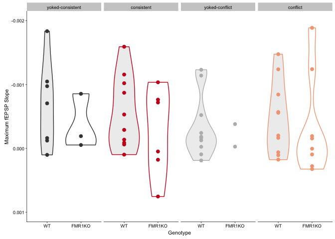

    library(ggplot2)
    library(reshape2)
    library(tidyr) # for drop na function
    library(cowplot)
    library(dplyr)
    library(magrittr)  # for function function "%<>%"

    colorvalAPA2 <-  c( "#404040","#ca0020", "#bababa", "#f4a582")

Read and wrangle data

    ephys2 <- read.csv("../data/Ephy_forDataAnalysisV2.csv", header=T, na.strings=c(""), stringsAsFactors = FALSE)

    ## rename columns 
    names(ephys2)[names(ephys2)=="Peak..V."] <- "Peak V"
    names(ephys2)[names(ephys2)=="training"] <- "group"

    ## new cols
    ephys2$APA <- ifelse(grepl("TTT", ephys2$group), "consistent", 
                         ifelse(grepl("TCT", ephys2$group), "conflict",
                                ifelse(grepl("TTY", ephys2$group), "control",
                                       ifelse(grepl("TCY", ephys2$group), "control", NA))))

    ephys2$APA2 <- ifelse(grepl("TTT", ephys2$group), "consistent", 
                          ifelse(grepl("TCT", ephys2$group), "conflict",
                                 ifelse(grepl("TTY", ephys2$group), "yoked-consistent",
                                        ifelse(grepl("TCY", ephys2$group), "yoked-conflict", NA))))

    ephys2$Year <- ifelse(grepl("151", ephys2$ID), "2015", 
                          ifelse(grepl("16-", ephys2$ID), "2016", NA))

    names(ephys2)

    ##  [1] "group"    "ID"       "V0"       "V10"      "V15"      "V20"     
    ##  [7] "V25"      "V30"      "V35"      "V40"      "V45"      "V50"     
    ## [13] "V60"      "Peak V"   "Genotype" "APA"      "APA2"     "Year"

    ## reorder, drop old group coloumn
    ephys2 <- ephys2[c(2,15:18,3:14)]

    ### Drop the voltages with very little recording and the Vmax
    ephys2 <- ephys2[c(-10,-12, -16, -17)]

    ## make characters either factors or numbers, as appropriate
    colsfactor = c(1:5)
    #colsnumeric = c(18)
    ephys2[,colsfactor] %<>% lapply(function(x) as.factor(as.factor(x)))
    #ephys2[,colsnumeric] %<>% lapply(function(x) as.numeric(as.integer(x)))

    ## make with max column with max i/o
    ephys2$min <- apply(ephys2[c(7:13)], 1, min,na.rm=TRUE)
    ephys2$max <- apply(ephys2[c(7:13)], 1, max,na.rm=TRUE)

    ## prep levels for visualization
    ephys2$Genotype <- factor(ephys2$Genotype, 
                              levels = c("WT", "FMR1KO"))
    ephys2$APA <- factor(ephys2$APA, 
                         levels = c("control", "consistent", "conflict"))

    ephys2$APA2 <- factor(ephys2$APA2,
                          levels = c("yoked-consistent","consistent","yoked-conflict", "conflict"))

    ## make long and tidy
    ephys2_long <- melt(ephys2, id = c(1:5))

    ## add numeric for stat smooth
    ephys2_long$variablenumeric <- ifelse((ephys2_long$variable == "V0"), "1", 
                                          ifelse(grepl("V10", ephys2_long$variable ), "2",
                                                 ifelse(grepl("V15", ephys2_long$variable ), "3",
                                                        ifelse(grepl("V20", ephys2_long$variable), "4", 
                                                               ifelse(grepl("V30", ephys2_long$variable), "5",
                                                                      ifelse(grepl("V40", ephys2_long$variable), "6",
                                                                             ifelse(grepl("V50", ephys2_long$variable), "7", NA)))))))
    ephys2_long <- ephys2_long %>% drop_na()

    ephys2_long$variablenumeric <- as.numeric(ephys2_long$variablenumeric)

    ephys2_long$Genotype <- factor(ephys2_long$Genotype, 
                                   levels = c("WT", "FMR1KO"))
    ephys2_long$APA <- factor(ephys2_long$APA, 
                              levels = c("control", "consistent", "conflict"))

    ephys2summaryNum <- dplyr::summarise(group_by(ephys2, Genotype, APA2), m = mean(min), se = sd(min)/sqrt(length(min)), len = length(min))
    ephys2summaryNum <- as.data.frame(ephys2summaryNum)
    levels(ephys2summaryNum$Genotype) <- c("WT","FMR1KO")

    ephys2$genoAPA <- as.factor(paste(ephys2$Genotype,ephys2$APA2,sep="_"))

Plot of fEPSP slop by treatment group and genotype

    # this was the third plot I made. Name left of from that
    plot3 <- ephys2 %>% 
      ggplot(aes(x=Genotype, y=max, color=APA2)) +
      geom_violin(aes(fill = factor(Genotype))) +
      geom_point(size=2) +
      scale_y_continuous(trans = "reverse",
                         limits = c(0.001 , -0.002)) + 
      background_grid(major = "xy", minor = "none") + 
      theme_cowplot(font_size = 8, line_size = 0.25) + 
      scale_color_manual(values = colorvalAPA2) +
      scale_fill_manual(values=alpha(c( "#404040","white"), .1)) +
      labs(y = "Maximum fEPSP Slope", x = "Genotype") +
      facet_wrap(~APA2, nrow = 1) + 
      theme(legend.position="none")
    plot3

    pdf(file="~/Github/FMR1CA1rnaseq/figures/04_ephys/ephys3.pdf", width=6, height=2.5)
    plot(plot3)
    dev.off()

    ## quartz_off_screen 
    ##                 2

Statistics

    aov1 <- aov(min ~ Genotype, data=ephys2)
    summary(aov1) 

    ##             Df    Sum Sq   Mean Sq F value Pr(>F)
    ## Genotype     1 0.0000018 1.797e-06   0.123  0.728
    ## Residuals   54 0.0007917 1.466e-05

    aov1 <- aov(min ~ Genotype * APA2, data=ephys2)
    summary(aov1) 

    ##               Df    Sum Sq   Mean Sq F value Pr(>F)
    ## Genotype       1 0.0000018 1.797e-06   0.113  0.738
    ## APA2           3 0.0000138 4.594e-06   0.289  0.833
    ## Genotype:APA2  3 0.0000145 4.838e-06   0.304  0.822
    ## Residuals     48 0.0007634 1.591e-05

    TukeyHSD(aov1)

    ##   Tukey multiple comparisons of means
    ##     95% family-wise confidence level
    ## 
    ## Fit: aov(formula = min ~ Genotype * APA2, data = ephys2)
    ## 
    ## $Genotype
    ##                    diff          lwr         upr     p adj
    ## FMR1KO-WT -0.0003783312 -0.002641506 0.001884843 0.7382494
    ## 
    ## $APA2
    ##                                          diff          lwr         upr
    ## consistent-yoked-consistent     -0.0005857119 -0.004864304 0.003692880
    ## yoked-conflict-yoked-consistent  0.0008036782 -0.003740914 0.005348270
    ## conflict-yoked-consistent       -0.0001010843 -0.004287255 0.004085086
    ## yoked-conflict-consistent        0.0013893901 -0.002663852 0.005442632
    ## conflict-consistent              0.0004846276 -0.003162218 0.004131473
    ## conflict-yoked-conflict         -0.0009047625 -0.004860322 0.003050797
    ##                                     p adj
    ## consistent-yoked-consistent     0.9832639
    ## yoked-conflict-yoked-consistent 0.9651511
    ## conflict-yoked-consistent       0.9999034
    ## yoked-conflict-consistent       0.7983987
    ## conflict-consistent             0.9846438
    ## conflict-yoked-conflict         0.9288126
    ## 
    ## $`Genotype:APA2`
    ##                                                        diff          lwr
    ## FMR1KO:yoked-consistent-WT:yoked-consistent    4.958900e-04 -0.008223440
    ## WT:consistent-WT:yoked-consistent              7.373619e-05 -0.006153111
    ## FMR1KO:consistent-WT:yoked-consistent         -1.363746e-03 -0.008393495
    ## WT:yoked-conflict-WT:yoked-consistent          1.218523e-03 -0.005008324
    ## FMR1KO:yoked-conflict-WT:yoked-consistent     -7.527771e-05 -0.010206224
    ## WT:conflict-WT:yoked-consistent               -4.240707e-04 -0.006650918
    ## FMR1KO:conflict-WT:yoked-consistent            5.144168e-04 -0.006025081
    ## WT:consistent-FMR1KO:yoked-consistent         -4.221538e-04 -0.008739864
    ## FMR1KO:consistent-FMR1KO:yoked-consistent     -1.859636e-03 -0.010794291
    ## WT:yoked-conflict-FMR1KO:yoked-consistent      7.226328e-04 -0.007595078
    ## FMR1KO:yoked-conflict-FMR1KO:yoked-consistent -5.711677e-04 -0.012105757
    ## WT:conflict-FMR1KO:yoked-consistent           -9.199607e-04 -0.009237671
    ## FMR1KO:conflict-FMR1KO:yoked-consistent        1.852683e-05 -0.008535754
    ## FMR1KO:consistent-WT:consistent               -1.437482e-03 -0.007962431
    ## WT:yoked-conflict-WT:consistent                1.144787e-03 -0.004505985
    ## FMR1KO:yoked-conflict-WT:consistent           -1.490139e-04 -0.009936437
    ## WT:conflict-WT:consistent                     -4.978069e-04 -0.006148579
    ## FMR1KO:conflict-WT:consistent                  4.406806e-04 -0.005552868
    ## WT:yoked-conflict-FMR1KO:consistent            2.582269e-03 -0.003942680
    ## FMR1KO:yoked-conflict-FMR1KO:consistent        1.288468e-03 -0.009028382
    ## WT:conflict-FMR1KO:consistent                  9.396755e-04 -0.005585274
    ## FMR1KO:conflict-FMR1KO:consistent              1.878163e-03 -0.004945792
    ## FMR1KO:yoked-conflict-WT:yoked-conflict       -1.293801e-03 -0.011081224
    ## WT:conflict-WT:yoked-conflict                 -1.642594e-03 -0.007293365
    ## FMR1KO:conflict-WT:yoked-conflict             -7.041060e-04 -0.006697654
    ## WT:conflict-FMR1KO:yoked-conflict             -3.487930e-04 -0.010136217
    ## FMR1KO:conflict-FMR1KO:yoked-conflict          5.896945e-04 -0.009399553
    ## FMR1KO:conflict-WT:conflict                    9.384875e-04 -0.005055061
    ##                                                       upr     p adj
    ## FMR1KO:yoked-consistent-WT:yoked-consistent   0.009215220 0.9999996
    ## WT:consistent-WT:yoked-consistent             0.006300583 1.0000000
    ## FMR1KO:consistent-WT:yoked-consistent         0.005666002 0.9985086
    ## WT:yoked-conflict-WT:yoked-consistent         0.007445370 0.9984236
    ## FMR1KO:yoked-conflict-WT:yoked-consistent     0.010055668 1.0000000
    ## WT:conflict-WT:yoked-consistent               0.005802776 0.9999987
    ## FMR1KO:conflict-WT:yoked-consistent           0.007053914 0.9999965
    ## WT:consistent-FMR1KO:yoked-consistent         0.007895557 0.9999998
    ## FMR1KO:consistent-FMR1KO:yoked-consistent     0.007075018 0.9976684
    ## WT:yoked-conflict-FMR1KO:yoked-consistent     0.009040343 0.9999931
    ## FMR1KO:yoked-conflict-FMR1KO:yoked-consistent 0.010963422 0.9999999
    ## WT:conflict-FMR1KO:yoked-consistent           0.007397750 0.9999641
    ## FMR1KO:conflict-FMR1KO:yoked-consistent       0.008572807 1.0000000
    ## FMR1KO:consistent-WT:consistent               0.005087467 0.9966711
    ## WT:yoked-conflict-WT:consistent               0.006795558 0.9980346
    ## FMR1KO:yoked-conflict-WT:consistent           0.009638410 1.0000000
    ## WT:conflict-WT:consistent                     0.005152965 0.9999924
    ## FMR1KO:conflict-WT:consistent                 0.006434229 0.9999978
    ## WT:yoked-conflict-FMR1KO:consistent           0.009107218 0.9109092
    ## FMR1KO:yoked-conflict-FMR1KO:consistent       0.011605319 0.9999182
    ## WT:conflict-FMR1KO:consistent                 0.007464625 0.9997875
    ## FMR1KO:conflict-FMR1KO:consistent             0.008702118 0.9872280
    ## FMR1KO:yoked-conflict-WT:yoked-conflict       0.008493623 0.9998801
    ## WT:conflict-WT:yoked-conflict                 0.004008178 0.9824977
    ## FMR1KO:conflict-WT:yoked-conflict             0.005289442 0.9999459
    ## WT:conflict-FMR1KO:yoked-conflict             0.009438631 1.0000000
    ## FMR1KO:conflict-FMR1KO:yoked-conflict         0.010578942 0.9999995
    ## FMR1KO:conflict-WT:conflict                   0.006932036 0.9996298

    aov1 <- aov(max ~ Genotype, data=ephys2)
    summary(aov1) 

    ##             Df    Sum Sq   Mean Sq F value Pr(>F)
    ## Genotype     1 4.650e-07 4.653e-07   1.353   0.25
    ## Residuals   54 1.857e-05 3.439e-07

    aov1 <- aov(max ~ Genotype * APA2, data=ephys2)
    summary(aov1)

    ##               Df    Sum Sq   Mean Sq F value Pr(>F)
    ## Genotype       1 4.650e-07 4.653e-07   1.243  0.270
    ## APA2           3 5.040e-07 1.680e-07   0.449  0.719
    ## Genotype:APA2  3 1.010e-07 3.380e-08   0.090  0.965
    ## Residuals     48 1.796e-05 3.742e-07

    summary(ephys2$min)

    ##      Min.   1st Qu.    Median      Mean   3rd Qu.      Max. 
    ## -0.019410 -0.008269 -0.005422 -0.006284 -0.003695 -0.001563
