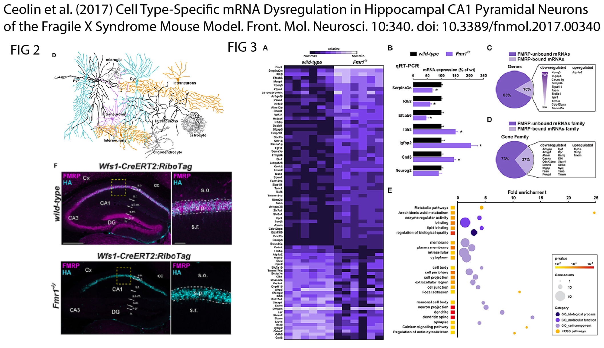
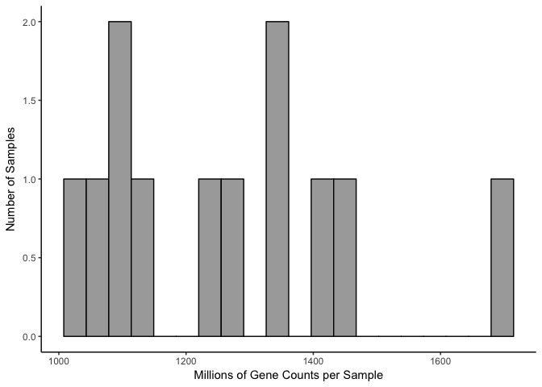
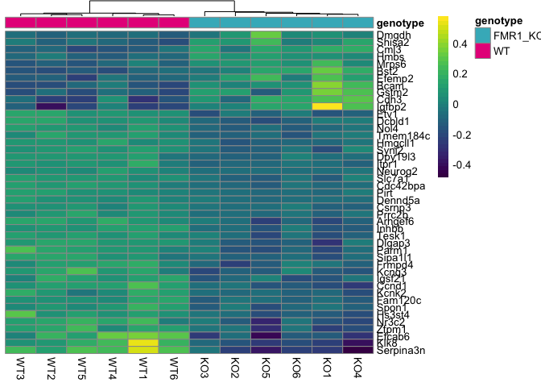
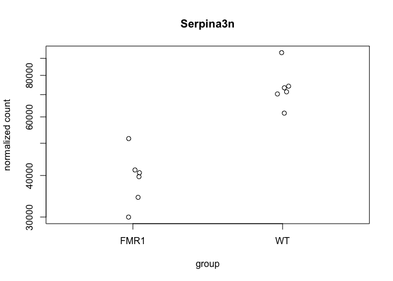

Ceolin et al. data reanalyzed
-----------------------------

From [Ceolin L, Bouquier N, Vitre-Boubaker J, Rialle S et al. Cell
Type-Specific mRNA Dysregulation in Hippocampal CA1 Pyramidal Neurons of
the Fragile X Syndrome Mouse Model. Front Mol Neurosci 2017;10:340.
PMID:
29104533](https://www.frontiersin.org/articles/10.3389/fnmol.2017.00340/full)

This data was made available here [open source
data](https://www.ncbi.nlm.nih.gov/geo/query/acc.cgi?acc=GSE94559).

The parts of their paper that I reproduced are visuzalized in Figure 2
and 3 of Ceolin et al 2017. Ceolin's fluoresence staining of the CA1
provided the inspriation for the color palette. I reproduced the heatmap
and part of the GO anlsysis but not that of FMRP binding.

I found roughly the same scale of gene expression changes, which is how
I stumbled upon the paper in the first place (by googling Serpina3a and
Fmr1), However, my list does have fewer significant genes. Most of the
genes were identified by both analytical methods indicating a robust
reponse. Our GO anlaysese highlighted different patterns. Ceolin
highlights the molecular function enriched pathways in FMR1-KO mice, but
my analysis provided stronger evidence for a deletion of calcium
receptor related functions. THis suggests a role for dys-regulation of
calcium signallying in the hippocampus of Fragile X Syndrom patients.

Here is the analysis, including the heatmap as well as a PCA plot and
maybe some statistics. The GO analysis is in the subdirectory
06\_GO\_MWU.

    #source("http://www.bioconductor.org/biocLite.R")
    #biocLite("DESeq2")
    library(DESeq2)
    library(magrittr)
    library(tidyverse)
    library(plyr)
    library(reshape2)
    library(VennDiagram)
    library(genefilter)
    library(pheatmap)
    library(edgeR)
    library(colorRamps) # for a matlab like color scheme
    library(viridis)
    library(genefilter)  ## for PCA fuction
    library(ggrepel) ## for labeling volcano plot
    library(cowplot)

    source("functions_RNAseq.R")

    # set output file for figures 
    knitr::opts_chunk$set(fig.path = '../figures/05_Ceolin/')

    # contains a file with the gene name and transcript id
    geneids <- read.table("../data/geneids.tsv", header=T)

    #read count data 
    count <- read.table("../data/GSE94559_Raw_Counts_RNA-Seq_Ceolin.txt", header = T)

    # strip gene length from data
    count$Gene <- sapply(strsplit(as.character(count$Gene),'\\|'), "[", 1)
    count$gene <- sapply(strsplit(as.character(count$Gene),'\\|'), "[", 1)

    ## join with geneids so we can look at gene level stuff
    countbygene <- full_join(geneids, count)
    countbygene <- countbygene %>% 
      filter(gene != "-")
    countbygene <- countbygene[-c(1,3)] ## keep gene name and counts for samples)

    ## lengthen the dataframe, then wide with gene level sums, then make gene the row name, then round the value to nearest integer
    countbygene <- melt(countbygene, id=c("gene")) 
    countbygene  <- dcast(countbygene, gene ~ variable, value.var= "value", fun.aggregate=sum)
    row.names(countbygene) <- countbygene$gene
    countbygene[1] <- NULL
    countbygene <- round(countbygene)

    # getting ready for DESeq2
    countData <- countbygene 

    # meta data
    sample=c("KO1", "KO2", "KO3", "KO4","KO5", "KO6", 
               "WT1", "WT2","WT3", "WT4", "WT5", "WT6") 
    genotype=c("FMR1_KO", "FMR1_KO", "FMR1_KO", "FMR1_KO", "FMR1_KO", "FMR1_KO", 
               "WT", "WT","WT", "WT", "WT", "WT") 

    colData <- data.frame(sample,genotype)
    rownames(colData) <- colData$sample

    # keep only data with >2 counts
    countData[countData < 2] <- 0

    # replace nas with 0
    countData[is.na(countData)] <- 0

The first thing I notice is that they have waay more reads per sample
and thus gene counts per sample than I do. They have a mean gene counts
per sample around 400 million counts per gene. My data had 5 million
counts per gene.

    counts <- countData
    dim( counts )

    FALSE [1] 37167    12

    colSums( counts ) / 1e06  # in millions of reads

    FALSE      KO1      KO2      KO3      KO4      KO5      KO6      WT1      WT2 
    FALSE 1418.315 1350.637 1138.349 1227.207 1713.639 1262.710 1462.382 1096.985 
    FALSE      WT3      WT4      WT5      WT6 
    FALSE 1328.221 1041.819 1051.388 1079.573

    table( rowSums( counts ) )[ 1:30 ] # Number of genes with low counts

    FALSE 
    FALSE     0     2     3     4     5     6     7     8     9    10    11    12 
    FALSE 17743    63    46    48    28    29    24    21    17    18    13    10 
    FALSE    13    14    15    16    17    18    19    20    21    22    23    24 
    FALSE    14    12     4    11    10    12    10     7     6     5    11     5 
    FALSE    25    26    27    28    29    30 
    FALSE    10     6     7   183     2     8

    rowsum <- as.data.frame(colSums( counts ) / 1e06 )
    names(rowsum)[1] <- "millioncounts"
    rowsum$sample <- row.names(rowsum)

    ggplot(rowsum, aes(x=millioncounts)) + 
      geom_histogram(bins = 20, colour = "black", fill = "darkgrey") +
      theme_classic() +
      scale_x_continuous(name = "Millions of Gene Counts per Sample") +
      scale_y_continuous(name = "Number of Samples")

Then I conducted differential gene experssion with DESeq2 modeling the
effect genotype.

    dds <- DESeqDataSetFromMatrix(countData = countData,
                                  colData = colData,
                                  design = ~ genotype )

    FALSE converting counts to integer mode

    dds <- dds[ rowSums(counts(dds)) > 2, ] ## filter genes with 0 counts
    dds <- DESeq(dds) # Differential expression analysis

    FALSE estimating size factors

    FALSE estimating dispersions

    FALSE gene-wise dispersion estimates

    FALSE mean-dispersion relationship

    FALSE final dispersion estimates

    FALSE fitting model and testing

    dds

    FALSE class: DESeqDataSet 
    FALSE dim: 19361 12 
    FALSE metadata(1): version
    FALSE assays(3): counts mu cooks
    FALSE rownames(19361): 0610005C13Rik 0610007P14Rik ... Zzef1 Zzz3
    FALSE rowData names(27): baseMean baseVar ... deviance maxCooks
    FALSE colnames(12): KO1 KO2 ... WT5 WT6
    FALSE colData names(3): sample genotype sizeFactor

    ## for variance stablized gene expression and log transformed data
    rld <- rlog(dds, blind=FALSE)

There are 12 samples (6 WT and 6 FMR1-KO) and 37,167 genes were included
in the analysis, but most were discarded during the normalizaiton and
analysis iwth DESeq such that the expression of only 19,361 genes were
analysed.

Differentially expressed genes

out of 19361 with nonzero total read count adjusted p-value &lt; 0.1 LFC
&gt; 0 (up) : 88, 0.45% LFC &lt; 0 (down) : 146, 0.75%

    colData$genotype <- as.factor(colData$genotype)
    colData %>% select(genotype)  %>%  summary()

    FALSE     genotype
    FALSE  FMR1_KO:6  
    FALSE  WT     :6

    dim(countData)

    FALSE [1] 37167    12

    dim(rld)

    FALSE [1] 19361    12

Then I did my favorite principle component analysis. The clustering of
points shows clear separation of samples by PC1 and PC2 together. PC2 is
signfificant.

    # create the dataframe using my function pcadataframe
    pcadata <- pcadataframe(rld, intgroup=c("genotype"), returnData=TRUE)
    percentVar <- round(100 * attr(pcadata, "percentVar"))

    ## PC1 vs PC2

    PCA12 <- ggplot(pcadata, aes(PC1, PC2, shape = genotype, color = genotype)) + 
      geom_point(size = 3, alpha = 1) +
        xlab(paste0("PC1: ", percentVar[1],"% variance")) +
        ylab(paste0("PC2: ", percentVar[2],"% variance")) +
        scale_color_manual(values =c("#41b6c4", "#e7298a")) +
        theme_cowplot(font_size = 8, line_size = 0.25)  +
        #theme(legend.position="none") +
        scale_shape_manual(values=c(16, 16)) 
    PCA12

    aov1 <- aov(PC1 ~ genotype, data=pcadata)
    summary(aov1) 

    FALSE             Df Sum Sq Mean Sq F value Pr(>F)
    FALSE genotype     1   21.8   21.80   1.905  0.198
    FALSE Residuals   10  114.4   11.44

    aov2 <- aov(PC2 ~ genotype, data=pcadata)
    summary(aov2) 

    FALSE             Df Sum Sq Mean Sq F value  Pr(>F)   
    FALSE genotype     1  41.04   41.04   10.53 0.00879 **
    FALSE Residuals   10  38.97    3.90                   
    FALSE ---
    FALSE Signif. codes:  0 '***' 0.001 '**' 0.01 '*' 0.05 '.' 0.1 ' ' 1

    aov3 <- aov(PC3 ~ genotype, data=pcadata)
    summary(aov3) 

    FALSE             Df Sum Sq Mean Sq F value Pr(>F)
    FALSE genotype     1   0.82   0.819     0.2  0.664
    FALSE Residuals   10  41.00   4.100

The heatmap shows a similar pattern as the volcano plot and PCA analysis
and allows us to visualize patterns of expression with gene names.

    contrast1 <- resvals(contrastvector = c('genotype', 'FMR1_KO', 'WT'), mypval = 0.1)

    FALSE [1] 234

    ## Any padj <0.1
    DEGes <- assay(rld)
    DEGes <- cbind(DEGes, contrast1)
    DEGes <- as.data.frame(DEGes) # convert matrix to dataframe
    DEGes$rownames <- rownames(DEGes)  # add the rownames to the dataframe

    DEGes <- DEGes %>% filter(padjgenotypeFMR1_KOWT < 0.01)

    rownames(DEGes) <- DEGes$rownames
    drop.cols <-colnames(DEGes[,grep("padj|pval|rownames", colnames(DEGes))])
    DEGes <- DEGes %>% select(-one_of(drop.cols))
    DEGes <- as.matrix(DEGes)
    DEGes <- DEGes - rowMeans(DEGes)

    # setting color options
    ann_colors <- list(
      genotype =  c('FMR1_KO' = (values=c("#41b6c4")), 
                'WT' = (values=c("#e7298a"))))

    df <- as.data.frame(colData(dds)[,c( "genotype")])
    rownames(df) <- names(countData)
    colnames(df) <- "genotype"

    paletteLength <- 40
    myBreaks <- c(seq(min(DEGes), 0, length.out=ceiling(paletteLength/2) + 1), 
                  seq(max(DEGes)/paletteLength, max(DEGes), length.out=floor(paletteLength/2)))

    pheatmap(DEGes, show_colnames=T, show_rownames = T,
             annotation_col=df, 
             annotation_colors = ann_colors,
             treeheight_row = 0, treeheight_col = 50,
             #fontsize = 4, 
             #width=4.5, height=3,
             border_color = "grey60" ,
             color = viridis(40),
             #cellwidth = 10, 
             clustering_distance_cols="correlation" ,
             breaks=myBreaks,
             clustering_method="average"
             )

    # for adobe
    pheatmap(DEGes, show_colnames=F, show_rownames = T,
             annotation_col=df, annotation_colors = ann_colors,
             treeheight_row = 0, treeheight_col = 10,
             fontsize = 4, 
             width=2, height=3.4,
             border_color = "grey60" ,
             color = viridis(40),
             cellwidth = 5, 
             clustering_distance_cols="correlation" ,
             breaks=myBreaks,
             clustering_method="average",
             filename = "../figures/05_Ceolin/HeatmapPadj-1.pdf"
             )

Create list of p-values for all genes
-------------------------------------

    #create a new DF with the gene counts
    GOpvals <- assay(rld)
    GOpvals <- cbind(GOpvals, contrast1)
    GOpvals <- as.data.frame(GOpvals)
    GOpvals <- GOpvals[ , grepl( "padj|pval" , names( GOpvals ) ) ]

    GOpvals$gene<-rownames(GOpvals)

    GOpvals <- GOpvals %>%
      select(gene, padjgenotypeFMR1_KOWT)
    GOpvals$logP <- log(GOpvals$padjgenotypeFMR1_KOWT)
    GOpvals <- GOpvals %>%
      select(gene, logP)

    write.csv(GOpvals, "./06_GO_MWU/05_Ceolin_GOpvals.csv", row.names = F)

### Serpina3n was in my list, right? and Ccnd1?

    res <- results(dds, contrast =c("genotype", "FMR1_KO", "WT"), independentFiltering = T, alpha = 0.1)
    summary(res)

    FALSE 
    FALSE out of 19361 with nonzero total read count
    FALSE adjusted p-value < 0.1
    FALSE LFC > 0 (up)     : 88, 0.45% 
    FALSE LFC < 0 (down)   : 146, 0.75% 
    FALSE outliers [1]     : 928, 4.8% 
    FALSE low counts [2]   : 4330, 22% 
    FALSE (mean count < 668)
    FALSE [1] see 'cooksCutoff' argument of ?results
    FALSE [2] see 'independentFiltering' argument of ?results

    resOrdered <- res[order(res$padj),]
    head(resOrdered, 10)

    FALSE log2 fold change (MAP): genotype FMR1_KO vs WT 
    FALSE Wald test p-value: genotype FMR1_KO vs WT 
    FALSE DataFrame with 10 rows and 6 columns
    FALSE             baseMean log2FoldChange      lfcSE      stat       pvalue
    FALSE            <numeric>      <numeric>  <numeric> <numeric>    <numeric>
    FALSE Serpina3n  56883.323     -0.6544227 0.09087423 -7.201412 5.959231e-13
    FALSE Efcab6     26253.646     -0.5619258 0.09385972 -5.986869 2.139187e-09
    FALSE Klk8       22535.472     -0.5755172 0.09643234 -5.968093 2.400428e-09
    FALSE Neurog2     1318.040     -0.6118730 0.10027296 -6.102074 1.047011e-09
    FALSE Nol4       87295.855     -0.2607096 0.04373721 -5.960820 2.509749e-09
    FALSE Inhbb      26270.049     -0.3209072 0.05716446 -5.613755 1.979828e-08
    FALSE Ccnd1     178320.712     -0.3610653 0.06516270 -5.540981 3.007810e-08
    FALSE Cml3        4536.018      0.5530818 0.09971910  5.546398 2.916154e-08
    FALSE Arhgef6    22052.633     -0.3853633 0.07450660 -5.172203 2.313499e-07
    FALSE Fam120c    74978.612     -0.2622172 0.05143142 -5.098386 3.425618e-07
    FALSE                   padj
    FALSE              <numeric>
    FALSE Serpina3n 8.404304e-09
    FALSE Efcab6    7.078997e-06
    FALSE Klk8      7.078997e-06
    FALSE Neurog2   7.078997e-06
    FALSE Nol4      7.078997e-06
    FALSE Inhbb     4.653586e-05
    FALSE Ccnd1     5.302393e-05
    FALSE Cml3      5.302393e-05
    FALSE Arhgef6   3.625252e-04
    FALSE Fam120c   4.831150e-04

    data <- data.frame(gene = row.names(res), pvalue = -log10(res$padj), lfc = res$log2FoldChange)
    data <- na.omit(data)
    data <- data %>%
      mutate(color = ifelse(data$lfc > 0 & data$pvalue > 1.3, 
                            yes = "FRM1_KO", 
                            no = ifelse(data$lfc < 0 & data$pvalue > 1.3, 
                                        yes = "WT", 
                                        no = "none")))
    top_labelled <- top_n(data, n = 5, wt = pvalue)

    # Color corresponds to fold change directionality

    volcano <- ggplot(data, aes(x = lfc, y = pvalue)) + 
      geom_point(aes(color = factor(color)), size = 1, alpha = 0.5, na.rm = T) + # add gene points
      theme_cowplot(font_size = 8, line_size = 0.25) +
      geom_hline(yintercept = 1,  size = 0.25, linetype = 2) + 
      scale_color_manual(values = c("FRM1_KO" = "#41b6c4",
                                    "WT" = "#e7298a", 
                                    "none" = "grey")) + 
      #scale_y_continuous(limits=c(0, 8)) +
      scale_x_continuous(name="Log fold change")+
      ylab(paste0("log10 p-value")) +       
      theme(panel.grid.minor=element_blank(),
            legend.position = "none", # remove legend 
            panel.grid.major=element_blank())
    volcano

    pdf(file="../figures/05_Ceolin/volcano.pdf", width=1.5, height=1.75)
    plot(volcano)
    dev.off()

    FALSE quartz_off_screen 
    FALSE                 2
