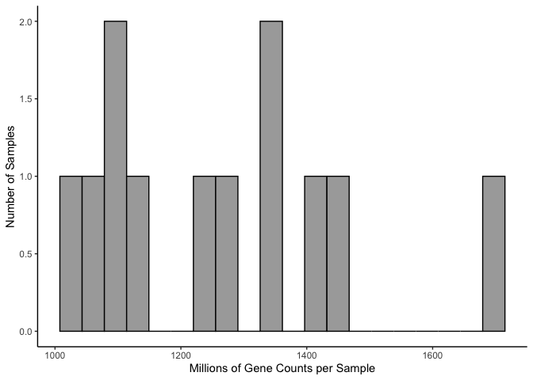

Ceolin et al. data reanalyzed
-----------------------------

From Ceolin L, Bouquier N, Vitre-Boubaker J, Rialle S et al. Cell
Type-Specific mRNA Dysregulation in Hippocampal CA1 Pyramidal Neurons of
the Fragile X Syndrome Mouse Model. Front Mol Neurosci 2017;10:340.
PMID: 29104533

This data was made available here [open source
data](https://www.ncbi.nlm.nih.gov/geo/query/acc.cgi?acc=GSE94559).

The first thing I notice is that they have waay more reads per sample
and thus gene counts per sample than I do. They have a mean gene counts
per sample around 400 million counts per gene. My data had 5 million
counts per gene.

Differential gene experssion with DESeq2 modeling genotype
==========================================================

    dds <- DESeqDataSetFromMatrix(countData = countData,
                                  colData = colData,
                                  design = ~ genotype )

    FALSE converting counts to integer mode

    dds <- dds[ rowSums(counts(dds)) > 2, ] ## filter genes with 0 counts
    dds <- DESeq(dds) # Differential expression analysis

    FALSE estimating size factors

    FALSE estimating dispersions

    FALSE gene-wise dispersion estimates

    FALSE mean-dispersion relationship

    FALSE final dispersion estimates

    FALSE fitting model and testing

    dds

    FALSE class: DESeqDataSet 
    FALSE dim: 19361 12 
    FALSE metadata(1): version
    FALSE assays(3): counts mu cooks
    FALSE rownames(19361): 0610005C13Rik 0610007P14Rik ... Zzef1 Zzz3
    FALSE rowData names(27): baseMean baseVar ... deviance maxCooks
    FALSE colnames(12): KO1 KO2 ... WT5 WT6
    FALSE colData names(3): sample genotype sizeFactor

    ## for variance stablized gene expression and log transformed data
    rld <- rlog(dds, blind=FALSE)

There are 12 samples (6 WT and 6 FMR1-KO) and 37,167 genes were included
in the analysis, but most were discarded during the normalizaiton and
analysis iwth DESeq such that the expression of only 19,361 genes were
analysed.

    ##     genotype
    ##  FMR1_KO:6  
    ##  WT     :6

    ## [1] 37167    12

    ## [1] 19361    12

Principle component analysis
============================

Nice clusering of points. PC1 and PC2 together separate samples by
genotype. PC2 is signfificant

ANOVA PCA
=========

    aov1 <- aov(PC1 ~ genotype, data=pcadata)
    summary(aov1) 

    FALSE             Df Sum Sq Mean Sq F value Pr(>F)
    FALSE genotype     1   21.8   21.80   1.905  0.198
    FALSE Residuals   10  114.4   11.44

    aov2 <- aov(PC2 ~ genotype, data=pcadata)
    summary(aov2) 

    FALSE             Df Sum Sq Mean Sq F value  Pr(>F)   
    FALSE genotype     1  41.04   41.04   10.53 0.00879 **
    FALSE Residuals   10  38.97    3.90                   
    FALSE ---
    FALSE Signif. codes:  0 '***' 0.001 '**' 0.01 '*' 0.05 '.' 0.1 ' ' 1

    aov3 <- aov(PC3 ~ genotype, data=pcadata)
    summary(aov3) 

    FALSE             Df Sum Sq Mean Sq F value Pr(>F)
    FALSE genotype     1   0.82   0.819     0.2  0.664
    FALSE Residuals   10  41.00   4.100

Heatmap
=======

Differentially expressed genes
==============================

out of 19361 with nonzero total read count adjusted p-value &lt; 0.1 LFC
&gt; 0 (up) : 88, 0.45% LFC &lt; 0 (down) : 146, 0.75%

### Serpina3n was in my list, right? and Ccnd1?

    res <- results(dds, contrast =c("genotype", "FMR1_KO", "WT"), independentFiltering = T, alpha = 0.1)
    summary(res)

    ## 
    ## out of 19361 with nonzero total read count
    ## adjusted p-value < 0.1
    ## LFC > 0 (up)     : 88, 0.45% 
    ## LFC < 0 (down)   : 146, 0.75% 
    ## outliers [1]     : 928, 4.8% 
    ## low counts [2]   : 4330, 22% 
    ## (mean count < 668)
    ## [1] see 'cooksCutoff' argument of ?results
    ## [2] see 'independentFiltering' argument of ?results

    resOrdered <- res[order(res$padj),]
    head(resOrdered, 10)

    ## log2 fold change (MAP): genotype FMR1_KO vs WT 
    ## Wald test p-value: genotype FMR1_KO vs WT 
    ## DataFrame with 10 rows and 6 columns
    ##             baseMean log2FoldChange      lfcSE      stat       pvalue
    ##            <numeric>      <numeric>  <numeric> <numeric>    <numeric>
    ## Serpina3n  56883.323     -0.6544227 0.09087423 -7.201412 5.959231e-13
    ## Efcab6     26253.646     -0.5619258 0.09385972 -5.986869 2.139187e-09
    ## Klk8       22535.472     -0.5755172 0.09643234 -5.968093 2.400428e-09
    ## Neurog2     1318.040     -0.6118730 0.10027296 -6.102074 1.047011e-09
    ## Nol4       87295.855     -0.2607096 0.04373721 -5.960820 2.509749e-09
    ## Inhbb      26270.049     -0.3209072 0.05716446 -5.613755 1.979828e-08
    ## Ccnd1     178320.712     -0.3610653 0.06516270 -5.540981 3.007810e-08
    ## Cml3        4536.018      0.5530818 0.09971910  5.546398 2.916154e-08
    ## Arhgef6    22052.633     -0.3853633 0.07450660 -5.172203 2.313499e-07
    ## Fam120c    74978.612     -0.2622172 0.05143142 -5.098386 3.425618e-07
    ##                   padj
    ##              <numeric>
    ## Serpina3n 8.404304e-09
    ## Efcab6    7.078997e-06
    ## Klk8      7.078997e-06
    ## Neurog2   7.078997e-06
    ## Nol4      7.078997e-06
    ## Inhbb     4.653586e-05
    ## Ccnd1     5.302393e-05
    ## Cml3      5.302393e-05
    ## Arhgef6   3.625252e-04
    ## Fam120c   4.831150e-04

    data <- data.frame(gene = row.names(res), pvalue = -log10(res$padj), lfc = res$log2FoldChange)
    data <- na.omit(data)
    data <- data %>%
      mutate(color = ifelse(data$lfc > 0 & data$pvalue > 1.3, 
                            yes = "FRM1_KO", 
                            no = ifelse(data$lfc < 0 & data$pvalue > 1.3, 
                                        yes = "WT", 
                                        no = "none")))
    top_labelled <- top_n(data, n = 5, wt = pvalue)

    # Color corresponds to fold change directionality
    colored <- ggplot(data, aes(x = lfc, y = pvalue)) + 
      geom_point(aes(color = factor(color), shape = factor(color)), size = 3, alpha = 0.5, na.rm = T) + # add gene points
      theme_bw(base_size = 8) + # clean up theme
      theme(legend.position = "none") + # remove legend 
      scale_color_manual(values = c("FRM1_KO" = "#41b6c4",
                                    "WT" = "#e7298a", 
                                    "none" = "grey")) + theme(panel.grid.minor=element_blank(),
               panel.grid.major=element_blank()) + 
      scale_x_continuous(name="Log Fold Change") +
      scale_y_continuous(name="-log10 (adjusted p-value)") +
      geom_hline(yintercept = 1.3,  size = 0.25, linetype = 2 ) + 
      scale_shape_manual(values = c(16,16,16))  
    colored

    colored <- ggplot(data, aes(x = lfc, y = pvalue)) + 
      geom_point(aes(color = factor(color), shape = factor(color)), size = 1, alpha = 0.5, na.rm = T) + # add gene points
      theme_bw(base_size = 8) + # clean up theme
      theme(legend.position = "none") + # remove legend 
      scale_color_manual(values = c("FRM1_KO" = "#41b6c4",
                                    "WT" = "#e7298a", 
                                    "none" = "grey")) + theme(panel.grid.minor=element_blank(),
               panel.grid.major=element_blank()) + 
      scale_x_continuous(name="Log Fold Change") +
      scale_y_continuous(name="-log10 (adjusted p-value)") +
      geom_hline(yintercept = 1.3,  size = 0.25, linetype = 2 ) + 
      scale_shape_manual(values = c(16,16,16))  
    colored

    pdf(file="../figures/05_Ceolin/volcano.pdf", width=1.5, height=1.75)
    plot(colored)
    dev.off()

    ## quartz_off_screen 
    ##                 2
