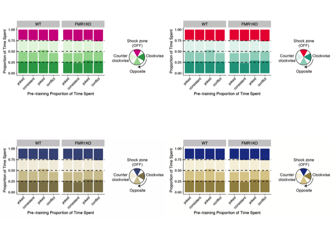
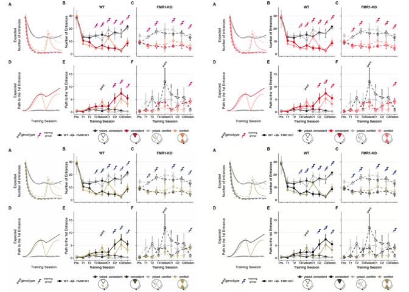
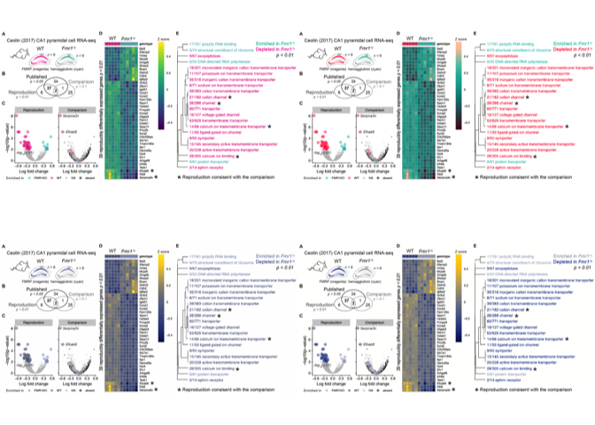
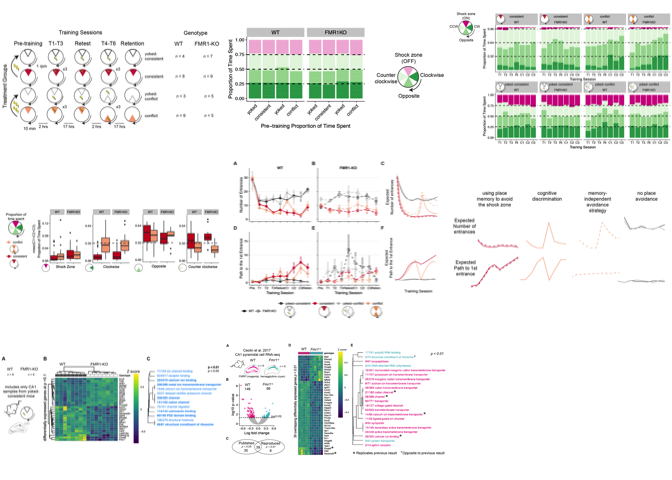

Rationale
=========

This script uses the "colorblindr" library to see how my figures look
through color blind simulators.

Setup
-----

    #devtools::install_github("wilkelab/cowplot")
    #install.packages("colorspace", repos = "http://R-Forge.R-project.org")
    #devtools::install_github("clauswilke/colorblindr")
    #install.packages("magick")

    library(ggplot2)
    library(colorblindr)
    library(cowplot)
    library(magick)

    ## set output file for figures 
    knitr::opts_chunk$set(fig.path = '../figures/07_colorblindr/')

Hippocampus color scheme
------------------------

    p0 <- magick::image_read("../figures/fig1-04.png")
    p <- ggdraw() + draw_image(p0) # turn png into ggplot object
    p2 <- edit_colors(p, tritan, sev = 1.0)
    p3 <- edit_colors(p, deutan, sev = 1.0)
    p4 <- edit_colors(p, protan, sev = 1.0)

    q0 <- magick::image_read("../figures/fig1-02.png")
    q <- ggdraw() + draw_image(q0) # turn png into ggplot object
    q2 <- edit_colors(q, tritan, sev = 1.0)
    q3 <- edit_colors(q, deutan, sev = 1.0)
    q4 <- edit_colors(q, protan, sev = 1.0)

    r0 <- magick::image_read("../figures/fig1-08.png")
    r <- ggdraw() + draw_image(r0) # turn png into ggplot object
    r2 <- edit_colors(r, tritan, sev = 1.0)
    r3 <- edit_colors(r, deutan, sev = 1.0)
    r4 <- edit_colors(r, protan, sev = 1.0)

    plot_grid(p, p2, p3, p4)

    plot_grid(q, q2, q3, q4)

    plot_grid(r, r2, r3, r4)

    t0 <- magick::image_read("../figures/fig1-01.png")
    t1 <- ggdraw() + draw_image(t0) # turn png into ggplot

    t0 <- magick::image_read("../figures/fig1-03.png")
    t3 <- ggdraw() + draw_image(t0) # turn png into ggplot

    t0 <- magick::image_read("../figures/fig1-06.png")
    t6 <- ggdraw() + draw_image(t0) # turn png into ggplot

    t0 <- magick::image_read("../figures/fig1-05.png")
    t5 <- ggdraw() + draw_image(t0) # turn png into ggplot

    t0 <- magick::image_read("../figures/fig3-01.png")
    t31 <- ggdraw() + draw_image(t0) # turn png into ggplot

    plot_grid(t1, p, t6, r, q, t5, t3, t31)

