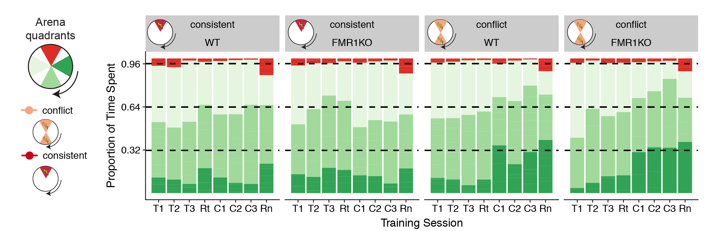
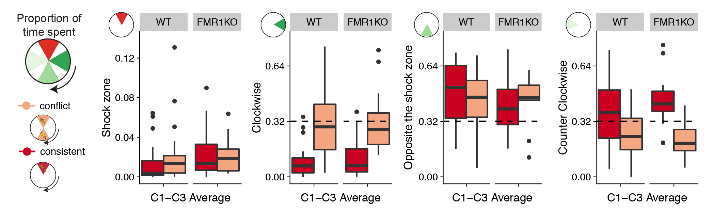
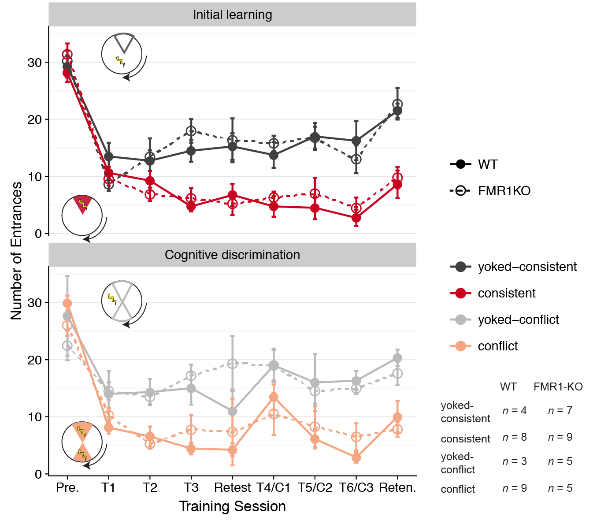
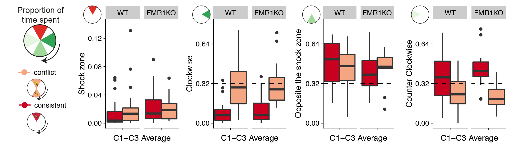
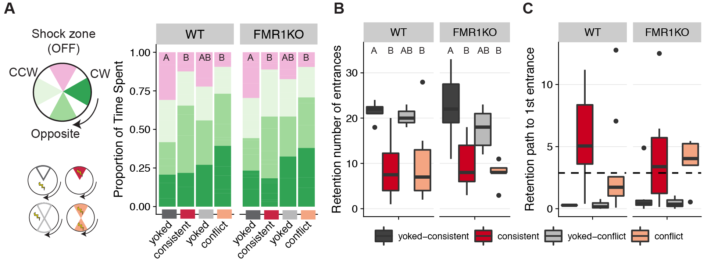
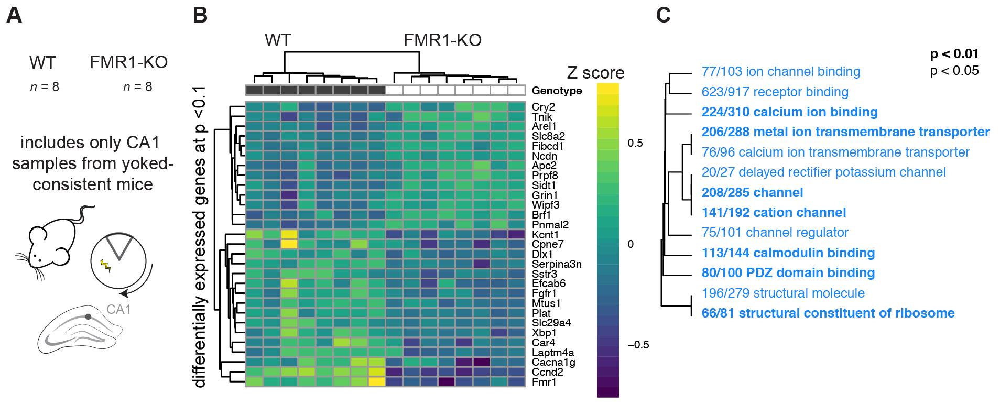
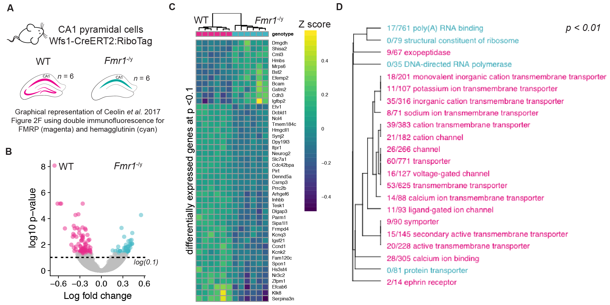

# No significant pre-training group differences by genoetype or treatment
First I examined the data to determine if the groups were different prior to experiencing shock. I found that all groups where equal in the proportion of time spent in all four quadrants of the arena (**Figure 2.2**). There was no significant effect of geneotype, training, or the interaction on pre-training proportion of time spent in the shock zone (F(3,35) = 0.132 p = 0.94), clockwise (F(3,35) = 0.660, p = 0.58), opposite (F(3,35) = 1.312, p = 0.29), or counter clockwise (F(3,35) = 0.816, p = 0.49). 

##### This graph shows that all groups of mice spend 25% of their time equally across four quadrants of the arena during the pre-training session. Pink: future shock zone, dark green: clockwise, green: opposite the shock zone, light green: counter clockwise.
 
# Effect of genotype on space use is smaller than the effects on avoidance

Next I asked if the groups differences in their avoidance of the shock zone? 

 
 

On day 1, differences in time/path to the 1st entrance between WT yoked and WT trained are minimal. The FMR1 data are all over the place with yoked groups showing highly variable time/path to the first entrance, while conflict and consistent show minor increases in path/time to the entrance. 

PRESUMABLY THEY ARE LESS ACTIVE (bad luck) - tells us we should use measures that are less sensitive to amount of movement since that might differ in KO (i.e. path to first enter better than time to first enter; entrances/path moved better than entrances)

q2) Do the groups differ in avoidance during training to the initial shock zone? On day 1, differences in time/path to the 1st entrance between WT yoked and WT trained are minimal. The FMR1 data are all over the place with yoked groups showing highly variable time/path to the first entrance, while conflict and consistent show minor increases in path/time to the entrance. 

The groups look pretty similar across T1-T3 providing no evidence of acquiring place memory. Because entrances decrease in trained compared to yoked, together these data suggest the mice don’t rely on place memory from before the trial, instead they get shocked first (by chance) and then adopt a strategy to reduce entrances that does not seem a place strategy by T3

Top) Consistently trained mice (red) from both WT (solid lines, filled circles) and FMR1-KO (dashes lines, open circles) make fewer entrances into the shock zone than yoked-mice (grey). Bottom) Conflict trained mice (pink) from both WT (solid lines, filled circles) and FMR1-KO (dashes lines, open circles) learn to avoid the initial and the conflicting shock zones. Data are reported as mean +/- SEM. A Mann-Whitney statistical test shows that there are no significant differences due to genotype for any treatment at any time point (as evidenced by all overlapping standard error bars). Inserts) The pie-shaped shaded regions of the inserts highlight the region used to count the number of entrances. Sample sizes for each treatment group and genotype are shown on the bottom right.

This is how I am currently conceptualizing the results.

### Identify transcriptional response to constitutive gene knockdown of fragile x mental retardation protein (FMRP)

### Show that synaptic strength not diminished despite reduced calcium activity 

WT and FMR1-KO show evidence of differential gene expression in the CA1
A)  The sample size for RNA-sequencing is 8 WT and 8 FMR1-KO tissues from the CA1 subfield from only the consistent-yoke group. B) Hierarchical clustering of differentially expressed genes shows that only 13 genes are upregulated in response to FMR1KO while 16, including Fmr1, were downregulated in the CA1 subfield of yoked-consistent mice. C) A volcano plot shows that expression Ccnd2 and Fmr1 are highly upregulated in WT compared to FMR1-KO mice. Genes with negative log fold change value are more highly expressed in WT (dark grey filled circles) while genes with a positive log fold change value are more highly expressed in the Fmr1 mice (open circles). Genes that are not significantly expressed are shown in light grey.

Down-regulation of ion transport in the the the CA1 subfield 
Down-regulation of ion channel binding, receptor binding, calcium binding, metal ion membrane transport, calcium ion transmembrane transporter, delayed rectifier potassium channel, channel, cation channel, channel regulator, calmodulin binding, PDZ domain binding, structural molecular, and structural constituent of ribosome. On the plot, different fonts are used to indicate significance (bold: p < 0.01, regular: p < 0.05) and color indicates enrichment with either up (red) or down (blue) regulated genes. The fraction next to GO category name indicates the fraction of "good" genes that exceed the p-value cutoff. The tree on the plot is hierarchical clustering of GO categories based on shared genes. Categories with no branch length between them are subsets of each other.

CA3-CA1 synaptic strength is not altered by genotype or place avoidance training.
I did not observe reduction in synaptic strength at the CA3-CA1 synapse (as measured by maximum fEPSP slope) with avoidance learning or with FMR1-KO. The interaction between Genotype and Training Group was not significant, and Genotype alone was not significant. Violin plots are colored by treatment group and shaded according to genotype.  

### Reproduction of and comparision to the Ceolin et al. 201732 study

A) Graphical representation of the samples for the Ceolin et al. 201732 study examining CA1 expression in WT and FMR1-KO mice. B)  Volcano plot showing enrichment of 88 genes that are up-regulated in FMR1-KO mice and the 146 genes that are up-regulated in WT mice. C) Hierarchical clustering showing the names and expression patterns of those same significant genes. D) GO analysis showing a very similar pattern of depletion of calcium channel activity as was shown in Fig. 2.4C). In contrast, Ceolin detected enrichment of ribosomal processes in response to FMR1-KO in CA1 pyramidal neurons.A) Graphical representation of the samples for the Ceolin et al. 201732 study examining CA1 expression in WT and FMR1-KO mice. B)  Volcano plot showing enrichment of 88 genes that are up-regulated in FMR1-KO mice and the 146 genes that are up-regulated in WT mice. C) Hierarchical clustering showing the names and expression patterns of those same significant genes. D) GO analysis showing a very similar pattern of depletion of calcium channel activity as was shown in Fig. 2.4C). In contrast, Ceolin detected enrichment of ribosomal processes in response to FMR1-KO in CA1 pyramidal neurons.

