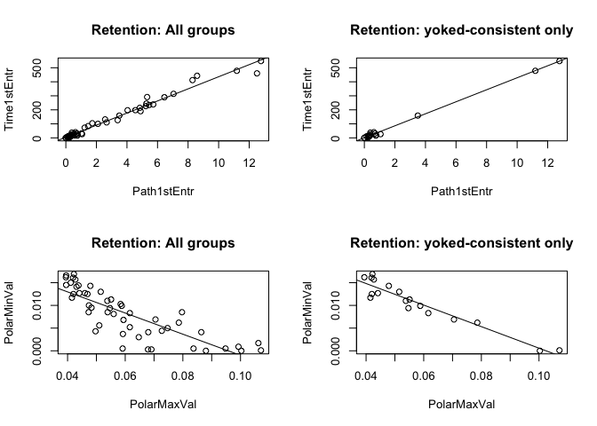
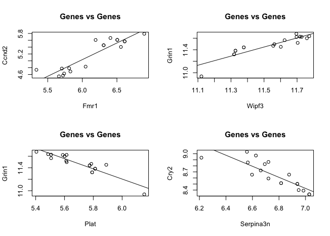
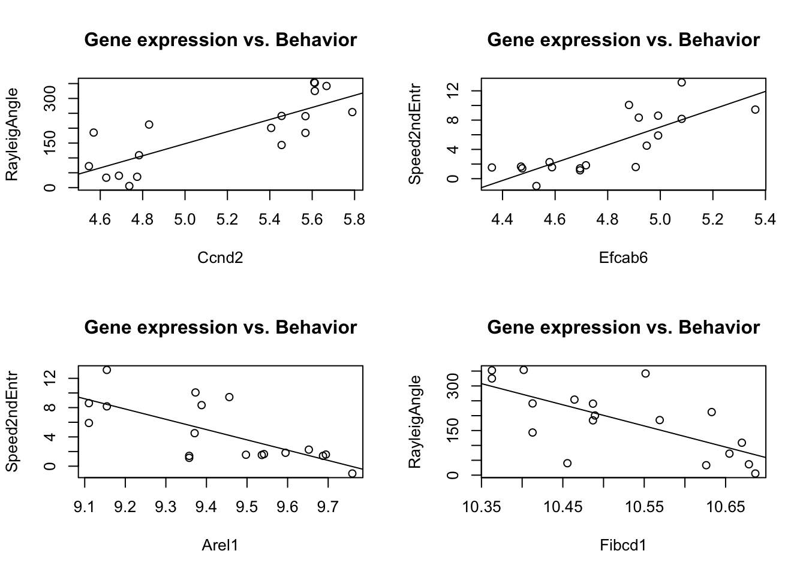

The plots on the left show behavioral correlations with ALL data. The
correlations on the right show data for ONLY yoked-consistent for which
we have CA1 RNA-seq data.

These plots show correlations between gene expression measures.

These plots show correlations between behavior and gene expresssion.

Top 100 positive correlations

    ##                 var1           var2        R2 pval
    ## 1        Path1stEntr    Time1stEntr 0.9981744    0
    ## 3         TimeTarget       NumShock 0.9969640    0
    ## 5        Path2ndEntr    Time2ndEntr 0.9886371    0
    ## 7        pTimeTarget     TimeTarget 0.9880736    0
    ## 9        Time2ndEntr    Time1stEntr 0.9864422    0
    ## 11       pTimeTarget       NumShock 0.9837383    0
    ## 13       Path2ndEntr    Path1stEntr 0.9830394    0
    ## 15       Time2ndEntr    Path1stEntr 0.9818235    0
    ## 17       Path2ndEntr    Time1stEntr 0.9798970    0
    ## 19      MaxTimeAvoid    Time1stEntr 0.9773429    0
    ## 21      MaxTimeAvoid    Path1stEntr 0.9772971    0
    ## 23          NumShock Dist1stEntr.m. 0.9745452    0
    ## 25    Max50.RngHiBin Min50.RngLoBin 0.9732545    0
    ## 27       PolarMaxVal  RayleigLength 0.9712939    0
    ## 29        TimeTarget Dist1stEntr.m. 0.9690480    0
    ## 31       Time2ndEntr   MaxTimeAvoid 0.9639631    0
    ## 33       Path2ndEntr   MaxTimeAvoid 0.9594787    0
    ## 35       pTimeTarget Dist1stEntr.m. 0.9414739    0
    ## 37    AnnularSkewnes     AnnularAvg 0.9337614    0
    ## 39              Fmr1          Ccnd2 0.9124030    0
    ## 41       PolarMaxVal    Time1stEntr 0.9036069    0
    ## 43       PolarMaxVal    Time2ndEntr 0.9026387    0
    ## 45             Wipf3          Grin1 0.9023210    0
    ## 47             Sidt1           Ncdn 0.9020540    0
    ## 49     RayleigLength    Time2ndEntr 0.9019797    0
    ## 51   AnnularKurtosis AnnularSkewnes 0.9013572    0
    ## 53     RayleigLength    Time1stEntr 0.8965492    0
    ## 55  Linearity.Arena. SdevSpeedArena 0.8951338    0
    ## 57    Dist1stEntr.m.   NumEntrances 0.8896888    0
    ## 59            Slc8a2          Arel1 0.8881084    0
    ## 61       PolarMaxVal    Path1stEntr 0.8879827    0
    ## 63       pTimeTarget   NumEntrances 0.8873372    0
    ## 65             Wipf3           Ncdn 0.8862480    0
    ## 67          NumShock   NumEntrances 0.8857797    0
    ## 69     RayleigLength    Path1stEntr 0.8828748    0
    ## 71            Slc8a2           Ncdn 0.8805764    0
    ## 73         Serpina3n        Cacna1g 0.8758914    0
    ## 75       PolarMaxVal    Path2ndEntr 0.8731146    0
    ## 77     RayleigLength    Path2ndEntr 0.8729821    0
    ## 79             Fgfr1          Cpne7 0.8721766    0
    ## 81        TimeTarget   NumEntrances 0.8705817    0
    ## 83             Fgfr1         Efcab6 0.8667004    0
    ## 85             Mtus1          Ccnd2 0.8635439    0
    ## 87     RayleigLength   MaxTimeAvoid 0.8603535    0
    ## 89            Efcab6          Cpne7 0.8600285    0
    ## 91       PolarMaxVal   MaxTimeAvoid 0.8590441    0
    ## 93             Sidt1           Apc2 0.8573283    0
    ## 95              Plat          Kcnt1 0.8563030    0
    ## 97             Prpf8           Apc2 0.8549189    0
    ## 99             Wipf3          Sidt1 0.8537924    0
    ## 101            Sidt1          Grin1 0.8514854    0
    ## 103             Tnik           Apc2 0.8488489    0
    ## 105            Wipf3          Prpf8 0.8382820    0
    ## 107  AnnularKurtosis     AnnularAvg 0.8378701    0
    ## 109             Tnik          Sidt1 0.8300217    0
    ## 111      PolarMinVal     PolarSdVal 0.8281393    0
    ## 113             Plat          Fgfr1 0.8275655    0
    ## 115             Xbp1           Plat 0.8269617    0
    ## 117            Arel1           Apc2 0.8235888    0
    ## 119             Xbp1           Car4 0.8226494    0
    ## 121            Mtus1           Fmr1 0.8226423    0
    ## 123             Ncdn          Arel1 0.8225228    0
    ## 125             Plat          Mtus1 0.8219660    0
    ## 127         pTimeOPP    Path2ndEntr 0.8188550    0
    ## 129            Sidt1          Prpf8 0.8136802    0
    ## 131             Tnik          Prpf8 0.8130015    0
    ## 133             Xbp1          Fgfr1 0.8127657    0
    ## 135         pTimeOPP   MaxTimeAvoid 0.8121732    0
    ## 137             Plat         Efcab6 0.8108918    0
    ## 139            Kcnt1          Fgfr1 0.8103416    0
    ## 141            Ccnd2   RayleigAngle 0.8066644    0
    ## 143             Ncdn         Fibcd1 0.8054625    0
    ## 145            Wipf3           Apc2 0.8054516    0
    ## 147            Kcnt1         Efcab6 0.8049690    0
    ## 149         pTimeOPP    Time2ndEntr 0.8034454    0
    ## 151           Slc8a2           Cry2 0.8002413    0
    ## 153             Cry2          Arel1 0.7989353    0
    ## 155             Xbp1          Mtus1 0.7981120    0
    ## 157          Slc29a4   Speed2ndEntr 0.7977317    0
    ## 159           Efcab6   Speed2ndEntr 0.7922813    0
    ## 161             Xbp1        Slc29a4 0.7903001    0
    ## 163            Sidt1          Arel1 0.7899886    0
    ## 165             Ncdn          Grin1 0.7884982    0
    ## 167          Slc29a4           Plat 0.7828496    0
    ## 169         pTimeOPP    Path1stEntr 0.7822457    0
    ## 171          Slc29a4          Fgfr1 0.7815698    0
    ## 173       PolarSdVal       pTimeCCW 0.7805501    0
    ## 175           Slc8a2  AnnularMaxVal 0.7804169    0
    ## 177          Slc29a4         Efcab6 0.7799605    0
    ## 179            Ccnd2           Car4 0.7788700    0
    ## 181            Cpne7   Speed2ndEntr 0.7775050    0
    ## 183         pTimeOPP    Time1stEntr 0.7740827    0
    ## 185            Fgfr1          Ccnd2 0.7724098    0
    ## 187        Serpina3n          Ccnd2 0.7701937    0
    ## 189            Mtus1          Kcnt1 0.7699666    0
    ## 191          Slc29a4          Cpne7 0.7693139    0
    ## 193            Wipf3         Fibcd1 0.7680300    0
    ## 195          Laptm4a          Fgfr1 0.7672337    0
    ## 197             Tnik          Arel1 0.7652628    0
    ## 199            Ccnd2        Cacna1g 0.7618402    0

Top 100 negative correlations

    ##                var1           var2         R2         pval
    ## 1       PolarMaxVal    PolarMinVal -0.9545169 0.000000e+00
    ## 3       PolarMinVal  RayleigLength -0.9386140 0.000000e+00
    ## 5              Plat          Grin1 -0.9190726 0.000000e+00
    ## 7   AnnularKurtosis      AnnularSd -0.9049821 0.000000e+00
    ## 9        PolarSdVal  RayleigLength -0.8967704 0.000000e+00
    ## 11            Sidt1           Plat -0.8960648 0.000000e+00
    ## 13             Tnik        Laptm4a -0.8960186 0.000000e+00
    ## 15       PolarSdVal    Time1stEntr -0.8870245 0.000000e+00
    ## 17       PolarSdVal    Path1stEntr -0.8843485 0.000000e+00
    ## 19       PolarSdVal    Path2ndEntr -0.8693058 0.000000e+00
    ## 21      PolarMaxVal     PolarSdVal -0.8661781 0.000000e+00
    ## 23       PolarSdVal    Time2ndEntr -0.8615705 0.000000e+00
    ## 25     MaxTimeAvoid   NumEntrances -0.8501735 0.000000e+00
    ## 27        Serpina3n           Cry2 -0.8466247 0.000000e+00
    ## 29            Wipf3          Mtus1 -0.8404972 0.000000e+00
    ## 31             Plat           Ncdn -0.8404218 0.000000e+00
    ## 33        Serpina3n          Arel1 -0.8388977 0.000000e+00
    ## 35             Ncdn          Mtus1 -0.8350123 0.000000e+00
    ## 37            Wipf3           Plat -0.8329637 0.000000e+00
    ## 39      PolarMinVal    Time2ndEntr -0.8299004 0.000000e+00
    ## 41            Sidt1        Laptm4a -0.8291619 0.000000e+00
    ## 43       PolarSdVal   MaxTimeAvoid -0.8268549 0.000000e+00
    ## 45      PolarMinVal    Time1stEntr -0.8219522 0.000000e+00
    ## 47          Slc29a4          Grin1 -0.8154644 0.000000e+00
    ## 49             Tnik          Fgfr1 -0.8140363 0.000000e+00
    ## 51     MaxTimeAvoid Dist1stEntr.m. -0.8079915 0.000000e+00
    ## 53             Cry2        Cacna1g -0.8068021 0.000000e+00
    ## 55        AnnularSd     AnnularAvg -0.8055950 0.000000e+00
    ## 57            Sidt1          Mtus1 -0.8051348 0.000000e+00
    ## 59      PolarMinVal    Path2ndEntr -0.8046251 0.000000e+00
    ## 61            Grin1         Efcab6 -0.8034514 0.000000e+00
    ## 63      PolarMinVal    Path1stEntr -0.8029278 0.000000e+00
    ## 65      Path2ndEntr Dist1stEntr.m. -0.8012691 0.000000e+00
    ## 67      Time2ndEntr   NumEntrances -0.7964186 0.000000e+00
    ## 69      PolarMinVal   MaxTimeAvoid -0.7914993 0.000000e+00
    ## 71           Slc8a2          Mtus1 -0.7878273 0.000000e+00
    ## 73            Mtus1         Fibcd1 -0.7862563 0.000000e+00
    ## 75      Path2ndEntr   NumEntrances -0.7862190 0.000000e+00
    ## 77            Kcnt1          Grin1 -0.7861862 0.000000e+00
    ## 79            Prpf8          Mtus1 -0.7801090 0.000000e+00
    ## 81        AnnularSd  AnnularMaxVal -0.7798474 0.000000e+00
    ## 83            Mtus1          Grin1 -0.7782619 0.000000e+00
    ## 85      Time1stEntr   NumEntrances -0.7773910 0.000000e+00
    ## 87   Max50.RngHiBin Dist1stEntr.m. -0.7772295 4.678942e-10
    ## 89          Cacna1g          Arel1 -0.7766077 0.000000e+00
    ## 91   AnnularSkewnes      AnnularSd -0.7762467 0.000000e+00
    ## 93   Max50.RngHiBin       NumShock -0.7740846 2.475797e-11
    ## 95            Ccnd2          Arel1 -0.7737986 0.000000e+00
    ## 97            Grin1          Fgfr1 -0.7731013 0.000000e+00
    ## 99      Path1stEntr   NumEntrances -0.7727601 0.000000e+00
    ## 101           Sidt1          Ccnd2 -0.7725909 0.000000e+00
    ## 103  Min50.RngLoBin       NumShock -0.7668764 5.803136e-11
    ## 105         Slc29a4         Pnmal2 -0.7667693 0.000000e+00
    ## 107  Max50.RngHiBin     TimeTarget -0.7665177 5.927037e-12
    ## 109           Sidt1          Fgfr1 -0.7662006 0.000000e+00
    ## 111            Fmr1          Arel1 -0.7644653 0.000000e+00
    ## 113     Time2ndEntr Dist1stEntr.m. -0.7636041 0.000000e+00
    ## 115          Slc8a2           Fmr1 -0.7628561 0.000000e+00
    ## 117  Min50.RngLoBin Dist1stEntr.m. -0.7623086 1.108129e-09
    ## 119        pTimeOPP Dist1stEntr.m. -0.7621078 0.000000e+00
    ## 121            Plat           Apc2 -0.7617916 0.000000e+00
    ## 123          Fibcd1          Ccnd2 -0.7606447 0.000000e+00
    ## 125  Min50.RngLoBin     TimeTarget -0.7601857 1.404388e-11
    ## 127        pTimeOPP   NumEntrances -0.7601809 0.000000e+00
    ## 129            Xbp1          Wipf3 -0.7595626 0.000000e+00
    ## 131            Fmr1           Brf1 -0.7591812 0.000000e+00
    ## 133            Xbp1          Grin1 -0.7573960 0.000000e+00
    ## 135  Dist1stEntr.m.    Path1stEntr -0.7553745 0.000000e+00
    ## 137           Prpf8        Laptm4a -0.7522732 0.000000e+00
    ## 139            Tnik          Cpne7 -0.7492919 0.000000e+00
    ## 141    MaxTimeAvoid       NumShock -0.7489739 0.000000e+00
    ## 143           Ccnd2           Brf1 -0.7489329 0.000000e+00
    ## 145  Dist1stEntr.m.    Time1stEntr -0.7478381 0.000000e+00
    ## 147  Max50.RngHiBin    pTimeTarget -0.7469719 1.695128e-10
    ## 149          Slc8a2        Cacna1g -0.7465110 0.000000e+00
    ## 151          Pnmal2          Kcnt1 -0.7463684 0.000000e+00
    ## 153            Car4           Brf1 -0.7457603 0.000000e+00
    ## 155            Xbp1          Sidt1 -0.7455944 0.000000e+00
    ## 157           Wipf3          Fgfr1 -0.7441583 0.000000e+00
    ## 159           Wipf3          Kcnt1 -0.7438170 0.000000e+00
    ## 161           Fgfr1           Apc2 -0.7437419 0.000000e+00
    ## 163            Ncdn          Ccnd2 -0.7435182 0.000000e+00
    ## 165          Slc8a2      Serpina3n -0.7411339 0.000000e+00
    ## 167           Kcnt1         Fibcd1 -0.7406287 0.000000e+00
    ## 169           Sidt1         Efcab6 -0.7400419 0.000000e+00
    ## 171           Cpne7           Apc2 -0.7399593 0.000000e+00
    ## 173      TimeTarget   MaxTimeAvoid -0.7392299 0.000000e+00
    ## 175           Mtus1           Apc2 -0.7380216 0.000000e+00
    ## 177        pTimeCCW    Time1stEntr -0.7366033 0.000000e+00
    ## 179  Min50.RngLoBin    pTimeTarget -0.7359971 4.664473e-10
    ## 181            Cry2          Ccnd2 -0.7358738 0.000000e+00
    ## 183            Plat         Fibcd1 -0.7355566 0.000000e+00
    ## 185        pTimeCCW    Path1stEntr -0.7337425 0.000000e+00
    ## 187     Path2ndEntr       NumShock -0.7329187 0.000000e+00
    ## 189          Slc8a2          Ccnd2 -0.7324076 0.000000e+00
    ## 191     PolarMaxVal       pTimeCCW -0.7308793 0.000000e+00
    ## 193            Tnik         Efcab6 -0.7276010 0.000000e+00
    ## 195           Prpf8           Plat -0.7269271 0.000000e+00
    ## 197           Mtus1          Arel1 -0.7262020 0.000000e+00
    ## 199            Fmr1         Fibcd1 -0.7258094 0.000000e+00
    ## 201      TimeTarget    Path2ndEntr -0.7228931 0.000000e+00
    ## 203         Laptm4a          Arel1 -0.7213862 0.000000e+00
    ## 205            Xbp1         Fibcd1 -0.7211167 0.000000e+00
    ## 207           Prpf8           Car4 -0.7206605 0.000000e+00
    ## 209         Laptm4a           Apc2 -0.7205194 0.000000e+00
    ## 211            Xbp1           Ncdn -0.7199577 0.000000e+00
    ## 213           Ccnd2           Apc2 -0.7189848 0.000000e+00
    ## 215           Sidt1           Car4 -0.7169458 0.000000e+00
    ## 217            Tnik           Plat -0.7168374 0.000000e+00
    ## 219            Tnik          Sstr3 -0.7161170 0.000000e+00
    ## 221     pTimeTarget   MaxTimeAvoid -0.7147063 0.000000e+00
    ## 223          Pnmal2          Ccnd2 -0.7111054 0.000000e+00
    ## 225        pTimeOPP       NumShock -0.7108482 0.000000e+00
    ## 227        pTimeOPP     TimeTarget -0.7105642 0.000000e+00
    ## 229           Arel1   Speed2ndEntr -0.7095092 0.000000e+00
    ## 231            Xbp1           Tnik -0.7091070 0.000000e+00
    ## 233            Fmr1           Apc2 -0.7084868 0.000000e+00
    ## 235          Pnmal2           Plat -0.7077111 0.000000e+00
    ## 237           Sstr3         Pnmal2 -0.7076663 0.000000e+00
    ## 239            Xbp1          Prpf8 -0.7045983 0.000000e+00
    ## 241     Time2ndEntr       NumShock -0.7043491 0.000000e+00
    ## 243   RayleigLength       pTimeCCW -0.7028295 0.000000e+00
    ## 245            Dlx1           Brf1 -0.7025183 0.000000e+00
    ## 247           Grin1          Cpne7 -0.7003757 0.000000e+00
    ## 249       Serpina3n           Apc2 -0.6996584 0.000000e+00
    ## 251        pTimeOPP    pTimeTarget -0.6972944 0.000000e+00
    ## 253  Min50.RngHiBin Min50.RngLoBin -0.6966739 0.000000e+00
    ## 255  AnnularSkewnes     PolarSdVal -0.6959579 0.000000e+00
    ## 257          Pnmal2         Efcab6 -0.6948639 0.000000e+00
    ## 259            Ncdn           Fmr1 -0.6931152 0.000000e+00
    ## 261           Wipf3          Ccnd2 -0.6930063 0.000000e+00
    ## 263           Sstr3          Arel1 -0.6910996 0.000000e+00
    ## 265      TimeTarget    Time2ndEntr -0.6904421 0.000000e+00
    ## 267          Fibcd1   RayleigAngle -0.6898527 0.000000e+00
    ## 269           Prpf8          Ccnd2 -0.6891927 0.000000e+00
    ## 271          Pnmal2   NumEntrances -0.6885092 0.000000e+00
    ## 273            Ncdn          Fgfr1 -0.6872783 0.000000e+00
    ## 275           Wipf3         Efcab6 -0.6864570 0.000000e+00
    ## 277           Sstr3          Grin1 -0.6834579 0.000000e+00
    ## 279            Tnik        Slc29a4 -0.6821682 0.000000e+00
    ## 281     pTimeTarget    Path2ndEntr -0.6821070 0.000000e+00
    ## 283           Mtus1           Brf1 -0.6797430 0.000000e+00
    ## 285        NumShock    Path1stEntr -0.6796317 0.000000e+00
    ## 287           Kcnt1           Brf1 -0.6796241 0.000000e+00
    ## 289            Tnik          Ccnd2 -0.6784341 0.000000e+00
    ## 291         Laptm4a         Fibcd1 -0.6778323 0.000000e+00
    ## 293            Plat           Brf1 -0.6773773 0.000000e+00
    ## 295           Sstr3         Fibcd1 -0.6764078 0.000000e+00
    ## 297        NumShock    Time1stEntr -0.6746735 0.000000e+00
    ## 299            Xbp1           Brf1 -0.6744603 0.000000e+00
