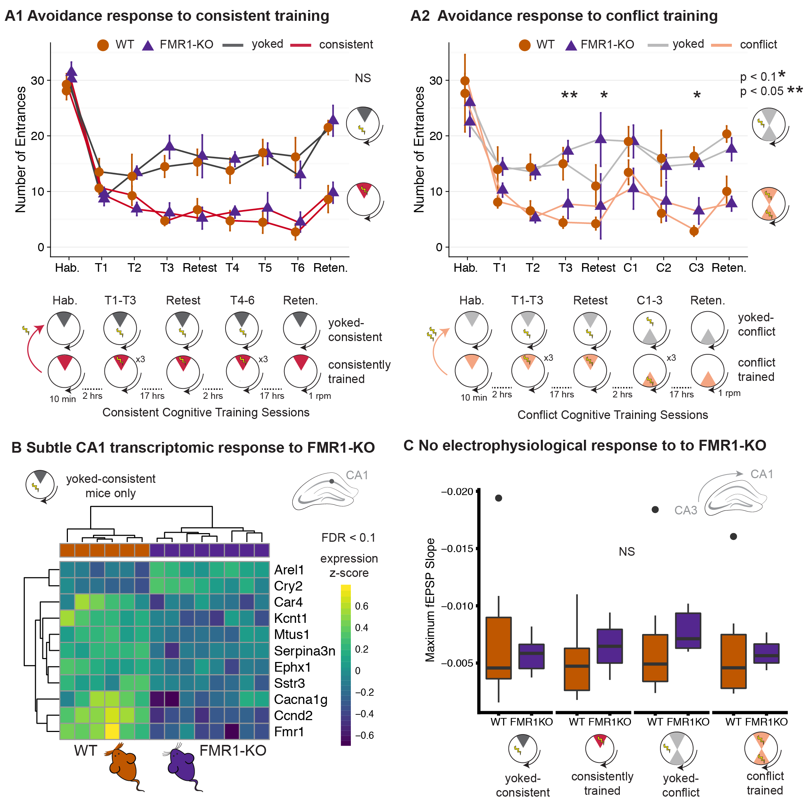

 Fig. 1: Active place avoidance task with
conflict training. Mice were assigned to one of four groups:
consistently-trained (red), yoked-consistent (dark grey),
conflict-trained (peach), or yoked-conflict (light grey). Mice were
placed on the rotating arena (1 rpm) for training sessions that lasted
10 min and was separated by 2-h intersession interval or overnight (~17
h). The physical conditions are identical for all mice during
pre-training and retention. Sample sizes for each treatment group and
genotype are shown on the bottom right.

The Markdown file imports the cleaned data and caluated the number of
animals in each behavioral treatment group for each genotyp. I use
`TrainSessionCombo == "Retention"` as a way to remove the time series
element and only count 1 row per animal.

    behavior <- read.csv("../results/behaviordata.csv", header = T)
    behavior$APA2 <- factor(behavior$APA2, levels = c("yoked-consistent","consistent", "yoked-conflict","conflict")) ## relevel then rename factors treatment
    behavior$Genotype <- factor(behavior$APA2, levels = c("WT","FMR1KO")) # relevel genotype

    # sample size for each group calculated using
    library(dplyr) # for filtering and selecting rows

    behavior %>% 
      filter(TrainSessionCombo == "Retention", Genotype == "WT") %>%
      select(APA2, Genotype)  %>%  summary()

    ##                APA2     Genotype
    ##  yoked-consistent:0   WT    :0  
    ##  consistent      :0   FMR1KO:0  
    ##  yoked-conflict  :0             
    ##  conflict        :0

    behavior %>% 
      filter(TrainSessionCombo == "Retention", Genotype == "FMR1KO") %>%
      select(APA2, Genotype)  %>%  summary()

    ##                APA2     Genotype
    ##  yoked-consistent:0   WT    :0  
    ##  consistent      :0   FMR1KO:0  
    ##  yoked-conflict  :0             
    ##  conflict        :0
