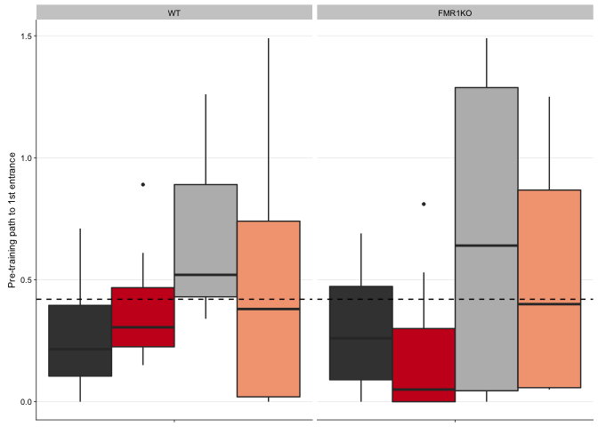

 Fig. 2: No group differences before
behavioral manipulation. A) This graph shows that all groups of mice
spend ~ 25% of their time equally across four quadrants of the arena
during the pre-training session (pink: future shock zone, dark green:
clockwise, green: opposite the shock zone, light green:
counterclockwise). B) Pre-training number of entrances into the shock
zone and C) path to the first entrance are not significantly different
between treatment groups and genotypes (dark grey: yoked-consistent,
red: consistently-trained, light grey: yoked-conflict, peach:
conflict-trained).

These are the packages required for making the figures and doing stats.

    library(dplyr) # for subsetting data 
    library(car) # for fancy ANOVA
    library(ggplot2) # for plotting
    library(cowplot) # for "easier"" ggplot themes

    knitr::opts_chunk$set(fig.path = '../figures/01_behavior/')

This chuck of code is for loading and formatting the dataframes.

    behavior <- read.csv("../results/behaviordata.csv", header = T)
    behavior$APA2 <- factor(behavior$APA2, levels = c("yoked-consistent","consistent", "yoked-conflict","conflict")) ## relevel then rename factors treatment
    behavior$Genotype <- factor(behavior$Genotype, levels = c("WT","FMR1KO")) # relevel genotype

    proptime <- read.csv("../results/behaviorproptime.csv", header = T)
    proptime$APA2 <- factor(proptime$APA2, levels = c("yoked-consistent","consistent", "yoked-conflict","conflict")) ## relevel then rename factors treatment
    proptime$Genotype <- factor(proptime$Genotype, levels = c("WT","FMR1KO")) # relevel genotype
    proptime$variable <- factor(proptime$variable, 
              levels = c("pTimeTarget", "pTimeCCW", "pTimeOPP", "pTimeCW"))

Pannel A
========

This shows time spent in each quadrant indepent of groups. These numbers
are displayed inside a schematic arena on the figure. The colored boxes
corresponding to the behaioral treatment groups were added in Adobe.

    PathNumStats <- behavior  %>% 
      filter(TrainSessionComboNum == "1") 

    mean(PathNumStats$pTimeTarget)

    ## [1] 0.2447605

    mean(PathNumStats$pTimeCCW)

    ## [1] 0.2757767

    mean(PathNumStats$pTimeOPP)

    ## [1] 0.2150884

    mean(PathNumStats$pTimeCW)

    ## [1] 0.2643767

This is the code use to make a stacked bar plot of the proportion of
time spent in the area

    # the name 'timespent3' is a reminant from a previous order of figures
    timespent3 <- proptime %>%
      filter(TrainSessionComboNum %in% c("1")) %>%
      ggplot(aes(x = APA2, y = value,fill = variable)) + 
        geom_bar(position = "fill",stat = "identity") +
        scale_x_discrete(name=NULL,
                         labels = c("yoked", "consistent", "yoked", "conflict")) +
      facet_wrap(~Genotype, nrow=1) +
      theme_cowplot(font_size = 8, line_size = 0.25) +
      theme(legend.title=element_blank()) +
      theme(legend.position="none") +
      scale_y_continuous(name= "Pre-training proportion of time spent") +
      scale_fill_manual(values = c("#f1b6da", "#e5f5e0" ,"#a1d99b", "#31a354")) + 
      geom_hline(yintercept=c(0.25,0.50, 0.75), color="black" , linetype="dashed") +
      theme(strip.text.x = element_text(size = 8)) +
      theme(axis.text.x = element_text(angle = 45, hjust = 1))
    timespent3

    pdf(file="../figures/01_behavior/timespent3.pdf", width=2, height=2.25)
    plot(timespent3)
    dev.off()

    ## quartz_off_screen 
    ##                 2

This is the statistical analysis of variance for the pretraining session

    PathNumStats <- behavior  %>% 
      filter(TrainSessionComboNum == "1") 

    summary(aov(pTimeTarget ~  APA2 + Genotype, data=PathNumStats))

    ##             Df  Sum Sq  Mean Sq F value Pr(>F)
    ## APA2         3 0.00315 0.001049   0.507  0.680
    ## Genotype     1 0.00091 0.000906   0.438  0.512
    ## Residuals   38 0.07868 0.002071

    summary(aov(pTimeOPP ~  APA2 + Genotype, data=PathNumStats))

    ##             Df  Sum Sq   Mean Sq F value Pr(>F)
    ## APA2         3 0.00528 0.0017596   1.051  0.381
    ## Genotype     1 0.00001 0.0000134   0.008  0.929
    ## Residuals   38 0.06360 0.0016736

    summary(aov(pTimeCW ~  APA2 + Genotype, data=PathNumStats))

    ##             Df  Sum Sq   Mean Sq F value Pr(>F)
    ## APA2         3 0.00415 0.0013839   0.507  0.680
    ## Genotype     1 0.00042 0.0004178   0.153  0.698
    ## Residuals   38 0.10375 0.0027302

    summary(aov(pTimeCCW ~  APA2 + Genotype, data=PathNumStats))

    ##             Df  Sum Sq   Mean Sq F value Pr(>F)
    ## APA2         3 0.00906 0.0030208   0.979  0.413
    ## Genotype     1 0.00004 0.0000374   0.012  0.913
    ## Residuals   38 0.11725 0.0030856

    # anova for genotype, training, and the interaction
    library(car)
    Anova(lm(data = PathNumStats, pTimeTarget ~ Genotype * APA2 ), type = 3)

    ## Anova Table (Type III tests)
    ## 
    ## Response: pTimeTarget
    ##                 Sum Sq Df F value    Pr(>F)    
    ## (Intercept)   0.214554  1 96.5179 1.345e-11 ***
    ## Genotype      0.000011  1  0.0048    0.9454    
    ## APA2          0.001534  3  0.2301    0.8748    
    ## Genotype:APA2 0.000881  3  0.1322    0.9403    
    ## Residuals     0.077803 35                      
    ## ---
    ## Signif. codes:  0 '***' 0.001 '**' 0.01 '*' 0.05 '.' 0.1 ' ' 1

    summary(aov(value ~  APA2 * Genotype + variable, data=proptime))

    ##                 Df Sum Sq Mean Sq F value Pr(>F)    
    ## APA2             3   0.00   0.000     0.0      1    
    ## Genotype         1   0.00   0.000     0.0      1    
    ## variable         3  13.62   4.541   224.5 <2e-16 ***
    ## APA2:Genotype    3   0.00   0.000     0.0      1    
    ## Residuals     1537  31.09   0.020                   
    ## ---
    ## Signif. codes:  0 '***' 0.001 '**' 0.01 '*' 0.05 '.' 0.1 ' ' 1

Pannels B and C
---------------

This is for making panel B and C of the number of entrances and path to
first entrance. I make each figure separately, then I used a 3 figure
for cropping a single legend at the bottom. There might be an easier way
to do this, but this is my solution.

    colorvalAPA2 <-  c( "#404040","#ca0020", "#bababa", "#f4a582")

    num1 <- behavior %>%
        filter(TrainSessionComboNum %in% c("1")) %>% 
      ggplot(aes(x = as.numeric(TrainSessionComboNum), y = NumEntrances, fill=APA2)) +
      geom_boxplot(outlier.size=0.8, lwd=0.5) +
      facet_wrap(~Genotype) +
      scale_fill_manual(values = colorvalAPA2) +  
     scale_x_continuous(name=NULL, 
                           breaks = c(1, 2, 3, 4, 5, 6, 7, 8, 9),
                           labels = NULL) +
        background_grid(major = "y", minor = "none") +
       scale_y_continuous(name = "Pre-training number of entrances",
                         limits = c(0,35)) +
      geom_hline(yintercept=c(28.58), color="black", linetype = "dashed" ) + 
      theme_cowplot(font_size = 8, line_size = 0.25) + 
      theme(legend.position="none") +
        background_grid(major = "y", minor = "none") 
    num1

    ## Warning: Removed 4 rows containing non-finite values (stat_boxplot).

    pdf(file="../figures/01_behavior/num1.pdf", width=1.75, height=1.9)
    plot(num1)

    ## Warning: Removed 4 rows containing non-finite values (stat_boxplot).

    dev.off()

    ## quartz_off_screen 
    ##                 2

    path1 <- behavior %>%
        filter(TrainSessionComboNum %in% c("1")) %>% 
      ggplot(aes(x = as.numeric(TrainSessionComboNum), 
                 y = Path1stEntr, fill=APA2)) +
      geom_boxplot(outlier.size=0.8, lwd=0.5) +
      facet_wrap(~Genotype) +
      scale_fill_manual(values = colorvalAPA2) +  
     scale_x_continuous(name=NULL, 
                           breaks = c(1, 2, 3, 4, 5, 6, 7, 8, 9),
                           labels = NULL) +
       scale_y_continuous(name = "Pre-training path to 1st entrance") +
        geom_hline(yintercept=c(0.42), color="black" , linetype = "dashed") + 
      theme_cowplot(font_size = 8, line_size = 0.25) + 
      theme(legend.position="none") +
        background_grid(major = "y", minor = "none") 
    path1

    legend2 <- behavior %>%
        filter(TrainSessionComboNum %in% c("1")) %>% 
      ggplot(aes(x = as.numeric(TrainSessionComboNum), 
                 y = NumEntrances, fill=APA2)) +
      geom_boxplot(outlier.size=0.8) +
      facet_wrap(~Genotype) +
      scale_fill_manual(values = colorvalAPA2) + 
        scale_y_continuous(name = "Number of entrances") +
     scale_x_continuous(name=NULL, 
                           breaks = c(1, 2, 3, 4, 5, 6, 7, 8, 9),
                           labels = NULL)  +
      theme_cowplot(font_size = 7, line_size = 0.25) +
      theme(legend.position = "bottom")
    legend2

    pdf(file="../figures/01_behavior/path1.pdf", width=1.75, height=1.9)
    plot(path1)
    dev.off()

    ## quartz_off_screen 
    ##                 2

    pdf(file="../figures/01_behavior/legend2.pdf", width=4, height=2)
    plot(legend2)
    dev.off()

    ## quartz_off_screen 
    ##                 2

This is for calculating the mean number of entrance or 1st path to the
shock zone and the corrresponding ANOVA.

    summary(aov(NumEntrances ~  APA2 * Genotype, data=PathNumStats))

    ##               Df Sum Sq Mean Sq F value Pr(>F)
    ## APA2           3  133.4   44.48   1.717  0.181
    ## Genotype       1    2.7    2.74   0.106  0.747
    ## APA2:Genotype  3  127.6   42.55   1.643  0.197
    ## Residuals     35  906.6   25.90

    summary(aov(Path1stEntr~  APA2 * Genotype, data=PathNumStats))

    ##               Df Sum Sq Mean Sq F value Pr(>F)
    ## APA2           3  0.943 0.31429   1.583  0.211
    ## Genotype       1  0.028 0.02777   0.140  0.711
    ## APA2:Genotype  3  0.098 0.03277   0.165  0.919
    ## Residuals     35  6.947 0.19848

    mean(PathNumStats$NumEntrances)

    ## [1] 28.5814

    mean(PathNumStats$Path1stEntr)

    ## [1] 0.4237209
