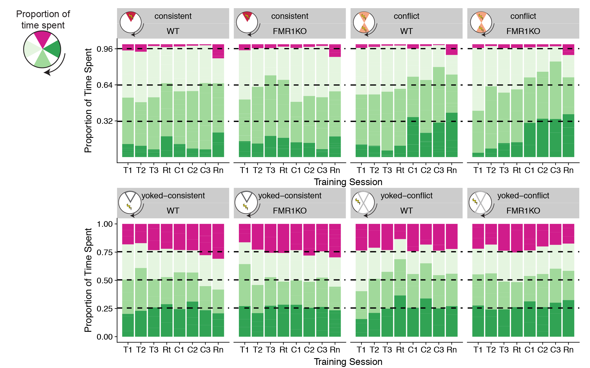

Fig. 3. The proportion of time spent in in the arena with the shock on.
The average proportion of time spent in each 60 degrees quadrant of the
arena was calculated or each group for each session with the shock was
on (T1, T2, T3: training sessions 1-3; R1: retest; C1, C2, C3: conflict
training sessions; pink: future shock zone; dark green: clockwise;
green: opposite the shock zone; light green: counter clockwise). For
trained mice, mice are expected to spend very little time in the shock
zone (&lt;0.4%) and to equally split their time between the three
remaining quadrants (~32% each). For yoked mice, time spent is expected
to be evenly distributed across all four quadrants (~25% each).

These are the packages required for making the figures and doing stats.

    library(dplyr) # for subsetting data 
    library(car) # for fancy ANOVA
    library(ggplot2) # for plotting
    library(cowplot) # for "easier"" ggplot themes

    knitr::opts_chunk$set(fig.path = '../figures/01_behavior/')

This chuck of code is for loading and formatting the dataframes.

    behavior <- read.csv("../results/behaviordata.csv", header = T)
    behavior$APA2 <- factor(behavior$APA2, levels = c("yoked-consistent","consistent", "yoked-conflict","conflict")) ## relevel then rename factors treatment
    behavior$Genotype <- factor(behavior$Genotype, levels = c("WT","FMR1KO")) # relevel genotype

    proptime <- read.csv("../results/behaviorproptime.csv", header = T)
    proptime$APA2 <- factor(proptime$APA2, levels = c("yoked-consistent","consistent", "yoked-conflict","conflict")) ## relevel then rename factors treatment
    proptime$Genotype <- factor(proptime$Genotype, levels = c("WT","FMR1KO")) # relevel genotype
    proptime$variable <- factor(proptime$variable, 
              levels = c("pTimeTarget", "pTimeCCW", "pTimeOPP", "pTimeCW"))

This is for making the figures that show propotion of time spent in each
quadrant during the training and retest sessions only. I had to make two
figures so that I put the expected percent time as dashed lines on the
y-axis with `geom_hline`.

    timespent1 <- proptime %>%
      filter(APA2 %in% c("consistent","conflict")) %>%
      filter(TrainSessionComboNum != 1, TrainSessionComboNum != 9 ) %>%
      ggplot(aes(x = TrainSessionComboNum, y = value,fill = variable)) + 
        geom_bar(position = "fill",stat = "identity") +
        scale_x_continuous(name="Training Session", 
                           breaks = c(1, 2, 3, 4, 5, 6, 7, 8, 9),
                           labels = c( "P", "T1", "T2", "T3",
                                       "Rt", "C1", "C2","C3", 
                                       "Rn")) +
      facet_wrap(~APA2*Genotype, nrow=1) +
      theme_cowplot(font_size = 8, line_size = 0.25) +  theme(legend.title=element_blank()) +
        theme(legend.position="none") +
      scale_y_continuous(name= "Proportion of Time Spent",
                         breaks = c(0.32,0.64, 0.96)) +
      scale_fill_manual(values = c("#d01c8b", "#e5f5e0" ,"#a1d99b", "#31a354")) + 
      geom_hline(yintercept=c(0.32,0.64, 0.96), color="black" , linetype="dashed") 
    timespent1

    timespent2 <- proptime %>%
      filter(APA2 %in% c("yoked-consistent","yoked-conflict")) %>%
        filter(TrainSessionComboNum != 1, TrainSessionComboNum != 9 ) %>%
      ggplot(aes(x = TrainSessionComboNum, y = value,fill = variable)) + 
        geom_bar(position = "fill",stat = "identity") +
        scale_x_continuous(name="Training Session", 
                           breaks = c(1, 2, 3, 4, 5, 6, 7, 8, 9),
                           labels = c( "P", "T1", "T2", "T3",
                                       "Rt", "C1", "C2","C3", 
                                       "Rn")) +
      facet_wrap(~APA2*Genotype, nrow=1) +
      theme_cowplot(font_size = 8, line_size = 0.25) +
      theme(legend.title=element_blank()) +
      theme(legend.position="none") +
      scale_y_continuous(name= "Proportion of Time Spent") +
      scale_fill_manual(values = c("#d01c8b", "#e5f5e0" ,"#a1d99b", "#31a354")) + 
      geom_hline(yintercept=c(0.25,0.50, 0.75), color="black" , linetype="dashed")
    timespent2

    pdf(file="../figures/01_behavior/timespent1.pdf", width=6, height=2.25)
    plot(timespent1)
    dev.off()

    ## quartz_off_screen 
    ##                 2

    pdf(file="../figures/01_behavior/timespent2.pdf", width=6, height=2.25)
    plot(timespent2)
    dev.off()

    ## quartz_off_screen 
    ##                 2

The statistics on time spend during the training and retest session (but
not the first and last pre-training and retest sessions).

    PathNumStats <- behavior  %>% 
      filter(TrainSessionComboNum != "1", TrainSessionComboNum != "9") 
    summary(aov(pTimeTarget ~  APA2 * Genotype, data=PathNumStats))

    ##                Df Sum Sq Mean Sq F value Pr(>F)    
    ## APA2            3 2.6064  0.8688 262.921 <2e-16 ***
    ## Genotype        1 0.0031  0.0031   0.952  0.330    
    ## APA2:Genotype   3 0.0026  0.0009   0.263  0.852    
    ## Residuals     286 0.9451  0.0033                   
    ## ---
    ## Signif. codes:  0 '***' 0.001 '**' 0.01 '*' 0.05 '.' 0.1 ' ' 1

    summary(aov(pTimeOPP ~  APA2 * Genotype, data=PathNumStats))

    ##                Df Sum Sq Mean Sq F value Pr(>F)    
    ## APA2            3  2.354  0.7847  39.138 <2e-16 ***
    ## Genotype        1  0.034  0.0344   1.717  0.191    
    ## APA2:Genotype   3  0.004  0.0013   0.067  0.977    
    ## Residuals     286  5.734  0.0200                   
    ## ---
    ## Signif. codes:  0 '***' 0.001 '**' 0.01 '*' 0.05 '.' 0.1 ' ' 1

    summary(aov(pTimeTarget ~  APA2 * Genotype, data=PathNumStats))

    ##                Df Sum Sq Mean Sq F value Pr(>F)    
    ## APA2            3 2.6064  0.8688 262.921 <2e-16 ***
    ## Genotype        1 0.0031  0.0031   0.952  0.330    
    ## APA2:Genotype   3 0.0026  0.0009   0.263  0.852    
    ## Residuals     286 0.9451  0.0033                   
    ## ---
    ## Signif. codes:  0 '***' 0.001 '**' 0.01 '*' 0.05 '.' 0.1 ' ' 1

    summary(aov(pTimeCCW ~  APA2 * Genotype, data=PathNumStats))

    ##                Df Sum Sq Mean Sq F value   Pr(>F)    
    ## APA2            3  1.143  0.3809  16.824 4.31e-10 ***
    ## Genotype        1  0.001  0.0012   0.053    0.818    
    ## APA2:Genotype   3  0.007  0.0023   0.100    0.960    
    ## Residuals     286  6.475  0.0226                     
    ## ---
    ## Signif. codes:  0 '***' 0.001 '**' 0.01 '*' 0.05 '.' 0.1 ' ' 1

    timespent <- behavior %>%
        filter(TrainSessionComboNum %in% c("2", "3", "4", "5" ,"6", "7", "8")) 
    Anova(lm(data = timespent, pTimeTarget ~ Genotype * APA2 ), type = 3)

    ## Anova Table (Type III tests)
    ## 
    ## Response: pTimeTarget
    ##                Sum Sq  Df  F value Pr(>F)    
    ## (Intercept)   1.36256   1 412.3498 <2e-16 ***
    ## Genotype      0.00493   1   1.4909 0.2231    
    ## APA2          1.27461   3 128.5783 <2e-16 ***
    ## Genotype:APA2 0.00260   3   0.2627 0.8523    
    ## Residuals     0.94505 286                    
    ## ---
    ## Signif. codes:  0 '***' 0.001 '**' 0.01 '*' 0.05 '.' 0.1 ' ' 1

    timespent <- behavior %>%
        filter(TrainSessionComboNum %in% c("2", "3", "4", "5" ,"6", "7", "8")) %>%
      filter(APA2 %in% c("yoked-consistent", "yoked-conflict"))
    Anova(lm(data = timespent, pTimeTarget ~ Genotype * APA2 ), type = 3)

    ## Anova Table (Type III tests)
    ## 
    ## Response: pTimeTarget
    ##                Sum Sq Df  F value Pr(>F)    
    ## (Intercept)   1.36256  1 191.1769 <2e-16 ***
    ## Genotype      0.00493  1   0.6912 0.4077    
    ## APA2          0.00094  1   0.1320 0.7171    
    ## Genotype:APA2 0.00135  1   0.1896 0.6642    
    ## Residuals     0.70559 99                    
    ## ---
    ## Signif. codes:  0 '***' 0.001 '**' 0.01 '*' 0.05 '.' 0.1 ' ' 1

    timespent <- behavior %>%
        filter(TrainSessionComboNum %in% c("2", "3", "4")) %>%
      filter(APA2 %in% c("consistent", "conflict"))
    summary(aov(data =  timespent, pTimeTarget ~ Genotype * APA2 ))

    ##               Df  Sum Sq  Mean Sq F value Pr(>F)  
    ## Genotype       1 0.00009 0.000085   0.040 0.8414  
    ## APA2           1 0.00729 0.007289   3.438 0.0674 .
    ## Genotype:APA2  1 0.00038 0.000385   0.182 0.6712  
    ## Residuals     80 0.16959 0.002120                 
    ## ---
    ## Signif. codes:  0 '***' 0.001 '**' 0.01 '*' 0.05 '.' 0.1 ' ' 1

    Anova(lm(data = timespent, pTimeTarget ~ Genotype * APA2 ), type = 3)

    ## Anova Table (Type III tests)
    ## 
    ## Response: pTimeTarget
    ##                 Sum Sq Df F value    Pr(>F)    
    ## (Intercept)   0.048546  1 22.9009 7.678e-06 ***
    ## Genotype      0.000269  1  0.1268   0.72272    
    ## APA2          0.006319  1  2.9809   0.08811 .  
    ## Genotype:APA2 0.000385  1  0.1816   0.67117    
    ## Residuals     0.169586 80                      
    ## ---
    ## Signif. codes:  0 '***' 0.001 '**' 0.01 '*' 0.05 '.' 0.1 ' ' 1
