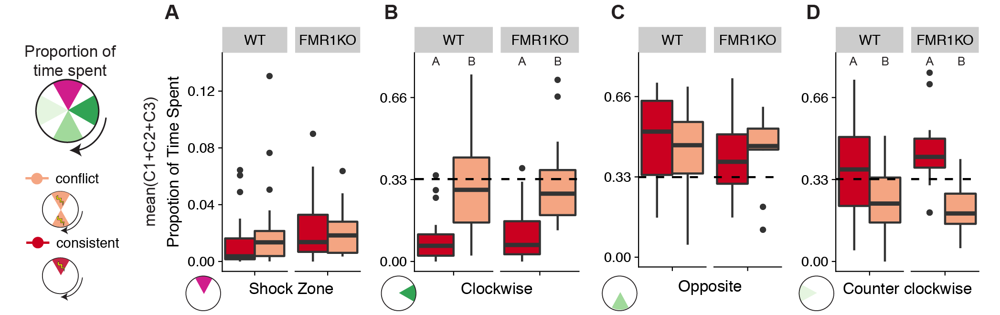
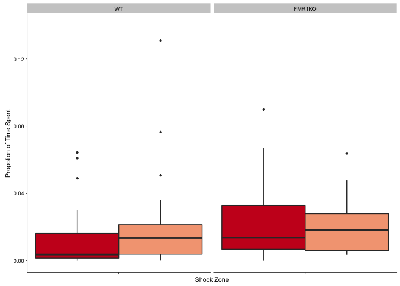
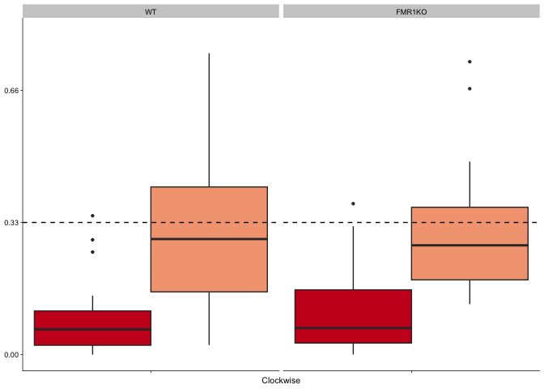
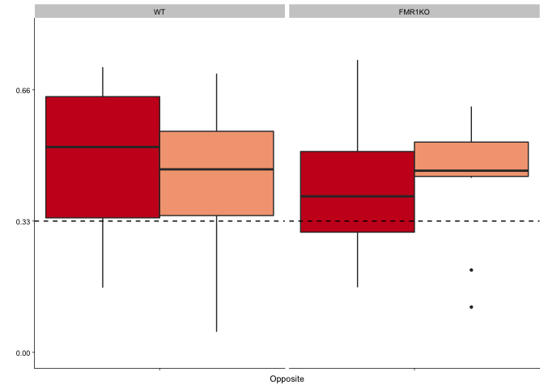
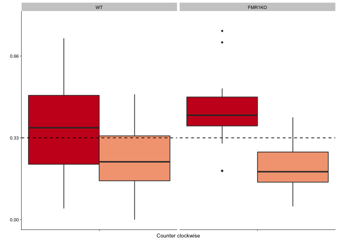

 Fig. 2.4: Consistent and
conflict trained mice use space differently during conflict training
sessions. A) During the conflict training sessions, consistent and
conflict mice both avoid the shock zone, but there is not a difference
between groups. B) Consistently trained mice spend significantly less
time in space clockwise to the shock zone. C) All groups spend more time
on average in the space opposite the shock zone, but there are no group
differences. D) Consistently trained mice spend more time in the
counterclockwise zone than conflict mice. Legend) dark grey:
yoked-consistent, red: consistently-trained, light grey: yoked-conflict,
peach: conflict-trained.

These are the packages required for making the figures and doing stats.

    library(dplyr) # for subsetting data 
    library(car) # for fancy ANOVA
    library(ggplot2) # for plotting
    library(cowplot) # for "easier"" ggplot themes

    knitr::opts_chunk$set(fig.path = '../figures/01_behavior/')

This chuck of code is for loading and formatting the dataframes.

    behavior <- read.csv("../results/behaviordata.csv", header = T)
    behavior$APA2 <- factor(behavior$APA2, levels = c("yoked-consistent","consistent", "yoked-conflict","conflict")) ## relevel then rename factors treatment
    behavior$Genotype <- factor(behavior$Genotype, levels = c("WT","FMR1KO")) # relevel genotype

Panels A, B, C, and D

    ## quartz_off_screen 
    ##                 2

    ## quartz_off_screen 
    ##                 2

    ## quartz_off_screen 
    ##                 2

    ## quartz_off_screen 
    ##                 2

    # time spent consistent and conflict only
    timespent <- behavior %>%
        filter(TrainSessionComboNum %in% c("6", "7", "8")) %>%
      filter(APA2 %in% c("consistent", "conflict"))
    Anova(lm(data = timespent, pTimeTarget ~ Genotype * APA2 ), type = 3)

    ## Anova Table (Type III tests)
    ## 
    ## Response: pTimeTarget
    ##                 Sum Sq Df F value   Pr(>F)   
    ## (Intercept)   0.004166  1  7.5179 0.007573 **
    ## Genotype      0.001086  1  1.9598 0.165496   
    ## APA2          0.000674  1  1.2166 0.273413   
    ## Genotype:APA2 0.000331  1  0.5973 0.441959   
    ## Residuals     0.043222 78                    
    ## ---
    ## Signif. codes:  0 '***' 0.001 '**' 0.01 '*' 0.05 '.' 0.1 ' ' 1

    Anova(lm(data = timespent, pTimeCW ~ Genotype * APA2 ), type = 3)

    ## Anova Table (Type III tests)
    ## 
    ## Response: pTimeCW
    ##                Sum Sq Df F value    Pr(>F)    
    ## (Intercept)   0.18035  1  7.8726  0.006334 ** 
    ## Genotype      0.00610  1  0.2661  0.607424    
    ## APA2          0.53471  1 23.3405 6.651e-06 ***
    ## Genotype:APA2 0.00061  1  0.0267  0.870690    
    ## Residuals     1.78689 78                      
    ## ---
    ## Signif. codes:  0 '***' 0.001 '**' 0.01 '*' 0.05 '.' 0.1 ' ' 1

    Anova(lm(data = timespent, pTimeCCW ~ Genotype * APA2 ), type = 3)

    ## Anova Table (Type III tests)
    ## 
    ## Response: pTimeCCW
    ##               Sum Sq Df  F value    Pr(>F)    
    ## (Intercept)   3.4318  1 131.5911 < 2.2e-16 ***
    ## Genotype      0.0667  1   2.5578  0.113793    
    ## APA2          0.2160  1   8.2837  0.005159 ** 
    ## Genotype:APA2 0.0668  1   2.5604  0.113612    
    ## Residuals     2.0342 78                       
    ## ---
    ## Signif. codes:  0 '***' 0.001 '**' 0.01 '*' 0.05 '.' 0.1 ' ' 1

    Anova(lm(data = timespent, pTimeOPP ~ Genotype * APA2 ), type = 3)

    ## Anova Table (Type III tests)
    ## 
    ## Response: pTimeOPP
    ##               Sum Sq Df  F value  Pr(>F)    
    ## (Intercept)   6.5392  1 227.5348 < 2e-16 ***
    ## Genotype      0.1363  1   4.7442 0.03242 *  
    ## APA2          0.0854  1   2.9729 0.08863 .  
    ## Genotype:APA2 0.0634  1   2.2059 0.14152    
    ## Residuals     2.2417 78                     
    ## ---
    ## Signif. codes:  0 '***' 0.001 '**' 0.01 '*' 0.05 '.' 0.1 ' ' 1

    TukeyHSD(aov(data = timespent, pTimeTarget ~ Genotype * APA2 ))

    ##   Tukey multiple comparisons of means
    ##     95% family-wise confidence level
    ## 
    ## Fit: aov(formula = pTimeTarget ~ Genotype * APA2, data = timespent)
    ## 
    ## $Genotype
    ##                 diff          lwr        upr     p adj
    ## FMR1KO-WT 0.00582024 -0.004852756 0.01649324 0.2809749
    ## 
    ## $APA2
    ##                            diff         lwr        upr     p adj
    ## conflict-consistent 0.004113866 -0.00624914 0.01447687 0.4317379
    ## 
    ## $`Genotype:APA2`
    ##                                           diff          lwr        upr
    ## FMR1KO:consistent-WT:consistent    0.010119737 -0.008857671 0.02909715
    ## WT:conflict-WT:consistent          0.007284259 -0.010053089 0.02462161
    ## FMR1KO:conflict-WT:consistent      0.008975000 -0.012874429 0.03082443
    ## WT:conflict-FMR1KO:consistent     -0.002835478 -0.021341169 0.01567021
    ## FMR1KO:conflict-FMR1KO:consistent -0.001144737 -0.023932333 0.02164286
    ## FMR1KO:conflict-WT:conflict        0.001690741 -0.019750252 0.02313173
    ##                                       p adj
    ## FMR1KO:consistent-WT:consistent   0.5032108
    ## WT:conflict-WT:consistent         0.6887573
    ## FMR1KO:conflict-WT:consistent     0.7036780
    ## WT:conflict-FMR1KO:consistent     0.9778290
    ## FMR1KO:conflict-FMR1KO:consistent 0.9991738
    ## FMR1KO:conflict-WT:conflict       0.9968360

    TukeyHSD(aov(data = timespent, pTimeCW ~ Genotype * APA2 ))

    ##   Tukey multiple comparisons of means
    ##     95% family-wise confidence level
    ## 
    ## Fit: aov(formula = pTimeCW ~ Genotype * APA2, data = timespent)
    ## 
    ## $Genotype
    ##                    diff         lwr        upr    p adj
    ## FMR1KO-WT -0.0007857052 -0.06941043 0.06783902 0.981873
    ## 
    ## $APA2
    ##                         diff       lwr       upr p adj
    ## conflict-consistent 0.205344 0.1387124 0.2719755     0
    ## 
    ## $`Genotype:APA2`
    ##                                         diff         lwr       upr
    ## FMR1KO:consistent-WT:consistent   0.02397566 -0.09804438 0.1459957
    ## WT:conflict-WT:consistent         0.20514213  0.09366727 0.3166170
    ## FMR1KO:conflict-WT:consistent     0.24057083  0.10008441 0.3810573
    ## WT:conflict-FMR1KO:consistent     0.18116647  0.06217945 0.3001535
    ## FMR1KO:conflict-FMR1KO:consistent 0.21659518  0.07007657 0.3631138
    ## FMR1KO:conflict-WT:conflict       0.03542870 -0.10243157 0.1732890
    ##                                       p adj
    ## FMR1KO:consistent-WT:consistent   0.9550673
    ## WT:conflict-WT:consistent         0.0000389
    ## FMR1KO:conflict-WT:consistent     0.0001379
    ## WT:conflict-FMR1KO:consistent     0.0008182
    ## FMR1KO:conflict-FMR1KO:consistent 0.0012165
    ## FMR1KO:conflict-WT:conflict       0.9063729

    TukeyHSD(aov(data = timespent, pTimeCCW ~ Genotype * APA2 ))

    ##   Tukey multiple comparisons of means
    ##     95% family-wise confidence level
    ## 
    ## Fit: aov(formula = pTimeCCW ~ Genotype * APA2, data = timespent)
    ## 
    ## $Genotype
    ##                 diff         lwr       upr     p adj
    ## FMR1KO-WT 0.05152245 -0.02169689 0.1247418 0.1652085
    ## 
    ## $APA2
    ##                           diff        lwr         upr   p adj
    ## conflict-consistent -0.1709606 -0.2420533 -0.09986782 7.9e-06
    ## 
    ## $`Genotype:APA2`
    ##                                          diff         lwr         upr
    ## FMR1KO:consistent-WT:consistent    0.07931096 -0.05087865  0.20950058
    ## WT:conflict-WT:consistent         -0.13039352 -0.24933193 -0.01145511
    ## FMR1KO:conflict-WT:consistent     -0.17080833 -0.32070071 -0.02091596
    ## WT:conflict-FMR1KO:consistent     -0.20970448 -0.33665801 -0.08275096
    ## FMR1KO:conflict-FMR1KO:consistent -0.25011930 -0.40644773 -0.09379087
    ## FMR1KO:conflict-WT:conflict       -0.04041481 -0.18750522  0.10667559
    ##                                       p adj
    ## FMR1KO:consistent-WT:consistent   0.3850072
    ## WT:conflict-WT:consistent         0.0259978
    ## FMR1KO:conflict-WT:consistent     0.0190587
    ## WT:conflict-FMR1KO:consistent     0.0002467
    ## FMR1KO:conflict-FMR1KO:consistent 0.0004019
    ## FMR1KO:conflict-WT:conflict       0.8883106

    TukeyHSD(aov(data = timespent, pTimeOPP ~ Genotype * APA2 ))

    ##   Tukey multiple comparisons of means
    ##     95% family-wise confidence level
    ## 
    ## Fit: aov(formula = pTimeOPP ~ Genotype * APA2, data = timespent)
    ## 
    ## $Genotype
    ##                  diff        lwr        upr     p adj
    ## FMR1KO-WT -0.05656091 -0.1334239 0.02030207 0.1469407
    ## 
    ## $APA2
    ##                            diff        lwr        upr     p adj
    ## conflict-consistent -0.03848289 -0.1131134 0.03614765 0.3077956
    ## 
    ## $`Genotype:APA2`
    ##                                           diff        lwr        upr
    ## FMR1KO:consistent-WT:consistent   -0.113388596 -0.2500569 0.02327968
    ## WT:conflict-WT:consistent         -0.082001852 -0.2068590 0.04285532
    ## FMR1KO:conflict-WT:consistent     -0.078733333 -0.2360848 0.07861818
    ## WT:conflict-FMR1KO:consistent      0.031386745 -0.1018844 0.16465790
    ## FMR1KO:conflict-FMR1KO:consistent  0.034655263 -0.1294526 0.19876311
    ## FMR1KO:conflict-WT:conflict        0.003268519 -0.1511416 0.15767862
    ##                                       p adj
    ## FMR1KO:consistent-WT:consistent   0.1384239
    ## WT:conflict-WT:consistent         0.3182425
    ## FMR1KO:conflict-WT:consistent     0.5571467
    ## WT:conflict-FMR1KO:consistent     0.9259496
    ## FMR1KO:conflict-FMR1KO:consistent 0.9450870
    ## FMR1KO:conflict-WT:conflict       0.9999378

    timespent <- behavior %>%
        filter(TrainSessionComboNum %in% c("6", "7", "8")) %>%
      filter(APA2 %in% c("conflict"))

    mean(timespent$pTimeTarget)

    ## [1] 0.02097949

    mean(timespent$pTimeOPP)

    ## [1] 0.4409872

    mean(timespent$pTimeCW)

    ## [1] 0.3027308

    mean(timespent$pTimeCCW)

    ## [1] 0.2353128

    timespent <- behavior %>%
        filter(TrainSessionComboNum %in% c("6", "7", "8")) %>%
      filter(APA2 %in% c("consistent"))

    mean(timespent$pTimeTarget)

    ## [1] 0.01764651

    mean(timespent$pTimeOPP)

    ## [1] 0.4718814

    mean(timespent$pTimeCW)

    ## [1] 0.0972814

    mean(timespent$pTimeCCW)

    ## [1] 0.413186

    timespent <- behavior %>%
        filter(TrainSessionComboNum %in% c("6", "7", "8")) %>%
      filter(Genotype %in% c("FMR1KO"))
    mean(timespent$pTimeOPP)

    ## [1] 0.3438088

    timespent <- behavior %>%
        filter(TrainSessionComboNum %in% c("6", "7", "8")) %>%
      filter(Genotype %in% c("WT"))
    mean(timespent$pTimeOPP)

    ## [1] 0.4225437
