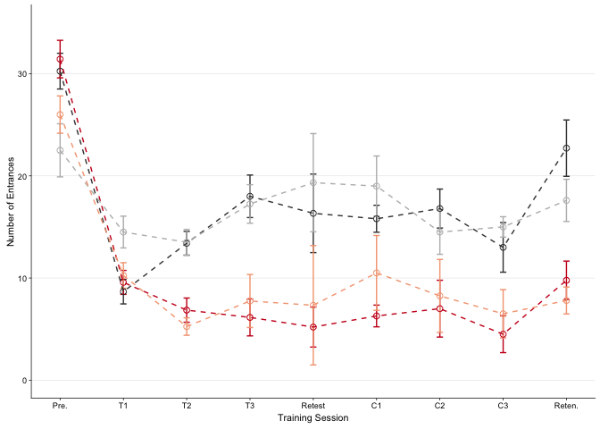
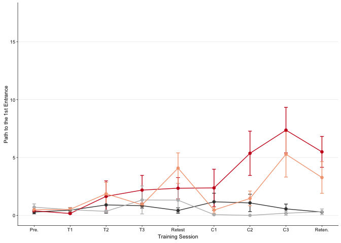

 Fig. 2.5. Summary of punishment
and estimates of memory in WT and FMR1-KO mice A) Expected results for
number of entrances based on data from Chapter 1 and Radwan et al.8 B,C)
Consistent and conflict trained mice from WT and FMR1-KO groups to make
fewer entrances into the shock zone than yoked-mice; however, the
pattern does not exactly match the expected results. D) Expected results
for number of entrances based on data from Chapter 1 and Radwan et al.8
E, F) Consistent and conflict trained mice from WT FMR1-KO do not show
evidence of place memory until after the first day of initial training.
This pattern does also not mirror the expected results. Legend) Pre:
pre-training; T1, T2, T3: training sessions 1-3; C1, C2, C3: conflict
training sessions; Reten.: retention session; dark grey:
yoked-consistent, red: consistently-trained, light grey: yoked-conflict,
peach: conflict-trained. The pie-shaped shaded regions of the inserts
highlight the region used to count the number of entrances.

These are the packages required for making the figures and doing stats.

    library(dplyr) # for subsetting data 
    library(car) # for fancy ANOVA
    library(ggplot2) # for plotting
    library(cowplot) # for "easier"" ggplot themes

    knitr::opts_chunk$set(fig.path = '../figures/01_behavior/')

    colorvalAPA2 <-  c( "#404040","#ca0020", "#bababa", "#f4a582")

This chuck of code is for loading and formatting the dataframes.

    behavior <- read.csv("../results/behaviordata.csv", header = T)
    behavior$APA2 <- factor(behavior$APA2, levels = c("yoked-consistent","consistent", "yoked-conflict","conflict")) ## relevel then rename factors treatment
    behavior$Genotype <- factor(behavior$Genotype, levels = c("WT","FMR1KO")) # relevel genotype

    PathNum <- read.csv("../results/behaviordatasummary.csv", header = T)
    PathNum$APA2 <- factor(PathNum$APA2, levels = c("yoked-consistent","consistent", "yoked-conflict","conflict")) ## relevel then rename factors treatment
    PathNum$Genotype <- factor(PathNum$Genotype, levels = c("WT","FMR1KO")) # relevel genotype

5B Number of entrances in WT
============================

    numenrwt <- PathNum  %>% 
      filter(measure == "Number of Entrances") %>% 
      filter(Genotype == "WT") %>% 
      droplevels()  %>% 
      ggplot(aes(x=, TrainSessionComboNum, y=m, color=APA2, shape=Genotype)) + 
        geom_errorbar(aes(ymin=m-se, ymax=m+se), width=.1) +
        geom_point(size = 2) +
       geom_line(aes(colour=APA2, linetype=Genotype)) +
       scale_y_continuous(name= "Number of Entrances",
                          limits = c(0,35)) +
        scale_x_continuous(name="Training Session", 
                           breaks = c(1, 2, 3, 4, 5, 6, 7, 8, 9),
                           labels = c( "Pre.", "T1", "T2", "T3",
                                       "Retest", "C1", "C2" ,"C3", 
                                       "Reten.")) +
      theme_cowplot(font_size = 8, line_size = 0.25) +
      background_grid(major = "y", minor="non") +
      scale_color_manual(values = colorvalAPA2)  +
      theme(legend.title=element_blank()) +
      theme(legend.position="none") +
      scale_shape_manual(values=c(16, 1)) 
    numenrwt

    pdf(file="../figures/01_behavior/numenrwt.pdf", width=2.25, height=2)
    plot(numenrwt)
    dev.off()

    ## quartz_off_screen 
    ##                 2

5C Number of entrances in FMR1-KO
=================================

    numenrfmr1 <- PathNum  %>% 
      filter(measure == "Number of Entrances") %>% 
      filter(Genotype != "WT") %>% 
      ggplot(aes(x=, TrainSessionComboNum, y=m, color=APA2, shape=Genotype)) + 
        geom_errorbar(aes(ymin=m-se, ymax=m+se), width=.1) +
        geom_point(size = 2) +
       geom_line(linetype = 2, aes(colour=APA2)) +
       scale_y_continuous(name= "Number of Entrances",
                          limits = c(0,35)) +
        scale_x_continuous(name="Training Session", 
                           breaks = c(1, 2, 3, 4, 5, 6, 7, 8, 9),
                           labels = c( "Pre.", "T1", "T2", "T3",
                                       "Retest", "C1", "C2","C3", 
                                      "Reten.")) +
      theme_cowplot(font_size = 8, line_size = 0.25) +
      background_grid(major = "y", minor = "none") +
      scale_color_manual(values = colorvalAPA2)  +
      theme(legend.title=element_blank()) +
      theme(legend.position="none") +
      scale_shape_manual(values=c(1)) 
    numenrfmr1

    pdf(file="../figures/01_behavior/numenrfmr1.pdf", width=2.25, height=2)
    plot(numenrfmr1)
    dev.off()

    ## quartz_off_screen 
    ##                 2

5E Path to first entrances in WT
--------------------------------

    pathwt <- PathNum  %>% 
      #filter(TrainSessionComboNum != "1", TrainSessionComboNum != "9") %>% 
      filter(measure == "Path to the 1st Entrance") %>% 
      filter(Genotype == "WT") %>% 
      ggplot(aes(x=, TrainSessionComboNum, y=m, color=APA2, shape=Genotype)) + 
        geom_errorbar(aes(ymin=m-se, ymax=m+se), width=.1) +
        geom_point(size = 2) +
       geom_line(linetype = 1, aes(colour=APA2)) +
       scale_y_continuous(name= "Path to the 1st Entrance",
                          limits = c(0,17.5)) +
        scale_x_continuous(name="Training Session", 
                           breaks = c(1, 2, 3, 4, 5, 6, 7, 8, 9),
                           labels = c( "Pre.", "T1", "T2", "T3",
                                       "Retest", "C1", "C2","C3", 
                                       "Reten.")) +
      theme_cowplot(font_size = 8, line_size = 0.25) +
      background_grid(major = "y", minor = "none") +
      scale_color_manual(values = colorvalAPA2)  +
      theme(legend.title=element_blank()) +
      theme(legend.position="none") +
      scale_shape_manual(values=c(16)) 
    pathwt

    pdf(file="../figures/01_behavior/pathwt.pdf", width=2.25, height=2)
    plot(pathwt)
    dev.off()

    ## quartz_off_screen 
    ##                 2

5F Path to first entrances in FMR1-KO
-------------------------------------

    pathfmr1 <- PathNum  %>% 
      filter(measure == "Path to the 1st Entrance") %>% 
      filter(Genotype != "WT") %>% 
      ggplot(aes(x=, TrainSessionComboNum, y=m, color=APA2, shape=Genotype)) + 
        geom_errorbar(aes(ymin=m-se, ymax=m+se), width=.1) +
        geom_point(size = 2) +
       geom_line(linetype = 2, aes(colour=APA2)) +
       scale_y_continuous(name= "Path to the 1st Entrance",
                          limits = c(0,17.5)) +
        scale_x_continuous(name="Training Session", 
                           breaks = c(1, 2, 3, 4, 5, 6, 7, 8, 9),
                           labels = c( "Pre.", "T1", "T2", "T3",
                                       "Retest", "C1", "C2", "C3", 
                                        "Reten.")) +
      theme_cowplot(font_size = 8, line_size = 0.25) +
      background_grid(major = "y", minor = "none") +
      scale_color_manual(values = colorvalAPA2)  +
      theme(legend.title=element_blank()) +
      theme(legend.position="none") +
      scale_shape_manual(values=c(1)) 
    pathfmr1

    pdf(file="../figures/01_behavior/pathfmr1.pdf", width=2.25, height=2)
    plot(pathfmr1)
    dev.off()

    ## quartz_off_screen 
    ##                 2

Statistics

    ## conflict
    PathNumStats <- behavior  %>% 
      filter(TrainSessionComboNum == "1") 
    Anova(lm(data = PathNumStats, NumEntrances ~ Genotype * APA2 ), type = 3)

    ## Anova Table (Type III tests)
    ## 
    ## Response: NumEntrances
    ##               Sum Sq Df  F value    Pr(>F)    
    ## (Intercept)   3422.2  1 132.1121 1.965e-13 ***
    ## Genotype         2.0  1   0.0772    0.7828    
    ## APA2            18.7  3   0.2400    0.8678    
    ## Genotype:APA2  127.6  3   1.6425    0.1972    
    ## Residuals      906.6 35                       
    ## ---
    ## Signif. codes:  0 '***' 0.001 '**' 0.01 '*' 0.05 '.' 0.1 ' ' 1

    summary(aov(NumEntrances ~  APA2 * Genotype, data=PathNumStats))

    ##               Df Sum Sq Mean Sq F value Pr(>F)
    ## APA2           3  133.4   44.48   1.717  0.181
    ## Genotype       1    2.7    2.74   0.106  0.747
    ## APA2:Genotype  3  127.6   42.55   1.643  0.197
    ## Residuals     35  906.6   25.90

    TukeyHSD(aov(NumEntrances~  APA2 * Genotype, data=PathNumStats))

    ##   Tukey multiple comparisons of means
    ##     95% family-wise confidence level
    ## 
    ## Fit: aov(formula = NumEntrances ~ APA2 * Genotype, data = PathNumStats)
    ## 
    ## $APA2
    ##                                        diff        lwr       upr     p adj
    ## consistent-yoked-consistent     -0.08333333  -6.092623  5.925957 0.9999808
    ## yoked-conflict-yoked-consistent -5.03571429 -12.139690  2.068262 0.2417174
    ## conflict-yoked-consistent       -1.05769231  -7.225671  5.110286 0.9667094
    ## yoked-conflict-consistent       -4.95238095 -11.235374  1.330612 0.1649033
    ## conflict-consistent             -0.97435897  -6.175655  4.226937 0.9573054
    ## conflict-yoked-conflict          3.97802198  -2.456913 10.412957 0.3558276
    ## 
    ## $Genotype
    ##                 diff       lwr      upr     p adj
    ## FMR1KO-WT -0.4991244 -3.672018 2.673769 0.7513564
    ## 
    ## $`APA2:Genotype`
    ##                                                     diff        lwr
    ## consistent:WT-yoked-consistent:WT             -1.1250000 -11.163658
    ## yoked-conflict:WT-yoked-consistent:WT         -1.5833333 -14.103740
    ## conflict:WT-yoked-consistent:WT                0.6388889  -9.212114
    ## yoked-consistent:FMR1KO-yoked-consistent:WT    1.0000000 -10.591644
    ## consistent:FMR1KO-yoked-consistent:WT          2.1785714  -8.096323
    ## yoked-conflict:FMR1KO-yoked-consistent:WT     -6.7500000 -18.341644
    ## conflict:FMR1KO-yoked-consistent:WT           -3.2500000 -14.841644
    ## yoked-conflict:WT-consistent:WT               -0.4583333 -11.556488
    ## conflict:WT-consistent:WT                      1.7638889  -6.201707
    ## yoked-consistent:FMR1KO-consistent:WT          2.1250000  -7.913658
    ## consistent:FMR1KO-consistent:WT                3.3035714  -5.180643
    ## yoked-conflict:FMR1KO-consistent:WT           -5.6250000 -15.663658
    ## conflict:FMR1KO-consistent:WT                 -2.1250000 -12.163658
    ## conflict:WT-yoked-conflict:WT                  2.2222222  -8.706485
    ## yoked-consistent:FMR1KO-yoked-conflict:WT      2.5833333  -9.937073
    ## consistent:FMR1KO-yoked-conflict:WT            3.7619048  -7.550382
    ## yoked-conflict:FMR1KO-yoked-conflict:WT       -5.1666667 -17.687073
    ## conflict:FMR1KO-yoked-conflict:WT             -1.6666667 -14.187073
    ## yoked-consistent:FMR1KO-conflict:WT            0.3611111  -9.489892
    ## consistent:FMR1KO-conflict:WT                  1.5396825  -6.721643
    ## yoked-conflict:FMR1KO-conflict:WT             -7.3888889 -17.239892
    ## conflict:FMR1KO-conflict:WT                   -3.8888889 -13.739892
    ## consistent:FMR1KO-yoked-consistent:FMR1KO      1.1785714  -9.096323
    ## yoked-conflict:FMR1KO-yoked-consistent:FMR1KO -7.7500000 -19.341644
    ## conflict:FMR1KO-yoked-consistent:FMR1KO       -4.2500000 -15.841644
    ## yoked-conflict:FMR1KO-consistent:FMR1KO       -8.9285714 -19.203466
    ## conflict:FMR1KO-consistent:FMR1KO             -5.4285714 -15.703466
    ## conflict:FMR1KO-yoked-conflict:FMR1KO          3.5000000  -8.091644
    ##                                                     upr     p adj
    ## consistent:WT-yoked-consistent:WT              8.913658 0.9999535
    ## yoked-conflict:WT-yoked-consistent:WT         10.937073 0.9998949
    ## conflict:WT-yoked-consistent:WT               10.489892 0.9999989
    ## yoked-consistent:FMR1KO-yoked-consistent:WT   12.591644 0.9999922
    ## consistent:FMR1KO-yoked-consistent:WT         12.453466 0.9969612
    ## yoked-conflict:FMR1KO-yoked-consistent:WT      4.841644 0.5756817
    ## conflict:FMR1KO-yoked-consistent:WT            8.341644 0.9838059
    ## yoked-conflict:WT-consistent:WT               10.639821 1.0000000
    ## conflict:WT-consistent:WT                      9.729484 0.9960229
    ## yoked-consistent:FMR1KO-consistent:WT         12.163658 0.9969920
    ## consistent:FMR1KO-consistent:WT               11.787786 0.9092163
    ## yoked-conflict:FMR1KO-consistent:WT            4.413658 0.6211430
    ## conflict:FMR1KO-consistent:WT                  7.913658 0.9969920
    ## conflict:WT-yoked-conflict:WT                 13.150929 0.9976614
    ## yoked-consistent:FMR1KO-yoked-conflict:WT     15.103740 0.9974369
    ## consistent:FMR1KO-yoked-conflict:WT           15.074191 0.9586854
    ## yoked-conflict:FMR1KO-yoked-conflict:WT        7.353740 0.8814165
    ## conflict:FMR1KO-yoked-conflict:WT             10.853740 0.9998518
    ## yoked-consistent:FMR1KO-conflict:WT           10.212114 1.0000000
    ## consistent:FMR1KO-conflict:WT                  9.801008 0.9986544
    ## yoked-conflict:FMR1KO-conflict:WT              2.462114 0.2654541
    ## conflict:FMR1KO-conflict:WT                    5.962114 0.9031725
    ## consistent:FMR1KO-yoked-consistent:FMR1KO     11.453466 0.9999456
    ## yoked-conflict:FMR1KO-yoked-consistent:FMR1KO  3.841644 0.4028828
    ## conflict:FMR1KO-yoked-consistent:FMR1KO        7.341644 0.9320805
    ## yoked-conflict:FMR1KO-consistent:FMR1KO        1.346323 0.1279540
    ## conflict:FMR1KO-consistent:FMR1KO              4.846323 0.6861115
    ## conflict:FMR1KO-yoked-conflict:FMR1KO         15.091644 0.9754463

    mean(PathNumStats$NumEntrances)

    ## [1] 28.5814

    PathNumStats <- behavior  %>% 
      filter(TrainSessionComboNum == "1",
             Genotype == "WT",
             APA2 %in% c("yoked-consistent", "yoked-conflict")) 
    mean(PathNumStats$NumEntrances)

    ## [1] 28.57143

    PathNumStats <- behavior  %>% 
      filter(TrainSessionComboNum == "1",
            Genotype != "WT",
             APA2 %in% c("yoked-consistent", "yoked-conflict")) 
    mean(PathNumStats$NumEntrances)

    ## [1] 26.375

    PathNumStats <- behavior  %>% 
      filter(TrainSessionComboNum == "1",
             APA2 %in% c("consistent", "conflict")) 
    mean(PathNumStats$NumEntrances)

    ## [1] 29.21429

    PathNumStats <- behavior  %>% 
      filter(TrainSessionComboNum == "7",
             Genotype == "WT")
    Anova(lm(data = PathNumStats, Path1stEntr ~  APA2 ), type = 3)

    ## Anova Table (Type III tests)
    ## 
    ## Response: Path1stEntr
    ##              Sum Sq Df F value  Pr(>F)  
    ## (Intercept)   4.623  1  0.3647 0.55305  
    ## APA2         95.511  3  2.5118 0.08944 .
    ## Residuals   240.823 19                  
    ## ---
    ## Signif. codes:  0 '***' 0.001 '**' 0.01 '*' 0.05 '.' 0.1 ' ' 1

    summary(aov(Path1stEntr~  APA2, data=PathNumStats))

    ##             Df Sum Sq Mean Sq F value Pr(>F)  
    ## APA2         3  95.51   31.84   2.512 0.0894 .
    ## Residuals   19 240.82   12.67                 
    ## ---
    ## Signif. codes:  0 '***' 0.001 '**' 0.01 '*' 0.05 '.' 0.1 ' ' 1

    TukeyHSD(aov(Path1stEntr~  APA2, data=PathNumStats))

    ##   Tukey multiple comparisons of means
    ##     95% family-wise confidence level
    ## 
    ## Fit: aov(formula = Path1stEntr ~ APA2, data = PathNumStats)
    ## 
    ## $APA2
    ##                                       diff        lwr        upr     p adj
    ## consistent-yoked-consistent      4.2875000  -1.842761 10.4177614 0.2351052
    ## yoked-conflict-yoked-consistent -1.0750000  -9.744499  7.5944988 0.9849908
    ## conflict-yoked-consistent        0.3872222  -5.628445  6.4028892 0.9978187
    ## yoked-conflict-consistent       -5.3625000 -13.276633  2.5516334 0.2589888
    ## conflict-consistent             -3.9002778  -8.764591  0.9640359 0.1445418
    ## conflict-yoked-conflict          1.4622222  -6.363482  9.2879268 0.9518875

    PathNumStats <- behavior  %>% 
      filter(TrainSessionComboNum == "7",
             Genotype != "WT")
    Anova(lm(data = PathNumStats, Path1stEntr ~  APA2 ), type = 3)

    ## Anova Table (Type III tests)
    ## 
    ## Response: Path1stEntr
    ##             Sum Sq Df F value  Pr(>F)  
    ## (Intercept) 159.39  1  5.9686 0.02741 *
    ## APA2         53.53  3  0.6682 0.58456  
    ## Residuals   400.56 15                  
    ## ---
    ## Signif. codes:  0 '***' 0.001 '**' 0.01 '*' 0.05 '.' 0.1 ' ' 1

    summary(aov(Path1stEntr~  APA2, data=PathNumStats))

    ##             Df Sum Sq Mean Sq F value Pr(>F)
    ## APA2         3   53.5   17.84   0.668  0.585
    ## Residuals   15  400.6   26.70

    TukeyHSD(aov(Path1stEntr~  APA2, data=PathNumStats))

    ##   Tukey multiple comparisons of means
    ##     95% family-wise confidence level
    ## 
    ## Fit: aov(formula = Path1stEntr ~ APA2, data = PathNumStats)
    ## 
    ## $APA2
    ##                                    diff        lwr       upr     p adj
    ## consistent-yoked-consistent     -3.3060 -12.324631  5.712631 0.7199517
    ## yoked-conflict-yoked-consistent -2.2910 -12.282051  7.700051 0.9100565
    ## conflict-yoked-consistent       -4.6335 -14.624551  5.357551 0.5552191
    ## yoked-conflict-consistent        1.0150  -8.598893 10.628893 0.9898144
    ## conflict-consistent             -1.3275 -10.941393  8.286393 0.9778648
    ## conflict-yoked-conflict         -2.3425 -12.873992  8.188992 0.9170112

    summary(aov(NumEntrances~  APA2, data=PathNumStats))

    ##             Df Sum Sq Mean Sq F value Pr(>F)  
    ## APA2         3  340.1   113.4   3.305 0.0493 *
    ## Residuals   15  514.6    34.3                 
    ## ---
    ## Signif. codes:  0 '***' 0.001 '**' 0.01 '*' 0.05 '.' 0.1 ' ' 1

    TukeyHSD(aov(NumEntrances~  APA2, data=PathNumStats))

    ##   Tukey multiple comparisons of means
    ##     95% family-wise confidence level
    ## 
    ## Fit: aov(formula = NumEntrances ~ APA2, data = PathNumStats)
    ## 
    ## $APA2
    ##                                  diff        lwr        upr     p adj
    ## consistent-yoked-consistent     -9.80 -20.021632  0.4216323 0.0624006
    ## yoked-conflict-yoked-consistent -2.30 -13.623764  9.0237637 0.9349500
    ## conflict-yoked-consistent       -8.55 -19.873764  2.7737637 0.1747839
    ## yoked-conflict-consistent        7.50  -3.396297 18.3962967 0.2371982
    ## conflict-consistent              1.25  -9.646297 12.1462967 0.9870294
    ## conflict-yoked-conflict         -6.25 -18.186295  5.6862949 0.4566427

    PathNumStats <- behavior  %>% 
      filter(TrainSessionComboNum == "6",
             Genotype != "WT")
    Anova(lm(data = PathNumStats, Path1stEntr ~  APA2 ), type = 3)

    ## Anova Table (Type III tests)
    ## 
    ## Response: Path1stEntr
    ##             Sum Sq Df F value  Pr(>F)  
    ## (Intercept) 248.51  1  7.2444 0.01605 *
    ## APA2        154.92  3  1.5053 0.25123  
    ## Residuals   548.87 16                  
    ## ---
    ## Signif. codes:  0 '***' 0.001 '**' 0.01 '*' 0.05 '.' 0.1 ' ' 1

    summary(aov(Path1stEntr~  APA2, data=PathNumStats))

    ##             Df Sum Sq Mean Sq F value Pr(>F)
    ## APA2         3  154.9   51.64   1.505  0.251
    ## Residuals   16  548.9   34.30

    TukeyHSD(aov(Path1stEntr~  APA2, data=PathNumStats))

    ##   Tukey multiple comparisons of means
    ##     95% family-wise confidence level
    ## 
    ## Fit: aov(formula = Path1stEntr ~ APA2, data = PathNumStats)
    ## 
    ## $APA2
    ##                                       diff        lwr       upr     p adj
    ## consistent-yoked-consistent     -6.1785714 -15.990412  3.633269 0.3084267
    ## yoked-conflict-yoked-consistent -2.1475000 -13.388375  9.093375 0.9461326
    ## conflict-yoked-consistent       -6.6500000 -17.890875  4.590875 0.3593126
    ## yoked-conflict-consistent        4.0310714  -6.471876 14.534019 0.6957210
    ## conflict-consistent             -0.4714286 -10.974376 10.031519 0.9992102
    ## conflict-yoked-conflict         -4.5025000 -16.351423  7.346423 0.7020553

    summary(aov(NumEntrances~  APA2, data=PathNumStats))

    ##             Df Sum Sq Mean Sq F value  Pr(>F)   
    ## APA2         3  505.7   168.6   7.768 0.00201 **
    ## Residuals   16  347.2    21.7                   
    ## ---
    ## Signif. codes:  0 '***' 0.001 '**' 0.01 '*' 0.05 '.' 0.1 ' ' 1

    TukeyHSD(aov(NumEntrances~  APA2, data=PathNumStats))

    ##   Tukey multiple comparisons of means
    ##     95% family-wise confidence level
    ## 
    ## Fit: aov(formula = NumEntrances ~ APA2, data = PathNumStats)
    ## 
    ## $APA2
    ##                                      diff        lwr        upr     p adj
    ## consistent-yoked-consistent     -9.514286 -17.318428 -1.7101430 0.0144901
    ## yoked-conflict-yoked-consistent  3.200000  -5.740769 12.1407687 0.7381675
    ## conflict-yoked-consistent       -5.300000 -14.240769  3.6407687 0.3576373
    ## yoked-conflict-consistent       12.714286   4.360450 21.0681214 0.0024919
    ## conflict-consistent              4.214286  -4.139550 12.5681214 0.4922433
    ## conflict-yoked-conflict         -8.500000 -17.924398  0.9243977 0.0846978

    PathNumStats <- behavior  %>% 
      filter(TrainSessionComboNum == "5",
             Genotype != "WT")
    Anova(lm(data = PathNumStats, Path1stEntr ~  APA2 ), type = 3)

    ## Anova Table (Type III tests)
    ## 
    ## Response: Path1stEntr
    ##             Sum Sq Df F value   Pr(>F)   
    ## (Intercept) 433.68  1 13.4684 0.004318 **
    ## APA2        171.80  3  1.7785 0.214662   
    ## Residuals   322.00 10                    
    ## ---
    ## Signif. codes:  0 '***' 0.001 '**' 0.01 '*' 0.05 '.' 0.1 ' ' 1

    summary(aov(Path1stEntr~  APA2, data=PathNumStats))

    ##             Df Sum Sq Mean Sq F value Pr(>F)
    ## APA2         3  171.8   57.27   1.778  0.215
    ## Residuals   10  322.0   32.20

    TukeyHSD(aov(Path1stEntr~  APA2, data=PathNumStats))

    ##   Tukey multiple comparisons of means
    ##     95% family-wise confidence level
    ## 
    ## Fit: aov(formula = Path1stEntr ~ APA2, data = PathNumStats)
    ## 
    ## $APA2
    ##                                      diff       lwr       upr     p adj
    ## consistent-yoked-consistent     -8.045333 -20.72352  4.632854 0.2716353
    ## yoked-conflict-yoked-consistent -7.030000 -21.20464  7.144645 0.4633079
    ## conflict-yoked-consistent       -9.780000 -23.95464  4.394645 0.2143019
    ## yoked-conflict-consistent        1.015333 -11.66285 13.693521 0.9944949
    ## conflict-consistent             -1.734667 -14.41285 10.943521 0.9740132
    ## conflict-yoked-conflict         -2.750000 -16.92464 11.424645 0.9317504

    summary(aov(NumEntrances~  APA2, data=PathNumStats))

    ##             Df Sum Sq Mean Sq F value Pr(>F)  
    ## APA2         3  502.1  167.38    3.29 0.0665 .
    ## Residuals   10  508.8   50.88                 
    ## ---
    ## Signif. codes:  0 '***' 0.001 '**' 0.01 '*' 0.05 '.' 0.1 ' ' 1

    TukeyHSD(aov(NumEntrances~  APA2, data=PathNumStats))

    ##   Tukey multiple comparisons of means
    ##     95% family-wise confidence level
    ## 
    ## Fit: aov(formula = NumEntrances ~ APA2, data = PathNumStats)
    ## 
    ## $APA2
    ##                                       diff        lwr       upr     p adj
    ## consistent-yoked-consistent     -11.133333 -27.070197  4.803531 0.2063385
    ## yoked-conflict-yoked-consistent   3.000000 -14.817956 20.817956 0.9535719
    ## conflict-yoked-consistent        -9.000000 -26.817956  8.817956 0.4486917
    ## yoked-conflict-consistent        14.133333  -1.803531 30.070197 0.0863822
    ## conflict-consistent               2.133333 -13.803531 18.070197 0.9755781
    ## conflict-yoked-conflict         -12.000000 -29.817956  5.817956 0.2302331
