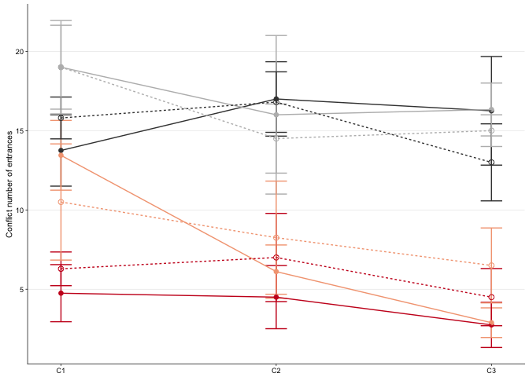
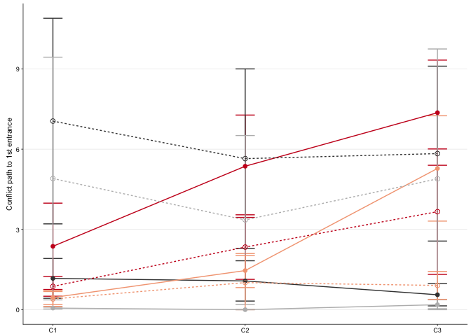
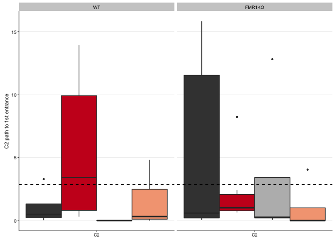

These are the packages required for making the figures and doing stats.

    library(dplyr) # for subsetting data 
    library(car) # for fancy ANOVA
    library(ggplot2) # for plotting
    library(cowplot) # for "easier"" ggplot themes

    knitr::opts_chunk$set(fig.path = '../figures/01_behavior/')

    colorvalAPA2 <-  c( "#404040","#ca0020", "#bababa", "#f4a582")

This chuck of code is for loading and formatting the dataframes.

    behavior <- read.csv("../results/behaviordata.csv", header = T)
    behavior$APA2 <- factor(behavior$APA2, levels = c("yoked-consistent","consistent", "yoked-conflict","conflict")) ## relevel then rename factors treatment
    behavior$Genotype <- factor(behavior$Genotype, levels = c("WT","FMR1KO")) # relevel genotype

    PathNum <- read.csv("../results/behaviordatasummary.csv", header = T)
    PathNum$APA2 <- factor(PathNum$APA2, levels = c("yoked-consistent","consistent", "yoked-conflict","conflict")) ## relevel then rename factors treatment
    PathNum$Genotype <- factor(PathNum$Genotype, levels = c("WT","FMR1KO")) # relevel genotype

Fig 6A

    conflictnum <- PathNum  %>% 
      filter(TrainSessionComboNum %in% c("6", "7", "8")) %>% 
      filter(measure == "Number of Entrances") %>% 
      #filter(Genotype == "WT") %>% 
      ggplot(aes(x=, TrainSessionComboNum, y=m, color=APA2, shape=Genotype)) + 
        geom_errorbar(aes(ymin=m-se, ymax=m+se), width=.1) +
        geom_point(size = 2) +
       geom_line(aes(linetype=Genotype, colour=APA2)) +
       scale_y_continuous(name= "Conflict number of entrances") +
        scale_x_continuous(name=NULL, 
                           breaks = c(1, 2, 3, 4, 5, 6, 7, 8, 9),
                           labels = c( "Pre.", "T1", "T2", "T3",
                                       "Retest", "C1", "C2","C3", 
                                       "Reten.")) +
      theme_cowplot(font_size = 8, line_size = 0.25) +
      background_grid(major = "y", minor = "none") +
      scale_color_manual(values = colorvalAPA2)  +
      theme(legend.title=element_blank()) +
      theme(legend.position="none") +
      scale_shape_manual(values=c(16,1)) 
    conflictnum

    pdf(file="../figures/01_behavior/conflictnum.pdf", width=1.5, height=2)
    plot(conflictnum)
    dev.off()

    ## quartz_off_screen 
    ##                 2

Fig 6B

    conflict6 <- behavior %>%
        filter(TrainSessionComboNum %in% c("6")) %>% 
      ggplot(aes(x = as.numeric(TrainSessionComboNum), y = NumEntrances, fill=APA2)) +
      geom_boxplot(outlier.size=0.8, lwd=0.5) +
      facet_wrap(~Genotype) +
      scale_fill_manual(values = colorvalAPA2) +  
     scale_x_continuous(name=NULL, 
                           breaks = c(6),
                           labels = c("C1")) +
       scale_y_continuous(name = "C1 number of entrances",
                          limits = c(0,24)) +
        #geom_hline(yintercept=c(16.6875), color="black", linetype = "dashed" ) + 
        #  geom_hline(yintercept=c(8.75), color="red", linetype = "dashed" ) + 
      theme_cowplot(font_size = 8, line_size = 0.25) + 
      theme(legend.position="none") +
        background_grid(major = "y", minor = "none") 
    conflict6

    ## Warning: Removed 2 rows containing non-finite values (stat_boxplot).

    pdf(file="../figures/01_behavior/conflict6.pdf", width=1.75, height=1.9)
    plot(conflict6)

    ## Warning: Removed 2 rows containing non-finite values (stat_boxplot).

    dev.off()

    ## quartz_off_screen 
    ##                 2

Figure 6C

    conflictpath <- PathNum  %>% 
      filter(TrainSessionComboNum %in% c("6", "7", "8")) %>% 
      filter(measure == "Path to the 1st Entrance") %>% 
      #filter(Genotype == "WT") %>% 
      ggplot(aes(x=, TrainSessionComboNum, y=m, color=APA2, shape=Genotype)) + 
        geom_errorbar(aes(ymin=m-se, ymax=m+se), width=.1) +
        geom_point(size = 2) +
       geom_line(aes(linetype=Genotype, colour=APA2)) +
       scale_y_continuous(name= "Conflict path to 1st entrance") +
        scale_x_continuous(name=NULL, 
                           breaks = c(1, 2, 3, 4, 5, 6, 7, 8, 9),
                           labels = c( "Pre.", "T1", "T2", "T3",
                                       "Retest", "C1", "C2","C3", 
                                       "Reten.")) +
      theme_cowplot(font_size = 8, line_size = 0.25) +
      background_grid(major = "y", minor = "none") +
      scale_color_manual(values = colorvalAPA2)  +
      theme(legend.title=element_blank()) +
      theme(legend.position="none") +
      scale_shape_manual(values=c(16,1)) 
    conflictpath

    pdf(file="../figures/01_behavior/conflictpath.pdf", width=1.5, height=2)
    plot(conflictpath)
    dev.off()

    ## quartz_off_screen 
    ##                 2

Figure 6D.

    conflict7 <- behavior %>%
        filter(TrainSessionComboNum %in% c("7")) %>% 
      ggplot(aes(x = as.numeric(TrainSessionComboNum), y = Path1stEntr, fill=APA2)) +
      geom_boxplot(outlier.size=0.8, lwd=0.5) +
      facet_wrap(~Genotype) +
      scale_fill_manual(values = colorvalAPA2) +  
     scale_x_continuous(name=NULL, 
                           breaks = c(7),
                           labels = c("C2")) +
       scale_y_continuous(name = "C2 path to 1st entrance") +
        geom_hline(yintercept=c(2.859524), color="black" , linetype = "dashed") + 
      theme_cowplot(font_size = 8, line_size = 0.25) + 
      theme(legend.position="none") +
        background_grid(major = "y", minor = "none") 
    conflict7

    pdf(file="../figures/01_behavior/conflict7.pdf", width=1.75, height=1.9)
    plot(conflict7)
    dev.off()

    ## quartz_off_screen 
    ##                 2

Here are the statisticl analyses

    ## conflict
    PathNumStats <- behavior  %>% 
      filter(TrainSessionComboNum == "6") 
    Anova(lm(data = PathNumStats, NumEntrances ~ Genotype * APA2 ), type = 3)

    ## Anova Table (Type III tests)
    ## 
    ## Response: NumEntrances
    ##               Sum Sq Df F value    Pr(>F)    
    ## (Intercept)   756.25  1 27.7891 6.538e-06 ***
    ## Genotype        9.34  1  0.3432 0.5616623    
    ## APA2          586.49  3  7.1837 0.0006702 ***
    ## Genotype:APA2  41.72  3  0.5110 0.6772764    
    ## Residuals     979.70 36                      
    ## ---
    ## Signif. codes:  0 '***' 0.001 '**' 0.01 '*' 0.05 '.' 0.1 ' ' 1

    summary(aov(NumEntrances ~  APA2 * Genotype, data=PathNumStats))

    ##               Df Sum Sq Mean Sq F value   Pr(>F)    
    ## APA2           3 1056.3   352.1  12.939 6.89e-06 ***
    ## Genotype       1    0.4     0.4   0.016    0.900    
    ## APA2:Genotype  3   41.7    13.9   0.511    0.677    
    ## Residuals     36  979.7    27.2                     
    ## ---
    ## Signif. codes:  0 '***' 0.001 '**' 0.01 '*' 0.05 '.' 0.1 ' ' 1

    TukeyHSD(aov(NumEntrances~  APA2 * Genotype, data=PathNumStats))

    ##   Tukey multiple comparisons of means
    ##     95% family-wise confidence level
    ## 
    ## Fit: aov(formula = NumEntrances ~ APA2 * Genotype, data = PathNumStats)
    ## 
    ## $APA2
    ##                                      diff        lwr        upr     p adj
    ## consistent-yoked-consistent     -9.422222 -15.346115 -3.4983293 0.0007251
    ## yoked-conflict-yoked-consistent  4.111111  -2.969295 11.1915175 0.4115373
    ## conflict-yoked-consistent       -2.350427  -8.442806  3.7419511 0.7278856
    ## yoked-conflict-consistent       13.533333   7.102235 19.9644318 0.0000112
    ## conflict-consistent              7.071795   1.747891 12.3956984 0.0053552
    ## conflict-yoked-conflict         -6.461538 -13.048161  0.1250839 0.0561732
    ## 
    ## $Genotype
    ##                diff       lwr      upr     p adj
    ## FMR1KO-WT 0.1957123 -3.007526 3.398951 0.9020735
    ## 
    ## $`APA2:Genotype`
    ##                                                        diff         lwr
    ## consistent:WT-yoked-consistent:WT             -9.000000e+00 -19.2719551
    ## yoked-conflict:WT-yoked-consistent:WT          5.250000e+00  -7.5613788
    ## conflict:WT-yoked-consistent:WT               -3.055556e-01 -10.3854945
    ## yoked-consistent:FMR1KO-yoked-consistent:WT    2.050000e+00  -9.2023630
    ## consistent:FMR1KO-yoked-consistent:WT         -7.464286e+00 -17.9779669
    ## yoked-conflict:FMR1KO-yoked-consistent:WT      5.250000e+00  -6.6110320
    ## conflict:FMR1KO-yoked-consistent:WT           -3.250000e+00 -15.1110320
    ## yoked-conflict:WT-consistent:WT                1.425000e+01   2.8939264
    ## conflict:WT-consistent:WT                      8.694444e+00   0.5437298
    ## yoked-consistent:FMR1KO-consistent:WT          1.105000e+01   1.4873303
    ## consistent:FMR1KO-consistent:WT                1.535714e+00  -7.1456722
    ## yoked-conflict:FMR1KO-consistent:WT            1.425000e+01   3.9780449
    ## conflict:FMR1KO-consistent:WT                  5.750000e+00  -4.5219551
    ## conflict:WT-yoked-conflict:WT                 -5.555556e+00 -16.7382438
    ## yoked-consistent:FMR1KO-yoked-conflict:WT     -3.200000e+00 -15.4500212
    ## consistent:FMR1KO-yoked-conflict:WT           -1.271429e+01 -24.2894677
    ## yoked-conflict:FMR1KO-yoked-conflict:WT       -3.552714e-15 -12.8113788
    ## conflict:FMR1KO-yoked-conflict:WT             -8.500000e+00 -21.3113788
    ## yoked-consistent:FMR1KO-conflict:WT            2.355556e+00  -7.0005527
    ## consistent:FMR1KO-conflict:WT                 -7.158730e+00 -15.6120479
    ## yoked-conflict:FMR1KO-conflict:WT              5.555556e+00  -4.5243834
    ## conflict:FMR1KO-conflict:WT                   -2.944444e+00 -13.0243834
    ## consistent:FMR1KO-yoked-consistent:FMR1KO     -9.514286e+00 -19.3361534
    ## yoked-conflict:FMR1KO-yoked-consistent:FMR1KO  3.200000e+00  -8.0523630
    ## conflict:FMR1KO-yoked-consistent:FMR1KO       -5.300000e+00 -16.5523630
    ## yoked-conflict:FMR1KO-consistent:FMR1KO        1.271429e+01   2.2006045
    ## conflict:FMR1KO-consistent:FMR1KO              4.214286e+00  -6.2993955
    ## conflict:FMR1KO-yoked-conflict:FMR1KO         -8.500000e+00 -20.3610320
    ##                                                      upr     p adj
    ## consistent:WT-yoked-consistent:WT              1.2719551 0.1222755
    ## yoked-conflict:WT-yoked-consistent:WT         18.0613788 0.8861219
    ## conflict:WT-yoked-consistent:WT                9.7743834 1.0000000
    ## yoked-consistent:FMR1KO-yoked-consistent:WT   13.3023630 0.9988551
    ## consistent:FMR1KO-yoked-consistent:WT          3.0493955 0.3302891
    ## yoked-conflict:FMR1KO-yoked-consistent:WT     17.1110320 0.8405486
    ## conflict:FMR1KO-yoked-consistent:WT            8.6110320 0.9859926
    ## yoked-conflict:WT-consistent:WT               25.6060736 0.0059740
    ## conflict:WT-consistent:WT                     16.8451591 0.0295954
    ## yoked-consistent:FMR1KO-consistent:WT         20.6126697 0.0141784
    ## consistent:FMR1KO-consistent:WT               10.2171008 0.9990529
    ## yoked-conflict:FMR1KO-consistent:WT           24.5219551 0.0017907
    ## conflict:FMR1KO-consistent:WT                 16.0219551 0.6241249
    ## conflict:WT-yoked-conflict:WT                  5.6271327 0.7486472
    ## yoked-consistent:FMR1KO-yoked-conflict:WT      9.0500212 0.9893925
    ## consistent:FMR1KO-yoked-conflict:WT           -1.1391037 0.0228639
    ## yoked-conflict:FMR1KO-yoked-conflict:WT       12.8113788 1.0000000
    ## conflict:FMR1KO-yoked-conflict:WT              4.3113788 0.4141170
    ## yoked-consistent:FMR1KO-conflict:WT           11.7116638 0.9914691
    ## consistent:FMR1KO-conflict:WT                  1.2945876 0.1484802
    ## yoked-conflict:FMR1KO-conflict:WT             15.6354945 0.6418261
    ## conflict:FMR1KO-conflict:WT                    7.1354945 0.9798377
    ## consistent:FMR1KO-yoked-consistent:FMR1KO      0.3075819 0.0633444
    ## yoked-conflict:FMR1KO-yoked-consistent:FMR1KO 14.4523630 0.9826704
    ## conflict:FMR1KO-yoked-consistent:FMR1KO        5.9523630 0.7947108
    ## yoked-conflict:FMR1KO-consistent:FMR1KO       23.2279669 0.0089219
    ## conflict:FMR1KO-consistent:FMR1KO             14.7279669 0.8970577
    ## conflict:FMR1KO-yoked-conflict:FMR1KO          3.3610320 0.3190938

    mean(PathNumStats$NumEntrances)

    ## [1] 11.63636

    PathNumStats <- behavior  %>% 
      filter(TrainSessionComboNum == "6",
             APA2 %in% c("yoked-consistent", "yoked-conflict")) 
    mean(PathNumStats$NumEntrances)

    ## [1] 16.6875

    PathNumStats <- behavior  %>% 
      filter(TrainSessionComboNum == "6",
             APA2 %in% c("consistent", "conflict")) 
    mean(PathNumStats$NumEntrances)

    ## [1] 8.75

    PathNumStats <- behavior  %>% 
      filter(TrainSessionComboNum == "7") 
    Anova(lm(data = PathNumStats, Path1stEntr ~ Genotype * APA2 ), type = 3)

    ## Anova Table (Type III tests)
    ## 
    ## Response: Path1stEntr
    ##               Sum Sq Df F value Pr(>F)
    ## (Intercept)     4.62  1  0.2450 0.6238
    ## Genotype       46.43  1  2.4613 0.1259
    ## APA2           95.51  3  1.6877 0.1880
    ## Genotype:APA2  92.38  3  1.6324 0.2001
    ## Residuals     641.38 34

    summary(aov(Path1stEntr~  APA2 * Genotype, data=PathNumStats))

    ##               Df Sum Sq Mean Sq F value Pr(>F)
    ## APA2           3   58.5  19.511   1.034  0.390
    ## Genotype       1    0.9   0.937   0.050  0.825
    ## APA2:Genotype  3   92.4  30.795   1.632  0.200
    ## Residuals     34  641.4  18.864

    TukeyHSD(aov(Path1stEntr~  APA2 * Genotype, data=PathNumStats))

    ##   Tukey multiple comparisons of means
    ##     95% family-wise confidence level
    ## 
    ## Fit: aov(formula = Path1stEntr ~ APA2 * Genotype, data = PathNumStats)
    ## 
    ## $APA2
    ##                                       diff       lwr      upr     p adj
    ## consistent-yoked-consistent      0.4526984 -4.559068 5.464465 0.9947986
    ## yoked-conflict-yoked-consistent -1.3777778 -7.560233 4.804677 0.9307621
    ## conflict-yoked-consistent       -2.2905983 -7.377234 2.796037 0.6210479
    ## yoked-conflict-consistent       -1.8304762 -7.554317 3.893365 0.8233614
    ## conflict-consistent             -2.7432967 -7.261423 1.774830 0.3706337
    ## conflict-yoked-conflict         -0.9128205 -6.702329 4.876688 0.9736607
    ## 
    ## $Genotype
    ##                diff      lwr      upr    p adj
    ## FMR1KO-WT 0.2905275 -2.44587 3.026925 0.830459
    ## 
    ## $`APA2:Genotype`
    ##                                                     diff        lwr
    ## consistent:WT-yoked-consistent:WT              4.2875000  -4.294472
    ## yoked-conflict:WT-yoked-consistent:WT         -1.0750000 -13.211741
    ## conflict:WT-yoked-consistent:WT                0.3872222  -8.034325
    ## yoked-consistent:FMR1KO-yoked-consistent:WT    4.5710000  -4.830079
    ## consistent:FMR1KO-yoked-consistent:WT          1.2650000  -7.781193
    ## yoked-conflict:FMR1KO-yoked-consistent:WT      2.2800000  -7.629607
    ## conflict:FMR1KO-yoked-consistent:WT           -0.0625000  -9.972107
    ## yoked-conflict:WT-consistent:WT               -5.3625000 -16.441778
    ## conflict:WT-consistent:WT                     -3.9002778 -10.710004
    ## yoked-consistent:FMR1KO-consistent:WT          0.2835000  -7.705881
    ## consistent:FMR1KO-consistent:WT               -3.0225000 -10.591088
    ## yoked-conflict:FMR1KO-consistent:WT           -2.0075000 -10.589472
    ## conflict:FMR1KO-consistent:WT                 -4.3500000 -12.931972
    ## conflict:WT-yoked-conflict:WT                  1.4622222  -9.493261
    ## yoked-consistent:FMR1KO-yoked-conflict:WT      5.6460000  -6.079206
    ## consistent:FMR1KO-yoked-conflict:WT            2.3400000  -9.102629
    ## yoked-conflict:FMR1KO-yoked-conflict:WT        3.3550000  -8.781741
    ## conflict:FMR1KO-yoked-conflict:WT              1.0125000 -11.124241
    ## yoked-consistent:FMR1KO-conflict:WT            4.1837778  -3.633026
    ## consistent:FMR1KO-conflict:WT                  0.8777778  -6.508408
    ## yoked-conflict:FMR1KO-conflict:WT              1.8927778  -6.528769
    ## conflict:FMR1KO-conflict:WT                   -0.4497222  -8.871269
    ## consistent:FMR1KO-yoked-consistent:FMR1KO     -3.3060000 -11.792081
    ## yoked-conflict:FMR1KO-yoked-consistent:FMR1KO -2.2910000 -11.692079
    ## conflict:FMR1KO-yoked-consistent:FMR1KO       -4.6335000 -14.034579
    ## yoked-conflict:FMR1KO-consistent:FMR1KO        1.0150000  -8.031193
    ## conflict:FMR1KO-consistent:FMR1KO             -1.3275000 -10.373693
    ## conflict:FMR1KO-yoked-conflict:FMR1KO         -2.3425000 -12.252107
    ##                                                     upr     p adj
    ## consistent:WT-yoked-consistent:WT             12.869472 0.7400240
    ## yoked-conflict:WT-yoked-consistent:WT         11.061741 0.9999905
    ## conflict:WT-yoked-consistent:WT                8.808769 0.9999999
    ## yoked-consistent:FMR1KO-yoked-consistent:WT   13.972079 0.7647289
    ## consistent:FMR1KO-yoked-consistent:WT         10.311193 0.9997905
    ## yoked-conflict:FMR1KO-yoked-consistent:WT     12.189607 0.9948924
    ## conflict:FMR1KO-yoked-consistent:WT            9.847107 1.0000000
    ## yoked-conflict:WT-consistent:WT                5.716778 0.7687191
    ## conflict:WT-consistent:WT                      2.909449 0.5935498
    ## yoked-consistent:FMR1KO-consistent:WT          8.272881 1.0000000
    ## consistent:FMR1KO-consistent:WT                4.546088 0.8968335
    ## yoked-conflict:FMR1KO-consistent:WT            6.574472 0.9943514
    ## conflict:FMR1KO-consistent:WT                  4.231972 0.7262044
    ## conflict:WT-yoked-conflict:WT                 12.417705 0.9998465
    ## yoked-consistent:FMR1KO-yoked-conflict:WT     17.371206 0.7731749
    ## consistent:FMR1KO-yoked-conflict:WT           13.782629 0.9975369
    ## yoked-conflict:FMR1KO-yoked-conflict:WT       15.491741 0.9848553
    ## conflict:FMR1KO-yoked-conflict:WT             13.149241 0.9999937
    ## yoked-consistent:FMR1KO-conflict:WT           12.000582 0.6704196
    ## consistent:FMR1KO-conflict:WT                  8.263963 0.9999296
    ## yoked-conflict:FMR1KO-conflict:WT             10.314325 0.9955737
    ## conflict:FMR1KO-conflict:WT                    7.971825 0.9999997
    ## consistent:FMR1KO-yoked-consistent:FMR1KO      5.180081 0.9080559
    ## yoked-conflict:FMR1KO-yoked-consistent:FMR1KO  7.110079 0.9927700
    ## conflict:FMR1KO-yoked-consistent:FMR1KO        4.767579 0.7525618
    ## yoked-conflict:FMR1KO-consistent:FMR1KO       10.061193 0.9999523
    ## conflict:FMR1KO-consistent:FMR1KO              7.718693 0.9997116
    ## conflict:FMR1KO-yoked-conflict:FMR1KO          7.567107 0.9939810

    mean(PathNumStats$Path1stEntr)

    ## [1] 2.859524

    PathNumStats <- behavior  %>% 
      filter(TrainSessionComboNum == "7",
             Genotype == "WT")
    Anova(lm(data = PathNumStats, Path1stEntr ~  APA2 ), type = 3)

    ## Anova Table (Type III tests)
    ## 
    ## Response: Path1stEntr
    ##              Sum Sq Df F value  Pr(>F)  
    ## (Intercept)   4.623  1  0.3647 0.55305  
    ## APA2         95.511  3  2.5118 0.08944 .
    ## Residuals   240.823 19                  
    ## ---
    ## Signif. codes:  0 '***' 0.001 '**' 0.01 '*' 0.05 '.' 0.1 ' ' 1

    summary(aov(Path1stEntr~  APA2, data=PathNumStats))

    ##             Df Sum Sq Mean Sq F value Pr(>F)  
    ## APA2         3  95.51   31.84   2.512 0.0894 .
    ## Residuals   19 240.82   12.67                 
    ## ---
    ## Signif. codes:  0 '***' 0.001 '**' 0.01 '*' 0.05 '.' 0.1 ' ' 1

    TukeyHSD(aov(Path1stEntr~  APA2, data=PathNumStats))

    ##   Tukey multiple comparisons of means
    ##     95% family-wise confidence level
    ## 
    ## Fit: aov(formula = Path1stEntr ~ APA2, data = PathNumStats)
    ## 
    ## $APA2
    ##                                       diff        lwr        upr     p adj
    ## consistent-yoked-consistent      4.2875000  -1.842761 10.4177614 0.2351052
    ## yoked-conflict-yoked-consistent -1.0750000  -9.744499  7.5944988 0.9849908
    ## conflict-yoked-consistent        0.3872222  -5.628445  6.4028892 0.9978187
    ## yoked-conflict-consistent       -5.3625000 -13.276633  2.5516334 0.2589888
    ## conflict-consistent             -3.9002778  -8.764591  0.9640359 0.1445418
    ## conflict-yoked-conflict          1.4622222  -6.363482  9.2879268 0.9518875

    PathNumStats <- behavior  %>% 
      filter(TrainSessionComboNum == "7",
             Genotype != "WT")
    Anova(lm(data = PathNumStats, Path1stEntr ~  APA2 ), type = 3)

    ## Anova Table (Type III tests)
    ## 
    ## Response: Path1stEntr
    ##             Sum Sq Df F value  Pr(>F)  
    ## (Intercept) 159.39  1  5.9686 0.02741 *
    ## APA2         53.53  3  0.6682 0.58456  
    ## Residuals   400.56 15                  
    ## ---
    ## Signif. codes:  0 '***' 0.001 '**' 0.01 '*' 0.05 '.' 0.1 ' ' 1

    summary(aov(Path1stEntr~  APA2, data=PathNumStats))

    ##             Df Sum Sq Mean Sq F value Pr(>F)
    ## APA2         3   53.5   17.84   0.668  0.585
    ## Residuals   15  400.6   26.70

    TukeyHSD(aov(Path1stEntr~  APA2, data=PathNumStats))

    ##   Tukey multiple comparisons of means
    ##     95% family-wise confidence level
    ## 
    ## Fit: aov(formula = Path1stEntr ~ APA2, data = PathNumStats)
    ## 
    ## $APA2
    ##                                    diff        lwr       upr     p adj
    ## consistent-yoked-consistent     -3.3060 -12.324631  5.712631 0.7199517
    ## yoked-conflict-yoked-consistent -2.2910 -12.282051  7.700051 0.9100565
    ## conflict-yoked-consistent       -4.6335 -14.624551  5.357551 0.5552191
    ## yoked-conflict-consistent        1.0150  -8.598893 10.628893 0.9898144
    ## conflict-consistent             -1.3275 -10.941393  8.286393 0.9778648
    ## conflict-yoked-conflict         -2.3425 -12.873992  8.188992 0.9170112
