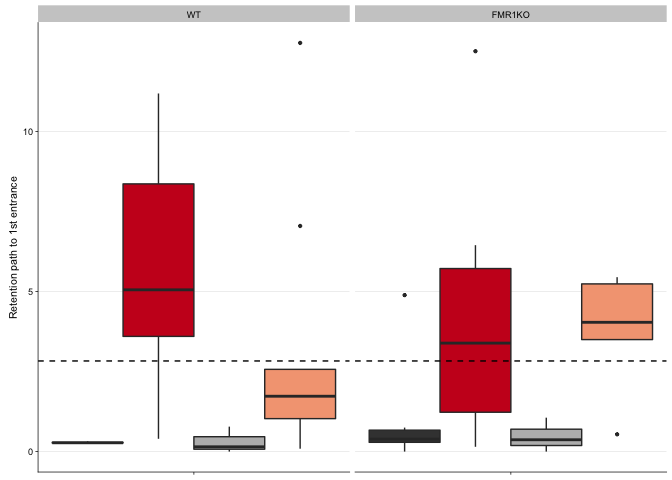

 Fig. 2.7. During
recall, mice avoid the shock zone. A) Trained mice spend less time in
the shock zone than their yoked counterparts. B) They also make fewer
entrances into the shock zone, C) but their path to the shock zone is
not significantly longer. Legend) dark grey: yoked-consistent, red:
consistently-trained, light grey: yoked-conflict, peach:
conflict-trained, pink: future shock zone, dark green: clockwise, green:
opposite the shock zone, light green: counterclockwise.

These are the packages required for making the figures and doing stats.

    library(dplyr) # for subsetting data 
    library(car) # for fancy ANOVA
    library(ggplot2) # for plotting
    library(cowplot) # for "easier"" ggplot themes

    knitr::opts_chunk$set(fig.path = '../figures/01_behavior/')

    colorvalAPA2 <-  c( "#404040","#ca0020", "#bababa", "#f4a582")

This chuck of code is for loading and formatting the dataframes.

    behavior <- read.csv("../results/behaviordata.csv", header = T)
    behavior$APA2 <- factor(behavior$APA2, levels = c("yoked-consistent","consistent", "yoked-conflict","conflict")) ## relevel then rename factors treatment
    behavior$Genotype <- factor(behavior$Genotype, levels = c("WT","FMR1KO")) # relevel genotype

    proptime <- read.csv("../results/behaviorproptime.csv", header = T)
    proptime$APA2 <- factor(proptime$APA2, levels = c("yoked-consistent","consistent", "yoked-conflict","conflict")) ## relevel then rename factors treatment
    proptime$Genotype <- factor(proptime$Genotype, levels = c("WT","FMR1KO")) # relevel genotype
    proptime$variable <- factor(proptime$variable, 
              levels = c("pTimeTarget", "pTimeCCW", "pTimeOPP", "pTimeCW"))

Figure 7A: Proportion time spent on the shock zone on the retention
trial

    ## quartz_off_screen 
    ##                 2

Figure 7B Number of entrances on retention

    num9 <- behavior %>%
        filter(TrainSessionComboNum %in% c("9")) %>% 
      ggplot(aes(x = as.numeric(TrainSessionComboNum), y = NumEntrances, fill=APA2)) +
      geom_boxplot(outlier.size=0.8, lwd=0.5) +
      facet_wrap(~Genotype) +
      scale_fill_manual(values = colorvalAPA2) +  
     scale_x_continuous(name=NULL, 
                           breaks = c(1, 2, 3, 4, 5, 6, 7, 8, 9),
                           labels = NULL) +
        background_grid(major = "y", minor = "none") +
       scale_y_continuous(name = "Retention number of entrances",
                         limits = c(0,35)) +
      #geom_hline(yintercept=c(9.21), color="red" , linetype = "dashed") + 
       # geom_hline(yintercept=c(18.65), color="black", linetype = "dashed" ) + 
      theme_cowplot(font_size = 8, line_size = 0.25) + 
      theme(legend.position="none") +
        background_grid(major = "y", minor = "none") 
    num9

    pdf(file="../figures/01_behavior/num9.pdf", width=1.75, height=1.9)
    plot(num9)
    dev.off()

    ## quartz_off_screen 
    ##                 2

    path9 <- behavior %>%
        filter(TrainSessionComboNum %in% c("9")) %>% 
      ggplot(aes(x = as.numeric(TrainSessionComboNum), y = Path1stEntr, fill=APA2)) +
      geom_boxplot(outlier.size=0.8, lwd=0.5) +
      facet_wrap(~ Genotype ) +
      scale_fill_manual(values = colorvalAPA2) +  
     scale_x_continuous(name=NULL, 
                           breaks = c(1, 2, 3, 4, 5, 6, 7, 8, 9),
                           labels = NULL) +
       scale_y_continuous(name = "Retention path to 1st entrance") +
       geom_hline(yintercept=c(2.832), color="black" , linetype = "dashed") + 
       theme_cowplot(font_size = 8, line_size = 0.25) + 
       theme(legend.position="none") +
        background_grid(major = "y", minor = "none") 
    path9

    pdf(file="../figures/01_behavior/path9.pdf", width=1.75, height=1.9)
    plot(path9)
    dev.off()

    ## quartz_off_screen 
    ##                 2

Statistics

    PathNumStats <- behavior  %>% 
      filter(TrainSessionComboNum == "9") 

    summary(aov(NumEntrances ~  APA2 * Genotype, data=PathNumStats))

    ##               Df Sum Sq Mean Sq F value   Pr(>F)    
    ## APA2           3 1622.5   540.8   14.32 1.44e-06 ***
    ## Genotype       1    1.5     1.5    0.04    0.843    
    ## APA2:Genotype  3   37.4    12.5    0.33    0.803    
    ## Residuals     42 1586.5    37.8                     
    ## ---
    ## Signif. codes:  0 '***' 0.001 '**' 0.01 '*' 0.05 '.' 0.1 ' ' 1

    summary(aov(Path1stEntr ~  APA2 * Genotype, data=PathNumStats))

    ##               Df Sum Sq Mean Sq F value  Pr(>F)   
    ## APA2           3  166.3   55.43   6.002 0.00169 **
    ## Genotype       1    0.2    0.23   0.025 0.87598   
    ## APA2:Genotype  3    8.8    2.94   0.318 0.81215   
    ## Residuals     42  387.8    9.23                   
    ## ---
    ## Signif. codes:  0 '***' 0.001 '**' 0.01 '*' 0.05 '.' 0.1 ' ' 1

    Anova(lm(data = PathNumStats, Path1stEntr ~ APA2 * Genotype), type = 3)

    ## Anova Table (Type III tests)
    ## 
    ## Response: Path1stEntr
    ##               Sum Sq Df F value  Pr(>F)  
    ## (Intercept)     0.32  1  0.0352 0.85211  
    ## APA2          100.78  3  3.6377 0.02022 *
    ## Genotype        1.41  1  0.1524 0.69822  
    ## APA2:Genotype   8.81  3  0.3182 0.81215  
    ## Residuals     387.84 42                  
    ## ---
    ## Signif. codes:  0 '***' 0.001 '**' 0.01 '*' 0.05 '.' 0.1 ' ' 1

    Anova(lm(data = PathNumStats, NumEntrances ~ APA2 * Genotype ), type = 3)

    ## Anova Table (Type III tests)
    ## 
    ## Response: NumEntrances
    ##                Sum Sq Df F value    Pr(>F)    
    ## (Intercept)   1849.00  1 48.9485 1.471e-08 ***
    ## APA2           682.96  3  6.0266  0.001647 ** 
    ## Genotype         3.75  1  0.0994  0.754161    
    ## APA2:Genotype   37.44  3  0.3304  0.803363    
    ## Residuals     1586.53 42                      
    ## ---
    ## Signif. codes:  0 '***' 0.001 '**' 0.01 '*' 0.05 '.' 0.1 ' ' 1

    Anova(lm(data = PathNumStats, pTimeTarget ~ APA2 * Genotype ), type = 3)

    ## Anova Table (Type III tests)
    ## 
    ## Response: pTimeTarget
    ##                Sum Sq Df F value    Pr(>F)    
    ## (Intercept)   0.38057  1 42.5068 7.099e-08 ***
    ## APA2          0.14885  3  5.5420  0.002685 ** 
    ## Genotype      0.00038  1  0.0430  0.836796    
    ## APA2:Genotype 0.00291  3  0.1083  0.954798    
    ## Residuals     0.37603 42                      
    ## ---
    ## Signif. codes:  0 '***' 0.001 '**' 0.01 '*' 0.05 '.' 0.1 ' ' 1

    TukeyHSD(aov(data = PathNumStats, NumEntrances ~ Genotype * APA2))

    ##   Tukey multiple comparisons of means
    ##     95% family-wise confidence level
    ## 
    ## Fit: aov(formula = NumEntrances ~ Genotype * APA2, data = PathNumStats)
    ## 
    ## $Genotype
    ##               diff       lwr      upr     p adj
    ## FMR1KO-WT 1.634615 -1.876381 5.145612 0.3528163
    ## 
    ## $APA2
    ##                                       diff        lwr       upr     p adj
    ## consistent-yoked-consistent     -12.862608 -19.224320 -6.500896 0.0000163
    ## yoked-conflict-yoked-consistent  -3.629152 -11.268411  4.010107 0.5862522
    ## conflict-yoked-consistent       -12.602023 -19.226101 -5.977945 0.0000460
    ## yoked-conflict-consistent         9.233456   2.184638 16.282274 0.0058512
    ## conflict-consistent               0.260585  -5.672877  6.194047 0.9994106
    ## conflict-yoked-conflict          -8.972871 -16.259356 -1.686386 0.0104313
    ## 
    ## $`Genotype:APA2`
    ##                                                      diff        lwr
    ## FMR1KO:yoked-consistent-WT:yoked-consistent     1.2142857 -11.068332
    ## WT:consistent-WT:yoked-consistent             -12.8750000 -24.875221
    ## FMR1KO:consistent-WT:yoked-consistent         -11.7222222 -23.498121
    ## WT:yoked-conflict-WT:yoked-consistent          -1.1666667 -16.133572
    ## FMR1KO:yoked-conflict-WT:yoked-consistent      -3.9000000 -17.045584
    ## WT:conflict-WT:yoked-consistent               -11.5000000 -23.275898
    ## FMR1KO:conflict-WT:yoked-consistent           -13.7000000 -26.845584
    ## WT:consistent-FMR1KO:yoked-consistent         -14.0892857 -24.231324
    ## FMR1KO:consistent-FMR1KO:yoked-consistent     -12.9365079 -22.812104
    ## WT:yoked-conflict-FMR1KO:yoked-consistent      -2.3809524 -15.903670
    ## FMR1KO:yoked-conflict-FMR1KO:yoked-consistent  -5.1142857 -16.588692
    ## WT:conflict-FMR1KO:yoked-consistent           -12.7142857 -22.589882
    ## FMR1KO:conflict-FMR1KO:yoked-consistent       -14.9142857 -26.388692
    ## FMR1KO:consistent-WT:consistent                 1.1527778  -8.369302
    ## WT:yoked-conflict-WT:consistent                11.7083333  -1.558410
    ## FMR1KO:yoked-conflict-WT:consistent             8.9750000  -2.196598
    ## WT:conflict-WT:consistent                       1.3750000  -8.147080
    ## FMR1KO:conflict-WT:consistent                  -0.8250000 -11.996598
    ## WT:yoked-conflict-FMR1KO:consistent            10.5555556  -2.508631
    ## FMR1KO:yoked-conflict-FMR1KO:consistent         7.8222222  -3.108060
    ## WT:conflict-FMR1KO:consistent                   0.2222222  -9.015552
    ## FMR1KO:conflict-FMR1KO:consistent              -1.9777778 -12.908060
    ## FMR1KO:yoked-conflict-WT:yoked-conflict        -2.7333333 -17.044432
    ## WT:conflict-WT:yoked-conflict                 -10.3333333 -23.397520
    ## FMR1KO:conflict-WT:yoked-conflict             -12.5333333 -26.844432
    ## WT:conflict-FMR1KO:yoked-conflict              -7.6000000 -18.530282
    ## FMR1KO:conflict-FMR1KO:yoked-conflict          -9.8000000 -22.193775
    ## FMR1KO:conflict-WT:conflict                    -2.2000000 -13.130282
    ##                                                       upr     p adj
    ## FMR1KO:yoked-consistent-WT:yoked-consistent   13.49690378 0.9999821
    ## WT:consistent-WT:yoked-consistent             -0.87477872 0.0277839
    ## FMR1KO:consistent-WT:yoked-consistent          0.05367608 0.0518092
    ## WT:yoked-conflict-WT:yoked-consistent         13.80023886 0.9999965
    ## FMR1KO:yoked-conflict-WT:yoked-consistent      9.24558378 0.9793693
    ## WT:conflict-WT:yoked-consistent                0.27589830 0.0599273
    ## FMR1KO:conflict-WT:yoked-consistent           -0.55441622 0.0357422
    ## WT:consistent-FMR1KO:yoked-consistent         -3.94724764 0.0015734
    ## FMR1KO:consistent-FMR1KO:yoked-consistent     -3.06091144 0.0033589
    ## WT:yoked-conflict-FMR1KO:yoked-consistent     11.14176505 0.9991519
    ## FMR1KO:yoked-conflict-FMR1KO:yoked-consistent  6.36012052 0.8423750
    ## WT:conflict-FMR1KO:yoked-consistent           -2.83868921 0.0041494
    ## FMR1KO:conflict-FMR1KO:yoked-consistent       -3.43987948 0.0036961
    ## FMR1KO:consistent-WT:consistent               10.67485793 0.9999293
    ## WT:yoked-conflict-WT:consistent               24.97507713 0.1187790
    ## FMR1KO:yoked-conflict-WT:consistent           20.14659804 0.1989740
    ## WT:conflict-WT:consistent                     10.89708015 0.9997695
    ## FMR1KO:conflict-WT:consistent                 10.34659804 0.9999976
    ## WT:yoked-conflict-FMR1KO:consistent           23.61974175 0.1934166
    ## FMR1KO:yoked-conflict-FMR1KO:consistent       18.75250459 0.3272519
    ## WT:conflict-FMR1KO:consistent                  9.45999687 1.0000000
    ## FMR1KO:conflict-FMR1KO:consistent              8.95250459 0.9989881
    ## FMR1KO:yoked-conflict-WT:yoked-conflict       11.57776561 0.9985679
    ## WT:conflict-WT:yoked-conflict                  2.73085286 0.2145471
    ## FMR1KO:conflict-WT:yoked-conflict              1.77776561 0.1244075
    ## WT:conflict-FMR1KO:yoked-conflict              3.33028237 0.3627775
    ## FMR1KO:conflict-FMR1KO:yoked-conflict          2.59377524 0.2148657
    ## FMR1KO:conflict-WT:conflict                    8.73028237 0.9980007

    TukeyHSD(aov(data = PathNumStats, Path1stEntr ~ Genotype * APA2))

    ##   Tukey multiple comparisons of means
    ##     95% family-wise confidence level
    ## 
    ## Fit: aov(formula = Path1stEntr ~ Genotype * APA2, data = PathNumStats)
    ## 
    ## $Genotype
    ##                 diff       lwr      upr    p adj
    ## FMR1KO-WT -0.5939103 -2.329839 1.142019 0.493714
    ## 
    ## $APA2
    ##                                       diff        lwr        upr     p adj
    ## consistent-yoked-consistent      3.9906513  0.8452532  7.1360494 0.0079464
    ## yoked-conflict-yoked-consistent -0.3586808 -4.1357320  3.4183704 0.9941610
    ## conflict-yoked-consistent        2.5188432 -0.7562755  5.7939620 0.1839459
    ## yoked-conflict-consistent       -4.3493321 -7.8344538 -0.8642104 0.0092514
    ## conflict-consistent             -1.4718081 -4.4054680  1.4618519 0.5420192
    ## conflict-yoked-conflict          2.8775240 -0.7251066  6.4801546 0.1583323
    ## 
    ## $`Genotype:APA2`
    ##                                                     diff         lwr
    ## FMR1KO:yoked-consistent-WT:yoked-consistent    0.7435714  -5.3292790
    ## WT:consistent-WT:yoked-consistent              5.2000000  -0.7332260
    ## FMR1KO:consistent-WT:yoked-consistent          3.9294444  -1.8928704
    ## WT:yoked-conflict-WT:yoked-consistent          0.0250000  -7.3750330
    ## FMR1KO:yoked-conflict-WT:yoked-consistent      0.1790000  -6.3205234
    ## WT:conflict-WT:yoked-consistent                2.9850000  -2.8373148
    ## FMR1KO:conflict-WT:yoked-consistent            3.4690000  -3.0305234
    ## WT:consistent-FMR1KO:yoked-consistent          4.4564286  -0.5580626
    ## FMR1KO:consistent-FMR1KO:yoked-consistent      3.1858730  -1.6968824
    ## WT:yoked-conflict-FMR1KO:yoked-consistent     -0.7185714  -7.4045597
    ## FMR1KO:yoked-conflict-FMR1KO:yoked-consistent -0.5645714  -6.2378206
    ## WT:conflict-FMR1KO:yoked-consistent            2.2414286  -2.6413269
    ## FMR1KO:conflict-FMR1KO:yoked-consistent        2.7254286  -2.9478206
    ## FMR1KO:consistent-WT:consistent               -1.2705556  -5.9785232
    ## WT:yoked-conflict-WT:consistent               -5.1750000 -11.7344282
    ## FMR1KO:yoked-conflict-WT:consistent           -5.0210000 -10.5445328
    ## WT:conflict-WT:consistent                     -2.2150000  -6.9229677
    ## FMR1KO:conflict-WT:consistent                 -1.7310000  -7.2545328
    ## WT:yoked-conflict-FMR1KO:consistent           -3.9044444 -10.3637228
    ## FMR1KO:yoked-conflict-FMR1KO:consistent       -3.7504444  -9.1546644
    ## WT:conflict-FMR1KO:consistent                 -0.9444444  -5.5118440
    ## FMR1KO:conflict-FMR1KO:consistent             -0.4604444  -5.8646644
    ## FMR1KO:yoked-conflict-WT:yoked-conflict        0.1540000  -6.9217849
    ## WT:conflict-WT:yoked-conflict                  2.9600000  -3.4992783
    ## FMR1KO:conflict-WT:yoked-conflict              3.4440000  -3.6317849
    ## WT:conflict-FMR1KO:yoked-conflict              2.8060000  -2.5982200
    ## FMR1KO:conflict-FMR1KO:yoked-conflict          3.2900000  -2.8378095
    ## FMR1KO:conflict-WT:conflict                    0.4840000  -4.9202200
    ##                                                      upr     p adj
    ## FMR1KO:yoked-consistent-WT:yoked-consistent    6.8164219 0.9999237
    ## WT:consistent-WT:yoked-consistent             11.1332260 0.1238624
    ## FMR1KO:consistent-WT:yoked-consistent          9.7517593 0.4003735
    ## WT:yoked-conflict-WT:yoked-consistent          7.4250330 1.0000000
    ## FMR1KO:yoked-conflict-WT:yoked-consistent      6.6785234 1.0000000
    ## WT:conflict-WT:yoked-consistent                8.8073148 0.7271300
    ## FMR1KO:conflict-WT:yoked-consistent            9.9685234 0.6860643
    ## WT:consistent-FMR1KO:yoked-consistent          9.4709198 0.1138153
    ## FMR1KO:consistent-FMR1KO:yoked-consistent      8.0686285 0.4435615
    ## WT:yoked-conflict-FMR1KO:yoked-consistent      5.9674168 0.9999684
    ## FMR1KO:yoked-conflict-FMR1KO:yoked-consistent  5.1086777 0.9999813
    ## WT:conflict-FMR1KO:yoked-consistent            7.1241840 0.8217228
    ## FMR1KO:conflict-FMR1KO:yoked-consistent        8.3986777 0.7861109
    ## FMR1KO:consistent-WT:consistent                3.4374121 0.9880135
    ## WT:yoked-conflict-WT:consistent                1.3844282 0.2171700
    ## FMR1KO:yoked-conflict-WT:consistent            0.5025328 0.0986822
    ## WT:conflict-WT:consistent                      2.4929677 0.8030318
    ## FMR1KO:conflict-WT:consistent                  3.7925328 0.9720339
    ## WT:yoked-conflict-FMR1KO:consistent            2.5548339 0.5408114
    ## FMR1KO:yoked-conflict-FMR1KO:consistent        1.6537755 0.3651727
    ## WT:conflict-FMR1KO:consistent                  3.6229551 0.9976294
    ## FMR1KO:conflict-FMR1KO:consistent              4.9437755 0.9999936
    ## FMR1KO:yoked-conflict-WT:yoked-conflict        7.2297849 1.0000000
    ## WT:conflict-WT:yoked-conflict                  9.4192783 0.8229886
    ## FMR1KO:conflict-WT:yoked-conflict             10.5197849 0.7749960
    ## WT:conflict-FMR1KO:yoked-conflict              8.2102200 0.7145546
    ## FMR1KO:conflict-FMR1KO:yoked-conflict          9.4178095 0.6797519
    ## FMR1KO:conflict-WT:conflict                    5.8882200 0.9999909

    TukeyHSD(aov(data = PathNumStats, pTimeTarget ~  Genotype * APA2))

    ##   Tukey multiple comparisons of means
    ##     95% family-wise confidence level
    ## 
    ## Fit: aov(formula = pTimeTarget ~ Genotype * APA2, data = PathNumStats)
    ## 
    ## $Genotype
    ##                 diff        lwr        upr     p adj
    ## FMR1KO-WT 0.01413397 -0.0399187 0.06818665 0.6004856
    ## 
    ## $APA2
    ##                                        diff         lwr          upr
    ## consistent-yoked-consistent     -0.18194503 -0.27988519 -0.084004868
    ## yoked-conflict-yoked-consistent -0.10866666 -0.22627499  0.008941666
    ## conflict-yoked-consistent       -0.20241649 -0.30439584 -0.100437136
    ## yoked-conflict-consistent        0.07327837 -0.03523997  0.181796713
    ## conflict-consistent             -0.02047146 -0.11181860  0.070875685
    ## conflict-yoked-conflict         -0.09374983 -0.20592712  0.018427459
    ##                                     p adj
    ## consistent-yoked-consistent     0.0000676
    ## yoked-conflict-yoked-consistent 0.0793153
    ## conflict-yoked-consistent       0.0000225
    ## yoked-conflict-consistent       0.2847497
    ## conflict-consistent             0.9316486
    ## conflict-yoked-conflict         0.1303159
    ## 
    ## $`Genotype:APA2`
    ##                                                        diff         lwr
    ## FMR1KO:yoked-consistent-WT:yoked-consistent   -0.0122928571 -0.20138687
    ## WT:consistent-WT:yoked-consistent             -0.1846375000 -0.36938395
    ## FMR1KO:consistent-WT:yoked-consistent         -0.1971833333 -0.37847627
    ## WT:yoked-conflict-WT:yoked-consistent         -0.0864166667 -0.31683597
    ## FMR1KO:yoked-conflict-WT:yoked-consistent     -0.1347900000 -0.33716959
    ## WT:conflict-WT:yoked-consistent               -0.2143833333 -0.39567627
    ## FMR1KO:conflict-WT:yoked-consistent           -0.2138300000 -0.41620959
    ## WT:consistent-FMR1KO:yoked-consistent         -0.1723446429 -0.32848389
    ## FMR1KO:consistent-FMR1KO:yoked-consistent     -0.1848904762 -0.33692779
    ## WT:yoked-conflict-FMR1KO:yoked-consistent     -0.0741238095 -0.28230947
    ## FMR1KO:yoked-conflict-FMR1KO:yoked-consistent -0.1224971429 -0.29914853
    ## WT:conflict-FMR1KO:yoked-consistent           -0.2020904762 -0.35412779
    ## FMR1KO:conflict-FMR1KO:yoked-consistent       -0.2015371429 -0.37818853
    ## FMR1KO:consistent-WT:consistent               -0.0125458333 -0.15914067
    ## WT:yoked-conflict-WT:consistent                0.0982208333 -0.10602405
    ## FMR1KO:yoked-conflict-WT:consistent            0.0498475000 -0.12214208
    ## WT:conflict-WT:consistent                     -0.0297458333 -0.17634067
    ## FMR1KO:conflict-WT:consistent                 -0.0291925000 -0.20118208
    ## WT:yoked-conflict-FMR1KO:consistent            0.1107666667 -0.09035979
    ## FMR1KO:yoked-conflict-FMR1KO:consistent        0.0623933333 -0.10588113
    ## WT:conflict-FMR1KO:consistent                 -0.0172000000 -0.15941788
    ## FMR1KO:conflict-FMR1KO:consistent             -0.0166466667 -0.18492113
    ## FMR1KO:yoked-conflict-WT:yoked-conflict       -0.0483733333 -0.26869633
    ## WT:conflict-WT:yoked-conflict                 -0.1279666667 -0.32909312
    ## FMR1KO:conflict-WT:yoked-conflict             -0.1274133333 -0.34773633
    ## WT:conflict-FMR1KO:yoked-conflict             -0.0795933333 -0.24786780
    ## FMR1KO:conflict-FMR1KO:yoked-conflict         -0.0790400000 -0.26984531
    ## FMR1KO:conflict-WT:conflict                    0.0005533333 -0.16772113
    ##                                                         upr     p adj
    ## FMR1KO:yoked-consistent-WT:yoked-consistent    0.1768011584 0.9999990
    ## WT:consistent-WT:yoked-consistent              0.0001089455 0.0502309
    ## FMR1KO:consistent-WT:yoked-consistent         -0.0158903969 0.0245675
    ## WT:yoked-conflict-WT:yoked-consistent          0.1440026342 0.9286751
    ## FMR1KO:yoked-conflict-WT:yoked-consistent      0.0675895913 0.4172367
    ## WT:conflict-WT:yoked-consistent               -0.0330903969 0.0108157
    ## FMR1KO:conflict-WT:yoked-consistent           -0.0114504087 0.0317847
    ## WT:consistent-FMR1KO:yoked-consistent         -0.0162053984 0.0214423
    ## FMR1KO:consistent-FMR1KO:yoked-consistent     -0.0328531672 0.0080029
    ## WT:yoked-conflict-FMR1KO:yoked-consistent      0.1340618498 0.9450292
    ## FMR1KO:yoked-conflict-FMR1KO:yoked-consistent  0.0541542469 0.3661544
    ## WT:conflict-FMR1KO:yoked-consistent           -0.0500531672 0.0027987
    ## FMR1KO:conflict-FMR1KO:yoked-consistent       -0.0248857531 0.0155974
    ## FMR1KO:consistent-WT:consistent                0.1340490020 0.9999934
    ## WT:yoked-conflict-WT:consistent                0.3024657137 0.7852462
    ## FMR1KO:yoked-conflict-WT:consistent            0.2218370808 0.9819202
    ## WT:conflict-WT:consistent                      0.1168490020 0.9978956
    ## FMR1KO:conflict-WT:consistent                  0.1427970808 0.9993317
    ## WT:yoked-conflict-FMR1KO:consistent            0.3118931215 0.6518284
    ## FMR1KO:yoked-conflict-FMR1KO:consistent        0.2306677984 0.9325880
    ## WT:conflict-FMR1KO:consistent                  0.1250178801 0.9999298
    ## FMR1KO:conflict-FMR1KO:consistent              0.1516277984 0.9999821
    ## FMR1KO:yoked-conflict-WT:yoked-conflict        0.1719496591 0.9965509
    ## WT:conflict-WT:yoked-conflict                  0.0731597882 0.4758458
    ## FMR1KO:conflict-WT:yoked-conflict              0.0929096591 0.5950808
    ## WT:conflict-FMR1KO:yoked-conflict              0.0886811317 0.7987965
    ## FMR1KO:conflict-FMR1KO:yoked-conflict          0.1117653085 0.8857553
    ## FMR1KO:conflict-WT:conflict                    0.1688277984 1.0000000

    PathNumStats <- behavior  %>% 
     filter(TrainSessionComboNum %in% c("9"))  %>% 
      filter(APA2 %in% c("yoked-consistent", "yoked-conflict")) 
    mean(PathNumStats$NumEntrances)

    ## [1] 20.73684

    mean(PathNumStats$Path1stEntr)

    ## [1] 0.61

    mean(PathNumStats$pTimeTarget)

    ## [1] 0.2548053

    PathNumStats <- behavior  %>% 
       filter(TrainSessionComboNum %in% c("9"))  %>%
      filter(APA2 %in% c("consistent", "conflict")) 
    mean(PathNumStats$NumEntrances)

    ## [1] 9.225806

    mean(PathNumStats$Path1stEntr)

    ## [1] 4.193871

    mean(PathNumStats$pTimeTarget)

    ## [1] 0.1068258

    PathNumStats <- behavior  %>% 
       filter(TrainSessionComboNum %in% c("9"))  
    mean(PathNumStats$Path1stEntr)

    ## [1] 2.832
